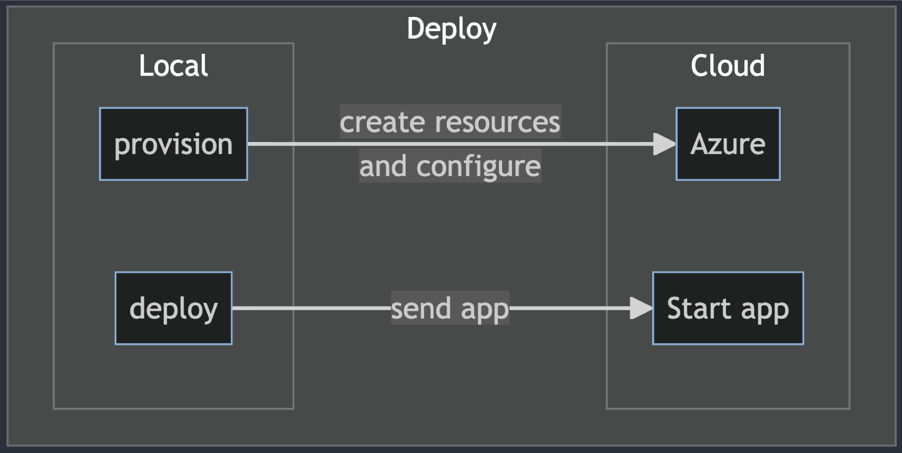
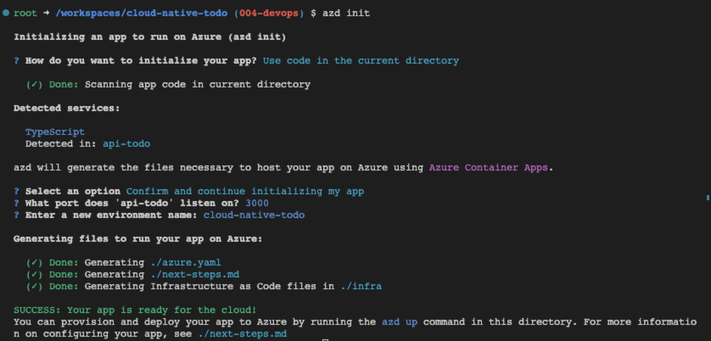
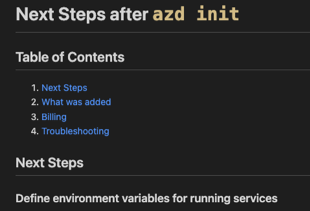
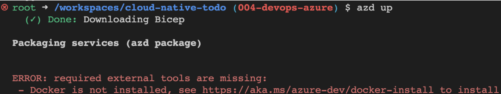
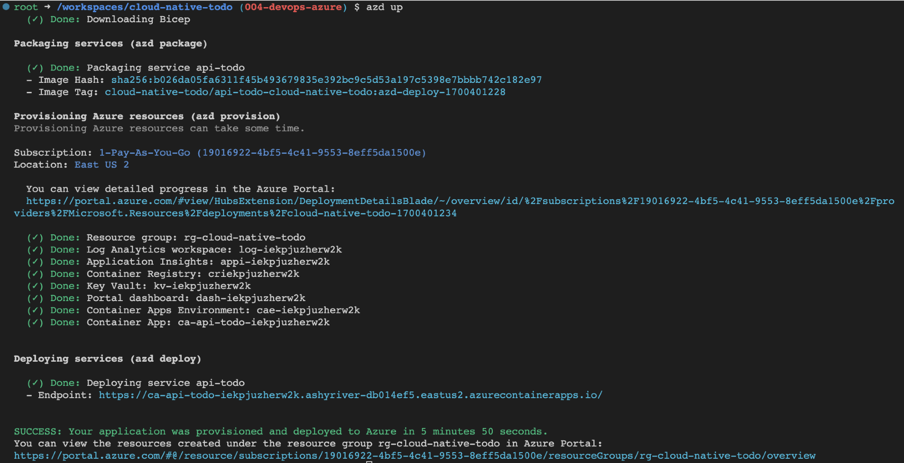
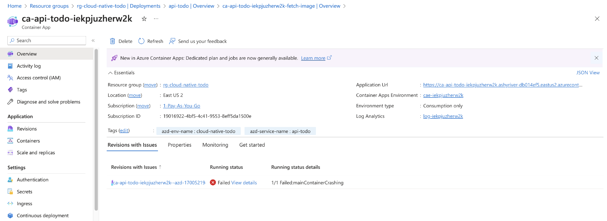
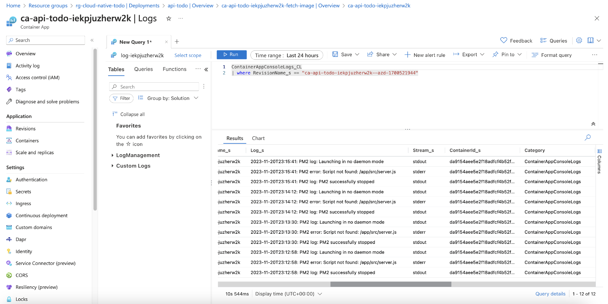
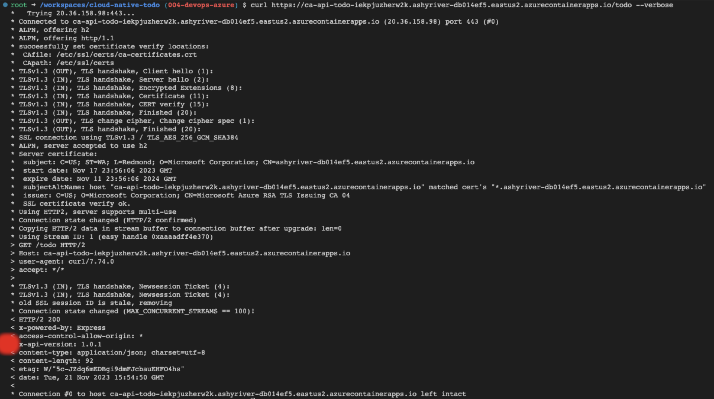
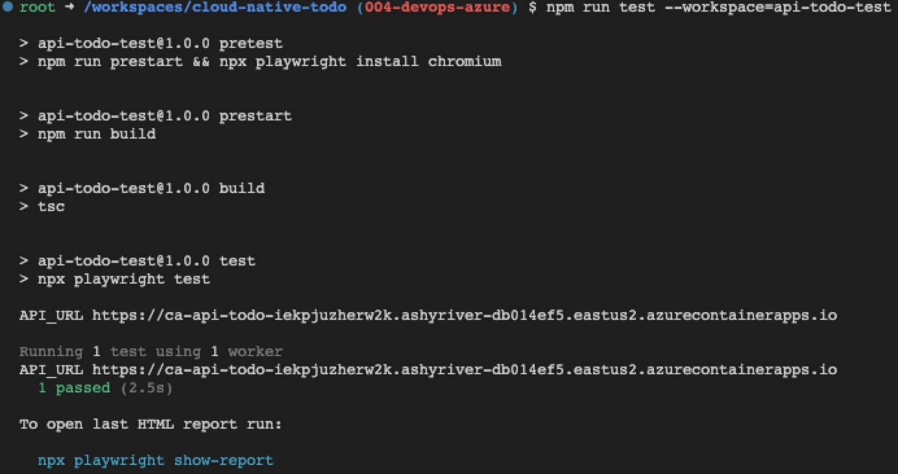

# Supercharging DevOps: Streamlining Cloud Infrastructure with Azure Developer CLI

This [fourth iteration](https://github.com/dfberry/cloud-native-todo/tree/004-devops-azure) of my cloud-native project, [https://github.com/dfberry/cloud-native-todo](https://github.com/dfberry/cloud-native-todo), added the steps of creating the cloud resources (provisioning) and pushing code to those resources (deployment). 



For this cloud-native project, I knew there would be a Docker image of the project in a registry but I wasn't sure of the fastest steps to create the image from the repository, push it to the registry or how it was pulled into the hosting environment. The authentication part to push to a registry and from which tool is usually what takes a minute or two. Anything that improved that auth flow would be welcome. 

Sticking with tools I know to go as fast as possible, I used [Azure Developer CLI](https://learn.microsoft.com/en-us/azure/developer/azure-developer-cli/) for the infrastructure. 


## Install Azure Developer CLI as a dev container feature in Visual Studio Code

Installation of Azure Developer CLI into dev containers is easy with a feature. [Find the feature](https://containers.dev/features) and add it to the `./.devcontainer/devcontainer.json`. 

```json
// Features to add to the dev container. More info: https://containers.dev/features.
"features": {
    "ghcr.io/azure/azure-dev/azd:latest": {}
},
```

Use the Visual Studio Code command palette to select **Dev Containers: Rebuild and reopen in container**. Check the version of the Azure Developer CLI installed with the following command: 

```bash
azd version
```

The response: 

```bash
azd version 1.5.0 (commit 012ae734904e0c376ce5074605a6d0d3f05789ee)
```

## Create the infrastructure code with Azure Developer CLI

I've done most of this work before in other projects. I didn't really expect to learn anything new. However, [GitHub Universe 2023](https://www.youtube.com/watch?v=NrQkdDVupQE&list=PL0lo9MOBetEGF_pCQVCc_3z36ihKSolLC) and [Microsoft Ignite 2023](https://www.youtube.com/watch?v=FZhbJZEgKQ4&list=PLFPUGjQjckXE2cf8RBSjFYUUq8HkM_3zW) both took place between [iteration 003](https://dfberry.github.io/2023-11-11-cloud-native-api.md) and my start on this iteration, 004. While I still used [Copilot Chat](https://docs.github.com/en/copilot) as my pair programming buddy, I also leaned into any new feature I heard of from these two industry conferences. The Azure Developer CLI's `azd init` feature had an update (version 1.50) and I wanted to see what it would do. It asked Copilot Chat a couple of questions then it created the required files and folders. It took hours of Bicep development and compressed it into 30 seconds. Amazing!!!



Did it correctly configure the infrastructure for this project? Yes. When I add a second app to this project, further down the road, I'll rerun `azd init` in a new branch. 

The `azd init` process created a `./next-steps.md` which was a huge help in validation. 



## Get cloud resource environment variables from Azure Developer CLI

The [next steps](https://github.com/dfberry/cloud-native-todo/blob/main/next-steps.md) covered environment variables because your project may need access to cloud resource secrets, connection strings, resource names, database names, and other settings created during provisioning to complete deployment tests. Azure Developer CLI gives you access this list of environment variables with `azd env get-values` to create your own `.env` file for your project. 

I created a Bash script to get those values so I could test the endpoint.

```bash
#!/bin/bash
# Usage: <script> <path-for-env-file>
# Example: ./scripts/postdeploy.sh "./api-todo-test" 
echo "postdeploy.sh"

set -x

echo "Getting param 1"
ENV_PATH="$1/.env" || ".env"
echo "ENV_PATH: $ENV_PATH"

echo "Remove old .env file"
rm -f $ENV_PATH

echo "Getting values from azd"
azd env get-values > $ENV_PATH

# Check if the .env exists
if [ ! -f "$ENV_PATH" ]; then
  echo "*** .env file not found at $1"
  exit 1
fi

# Run the npm test command
echo "Run test at $1"
cd "$1" && npm test

echo "Test completed"
exit 0
```

This script is called in the `./azure.yaml` file in the post deployment hook:

```yaml
postdeploy: 
    shell: sh
    run: |
        echo "***** Root postdeploy"
        ./scripts/postdeploy.sh "./api-todo-test"  
```

## Develop containers for cloud-native apps

When I tried to use Azure Developer CLI to provision the project with `azd up`, the provision failed because the CLI couldn't find the tools in the environment to build and push the image to the Azure Container Registy. 



While Docker isn't specifically required to run Azure Developer CLI, it's logical to assume if I intend to create images, I need the tools to do that. Copilot advised me to create a new `Dockerfile` for the dev container. This would have added another level of complexity and maintenance. Instead, I chose to use a dev container feature for [docker-in-docker](https://github.com/devcontainers/features/tree/main/src/docker-in-docker) which leaves that complexity to the owner of the feature. 

## Fix for dev container won't start

I love Docker and I love dev containers but occasionally containers just don't start and the error messages are so low-level that they generally aren't helpful. The whole point of containers is that they consistently work but I develop on a Mac M1 and containers sometimes don't work well with M1. 

When I added the docker-in-docker feature to the Visual Studio dev container and rebuilt the container, the container wouldn't start. I changed the configs and looked at the order of features, searched StackOverflow and GitHub and chatted with Copilot. Nothing helped. Using Visual Studio Code to rebuild the dev container without the cache didn't fix it either. Which is when I knew it was my environment.

The fix was to stop the dev container, delete all containers, images, and volumes associated with the dev container and start over completely. I didn't have any other projects in dev containers so I removed everything. 

```bash
# Delete all containers
docker rm -f $(docker ps -a -q)

# Delete all images
docker rmi -f $(docker images -a -q)

# Delete all volumes
docker volume rm $(docker volume ls -q)
```

## Deploy Express.js container image to Azure

Restart the dev container and the dev container started. At this point, I tried to provision again with `azd up` (provision & deploy) which succeeded. It's impressive how the services just work together without me having to figure out how to pass integration information around. 



Then I tried the endpoint for the API which is shown at the end of the output when `azd up` is done. I didn't get my project from the endpoint. The "Hello World" for containers responded at the endpoint which meant provisioning worked but deployment failed. 

## Find container image deployment error in Azure portal deployment log

The Azure resource group, the logical unit for all the resources in the infrastructure, has a deployment log. The Container App showed a failed status. The code is still a very simple Express.js app so the issue had to also be simple. I checked the deployment logs in the Azure portal and found the app's start script pointed to the wrong file. 



Following the error to the log shows the issue that the start file is incorrect.



A quick fix to the Dockerfile.

```yaml
# Wrong cmd
CMD [ "pm2-runtime", "start", "server.js" ]

# Correct cmd
CMD [ "pm2-runtime", "start", "dist/start.js" ]
```

Then `azd up` and the correct endpoint worked. 

## Add a version header to source code 

While testing the deployment, I wanted to add versioning to the app so I knew changes to the project were displayed at the endpoint. The root request returns the version found in the `./api-todo/package.json`, and the APIs return a `x-api-version` header with the value. 

```typescript
// eslint-disable-next-line @typescript-eslint/ban-ts-comment
// @ts-ignore: Ignoring TS6059 as we want to import version from package.json
import { version } from '../../package.json';

export function setVersionHeader(_, res, next) {
  res.setHeader('x-api-version', version);
  next();
}

```

The **curl** request returns the header when using `--verbose`.



## Add Playwright test to validate API

When I added playwright to the dev container and rebuilt the dev container, the container started but Playwright and its dependencies took up too much room. I increased the size of my container and limited by testing to Chrome. I also added the installation in the `./.devcontainer/post-create-command.sh` script. By adding the installation here, when the container opens, I can see if it has enough room for a big dependency like Playwright and its browsers. 

```bash
# ./.devcontainer/post-create-command.sh

#! /bin/bash
sudo apt-get clean
sudo apt update
npm i -g npm@latest
npm install
chmod -R +x ./scripts
npx playwright install --with-deps 
echo "Node version" && node -v
echo "NPM version" && npm -v
echo "Git version" && git -v
echo "Docker version" && docker --version 
```

The Playwright for the API tests the new header and the returned array of todos.

```typescript
import { test, expect } from '@playwright/test';
import dotenv from 'dotenv';
dotenv.config();

const API_URL = process.env.API_TODO_URL || 'http://localhost:3000';
console.log('API_URL', API_URL);

import { version } from '../../api-todo/package.json';

test.use({
  ignoreHTTPSErrors: true, // in case your certificate isn't properly signed
  baseURL: API_URL,
  extraHTTPHeaders: {
    'Accept': 'application/vnd.github.v3+json',
    // Add authorization token to all requests.
    'Authorization': `token ${process.env.API_TOKEN}`,
  }
});
test('should get all todos', async ({ request }) => {
  const response = await request.get(`/todo`);
  expect(response.ok()).toBeTruthy();

  // Validate the x-api-version header
  const headers = response.headers();
  expect(headers).toHaveProperty('x-api-version');
  expect(headers['x-api-version']).toEqual(version);


  // Validate the response body
  const todos = await response.json();
  expect(Array.isArray(todos)).toBeTruthy();
  expect(todos.length).toEqual(3);
});
```

Run the test from the workspace with `npm run test --workspace=api-todo-test` and see the test succeeded. 



## Most fun - time savings

The best part about this project is the tooling. I can spend less time and enjoy that time more. 


Currently Copilot shines with technologies that have a lot of Internet coverage including docs and troubleshooting. For this particular iteration, the only place Copilot didn't help was the annoying Docker issue when the dev container wouldn't start after adding the docker-in-docker dev container feature. 

## Wish list item #1 - `azd test`

While Azure Developer CLI provided provisioning and deployment, it didn't add testing. This seems like a natural next step for the project. It knows what the stack is because it created the infrastructure to support it. And it knows the endpoints because it displays them at the end of the deployment. Adding API tests seems within the tool's ability someday.

## Wist list item #2 - docker-in-docker

Since the infrastructure required containers and the environment had the `.devcontainer` folder, adding docker-in-docker as a dev container feature is probably something Azure Developer CLI can fix in the future...perhaps a YAML snippet for the dev container feature in the `./next-steps.md`:

```json
"features": {
    "ghcr.io/azure/azure-dev/azd:latest": {},
    "ghcr.io/devcontainers/features/docker-in-docker:1":{}
},
```

## Tips

There were a few things I found useful that I use moving forward in my development in the [Tips list](https://github.com/dfberry/cloud-native-todo).

## Results for 004 - create resources and deploy code

Once again Copilot saved a lot of time but it took backseat to the amazing work Azure Developer CLI provided with the entire DevOps flow. And notice there wasn't any auth flow for the Container registry to deal with when pushing images. That was all wrapped up in the Azure Developer CLI auth. Another time saver. 