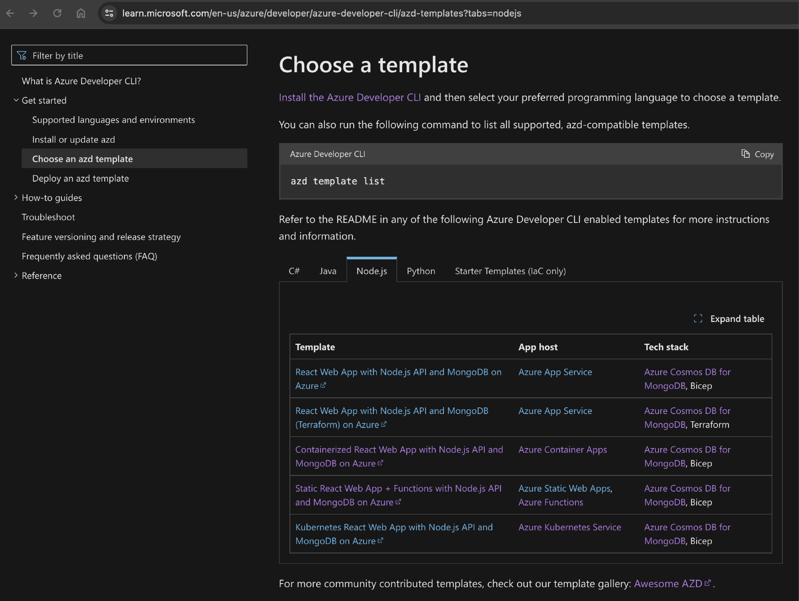
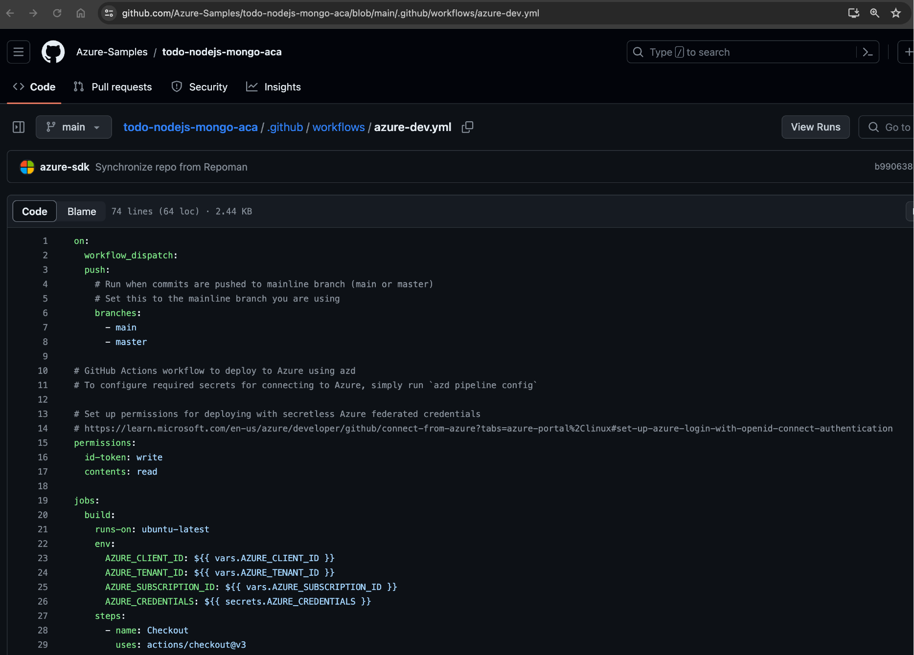
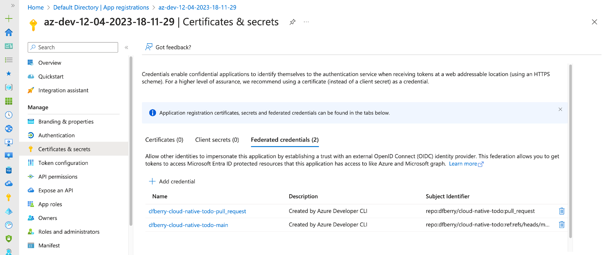
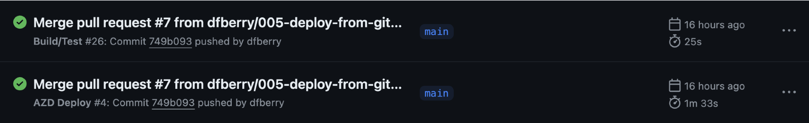
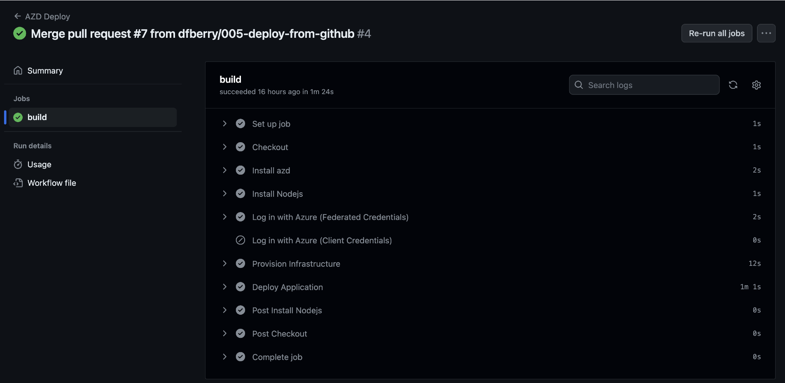
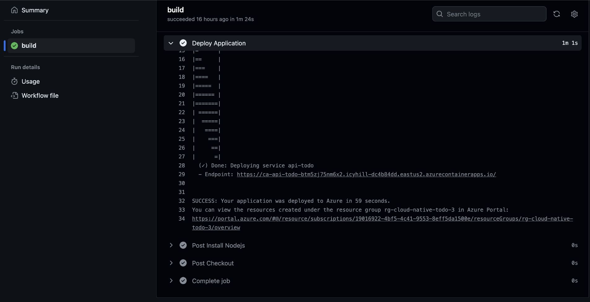
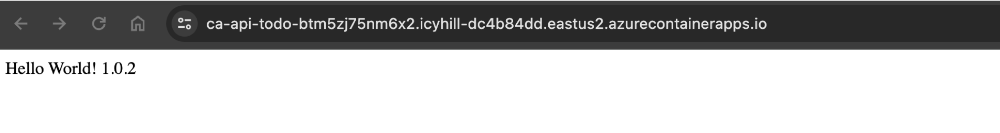

# Deploy to cloud from source control with Azure Developer CLI

This [fifth iteration](https://github.com/dfberry/cloud-native-todo/tree/005-deploy-from-github) of the cloud-native project, [https://github.com/dfberry/cloud-native-todo](https://github.com/dfberry/cloud-native-todo), added the changes to deploy from the GitHub repository:

[YouTube demo](https://youtu.be/CSZ6dMEkO4Q)

1. Add `azure-dev.yml` GitHub action to deploy from source code
2. Run `azd pipeline config`
    * push action to repo
    * create Azure service principal with appropriate cloud permissions
    * create GitHub variables to connect to Azure service principal

## Setup

In the [fourth iteration](https://dev.to/dfberry/supercharging-devops-streamlining-cloud-infrastructure-with-azure-developer-cli-2o98), the project added the infrastructure as code (IaC), created with Azure Developer CLI with `azd init`. This created the `./azure.yml` file and the `./infra` folder. Using the infrastructure, the project was deployed with `azd up` from the local development environment (my local computer). That isn't sustainable or desirable. Let's change that so deployment happens from the source code repository.

## Add `azure-dev.yml` GitHub action to deploy from source repository

The easiest way to find the correct `azure-dev.yml` is to use the official documentation to find the [template](https://learn.microsoft.com/en-us/azure/developer/azure-developer-cli/configure-devops-pipeline?tabs=GitHub) closest to your deployed resources and sample. 



1. Copy the contents of the template's `azure-dev.yml` file from the sample repository into your own source control in the `./github/workflows/azure-dev.yml` file. 

    

2. Add the **name** to the top of the file if one isn't there, such as `name: AZD Deploy`. This helps distinguish between other actions you have the in repository. 

    ```
    name: AZD Deploy

    on:
      workflow_dispatch:
      push:
        # Run when commits are pushed to mainline branch (main or master)
        # Set this to the mainline branch you are using
        branches:
          - main
          - master
    ```

3. Make sure the `azure-dev.yml` also has the `workflow_dispatch` as one of the `on` settings. This allows you to deploy manually from GitHub. 

## Run `azd pipeline config` to create deployment from source repository

1. Switch to a branch you intend to be used for deployment such as `main` or `dev`. The current branch name is used to create the federated credentials. 
2. Run `azd pipeline config`
3. If asked, log into your source control.
4. When the process is complete, copy the **service principal** name and id. Mine looked something like: 

    ```
    az-dev-12-04-2023-18-11-29 (abc2c40c-b547-4dca-b591-1a4590963066)
    ```

    When you need to add new configurations, you'll need to know either the name or ID to find it in the Microsoft Entra ID in the Azure portal.

## Service principal for secure identity

The process created your service principal which is the identity used to deploy securely from GitHub to Azure. If you search for service principal in the Azure portal, it takes you Enterprise app. Don't go there. An Enterprise app is meant for other people, like customers, to log in. That's a different kind of thing. When you want to find your deployment service principal, search for **Microsoft Entra ID**. 
    
1. Go ahead ... find your service principal in the [Azure portal](https://portal.azure.com/) by searching for **Microsoft Entra ID**. The service principals are listed under the **Manage -> App registrations -> All applications**. 
2. Select your service principal. This takes you to the **Default Directory | App registrations**.
3. On the **Manage -> Certificates & secrets**, view the federated credentials. 

    

4. On the **Manage -> Roles and Administrators**, view the **Cloud Application Administrator**. 

When you want to remove this service principal, you can come back to the portal, or use [Azure CLI](https://learn.microsoft.com/en-us/cli/azure/)'s `az ad sp delete --id <service-principal-id>`

## GitHub action variables to use service principal

The process added the service principal information to your GitHub repository as action variables. 

1. Open your GitHub repository in a browser and go to **Settings**.
2. Select **Security -> Secrets and variable -> Actions**.
3. Select variables to see the service principal variables. 

    ![Browser screenshot of GitHub repository showing settings page with secure action variables table which lists the values necessary to deploy to Azure securely.]

4. Take a look at the actions run as part of the push from the process. The **Build/Test** action ran successfully when AZD pushed the new pipeline file in commit [24f78f4](https://github.com/dfberry/cloud-native-todo/commit/24f78f4336e7bed72801a620176c04f0330b198e). Look for the actions that run based on that commit. 

    

    Verify that the action ran successfully. Since this was the only change, the application should still have the `1.0.1` version number in the response from a root request. 
    
When you want to remove these, you can come back to your repo's settings. 

## Test a deployment from source repository to Azure with Azure Developer CLI

To test the deployment, make a change and push to the repository. This can be in a branch you merge back into the default branch, or you can stay on the default branch to make the change and push. The important thing is that a push is made to the default branch to run the GitHub action.

In this project, a simple change to the API version in the `./api-todo/package.json`'s **version** property is enough of a change. And this change is reflected in the home route and the returned headers from an API call. 

1. Change the version from `1.0.1` to `1.0.2`.
2. Push the change to main. 

## Verify deployment from source repository to Azure with Azure Developer CLI

1. Open the repository's actions panel to see the action to deploy complete. 

    

2. Select the **AZD Deploy** for that commit to understand it is the same deployment as the local deployment. Continue to drill into the action until you see the individual steps.

    

3. Select the **Deploy Application** step and scroll to the bottom of that step. It shows the same deployed endpoint for the api-todo as the deployment from my local computer. 

    

4. Open the endpoint in a browser to see the updated version. 

    

## Deployment from source code works

This application can now deploy the API app from source code with Azure Developer CLI. 

## Tips 

After some trial and error, here are the tips I would suggest for this process:

* Add a meaningful name to the `azure-dev.yml`. You will have several actions eventually, make sure the name of the deployment action is short and distinct. 
* Run `azd pipeline config` with the `--principal-name` switch in order to have a meaningful name. 

## Summary 

This was an easy process for such an easy project. I'm interested to see how the infrastructure as code experience changes and the project changes. 


