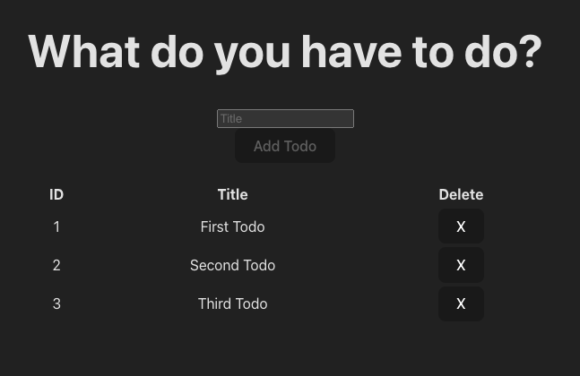
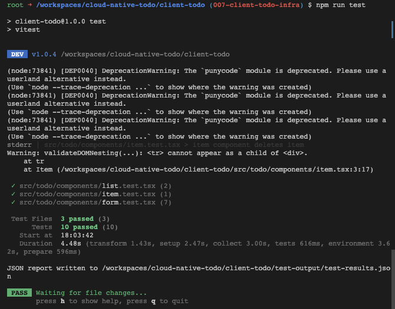

# React Vite Client UI: quick Todo app proof of concept

This [sixth iteration][006Code] of the cloud-native project, [https://github.com/dfberry/cloud-native-todo](https://github.com/dfberry/cloud-native-todo), added the client UI to the monorepo. 

[YouTube demo](https://youtu.be/HTdVSKhnXek)

1. Use Vite React to create basic project structure. 
2. Add React page and components for Todo: form, list, item.
3. Add Tests for components. 
4. Add API integration.

> **Reminder:** A quick reminder that this project is using an in-memory DB at this point in the API. Each step of the way is meant to bootstrap the next step for speed instead of complete build out. This step is focusing on a bare-bones UI that interacts with the API. 

## Front-end framework choices and ChatGPT

This iteration is a proof of concept (POC) that can grow, as opposed to being thrown away. With that in mind, I picked Vite React as the frontend framework. I'm comfortable with React and I like the Vite toolchain. 

In this day and age of ChatGPT everywhere, does it matter what framework you pick for a POC? This is up to you. Whatever answers or code your AI partner (such as ChatGPT) gives you, you still need to be able to integrate it and debug it. I suggest you pick something that you work with as though ChatGPT weren't available. If your team knows a different stack, and that stack has any duration (not built in the last year), go with that stack. 

I considered [Next.js][Nextjs], plain [React][React], [Vite][Vite] React, and [create-react-app][CreateReactApp] (CRA). The POC needs velocity but not at the risk of the velocity or chaos of the underlying stack:

* **Next.js** is a great framework but has its own ideas about the cloud. 
* **Plain React** means building out my own toolchain -- a waste of time compared to Next, Vite, CRA and other stacks that provide that. 
* **Create React App** has had some bumps in the road the last few years. Reminds me of the Angular 2,3,4,5 releases which is why I don't use Angular anymore. 
* **Vite** has been dependable in the last few projects so I'm sticking with that. ChatGPT answers enough of the Vite config and ViTest questions so that's a plus. 

## Creating the basic Vite React app

Vite has a quick ability to scaffold out the app with the CLI for a variety of front-end frameworks including React, Vue, and Svelte, and Electron. I chose TypeScript and SWC.

```bash
npm create vite@latest
```

This gives a basic runnable app with ESLint already configured. 

```json
{
  "name": "vite-project",
  "private": true,
  "version": "0.0.0",
  "type": "module",
  "scripts": {
    "dev": "vite",
    "build": "tsc && vite build",
    "lint": "eslint . --ext ts,tsx --report-unused-disable-directives --max-warnings 0",
    "preview": "vite preview"
  },
  "dependencies": {
    "react": "^18.2.0",
    "react-dom": "^18.2.0"
  },
  "devDependencies": {
    "@types/react": "^18.2.43",
    "@types/react-dom": "^18.2.17",
    "@typescript-eslint/eslint-plugin": "^6.14.0",
    "@typescript-eslint/parser": "^6.14.0",
    "@vitejs/plugin-react-swc": "^3.5.0",
    "eslint": "^8.55.0",
    "eslint-plugin-react-hooks": "^4.6.0",
    "eslint-plugin-react-refresh": "^0.4.5",
    "typescript": "^5.2.2",
    "vite": "^5.0.8"
  }
}
```

The `vite.config.ts` is where all the configuration goes.

## Add environment variable for API

Create a `.env` file and add an environment variable prefixed with `VITE_` for the API URL such as `http://localhost:3000`. When the client is deployed to the host, this URL will need to be changes and the front-end client build with the correct cloud URL. This URL is used later to build out the full API URL to fetch results:

```typescript
const ENV_URL = import.meta.env.VITE_API_URL || 'http://localhost:3000';
if(!ENV_URL) {
  console.log('VITE_API_URL is not defined');
}

export const API_URL = `${ENV_URL}/todo`;
```

For this POC, a simple API service looks like: 

```typescript
import { NewTodo } from './models';

const ENV_URL = import.meta.env.VITE_API_URL || 'http://localhost:3000';
if(!ENV_URL) {
  console.log('VITE_API_URL is not defined');
}

export const API_URL = `${ENV_URL}/todo`;

export const addTodo = async (newTodo: NewTodo): Promise<Response> => {
    return await fetch(API_URL, {
        method: 'POST',
        headers: {
          'Content-Type': 'application/json',
        },
        body: JSON.stringify(newTodo),
      });
    };
export const deleteTodo = async (id: number): Promise<Response> => {
    return await fetch(`${API_URL}/${id}`, {
        method: 'DELETE',
      });
    };
```

## Clean up the app

The main boilerplate for the Vite React app has a few things going on but none of which this POC needs at this point.

```JSX
import { useState } from 'react'
import reactLogo from './assets/react.svg'
import viteLogo from '/vite.svg'
import './App.css'

function App() {
  const [count, setCount] = useState(0)

  return (
    <>
      <div>
        <a href="https://vitejs.dev" target="_blank">
          
        </a>
        <a href="https://react.dev" target="_blank">
          
        </a>
      </div>
      <h1>Vite + React</h1>
      <div className="card">
        <button onClick={() => setCount((count) => count + 1)}>
          count is {count}
        </button>
        <p>
          Edit <code>src/App.tsx</code> and save to test HMR
        </p>
      </div>
      <p className="read-the-docs">
        Click on the Vite and React logos to learn more
      </p>
    </>
  )
}

export default App
```

Replace the contents with a pared-down component:

```JSX
import './App.css'

import Todo from './todo'

function App() {

  return (
    <>
        <Todo />
    </>
  )
}

export default App
```

## Add the page, form, list, and item 

1. To keep the client UI clean and clear, create a new subfolder for everything for the Todo named `todo`.
2. Create the main todo page, `index.tsx`, which handled the events, API call, and child rerenders. 

    ```JSX
    import { useState } from 'react';
    import useSWR, { mutate } from 'swr';
    import TodoForm from './components/form';
    import List from './components/list';
    import { NewTodo, Todo } from './models';
    import { API_URL, addTodo, deleteTodo } from './service';
    import { fetcher } from './api';

    export default function Todo() {
        const [requestError, setRequestError] = useState('');
        const { data, error, isLoading } = useSWR(API_URL, fetcher)

        async function handleSubmit(newTodoItem: NewTodo) {
            setRequestError('');

            try {
                const result = await addTodo(newTodoItem);

                if (!result.ok) throw new Error(`result: ${result.status} ${result.statusText}`);
                const savedTodo = await result.json();
                mutate(API_URL, [...data, savedTodo], false);

            } catch (error: unknown) {
                setRequestError(String(error));
            }
        }

        async function handleDelete(id: number) {
            setRequestError('');
            try {
                const result = await deleteTodo(id);
                if (!result.ok) throw new Error(`result: ${result.status} ${result.statusText}`);
                mutate(API_URL, data.filter((todo: Todo) => todo.id !== id), false);
            } catch (error: unknown) {
                setRequestError(String(error));
            }
        }

        if (error && requestError) return <div>failed to load {error ? JSON.stringify(error) : requestError}</div>
        if (isLoading) return <div>loading...{JSON.stringify(isLoading)}</div>

        return (
            <div>
                <TodoForm onSubmit={handleSubmit} requestError={requestError} />
                <div>
                    <List todos={data} onDelete={handleDelete} />
                </div>
            </div>
        )
    }
    ```

3. Create the listing, `components/list.tsx`, to display the 3 default todos.

    ```JSX
    import { Todo } from '../models';
    import Item from './item';

    export type { Todo };

    interface Props {
    todos: Todo[];
    onDelete: (id: number) => void;
    }

    export default function List({ todos, onDelete }: Props) {
    return (

        todos.length > 0 && (
        <table style={{ width: '100%', marginTop: '20px'}} data-testid="list">
            <thead>
            <tr>
                <th >ID</th>
                <th >Title</th>
                <th >Delete</th>
            </tr>
            </thead>
            <tbody>
            {todos.map((todo) => (
                <Item
                key={todo.id}
                todo={todo}
                onDelete={onDelete}
                />
            ))}
            </tbody>
        </table>
        )
    )
    }
    ```

4. Add the Item, `components/item.tsx`, to display each item. 

    ```jsx
    import { Todo } from '../models';

    export type { Todo };

    export interface ItemProps {
    todo: Todo;
    onDelete: (id: number) => void;
    }

    export default function Item({ todo, onDelete }: ItemProps) {

    return (
        <tr data-testid="item-row">
        <td data-testid="item-id">{todo.id}</td>
        <td data-testid="item-title">{todo.title}</td>
        <td data-testid="item-delete">
            <button onClick={() => onDelete(todo.id)} >X</button>
        </td>
        </tr>
    );
    }
    ```

    Notice the attributes for testing, named `data_testid` are included already. 

5. Add the Form, `components/form.tsx`, to capture a new todo item.

    ```jsx
    import { FormEvent, KeyboardEvent, ChangeEvent, useRef, useState } from 'react';
    import { NewTodo } from '../models';

    export type { NewTodo };

    interface Props {
        onSubmit: (newTodoItem: NewTodo) => void;
        requestError?: string;
    }
    export default function TodoForm({ onSubmit, requestError }: Props) {
        const formRef = useRef<HTMLFormElement>(null);
        const [newTodo, setNewTodo] = useState<NewTodo>({ title: '' });

        const handleSubmit = (event: FormEvent<HTMLFormElement>) => {
            event.preventDefault();
            const formData = new FormData(event.currentTarget);
            const title = formData.get('title')?.toString() || null;

            if (title !== null) {

                onSubmit({
                    title
                });
                if (formRef.current) {
                    formRef.current.reset();
                }
                // Reset the newTodo state
                setNewTodo({ title: '' });
            }
        }

        const handleKeyDown = (event: KeyboardEvent<HTMLInputElement>) => {
            if (event.key === 'Enter') {
                if (formRef.current) {
                    formRef.current.dispatchEvent(new Event('submit', { cancelable: true }));
                }
            }
        };
        const handleInputChange = (event: ChangeEvent<HTMLInputElement>) => {
            setNewTodo({
                title: event.target.value,
            });
        };
        return (
            <div >
                <div>
                    <h1 >What do you have to do?</h1>
                </div>
                <form ref={formRef} onSubmit={handleSubmit} data-testid="todo-form">
                    <div >
                        <input
                            id="todoTitle"
                            name="title"
                            type="text"
                            value={newTodo.title}
                            placeholder="Title"
                            onChange={handleInputChange}
                            onKeyDown={handleKeyDown}
                            data-testid="todo-form-input-title"
                        />
                    </div>
                    {requestError && (
                        <div data-testid="todo-error">
                            {requestError}
                        </div>
                    )}
                    <button type="submit" disabled={!newTodo.title} data-testid="todo-button">Add Todo</button>
                </form>
            </div>
        );
    } 
    ```

6. Add any dependency code such as the [API service][006-api-service] and its API [fetcher][006-api-fetcher] for SWR, and the TypeScript [models][006-models] for a new todo and an existing todo. 

7. Start the API and the client UI to use the form.

    

    The form accepts a title to add a new todo, or deletes a todo using the X on each item's room. 

> **Note:** This UI isn't styled and the little style that is there is mostly defaults. If you aren't comfortable with CSS or style libraries, use ChatGPT and GitHub CoPilot for this.


## Add ViTest UI tests

Now that the bare bones proof of concept is working, add the UI tests to validate it. This is important so that any future changes to the app don't break existing functionality. 

The tests cover the following simple cases:

* renders form without error
* renders form with error
* renders button disabled
* renders button enabled
* accepts input text
* submit form by button
* submit form by keypress enter
* item component deletes item
* renders List with todos
* does not render List when todos is empty

1. Add [ViTest][ViTest] following the instructions for that site and a few other packages for [testing UI with ViTest][ViTestUI]. Refer to the [package.json][006-ui-package-json] for the complete list.

    ```bash
    npm install -D vitest @vitest/ui
    ```

2. Create the `vitest.config.ts` file for configurations:

    ```TypeScript
    import path from 'node:path';
    import { defineConfig, defaultExclude } from 'vitest/config';
    import configuration from './vite.config';

    const config = {
        ...configuration,
        test: {
            reporters: ['json', 'default'],
            outputFile: { json: "./test-output/test-results.json" },
            globals: true,
            setupFiles: path.resolve(__dirname, 'test/setup.ts'),
            exclude: [...defaultExclude],
            environmentMatchGlobs: [
                ['**/*.test.tsx', 'jsdom'],
                ['**/*.component.test.ts', 'jsdom'],
            ]
        },
    };

    export default defineConfig(config);     
    ```

    The `outputFile` keeps the output files out of the way. The `setupFiles` also keep the test setup files tucked away. 

3. The hardest part about getting these tests to work was the TypeScript types for the testing library user events such as `await user.type(input, title)`. The test setup and utility files helped with that. If you run into this, make sure to restart your TS Server in Visual Studio Code as well. 

    ```TypeScript
    // test/setup.ts
    import '@testing-library/jest-dom/vitest';


    // test/utilities.ts
    import type { ReactElement } from 'react';
    import { render as renderComponent } from '@testing-library/react';
    import userEvent from '@testing-library/user-event';

    type RenderOptions = Parameters<typeof renderComponent>[1];

    export * from '@testing-library/react';

    export const render = (ui: ReactElement, options?: RenderOptions) => {
        return {
            ...renderComponent(ui, options),
            user: userEvent.setup(),
        };
    };
    ```

4. Then the User event test, such as the following, builds and runs.

    ```TypeScript
    test('submit form by keypress enter', async () => {

        // new title
        const title = 'Test Todo';

        // mock add function
        const mockAdd = vi.fn();

        // render the component
        const { user, getByTestId } = render(<TodoForm onSubmit={mockAdd}/>);

        // Fill in the input
        const input = getByTestId('todo-form-input-title');
        await user.type(input, title);

        // submit form by keypress
        await user.type(input, '{enter}');

        // todo submitted to parent via onSubmit
        expect(mockAdd).toHaveBeenCalledTimes(1);
        expect(mockAdd).toHaveBeenCalledWith({ title });
    })
    ```

5. Run the test with `npm run test` and see the results:

    

## Where was CoPilot in this iteration?

**Where did CoPilot succeed?** 

CoPilot came in handy in some of the places that I'm happy to let to handle: 

* Quick CSS tweaks - it's much faster to play with CSS when CoPilot is generating styles over and over.
* Config files - I was surprised by how much CoPilot helped with Vite and ViTest. 
* Components - it wrote most of the component code, I asked for refactors and it provided those as well.
* Tests - it wrote most of the UI tests for me in seconds.

**Where did CoPilot fail?** 

The tricky parts of integration, especially across tools, dependencies, and versions are still tricky. I spent the most time on the TypeScript issue with the testing library for user events. The fix came from a StackOverflow post which I had to look for. Considering all the layers involved and the time already saved in other places I used CoPilot and ChatGPT, that seems like net positive time savings for a proof of concept. 

## Where to next? 

Now that the UI code is written and works locally, the project needs a container for the UI, and it needs to provision the UI resources for that container in the cloud. The client container needs to talk to the API container correctly. Fun stuff!


[006-ui-package-json]:https://github.com/dfberry/cloud-native-todo/blob/006-client-todo/client-todo/package.json
[006-api-service]:https://github.com/dfberry/cloud-native-todo/blob/006-client-todo/client-todo/src/todo/service.ts
[006-api-fetcher]:https://github.com/dfberry/cloud-native-todo/blob/006-client-todo/client-todo/src/todo/api.ts
[006-models]:https://github.com/dfberry/cloud-native-todo/blob/006-client-todo/client-todo/src/todo/models.ts
[006Code]:https://github.com/dfberry/cloud-native-todo/tree/006-client-todo
[Nextjs]:https://nextjs.org/
[Vite]:https://vitejs.dev/
[ViTest]:https://vitest.dev/guide/
[ViTestUI]:https://vitest.dev/guide/ui.html
[CreateReactApp]:https://create-react-app.dev/
[React]:https://react.dev/