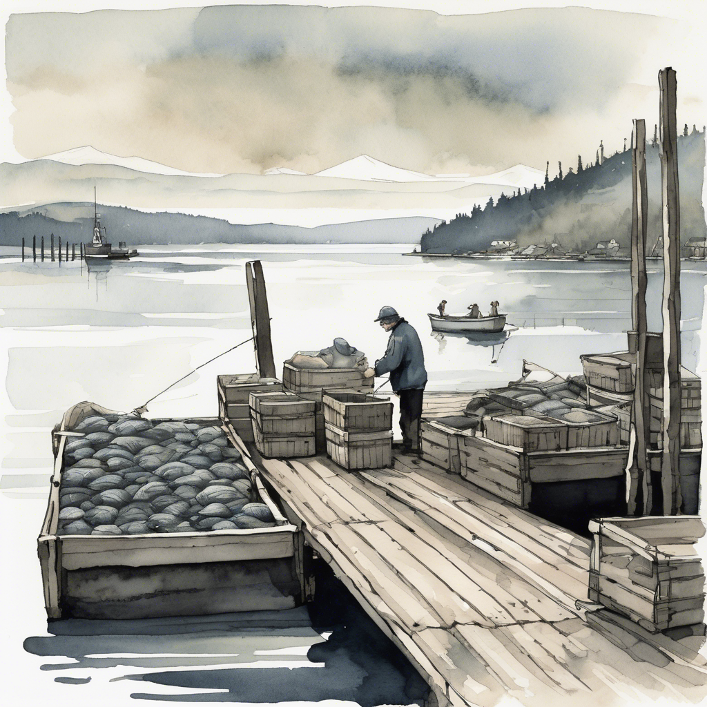

# Exploring Copilot CLI Session Management to Improve Squad

I've been using [Squad](https://github.com/bradygaster/squad), an AI team framework built on top of Copilot CLI, and I kept wondering: Copilot CLI already tracks everything that happens in a session — could that data make Squad's agents smarter? I spent some time digging into how both systems manage session data, and I think there's an untapped opportunity.

This post is my investigation notes — what I found, how the two systems compare, and where I think they could be combined for more value.

**My working theory: Copilot is your diary (what happened). Squad is your playbook (what to do about it). Right now they're like two lighthouses on opposite shores of Bellingham Bay — both useful, but no bridge between them.**


## What I Found: Two Memory Systems

### Copilot CLI: The Raw Record

Copilot CLI records every session — prompts, responses, tool calls, file changes, and checkpoints. I discovered it powers:

- **`/resume`** — pick up where you left off in any previous session
- **`/chronicle`** — generate standup reports, get personalized tips, improve your custom instructions
- **`/session`** — view and manage your sessions directly from the CLI

Session data lives in `~/.copilot/session-state/` as files and in `~/.copilot/session-store.db` as a structured SQLite database.

**What Copilot remembers:** Everything that happened in every session — the full transcript.

**What it doesn't do:** Extract meaning. Copilot stores the raw conversation, not the conclusions you drew from it.

### Squad: The Distilled Knowledge

Squad's memory is different — and this is where I see the gap. It's not a transcript — it's distilled knowledge, stored as markdown files in your repo:

| What | File | Purpose |
|------|------|---------|
| Team decisions | `.squad/decisions.md` | Shared brain — every agent reads this |
| Agent memory | `.squad/agents/{name}/history.md` | Personal learnings per agent |
| Skills | `.copilot/skills/{name}/SKILL.md` | Repeatable tasks with everything needed to execute |
| Session state | `.squad/sessions/*.json` | Resume data (gitignored by default) |
| Scribe logs | `.squad/log/*.md` | Session summaries (gitignored by default) |

**What Squad remembers:** Decisions, patterns, preferences, and skills — the things that should change how agents behave next time.

**What it doesn't do:** Record the full conversation. That's Copilot's job.

## The Gap I See

The two systems complement each other, but right now they're completely disconnected — like looking across Deception Pass and seeing the other side but having no way to cross.


Here's where each system shines:

| Question | Where to look |
|----------|--------------|
| "What did I do last Tuesday?" | Copilot — `/session` or `/chronicle standup` |
| "What did the team decide about auth?" | Squad — `.squad/decisions.md` |
| "Have I worked on this file before?" | Copilot — `/session` to browse past sessions |
| "How do we run a content audit?" | Squad — `.copilot/skills/content-audit/SKILL.md` |
| "What went wrong last time I tried this?" | Copilot — session transcript via `/resume` |
| "What does this agent know about TypeSpec?" | Squad — `.squad/agents/{name}/history.md` |

This separation works, but it's manual. You have to be the bridge — ferrying insights across the water yourself. That's the opportunity I'm investigating.

## Where I Think Session Data Could Improve Squad

Squad has a built-in skill called **reskill** (`"team, reskill"`) that audits agent charters and histories, extracts shared patterns into skills, and compresses bloated files. Think of it as sorting the morning catch on a Bellingham dock — keeping what's valuable, tossing the rest back.



But reskill today is purely file-based — it reads `.squad/` markdown and looks for textual duplication. It has no idea what actually happened in sessions.

Here's what I think session data could add:

| Signal from Copilot sessions | What Squad could do with it |
|---|---|
| Agent X was spawned 40 times but only useful 25 times | Refine charter to reduce misfires |
| Agent Y always gets the same 3 files as input | Bake those into charter's "What I Own" |
| Users keep correcting the same mistake | Extract as anti-pattern in a skill |
| An agent never gets spawned | Flag for removal during reskill |
| Two agents always get spawned together | Suggest merging or formalizing the pairing |
| Certain skills are read but never applied | Deprecate during reskill |
| Session durations spike after charter changes | Detect regressions from past reskills |

There are two existing proposals in the Squad repo that go in this direction — **tiered memory** ([#600](https://github.com/bradygaster/squad/issues/600), open) for hot/cold/wiki context layers, and **reflect** ([#621](https://github.com/bradygaster/squad/pull/621), closed PR — not merged) for in-session learning capture. Neither one references Copilot CLI session data though. They're both Squad-internal. The bridge between Copilot's behavioral data and Squad's knowledge system doesn't exist yet.

## Ideas I'm Exploring

The theme here is a feedback loop — raw session data flows downstream, gets refined into knowledge, and that knowledge shapes the next session. Like the Nooksack River circling back toward the mountains that feed it.


### 1. Feed `/chronicle` into Reskill

After a productive session, Squad agents already extract the important parts:
- **Decisions** go to `.squad/decisions.md`
- **Learnings** go to `agents/{name}/history.md`
- **Reusable patterns** become skills

But what if reskill could also query Copilot's session store to find patterns agents missed? `/chronicle improve` already analyzes session history to suggest custom instruction improvements. That same analysis could feed into Squad's skill extraction pipeline — Copilot finds the behavioral pattern, Squad encodes it permanently.

### 2. Use `/chronicle` for Behavioral Analysis

Copilot's `/chronicle improve` analyzes session history to find where agents struggled or needed correction. I'm thinking about how to make this a systematic input to Squad:

- Run `/chronicle improve` periodically
- Take the suggestions and apply them to agent charters or team directives
- This creates a feedback loop: Copilot finds the pattern, Squad encodes it permanently

Today this is manual. I'd love to see a `squad reskill --from-chronicle` that automates the loop.

### 3. Use `/session` for Context

When starting work on something you've touched before, use `/session` to browse previous sessions and find relevant context:

```
"Before starting, check /session for any previous sessions 
that touched these files. Summarize what was done and any issues."
```

This gives agents a head start without you having to remember and re-explain.

### 4. Use Squad for Cross-Agent Memory

Copilot's session history is per-user. Squad's memory is per-team. When Agent A discovers something that Agent B needs to know, Squad's shared files make that happen:

- Scribe writes cross-agent updates to affected agents' `history.md`
- Decisions in `decisions.md` are read by every agent at spawn time
- Skills are shared — any agent can use any skill

## The Gitignore Decision

Squad gitignores session-related files by default. Here's what that means and when to change it:

| File | Default | Change when |
|------|---------|-------------|
| `.squad/sessions/` | Gitignored | Commit if you need session transcripts in git (training repos, research) |
| `.squad/log/` | Gitignored | Commit if you want Scribe's summaries as an audit trail |
| `.squad/orchestration-log/` | Gitignored | Commit if you want agent routing history preserved |
| `.squad/decisions.md` | **Committed** | Never gitignore — this is the team's shared brain |
| `.squad/agents/*/history.md` | **Committed** | Never gitignore — this is each agent's knowledge |
| `.copilot/skills/` | **Committed** | Never gitignore — these are your reusable patterns |

**The recommended hybrid:** Keep sessions gitignored, but commit Scribe's logs for a lightweight audit trail. Remove `.squad/log/` and `.squad/orchestration-log/` from `.gitignore` to enable this.

> ⚠️ **One caveat:** If your org requires audit trails of AI interactions, git probably isn't the right system of record — no retention policies, no redaction, no legal hold. Worth checking before treating committed sessions as a compliance solution.

## Under the Hood (Skip Unless Debugging)

Copilot CLI stores session data in two places: file-based events in `~/.copilot/session-state/{session-id}/events.jsonl` and a searchable SQLite database at `~/.copilot/session-store.db`. The database powers `/chronicle` and `/session` — you need `"experimental": true` in `~/.copilot/config.json` to enable these features. Without experimental mode, `/chronicle` won't be available — enable it with `/experimental on` in any session.

Each session folder contains the event stream (every tool call, message, and model metric), workspace metadata, and checkpoint snapshots that `/resume` uses to reconstruct context. The `session.shutdown` event in `events.jsonl` is worth finding — it shows your token usage, cache hit rates, and code changes in one place.

The SQLite database (~59 MB after ~770 sessions in my case) holds structured records across seven tables: sessions, turns, checkpoints, session_files, session_refs, and an FTS5 search index. Records persist even after session directories are cleaned up. Don't delete the `.db-wal` file while Copilot is running — you'll lose recent writes.

## What's in the `.squad` Session Files

If you're using [Squad](https://github.com/bradygaster/squad) to orchestrate AI agents, there's a parallel session storage layer inside `.squad/` in your repo. While `.copilot/` tracks *platform sessions*, `.squad/` accumulates *session-by-session team memory*.

### Session-Scoped Files (Created Per Session)

These files can be traced back to a specific session:

| File | What It Contains |
|------|-----------------|
| `orchestration-log/{timestamp}-{agent}.md` | Who was spawned, why, what they did. Append-only audit trail. |
| `log/{timestamp}-{topic}.md` | Scribe's session summary. |
| `decisions/inbox/{agent}-{slug}.md` | Ephemeral drop-box — agents write decisions here during a session. Scribe merges them into `decisions.md` afterward. |
| `identity/now.md` | Updated each session with current focus. Every agent reads this at spawn so they hit the ground running. |

### Running-State Files (Modified Across Sessions)

These files accumulate changes but don't track which session changed them:

| File | How It Changes |
|------|---------------|
| `agents/*/history.md` | Grows each session as agents record learnings. Scribe summarizes when it exceeds ~15 KB. |
| `agents/*/charter.md` | Updated if an agent's role evolves. No session linkage. |
| `skills/{name}/SKILL.md` | Created or updated when agents discover reusable patterns. |
| `decisions.md` | The canonical decision ledger — grows each session, entries are dated. |
| `team.md`, `routing.md` | Updated when members join or leave. |
| `casting/registry.json` | New agent names registered here. Persistent. |

The distinction matters: session files are *created per session* and disposable. Running-state files are your team's accumulated intelligence — they compound over time.

### The Two-Layer Model

Together, `.copilot/` and `.squad/` form a complete session memory system — like Whatcom County's geology, where buildings sit on the visible surface but the real water supply flows through the aquifer below.


| Layer | Location | Scope | What it tracks per session |
|-------|----------|-------|---------------------------|
| **Platform** | `~/.copilot/` | Per-user, cross-project | Events, turns, tool calls, model metrics |
| **Team** | `.squad/` (in repo) | Per-project, cross-session | Orchestration logs, agent memory, decisions, focus |

The platform layer is invisible infrastructure — you don't commit it, you query it. The team layer is committed to the repo — it travels with the code and survives across machines, sessions, and team members. Surface and aquifer, both feeding the same ecosystem.

## Try This

Ready to explore your own session data? Here are three things you can do right now:

1. **Browse your sessions:** Open `~/.copilot/session-state/` and look at the `events.jsonl` from your most recent session. Search for `session.shutdown` to see your token usage and cache hit rates.

2. **Query your history:** In any Copilot CLI session, try `/session` to browse your past sessions. Use `/resume` to jump back into a previous session with full context.

3. **Feed Copilot into Squad:** Run `/chronicle improve` and review the suggestions. Pick one that matches a recurring pattern and say: *"Make that a skill"* or *"Add that to decisions."*

If you're not using Squad yet, #1 and #2 still work — they're pure Copilot CLI. The session data is there whether you browse it or not.

## If You're Building an Agent on Top of Copilot

This investigation was Squad-specific, but the underlying insight applies to anyone building on Copilot CLI: **there's a lake of session data sitting right there in `~/.copilot/`** — and most agents ignore it completely.

The good news is the plumbing already exists. The Copilot SDK (`@github/copilot-sdk`) exposes session listing, full event history, and real-time event subscriptions. You can filter sessions by repo or branch, pull every tool call and assistant response, and subscribe to events as they happen. The data access is there — what's missing is the intelligence layer on top.

Here are three ideas I keep coming back to — none of them Squad-specific:

### 1. Adaptive Prompt Tuning Based on Tool Failure Rates

I noticed in my own session data that certain tool calls fail repeatedly — `grep` with regex that doesn't match the codebase's naming conventions, for example. An agent could watch for these patterns and silently adjust its strategy — switching to glob patterns, broadening search terms, adding fallback chains — without me ever asking. Like a fishing guide who notices you keep casting into the wrong current and quietly repositions the boat.

### 2. Cross-Session Onboarding for New Repos

When I open a new repository for the first time, the agent has zero context about how I work. But my session history from *other* repos is right there — it shows whether I prefer TypeScript or JavaScript, whether I write tests first, which frameworks I reach for. An agent could mine that cross-project session data to bootstrap a developer profile, skipping the cold-start problem. First day in a new codebase, but the agent already knows your habits.

### 3. Drift Detection Between Intent and Outcome

Session data captures both what I *asked for* and what the agent *actually did* — tool calls, file edits, test results. Over time, an agent could spot drift: I keep correcting the same kind of CSS suggestion, or certain requests consistently take multiple follow-up turns. Imagine the agent saying, "You frequently adjust my styling — want me to follow a specific style guide?" That turns passive logs into active self-improvement.

The common thread: **session data isn't just a transcript — it's telemetry.** Any agent that treats it as a feedback signal rather than a static log has a real advantage, like reading the tides instead of just watching the water.

## The Bottom Line

Use both memory systems intentionally:

- **Copilot** handles the raw history. Let it. Don't try to replicate session transcripts in Squad files.
- **Squad** handles the distilled knowledge. Invest here — decisions, history, and skills are what compound.
- **Feed insights from Copilot back into Squad** via `/chronicle improve`, directives, and skill creation.
- **Start with the default gitignore.** The valuable stuff is already being committed. Relax later if you need session trails.

Your agents get smarter not because they remember every conversation, but because the important conclusions persist in the right place. The river keeps flowing — what matters is what settles into the riverbed.
