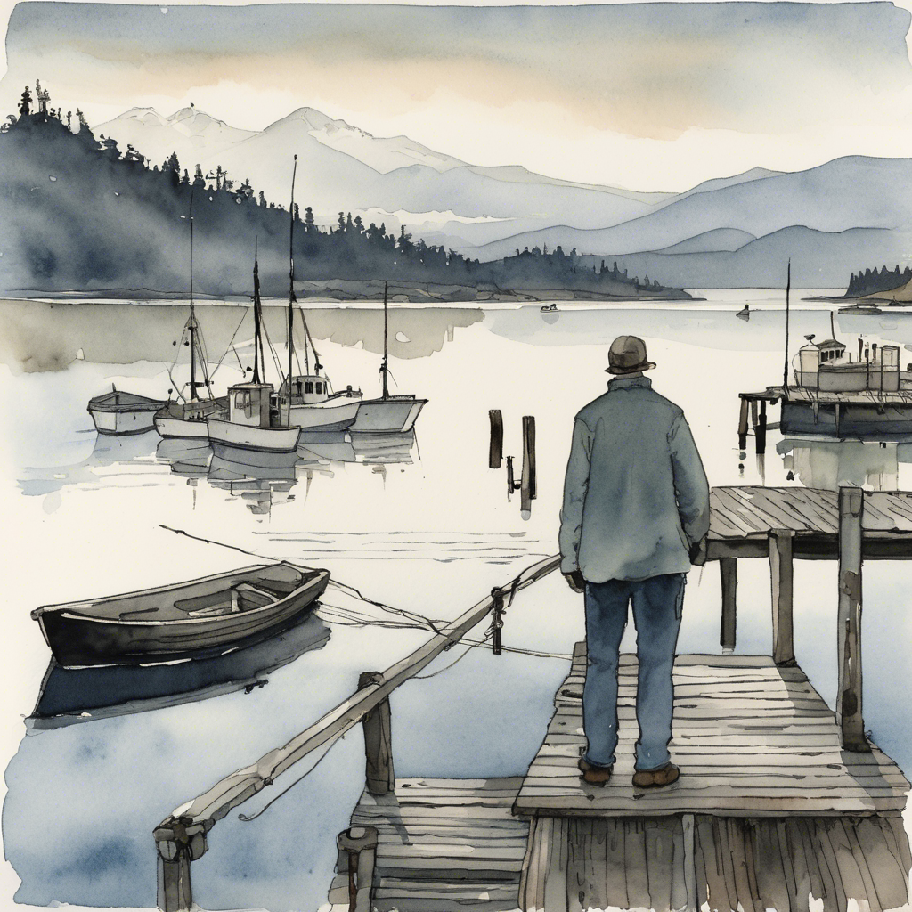
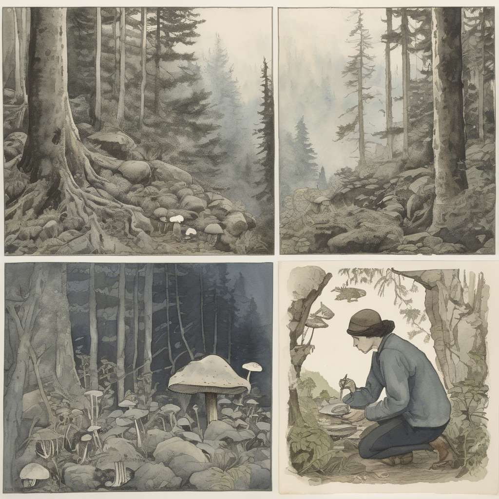
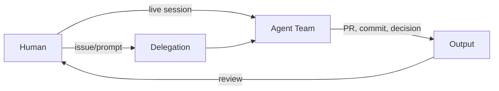
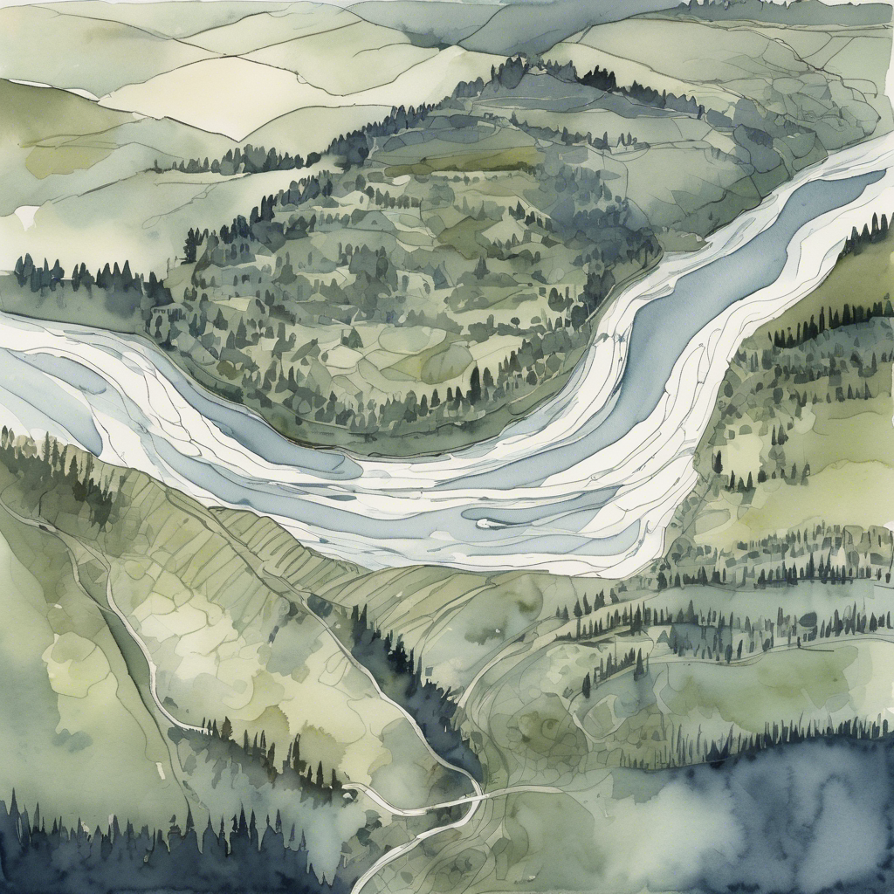
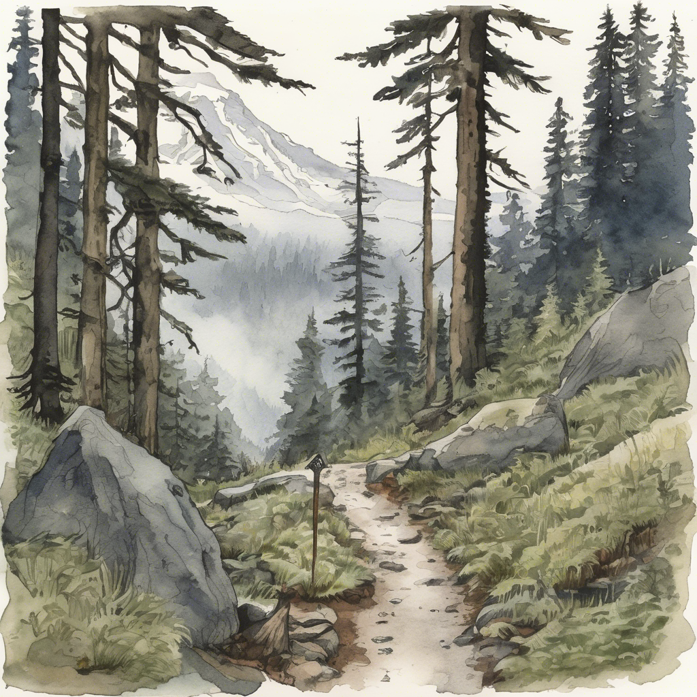
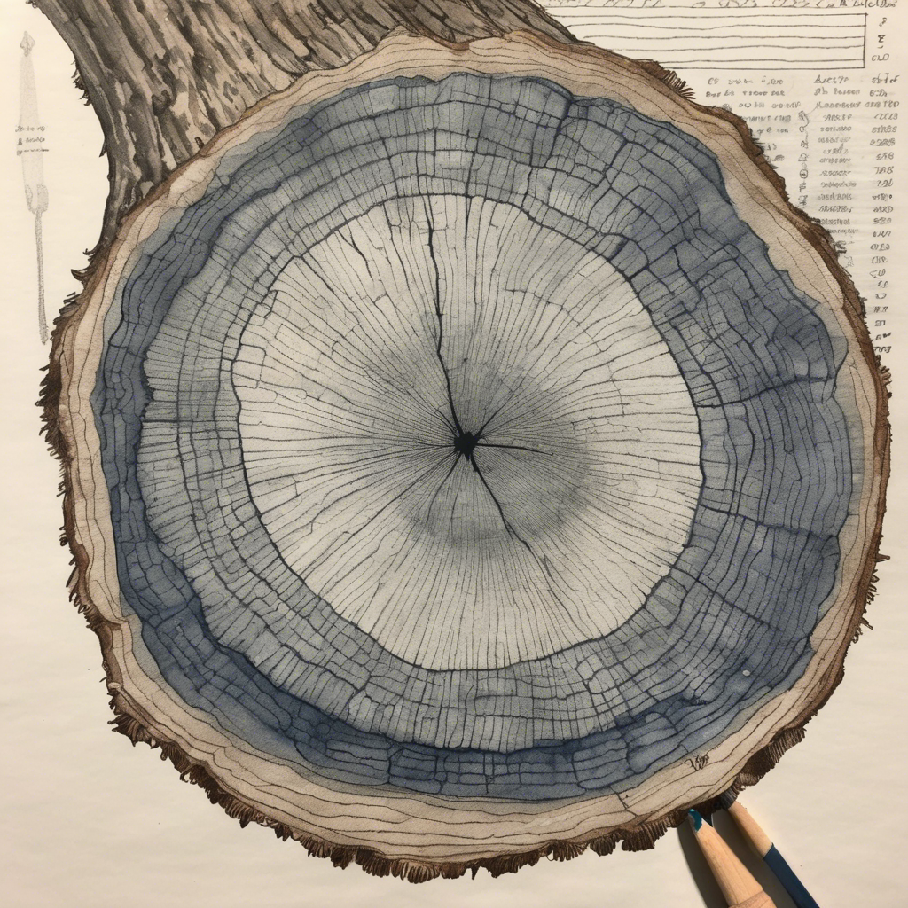
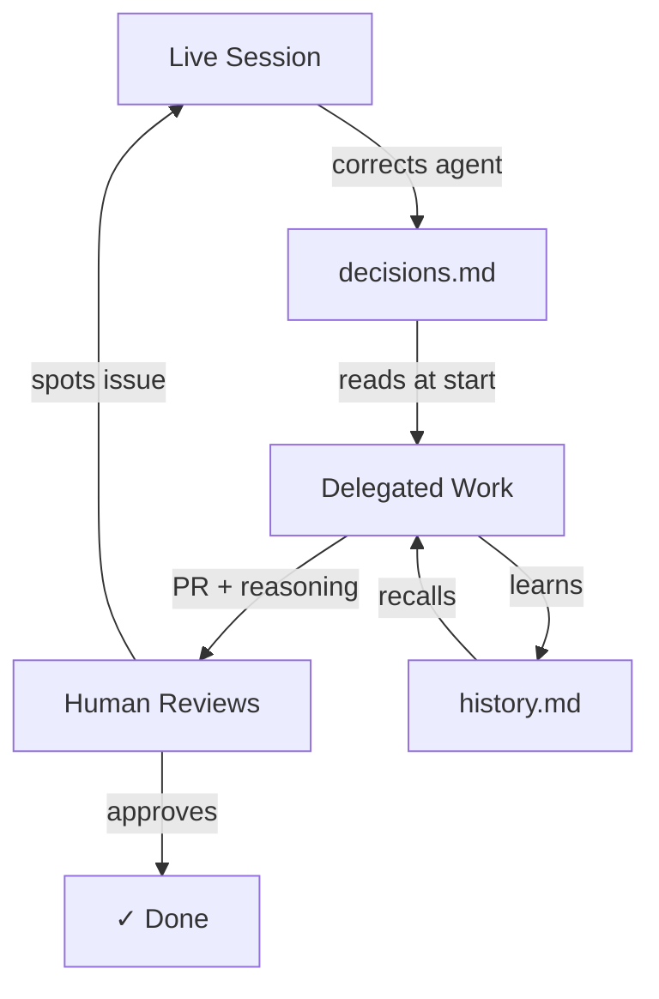

# Knowing What Your Agent Team Did and Why

<!-- IMAGE PROMPT (Hero): Watercolor illustration of a person standing on the Bellingham Bay boardwalk at dawn, looking out at a fleet of small fishing boats returning to harbor. Each boat has a faintly glowing logbook on its deck. Soft fog on the water, Mount Baker in the background with alpenglow. Muted blues, greens, and warm amber. Pacific Northwest atmosphere. Clean, editorial style. -->



I've been using [Squad](https://github.com/bradygaster/squad), a human-led AI agent team framework built on [Copilot CLI](https://docs.github.com/en/copilot/github-copilot-in-the-cli), for a few months now. I set up ten agents — each with a charter, a history file, and specific skills. Some days I'm sitting at the terminal directing them. Other days I delegate work through issues and review the PRs later.

Both ways work. But I keep running into the same question: **when I review what the team did, can I understand _why_ they did it?**

This post is my investigation into that question — not a conclusion. I'm exploring what observability looks like for custom Copilot CLI agent teams, what the platform gives you today, and what you might need to build yourself. It's a snapshot in time. Things are moving fast.

## The question that started this

I had delegated a task through an issue: "update the content pipeline for the new API version." The next morning I had a clean PR with the right changes. But the agent had restructured one function in a way I didn't expect. I wanted to know: why this approach? What did the agent consider? What constraints drove the decision?

The code was correct. But I couldn't trace the reasoning.

And here's the thing: if I'd been in a live session, I could have just asked. The reasoning would have been right there in the conversation. But because I'd delegated the work, the reasoning was... somewhere. Not lost — but not connected to the PR I was reviewing.

That's the gap I wanted to understand. The more I dig into it, the more I think it's not just a tooling problem — it's a strategic one. Tools can record what happened. Strategy determines whether you can still course-correct when the reasoning behind a change doesn't match your intent.

## Why this matters beyond my workflow

If you're a developer using AI agents for real work — or a team lead deciding whether to adopt them — this question isn't academic. It's the difference between:

- **"I can use AI agents and stay accountable"** vs. **"I shipped code I can't fully explain"**
- **"I can scale my team's output with agents"** vs. **"I scaled output but lost the ability to course-correct"**
- **"I can onboard someone new and they can follow the reasoning trail"** vs. **"Only I know why things are the way they are, and even I'm not sure"**

As AI agents move from experimental tools to production workflows, the ability to trace reasoning becomes a governance question. Not in the heavy compliance sense — in the practical sense of: can you maintain confidence in a system that makes decisions on your behalf?

I think the answer is probably yes, but only if you design for it.

## Two ways to work with your agent team

<!-- IMAGE PROMPT (Live vs. Delegated): Split watercolor — left panel shows mushroom forager kneeling in Whatcom County forest examining chanterelle with hand lens up close, ferns and moss around them. Right panel shows same forager at cabin table studying collected specimens with field notes beside them. Dense PNW forest with filtered light on left, warm cabin interior on right. Slate blue, warm sage, charcoal palette. -->



When you set up a custom agent team on Copilot CLI, there are two natural patterns:

**Live sessions** — you're at the terminal, talking to the team. You see every decision as it happens. You can ask "why did you do that?" and get an answer immediately. You're steering.

**Delegated work** — you set direction through an issue or a prompt, the team executes, and you review the output later. You're governing — setting goals, reviewing results, course-correcting.

Both are human-directed. In live sessions, you're hands-on. In delegated work, you're setting direction and reviewing results. People stay accountable for priorities, approvals, and final changes — the agents handle coordination and execution.



The observability question is the same in both cases: **can you reconstruct why the team made those decisions and changed that code?** But the answer is very different depending on which pattern you used.

## What the platform gives you today

<!-- IMAGE PROMPT (Platform Telemetry): Illustrated aerial view of the Nooksack River winding through Whatcom County farmland, with small sensor stations along the riverbank glowing softly — measuring water level, flow rate, temperature. The river is data flowing through the landscape. Fog in the valleys, evergreen ridgelines. Clean cartographic style with watercolor texture. -->



Copilot CLI has been adding observability features. Here's what I can see as a user, as of mid-April 2026:

### Session persistence

Every Copilot CLI session — live or delegated — lands in `~/.copilot/session-state/`. The full transcript: prompts, responses, tool calls, file changes, checkpoints. You can browse sessions with `/session` and resume any past session with `/resume`.

### OpenTelemetry (shipped in v1.0.4)

As of [Copilot CLI v1.0.4](https://github.com/github/copilot-cli/issues/2471), you can enable OTel instrumentation:

```bash
COPILOT_OTEL_ENABLED=true
# or
OTEL_EXPORTER_OTLP_ENDPOINT=http://localhost:4317
```

This gives you traces for agent sessions, LLM calls, and tool executions — token usage metrics, operation durations, and OTLP HTTP export with enterprise auth headers. Run `copilot help monitoring` for the full reference.

### Session store (queryable)

Session data is also available in a structured SQLite database. If you're building tooling, you can query sessions, turns, checkpoints, file changes, and references (commits, PRs, issues) programmatically.

### What's still missing

Two open issues on [github/copilot-cli](https://github.com/github/copilot-cli) highlight gaps:

- **[#2396](https://github.com/github/copilot-cli/issues/2396) — Session attribution.** Sessions don't currently record _how_ you launched them — interactive vs SDK vs headless — or which custom tool created them. If you run three different agent tools, their sessions all look identical. The issue proposes persisting `client_type` and `clientName` in session-state files.

- **[#1791](https://github.com/github/copilot-cli/issues/1791) — Session history.** There's no cross-session audit view without starting the agent. The issue proposes a `copilot --history` flag for querying session history directly from the shell — spend no tokens, launch no agent.

These are platform-level improvements that, based on the issue discussions, should help with the "what happened" and "which session did it" questions. But even when they ship, there's a layer they won't fully cover.

## The layer the platform can't fully solve

<!-- IMAGE PROMPT (Project-Specific Why): A hiker on the Chain Lakes trail near Mount Baker, standing at a fork where two paths diverge into fog. One path has a hand-carved wooden trail sign with specific directions. The other path has only a generic "Trail" marker. Dense Pacific Northwest old growth — moss, ferns, cedar. Watercolor, moody greens and grays. -->



Here's where my thinking is landing so far: platforms are getting better at capturing **what happened**, **which session did it**, and even **generic rationale** (plans, tool-call sequences, diff summaries). But they can't tell you which rationale is **project-relevant**.

Consider these questions:

- "Why did the agent pick Redis over a file cache?" → That depends on your team's standing decision to prefer managed services.
- "Why did the agent restructure the function?" → That depends on your charter's rule about separating API contracts from implementation.
- "Why did the agent skip the edge case in the test?"→ That depends on your skill's instruction to focus on the happy path first and file follow-up issues for edge cases.

The platform can tell you the agent called 12 tools and used 50K tokens. It can even summarize the session. But it doesn't know about your team's decisions, your project's constraints, or your agents' specific mandates.

Squad's design philosophy — recently [reframed explicitly](https://github.com/bradygaster/squad/pull/989) around human-led productivity — is that people stay accountable for priorities, approvals, and final changes while agents handle coordination and repetition. The work stays inspectable because it lives in your repo as files: charters, decisions, history, orchestration logs.

## What you can build into a custom agent team

If you're using a framework like Squad (or any custom agent setup with scoped personas), you have configuration surfaces that I think serve double duty: they shape agent behavior AND create a reasoning trail. I experiment with this in my own setup, but the same patterns apply with system prompts, ADRs, policy files, or whatever mechanism your framework uses to scope agent behavior.

### Charters — scope + accountability

When something goes wrong, the first question is "who was supposed to own this?" Charters answer that before anyone has to ask.

Each agent has a charter that defines what they own, how they work, and their boundaries. In my setup, charters look like this:

```markdown
# Gonzo — Infrastructure Charter

## Responsibilities
- GitHub Projects Setup
- Labels & Configuration
- GitHub Actions workflows

## Scope Boundaries
- Does: Infrastructure, automation, GitHub platform configuration
- Doesn't: Design templates (→ Piggy), strategic decisions (→ Kermit)
```

When Gonzo opens a PR that changes a GitHub Action, the charter explains why Gonzo did it (it's in scope) and why Piggy didn't (it's not in Piggy's scope). The charter is both an instruction and an explanation.

**What to add for observability:** An explicit section on how the agent should narrate their work:

```markdown
## When producing output
- Every PR description includes: parent issue link, reasoning summary,
  what was considered but rejected
- Every commit message references the source issue
- Architectural choices reference the relevant standing decision
```

This is just charter text. No code change. The agent reads it and follows it.

### Decisions — the shared brain

Individual agents forget between sessions. Standing decisions don't — they're the one file every agent reads at startup.

`decisions.md` is the team's institutional memory. Every agent reads it at session start. Standing decisions shape behavior across all sessions:

```markdown
## Prefer managed services over self-hosted
**What:** When choosing infrastructure, prefer managed/cloud services.
**Why:** Reduces operational burden. Team doesn't have on-call rotation.
**When:** 2026-03-15
```

When an agent chooses Azure Cache for Redis over a local Redis container, you can trace it back to this decision. The decision is the **why**. It persists across sessions, across agents, across modes.

**What to add for observability:** A standing decision that requires reasoning in outputs:

```markdown
## All delegated work must include reasoning
**What:** Every PR opened from delegated work must include a "Reasoning"
section explaining key decisions and what alternatives were considered.
**Why:** The person reviewing wasn't in the session. They need context.
**When:** 2026-04-18
```

### Agent history — per-persona memory

Charters define what an agent *should* do. History captures what they *learned* doing it.

Each agent accumulates a `history.md` — learnings from past sessions that shape future behavior. When Gonzo learns that a specific GitHub Action syntax causes failures in this repo, that goes in Gonzo's history. Next time Gonzo works on Actions, they know.

History files serve observability because they're the answer to "has this agent dealt with this before, and what did they learn?"

### Skills — repeatable tasks with built-in standards

If charters define who does what and decisions define why, skills define *how* — including what the output should look like.

Skills encode how to do specific tasks — including quality gates and output standards. A well-written skill includes what the output should look like:

```markdown
## PR Description Format
- Reference the source issue or dispatch parent
- Include a checklist of validation criteria
- This provides traceability from the content PR back to
  the engineering change
```

Skills are instructions AND observability policy in one file. They tell the agent what to produce and tell the reviewer what to expect.

### Orchestration logs — the narrative bridge

Raw session data tells you everything that happened. Orchestration logs tell you what *mattered*.

If your agent team produces orchestration logs (structured summaries of what happened during a work session), those become the bridge between raw session data and human understanding:

```markdown
## Orchestration Log — 2026-04-18T14:30:00

**Agent:** Gonzo (Infrastructure)
**Task:** Update CI pipeline for new API version
**Key decisions:**
- Chose matrix strategy over sequential jobs (faster, same coverage)
- Skipped Windows runner (no Windows-specific code in this change)
**Artifacts:** PR #847, 3 commits
**Standing decisions referenced:** "Prefer managed services", "CI must pass before review"
```

## The feedback loop

<!-- IMAGE PROMPT (Feedback Loop): Close-up cross section of old growth cedar tree trunk from Whatcom County forest showing detailed tree rings. A forestry researcher's hand holds a pencil making small annotations beside specific rings. Magnifying glass rests on the wood surface. Each ring is a distinct record. Warm wood tones, scientific field study aesthetic. Slate blue, warm sage, charcoal palette. -->



The real power isn't any single artifact — it's the loop between them.



1. In a live session, you notice an agent making a choice you disagree with. You correct them. That correction becomes a decision in `decisions.md`.
2. Next time that agent (or any agent) runs — live or delegated — they read `decisions.md` and behave differently.
3. The delegated work produces a PR with a reasoning section. You review it. If the reasoning references the decision you wrote, the loop is closed.
4. If the reasoning doesn't make sense, you're back in a live session asking questions. The loop continues.

**The human is always directing the work.** Charters, decisions, history, and skills are the mechanisms. The question is whether those mechanisms produce enough signal for you to know _when_ to course-correct — so you spend less time re-investigating and more time deciding.

## Where my investigation is landing

After digging into this, here's my current understanding — still forming, not final:

**I'm starting to see this less as a gap and more as a design discipline.** You're building a provenance layer — charters, decisions, skills, orchestration logs — that complements platform telemetry. The platform tells you what happened. Your configuration tells agents why things should happen a certain way — and creates the trail to verify that they did.

**And it matters more when you're reviewing delegated work.** In a live session, missing rationale is recoverable — you can ask. In delegated work, missing rationale means you're reading code without context. Both modes need reasoning capture, but delegated work makes missing rationale much costlier.

## The bigger picture: why this matters strategically

I keep coming back to this: the value of AI agents isn't just that they produce code. It's that they can produce code _you trust enough to ship_.

Trust requires the ability to course-correct. Course-correction requires understanding what happened and why. That's observability.

**For developers**, this is about code quality and review confidence. If you can't trace why an agent restructured a function, you're approving code on faith. That might work for trivial changes. It doesn't scale to anything complex.

**For team leads and AI owners**, the stakes are higher:

- **Review scalability.** Without reasoning trails, every delegated PR becomes expensive senior-review work. If delegation saves coding time but increases review time, you haven't actually scaled — you've moved the labor.
- **Incident response.** When an agent causes a regression, observability is how you reconstruct what happened. Without it, your postmortem is: "the AI did something and we're not sure why."
- **Drift detection.** Agent teams don't just fail once — they drift. Models update, prompts evolve, context shifts. Observability is how you notice when behavior changes incrementally, before it becomes a production issue.
- **Safe scope expansion.** You can only delegate more to agents you can verify. Observability is the prerequisite for saying "I trust this agent enough to handle this without me watching."

As more developers and teams adopt AI agents for real production work, I think this becomes a dividing line:

**Teams that design for observability** can scale their use of agents and catch reasoning drift early. They can onboard new team members who can follow the trail. They can maintain accountability even as agent capabilities grow.

**Teams that don't** risk hitting a ceiling. The agents produce output, but reviewing that output becomes a black-box exercise. You end up approving PRs you don't fully understand because the alternative is re-doing the work yourself.

I don't think this is unique to Squad or even to Copilot CLI. Any system where AI agents make decisions on a developer's behalf faces this same question — whether it's a custom agent team, a CI pipeline with AI steps, or a coding assistant with increasing scope. The mechanisms might differ (charters vs. system prompts vs. policy files), but the discipline is the same: **design your agents and workflows so reasoning is inspectable where review actually happens.**

The platform appears to be moving in this direction. OTel is already there. Session attribution and history seem to be coming. But the project-specific reasoning layer — what decisions matter, what constraints apply, what "good" looks like for _this_ project — that's yours to build.

## What I'd do on Monday

<!-- IMAGE PROMPT (Actionable Steps): A person sitting at a weathered wooden table on a covered porch overlooking Chuckanut Bay, with a field journal open, a cup of coffee, and a simple checklist being written by hand. Rain falling gently outside. Fir trees framing the view. Warm, inviting, practical. Watercolor illustration, cozy PNW cabin aesthetic. -->


If you're setting up a custom agent team and want observability from day one, here's where I'd start:

1. **Add observability expectations to every agent's scope definition.** Tell agents to explain their reasoning in PR descriptions, reference relevant decisions, and note what alternatives they considered. This is free — it's just configuration text.

2. **Write a standing decision requiring reasoning in outputs.** Make it team policy, not per-agent hope. "Every PR from delegated work must include a Reasoning section."

3. **Link outputs to inputs.** Every PR should reference its source issue. Every commit should trace to a task. The goal is: from any output, you can walk backward to the intent.

4. **Use orchestration logs.** Even a simple markdown summary after each work session creates a queryable trail for later review.

5. **Enable OTel now.** `COPILOT_OTEL_ENABLED=true` gets you traces immediately. Watch for session attribution ([#2396](https://github.com/github/copilot-cli/issues/2396)) and session history ([#1791](https://github.com/github/copilot-cli/issues/1791)) as they ship.

6. **Build the feedback loop.** When you spot a reasoning gap during review, don't just fix the code — update the decision file or charter so the next session benefits. That's how the system gets smarter.

The agents are doing the work. The platform is recording the telemetry. But the human defines what "good reasoning" looks like for this project. That's the part no platform can ship for you. I'm still figuring out the best patterns, but I'm increasingly convinced this is one of the first disciplines to get right.

---

_This is a snapshot of my investigation as of April 2026. Copilot CLI and Squad are both evolving fast. The specific features and issue numbers referenced here may have changed by the time you read this._

_Squad is an open-source project by [Brady Gaster](https://github.com/bradygaster/squad). Observability patterns referenced here also draw from [Tamir Dresher's](https://www.tamirdresher.com/blog) excellent series on scaling AI agent teams, particularly his posts on [Aspire + Squad observability](https://www.tamirdresher.com/blog/2026/03/22/aspire-squad-love), [securing agent teams](https://www.tamirdresher.com/blog/2026/03/25/securing-hardening-ai-agent-squad), and [cross-squad communication](https://www.tamirdresher.com/blog/2026/03/26/scaling-ai-part8-pathfinder)._
