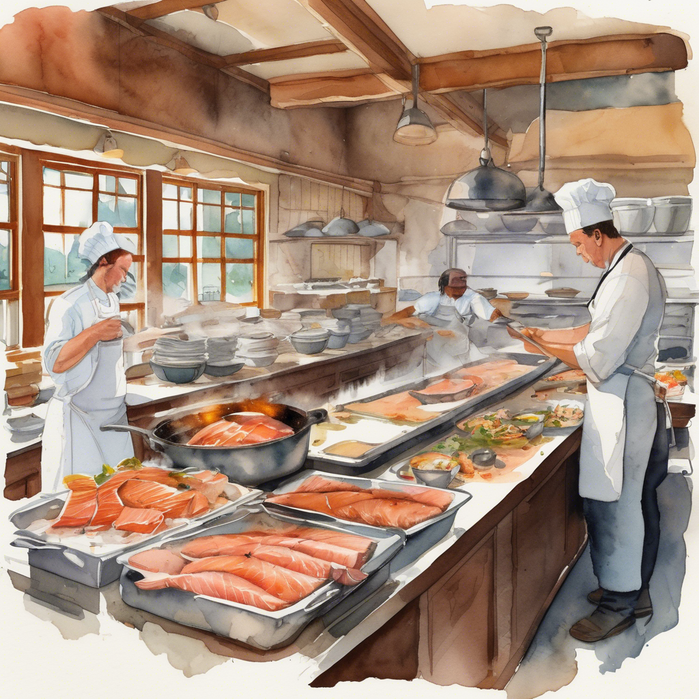
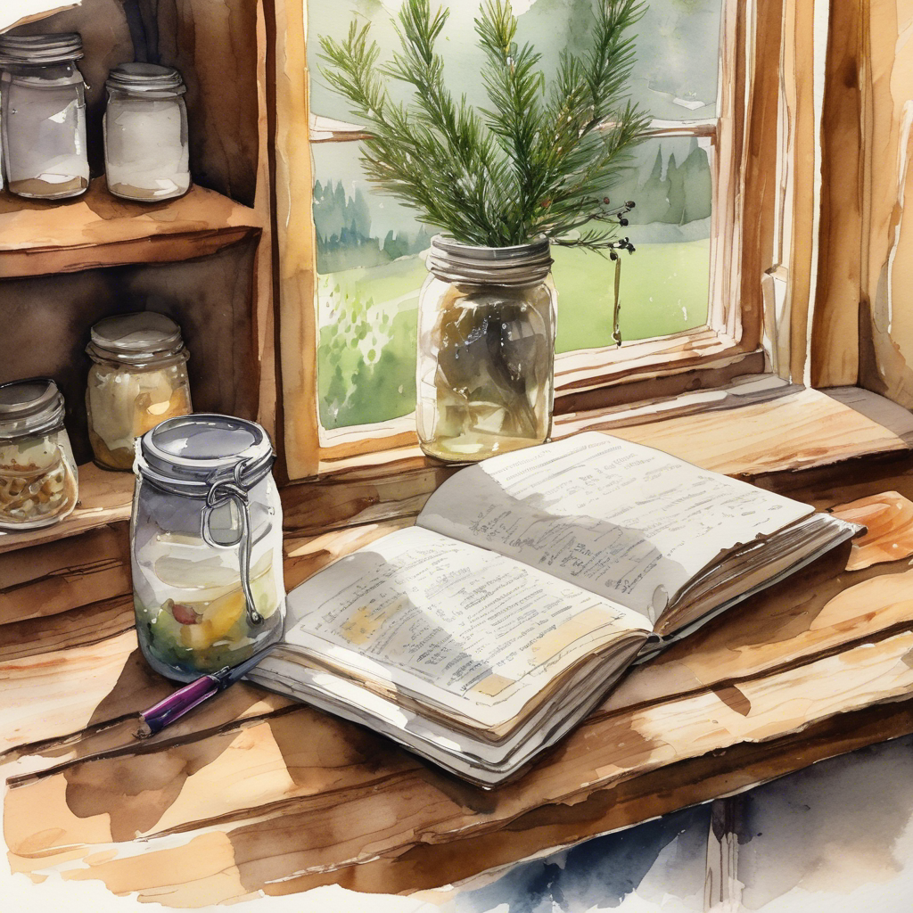
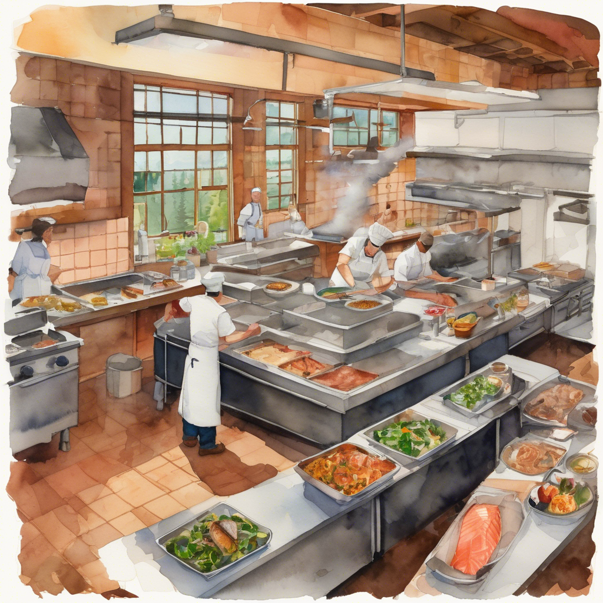

# I Had a Team — Why Was I Talking to One Agent?

<!-- IMAGE PROMPT (Solo vs. Team): Split watercolor illustration in Whatcom County PNW style. LEFT: A single chef in a rustic farmhouse kitchen (think Bellingham farm-to-table restaurant), surrounded by piling orders — salmon on the grill burning, a dessert collapsing, dirty dishes stacking up, an empty dining room visible through the pass. Stressed posture, too many pans. RIGHT: The same kitchen, now alive — one person at the grill, another plating dessert, someone restocking from a garden crate, a floor manager visible through the pass checking on diners. Calm, coordinated, everything moving. Muted PNW palette: slate blue, warm wood, sage green, copper pans. Soft watercolor texture with fog through the windows showing evergreen treeline. -->



*Same kitchen, same menu. One side has a cook trying to run every station alone. The other has a team — and it shows.*

I built a full AI agent team with Copilot CLI's Squad feature. Then I ignored most of it.

Imagine I open a restaurant.I've got a head chef, a sous chef, a pastry specialist, someone managing inventory, and a floor manager watching the dining room. One evening, I walk into the kitchen and hand the head chef a note:

*"Cook the salmon, bake the dessert, restock the walk-in, check on table 6, and fix the wobbly chair by the window."*

The head chef can probably handle all of it — slowly, and not particularly well — while the pastry chef stands idle and the floor manager doesn't know table 6 needs attention. I didn't use the team. I handed everything to one cook and left the rest of the kitchen standing idle.

But here's the thing: even if the head chef *could* do it all, that's not their job. The head chef's job is to run the kitchen — decide what goes out, when, and who makes it. The moment the head chef starts cooking every dish, they stop managing the kitchen. Nobody is coordinating. Nobody is watching quality. The whole system depends on one person not burning out before dessert.

Something similar happened with my Copilot CLI agent team. I'd set up a full Squad — cast the roles, written the charters, built a routing table. Then I opened a session and said:

*"Cedar (Coordinator), build the login page, write tests for it, review the PR, update the docs, and file the issue."*

Cedar did all of it. Alone. Sequentially. No delegation, no specialization, no memory carried forward. I'd asked the coordinator to do all the work instead of coordinate it — like asking a manager to personally complete every task on the sprint board instead of assigning them to the team.

It's an easy habit to fall into, and it quietly gives up most of what makes an agent team useful. This post is about why I kept doing it, what it cost me, and how I learned to use the full team in Squad as it works today.

## Why I kept using a single agent

**The single-prompt habit.** ChatGPT, Copilot Chat, Claude — most AI tools trained me to talk to one thing and get one answer. Squad starts with a single CLI entry point, so the muscle memory carried over. I addressed Cedar because that was the name I remembered.

**Delegation felt uncertain.** When I sent work to one agent, I saw every line of output. When I sent it to four, I had to trust a routing table I wrote last week. That trust gap kept pulling me back toward the familiar.

**Routing looked like overhead.** I could see the work in front of me. I knew what needed to happen. Telling the coordinator "figure out who handles this" felt slower than just asking Cedar directly — even when it wasn't.

**The casting ceremony was the high point.** I named agents after PNW trees. I confirmed the roster. I got the "✅ Team hired" message. Then the energy shifted to actual work, and the team structure faded into the background.

**The cost was invisible.** One agent still produced output. The things I missed weren't obvious: the PR that skipped quality review, the decision nobody logged, the stuck issue that sat unnoticed for three days.

*One cook trying to run the whole restaurant. Same kitchen, same menu — but only one side keeps up with the dinner rush.*

## What I lost using one Copilot CLI agent

Back to the restaurant. Here's what started to slip when the head chef handled it all alone.

### Specialization gave way to generalist guesses

My team picked specialists for a reason. Here's what happened when I skipped past that choice.

The pastry chef knows dough hydration ratios by feel. The head chef knows them well enough — but not the way someone who does it every day does. That gap is the difference between adequate and excellent.

Each Squad agent has a charter that defines what it handles and what it should defer. My QA agent catches things the implementer won't, because its charter says "review for edge cases, test coverage, and security patterns." When one agent does everything, there's no second perspective — no healthy tension between "ship it" and "is it actually ready?"

### Parallel work became sequential

Nothing slows a dinner service like running every station one at a time. I found the same thing happening with my agent team.

In a restaurant, the salmon, the dessert, and the inventory happen at the same time — different people, different stations. Hand it all to one person, and your dinner service takes three times as long.

Squad's triage system launches agents in parallel:

```bash
npx squad triage --execute --max-concurrent 3
```

Triage scans your issues, routes each to the right agent via `routing.md`, and runs them concurrently. Three agents, three repos, running at the same time. With one agent, those same tasks ran back-to-back — slower, and each one got less focus because the context window was packed with everything at once.

### Decisions got made and then forgotten

A restaurant keeps a recipe book. When the sous chef figures out that the hollandaise breaks if you add butter too fast, that goes in the book. Next time, nobody has to relearn it.

Individual agents forget between sessions. Standing decisions don't.

Scribe (the silent agent) maintains `.squad/decisions.md` — an append-only log of why your team chose what it chose. Here's a real entry:

```markdown
## Decision: Fork-and-Pull is Standard Open Source (2026-03-31)
**By:** Squad Coordinator
Dina's fork workflow (work on diberry/ fork, PR upstream when ready) is the standard
"fork and pull" model. Filing issues on the fork for squad task tracking is a reasonable
extension that keeps the workspace self-contained.
**Status:** ✅ Validated
```

That decision now informs every future dispatch. With one agent and no Scribe, I ended up making the same mistake again next week — because nobody wrote it down.

<!-- IMAGE PROMPT (Decision Memory): Watercolor close-up of a well-worn recipe book open on a wooden shelf in a Whatcom County farmhouse kitchen. Handwritten notes in the margins — "butter too fast = breaks", "use Samish Bay cream for this one", dates and initials. A newer note is being written by a hand holding a pen. Behind the book, mason jars of preserved ingredients line the shelf. Morning light through a rain-streaked window, evergreen branches visible outside. Warm wood tones, cream pages, ink blue handwriting. Soft watercolor with visible brushstrokes. -->



*The recipe book doesn't cook. But without it, every new cook starts from scratch — and makes the same mistakes the last one already solved.*

### Work quietly got stuck

Work that nobody's watching tends to stay broken. Here's what I missed without a floor manager.

The floor manager's job is to watch the room. Nobody asks them to — they just do it, continuously. They notice the couple waiting too long, the empty water glasses, the check that hasn't been dropped.

Ralph (Work Monitor) plays the same role. Ralph's background scans detect:
- Untriaged issues that need assignment
- Issues assigned but not started
- PRs open too long with no review
- CI failures across repos

Without Ralph running, work sat. I didn't notice until someone asked "what happened to that PR?"

### The audit trail disappears

Good restaurants keep logs. Health inspectors don't accept "I think we checked the fridge temperature." They want the sheet with dates and signatures.

Three weeks from now, someone asks why I chose approach A over approach B. With Squad's orchestration log, decisions inbox, and `.copilot/` session state (which [persists checkpoints, plans, and turn history](https://dfberry.github.io/2026-04-16-session-storage-decision-guide) across sessions), I have an answer. With one agent, the reasoning disappeared when the session ended.

## How to use the whole Copilot CLI agent team

That's what slipped. Here's what changed when I stopped asking the coordinator to do the work and started letting it delegate.

### 1. Talk to the coordinator about problems, not tasks

The shift was subtle but meaningful: I started describing the outcome I needed, not the steps to get there. The coordinator's job is to figure out *who* does the work — not to do it personally.

Instead of: *"Cedar (Coordinator), write the auth middleware, add tests, and update the API docs."*

Try: *"Cedar, we need authentication for the API. Users should log in with GitHub OAuth. Route this to the right agents."*

Cedar reads routing.md, sees that infrastructure goes to Alder (Backend Dev), docs go to Madrone (Docs/Specs), and quality review goes to Salal (Tester). Three agents get dispatched. I get parallel execution and specialized output.

### 2. Let routing.md handle assignment

My routing table already maps work types to agents:

```markdown
| Work Type              | Primary                | Reviewer               |
|------------------------|------------------------|------------------------|
| Infrastructure/CI      | Alder (Backend Dev)    | Cedar (Coordinator)    |
| Requirements/Specs     | Madrone (Docs/Specs)   | Cedar (Coordinator)    |
| Quality/Testing        | Salal (Tester)         | Madrone (Docs/Specs)   |
| Cross-repo coordination| Cedar (Coordinator)    | —                      |
```

When I tell Cedar "route this," the coordinator uses this table. I don't need to remember who does what — that's the coordinator's job.

### 3. Run a quick ceremony before building

A 2-minute design review catches "I'm building the wrong thing" before three agents spend 20 minutes building it.

Squad has three built-in ceremonies:

- **Design Review** — the lead and reviewers validate requirements before anyone writes code
- **Retrospectives** — the team reflects on what worked and what didn't
- **Cross-Repo Sync** — the coordinator ensures work across multiple repos stays aligned

They might feel like overhead. I found they tend to save more time than they cost.

### 4. Let Ralph watch in the background

Ralph's (Work Monitor) background scan gives the team ambient awareness without requiring me to check anything manually:

```bash
npx squad triage --two-pass --interval 10
```

Ralph scans for actionable work on a regular interval using a two-pass approach — lightweight list first, then hydrate only actionable items. When Ralph finds an untriaged issue, it flags it for the coordinator. When Ralph spots a stale PR, the team knows before the author has to ask.

If I only ever ran agents on demand, I missed the quiet awareness that makes a team feel like a team.

### 5. Check decisions.md before starting a new session

Before I open a session, I glance at `.squad/decisions.md`. It takes 30 seconds. I see what the team decided last time, what patterns they established, and what constraints they're working under. This is the institutional memory that keeps me from relitigating settled questions.

### 6. Use the skills library instead of one-off prompts

Skills compound. One-off prompts don't. The difference between a team that gets better over time and one that starts fresh every session is whether I capture patterns as reusable skills.

Squad ships with 40+ SKILL.md files — portable, reusable capabilities any agent can run. When I need a PR quality check, I don't write a custom prompt. I invoke the `pr-quality-checkpoint` skill:

```
"Salal (Tester), run the pr-quality-checkpoint skill on PR #42"
```

<!-- IMAGE PROMPT (Routing Flow): Watercolor bird's-eye view of a busy restaurant kitchen during dinner service in Whatcom County. The pass (pickup window) is center frame with order tickets clipped above it — the head chef stands here calling out orders. Around the kitchen: the grill station (salmon searing, one cook focused), the pastry corner (dessert being plated, another cook), the prep station (vegetables from a farm crate being chopped), and through the pass window the floor manager is visible checking on a table. Each station works independently but the tickets connect them. Warm kitchen light, copper and wood, steam rising, evergreen dusk visible through a back door propped open. PNW watercolor palette: warm amber interior, cool blue-green exterior. -->



*The head chef calls the order. Each station owns their part. The tickets keep everyone connected. That's routing.*

## The mental model shift

The single-agent habit came from thinking of AI as a tool — pick it up, use it, put it down. Squad works a bit differently: it treats AI as a team I coordinate.

I don't run a restaurant by cooking every dish myself. I run it by hiring people who are better than me at specific things, telling them what needs to happen, and letting them coordinate. The head chef sets the menu. The sous chef preps. The pastry chef handles dessert. The floor manager watches the room. Everyone knows their role because it's written down — not because I remind them every night.

Squad works the same way:
- Defining who does what (charters)
- Routing work to the right person (routing.md)
- Letting specialists specialize (parallel dispatch)
- Keeping a shared record of decisions (Scribe + decisions.md)
- Watching for stuck work (Ralph)
- Reviewing before shipping (ceremonies)

All of these exist in Squad today. The question is whether I let the coordinator coordinate.

## Tasks that light up the whole kitchen

The difference becomes clearest with real work. These are tasks where a single agent gives you a piece of the picture — and a coordinated team gives you the full one.

### Full repo review

One agent reads files and offers scattered observations. A team assigns the lead to scope what matters, the backend dev to check architecture and dependencies, the tester to assess coverage gaps, and the docs agent to flag stale README sections. Scribe logs what they find so the next review builds on this one.

*Restaurant version: A health inspection isn't one person tasting a dish. The kitchen gets checked, the walk-in gets reviewed, the floor gets inspected, and the logs get audited. Each area needs its own set of eyes.*

### PR review

A single agent reads the diff and comments on style. A team routes the PR through the right reviewer based on what changed — infrastructure changes go to one agent, test coverage to another, docs impact to a third. The lead assembles their findings into a single review with prioritized feedback.

### Feature planning

One agent writes a spec. A team runs a design ceremony first — the lead defines scope, the backend dev flags technical constraints, the tester identifies edge cases before anyone writes code, and the docs agent checks whether users will actually understand it. The spec that comes out has input from the people who'll build it.

*Restaurant version: You wouldn't design a new menu item by asking only the head chef. The pastry chef might say "that won't pair with our dessert rotation," the prep cook might flag a sourcing issue, and the floor manager might share what customers have been requesting. The final dish is better because the whole kitchen weighed in.*

### Cross-repo coordination

One agent works in one repo. A team uses the coordinator to sync work across multiple repos — tracking which PRs depend on each other, which issues in repo A block work in repo B, and which decisions apply everywhere. Ralph's background scan catches stale PRs and unassigned issues across the whole project.

### Communications and stakeholder updates

One agent drafts a message. A team has Scribe pull from decisions.md and session history to draft updates grounded in what actually happened — not what you remember happened. The lead reviews for accuracy, and the message goes out with context no single agent session would have retained.

### Content freshness audit

One agent checks a few files. A team scans every article in your ownership area, categorizes by freshness thresholds, prioritizes by traffic and staleness, and produces a batched remediation plan with PR groupings. Each batch gets routed to the agent best suited to validate that content type.

---

These are the tasks where I used to say "the AI didn't help much" — and the reason was usually that I'd asked one agent to do what a team was built for. The restaurant didn't struggle because the food was bad. It struggled because one cook tried to run every station alone.

## Five steps to start delegating

If this sounds familiar, here's what worked for me:

1. I opened `.squad/routing.md` and actually read it. Remembering it exists was half the battle.
2. I started my next session by describing a problem to the coordinator, not handing it a task list.
3. When the coordinator proposed a plan, I checked whether it involved more than one agent. If it didn't, I asked: "Which agents should own parts of this?"
4. I ran `npx squad triage --two-pass --interval 10` in a second terminal and left it running.
5. At the end of the session, I checked `.squad/decisions.md`. If Scribe logged something, the team was working. If it was empty, I was probably still doing it alone.

The team is already hired. Let them work.
