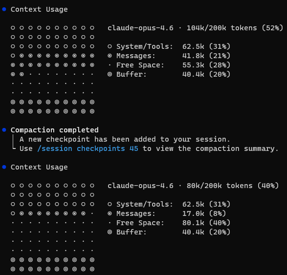
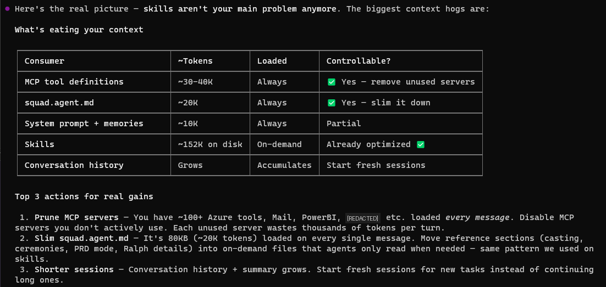
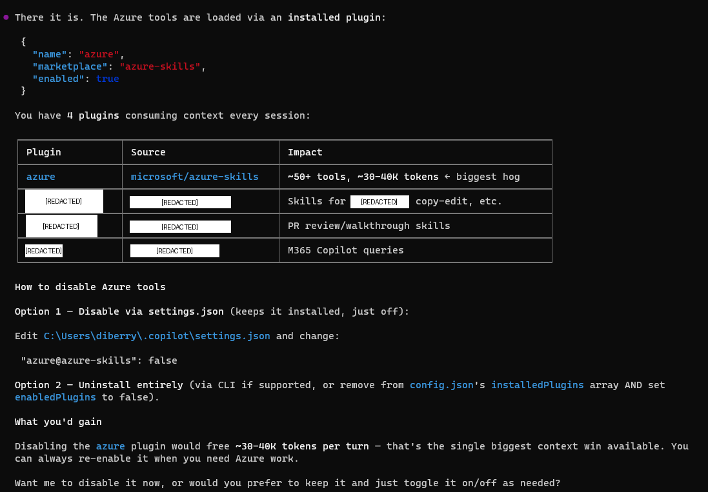
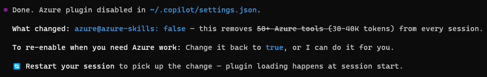
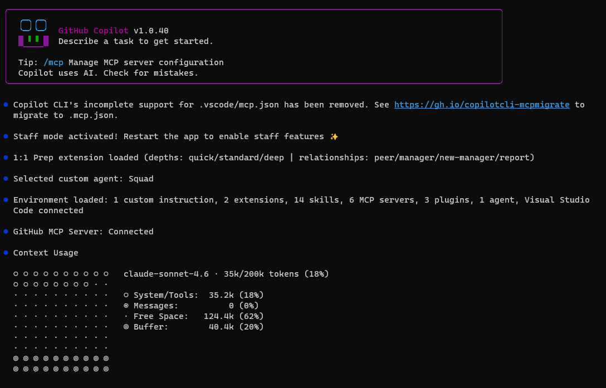
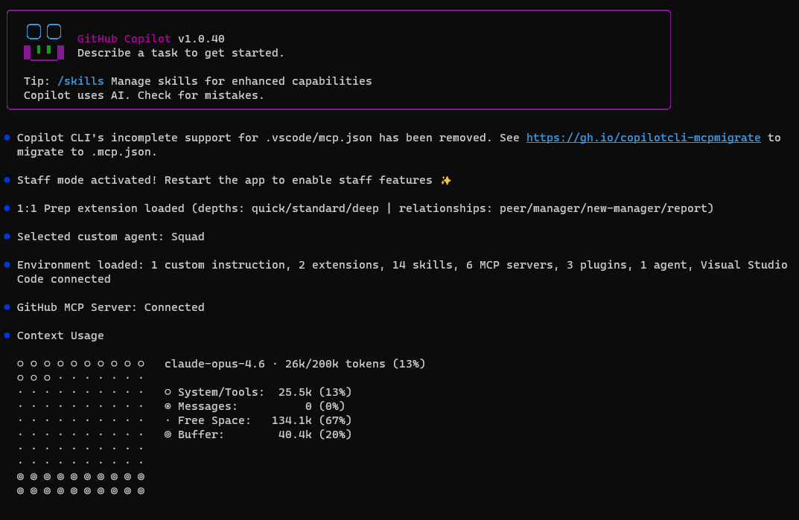
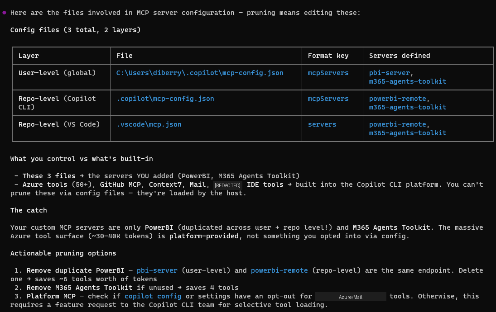

# Tuning Up Context: How I Got My Copilot CLI Context Window from 52% to 13%

I'll be honest: I started this whole investigation backwards. I had 117 skills consuming 413K tokens on disk and assumed *that* was the problem. I spent two hours optimizing them before I thought to actually measure what was in my context window. Turns out, skills are on-demand — they never touch the context window at all.

The biggest consumer was something I never would have guessed: a single plugin loading ~27K tokens of tool definitions into every message. This is the story of how I found it, scoped it down, and — importantly — how you can configure it to match your workflow without losing functionality.

> **What makes this different?** There are already several great articles about MCP context optimization ([devbolt.dev](https://devbolt.dev), [The New Stack](https://thenewstack.io), [StackOne](https://stackone.com), [blog.pamelafox.org](https://blog.pamelafox.org)). This one adds: real measured token numbers from a production setup, the `/context` command as a diagnostic tool, the Azure MCP namespace scoping solution, and the Squad orchestration angle.

## Step 1: Measure First — Check Your Token Breakdown

I run [GitHub Copilot CLI](https://githubnext.com/projects/copilot-cli) with a multi-agent orchestration setup — half a dozen MCP servers, several plugins, and 117 skills. Mid-session, I got curious about what my context window actually looked like and ran `/context`:



```
Context Usage
  claude-opus-4.6 · 104k/200k tokens (52%)

  System/Tools:  62.5k (31%)
  Messages:      41.8k (21%)
  Free Space:    55.3k (28%)
  Buffer:        40.4k (20%)
```

**52% consumed before typing a single message.** The `System/Tools` bucket alone was 62.5K tokens — 31% of my 200K window. That's the baseline cost of my setup: agent instructions, MCP tool definitions, system prompt, memories.

With only 28% free space, complex multi-agent tasks would trigger compaction mid-session. I needed to find what was actually consuming those 62.5K tokens — and the only way to know for sure was to audit what's always-loaded vs. what lives on disk.

## Step 2: Distinguish Always-Loaded from On-Demand

The first question to ask is not "what's biggest?" but "what's always in context?"

The `System/Tools` bucket contains everything that loads on every message — unconditionally. If I can reduce that, *every operation* gets cheaper. Optimizing anything else only helps specific operations.

I built a breakdown:

| Consumer | ~Tokens | When Loaded | Controllable? |
|----------|---------|-------------|--------------|
| **MCP/Plugin tool definitions** | **~27K+** | **Every message** | ✅ Scope or remove |
| **Agent instructions** | **~20K** | **Every message** | ✅ Slim it down |
| System prompt + memories | ~10K | Every message | Partial |
| Skills | ~143K on disk | On-demand only | Can optimize, but won't help context |
| Conversation history | Growing | Accumulates | Fresh sessions help |

**Key insight: Skills sit on disk until an agent explicitly requests one. They are never in the context window.** Optimizing them makes individual agent spawns cheaper and faster — valuable for performance — but they don't contribute to `System/Tools` at all. (I learned this *after* spending two hours optimizing them. Do as I say, not as I did.)



## Step 3: Audit What's Always-Loaded

The mystery is: what's in that 62.5K System/Tools bucket?

### MCP Tool Definitions (~6–10K tokens)

MCP servers inject their tool schemas into every message. I had:

- **GitHub MCP** — ~15 tools (issues, PRs, code search, actions)
- **Mail MCP** — ~20 tools (search, send, reply, forward, attachments)
- **PowerBI MCP** — ~6 tools (execute query, generate query, get schema)
- **M365 Agents Toolkit** — ~4 tools (knowledge, snippets, schema, troubleshoot)
- **IDE** — ~2 tools (diagnostics, selection)

These are real — about 47–55 tools across all servers. But they're only ~6–10K tokens total. Where's the other 50K?

### The Azure Plugin (~27K tokens) — The Biggest Consumer

I checked `~/.copilot/settings.json` and found the Azure plugin enabled:

| Plugin | Source | Impact |
|--------|--------|--------|
| **azure** | microsoft/azure-skills | **50+ tools, ~27K tokens** |

Here's the thing about the Azure MCP Server: it's **comprehensive**. Version 3.0.0-beta.6 has **259 tools across 56 namespaces** — covering everything from ACR to Virtual Desktop to Well-Architected Framework. That breadth is genuinely impressive, and the team clearly designed it to be a one-stop shop for Azure developers.

The good news: the team also thought carefully about how developers actually work. They built in **namespace scoping** and **mode selection** so you don't have to load the entire surface area. In its default "namespace" mode, it groups tools by service — but if you're only using a few services, you can filter down to just those. More on that in a moment.

In my case, the default configuration was loading 50+ tool schemas into every message — even when I wasn't doing Azure work in that session. Not a bug, just a configuration I hadn't tuned yet.



### Agent Instructions (~20K tokens)

My agent governance file — `.github/copilot-instructions.md` at the repo root — is 80KB. It loads on every turn. This is the ongoing cost of a sophisticated agent setup: the orchestration rules are comprehensive, and they load unconditionally whether I need them or not.

## Step 4: Scope the Azure Plugin to Match How You Work

Once I understood the breakdown, the fix was straightforward. The Azure MCP team built exactly the right lever for this — **namespace scoping** lets you declare which services matter for your project and ignore the rest. No functionality lost, just a tighter fit.

### Option A: Disable Entirely (Full removal)

If you genuinely don't use Azure, just turn it off:

```json
// ~/.copilot/settings.json
"azure@azure-skills": false
```

This is what I did initially — it dropped System/Tools from 62.5K → 35.2K, freeing ~27K tokens instantly.



### Option B: Namespace Scoping (Surgical — Recommended)

This is where the Azure MCP Server's design really shines. The team built **namespace filtering** specifically for this use case — you declare the services relevant to your project, and only those tool schemas load into context.

Configure it in your MCP settings with the `--namespace` flag:

```
--namespace appservice --namespace cosmos --namespace keyvault --namespace storage
```

This gives you **4 namespaces (~24 tools)** instead of 56 namespaces (~259 tools) — a significant reduction in context usage while keeping the Azure tools you actually use.

#### Azure MCP Modes

The server supports 4 modes that control how tools are exposed:

| Mode | Behavior | Best For |
|------|----------|----------|
| **namespace** (default) | One tool per service namespace | Copilot — good balance |
| **consolidated** | Groups operations by user intent | Natural language workflows |
| **single** | One routing tool for everything | Maximum simplicity |
| **all** | Every operation as a separate tool (259!) | Maximum granularity — high context cost |

#### Pick Your Stack

Here's a quick reference for common developer personas:

| If you work with... | Namespaces to keep |
|---------------------|-------------------|
| Web apps | `appservice`, `cosmos`, `keyvault`, `storage`, `functions` |
| Data/Analytics | `cosmos`, `sql`, `kusto`, `eventhubs`, `storage` |
| DevOps/Infra | `compute`, `aks`, `azureterraform`, `deploy`, `monitor` |
| AI/ML | `foundryextensions`, `search`, `speech`, `applicationinsights` |

#### All 56 Namespaces (Reference)

For the curious, here's the full list with tool counts. Use this to build your own `--namespace` filter:

| Namespace | Tools | Namespace | Tools | Namespace | Tools |
|-----------|-------|-----------|-------|-----------|-------|
| acr | 2 | advisor | 1 | aks | 2 |
| appconfig | 5 | applens | 1 | applicationinsights | 1 |
| appservice | 7 | azurebackup | 16 | azuremigrate | 2 |
| azureterraform | 10 | azureterraformbestpractices | 1 | bicepschema | 1 |
| cloudarchitect | 1 | communication | 2 | compute | 12 |
| confidentialledger | 2 | containerapps | 1 | cosmos | 2 |
| datadog | 1 | deploy | 5 | deviceregistry | 1 |
| eventgrid | 3 | eventhubs | 9 | extension | 3 |
| fileshares | 14 | foundryextensions | 7 | functionapp | 1 |
| functions | 3 | grafana | 1 | group | 2 |
| keyvault | 8 | kusto | 7 | loadtesting | 6 |
| managedlustre | 18 | marketplace | 2 | monitor | 16 |
| mysql | 6 | policy | 1 | postgres | 6 |
| pricing | 1 | quota | 2 | redis | 2 |
| resourcehealth | 2 | role | 1 | search | 6 |
| servicebus | 3 | servicefabric | 2 | signalr | 1 |
| speech | 2 | sql | 13 | storage | 7 |
| storagesync | 18 | subscription | 1 | virtualdesktop | 3 |
| wellarchitectedframework | 1 | workbooks | 5 | | |

#### VS Code Users

You can also scope Azure MCP visually: click the **gear icon** next to the chat panel → select/deselect at the server, namespace, or individual tool level. No config files needed.

#### Other Filtering Options

- **Individual tools**: `--tool azmcp_storage_account_get --tool azmcp_cosmos_query` for surgical precision
- **Combine namespace + tool filters** for maximum control

## Step 5: Then Optimize On-Demand Content (Optional)

Now that the always-loaded problem was solved, it was the *right time* to optimize skills — not because they consume context window (they don't), but because they improve individual agent spawn performance.

I spent two hours optimizing 117 Copilot CLI skills — reducing them from 413K to 143K tokens on disk, a 65% reduction. The process used `waza_tokens` to find bloated skills and patterns like reference extraction and checklist compression.

This didn't move the `System/Tools` percentage. But it made agent spawns faster and cheaper to run. Both wins are real — you just optimize them for different reasons.

## Step 6: Measure Results



**After scoping the Azure plugin:**
```
System/Tools:  35.2k (18%)
Total usage:   ~70k/200k (35%)
Free Space:    ~90k (45%)
```

**After upgrading the agent coordinator file:**
```
System/Tools:  25.5k (13%)
Total usage:   26k/200k (13%)
Free Space:    134.1k (67%)
```

The remaining ~10K drop from 35.2K → 25.5K came from **upgrading my agent coordinator file** — the new version replaced the old 80KB governance prompt with a leaner one. Skill optimization (270K saved on disk) didn't affect this number because skills are on-demand and never in the context window.



### The Scorecard

| Action | Tokens Freed | Effort | Context Impact |
|--------|-------------|--------|----------------|
| Scope Azure plugin | ~27K | Config change | **Significant** — always loaded |
| Upgrade agent coordinator file | ~10K | 1 command | **Significant** — always loaded |
| Optimize 117 skills | ~270K on disk | 2 hours, 106 files | **Zero** on context — but faster agent spawns |

**System/Tools went from 62.5K → 25.5K. Free space went from 28% → 67%.** That's 2.4x more room for actual work.

The counterintuitive lesson: The biggest token savings came from the smallest changes — because I measured first instead of guessing.

## Why Measurement First Matters

Most people (including me, initially) assume the biggest files on disk must be the problem. It's intuitive. It's wrong.

Skills: 143K on disk → 0K in context.
Azure plugin: 50+ tools → ~27K in context every message.

Without checking `/context`, I would have spent all my time optimizing the wrong thing. I *did* optimize skills first (and it was worthwhile for other reasons), but the crucial discovery was **always-loaded vs. on-demand.** I'm reframing my mistake as a teaching moment: measure first, then optimize.

## Quick Diagnostic Guide

This is the methodology. Use it whenever context runs tight:



1. **Run `/context`** — see your actual breakdown
2. **Check plugins** — `~/.copilot/settings.json` — scope or disable unused ones (biggest wins are usually here)
3. **Scope your MCPs** — use namespace filtering, tool filtering, or mode selection to load only what you need
4. **Check MCP servers** — `~/.copilot/mcp-config.json` and `.copilot/mcp-config.json` — remove servers you don't use daily
5. **Check agent instructions** — if you use custom agent governance files, they load every turn
6. **Skills are usually fine** — they're on-demand, not always-loaded
7. **Start fresh sessions** — conversation history accumulates; don't run marathon sessions

The biggest wins are almost always in steps 2–3. Scoping one plugin can save more context than hours of file optimization.

## What About Hooks?

One thing I haven't tested yet: **Copilot hooks** (commit hooks, pre-push hooks, custom event hooks). These are lightweight by design — they're shell scripts or short instructions, not loaded into the context window the way MCP tool definitions are. They fire on specific events rather than sitting in the always-loaded bucket.

That said, if you have hooks that reference large config files or trigger MCP calls, those downstream effects *could* impact context during execution. Worth running `/context` before and after adding hooks to verify. My expectation is minimal impact, but I'll update this post once I've measured it directly.

## The Setup

- **GitHub Copilot CLI** v1.0.40
- **[Squad](https://github.com/bradygaster/squad)** v0.9.4-insider.1 for multi-agent orchestration
- **117 skills** in `.copilot/skills/` — now ~143K tokens (optimized)
- **5 MCP servers** (GitHub, Mail, PowerBI, M365 Agents Toolkit, IDE)
- **Azure plugin: scoped to needed namespaces** (the one that mattered)
- **Model:** Claude Opus 4.6 with 200K context window

---

*Investigation: May 5, 2026. The key lesson: measurement comes before optimization. Run `/context` and let the data guide your effort, not your intuition about file sizes. And when you find an MCP consuming more than you need — scope it down to match how you actually work.*

*The skills optimization ran same session — 117 skills reduced by 65% (413K → 143K tokens on disk) using waza tools.*
