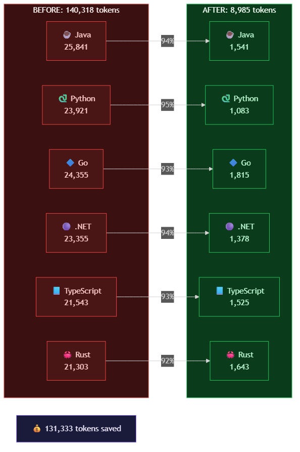
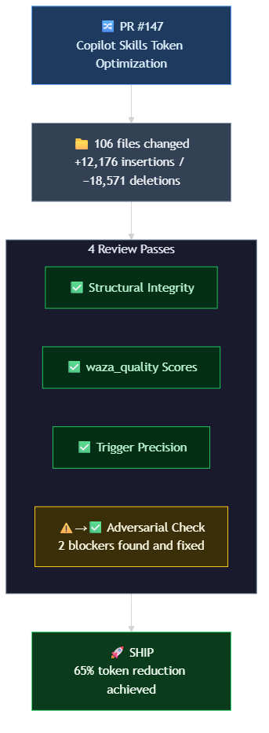

# Optimizing Copilot Skills: 65% Token Reduction Across 117 Skills


Optimizing skills felt less like deleting content and more like reorganizing a workshop — same tools, better drawers.

I'd been adding to the `.copilot/skills/` directory for a while without taking inventory. Every feature or domain onboarding meant a new skill — sometimes three. The assumption was obvious: more skills = more consistency. For the first few dozen, that was true.

Here's what's weird: I had no actual count.

When I finally looked: **413,591 tokens across 136 skill and reference files (117 distinct skills).** Just measuring it revealed the bloat:
- 6 SDK sample review skills: 140K tokens (34% of total budget)
- Dead redirect stubs: consuming tokens for no routing purpose
- Duplicated prose: same guidance repeated across language variants

Not a disaster, but the kind of creeping growth that happens when you build fast and don't audit.

**Why this matters:** Skills load on demand, so optimizing them doesn't free your active context window. But faster agent spawns and cheaper skill loading? That's a different lever, and I wanted to pull it.

The patterns I found — reference extraction, checklist compression, shared references — work with any tool. I used GitHub Copilot CLI with Squad orchestration to run them in parallel, but you could apply them manually in any editor. The techniques are the point, not the tooling.

## Measuring Token Usage with microsoft/waza

The first move: measure. [Waza](https://github.com/microsoft/waza) is a skill quality toolkit, and `waza_tokens count` does exactly that — scans your skills directory and gives you sorted token usage. No guessing. Here's the breakdown:

```
$ waza_tokens count .copilot/skills/
┌─────────────────────────────────┬────────┐
│ Skill                           │ Tokens │
├─────────────────────────────────┼────────┤
│ data-plus-ai-sdk-java-sample... │ 25,841 │
│ data-plus-ai-sdk-python-samp... │ 23,921 │
│ ...                             │        │
│ dina-small-utility              │    312 │
├─────────────────────────────────┼────────┤
│ Total: 117 skills               │413,591 │
└─────────────────────────────────┴────────┘
```

25K tokens for a single skill. That's the starting point. Waza has other tools too — `waza_tokens suggest` for optimization ideas, `waza_quality` to verify post-changes, and `waza_dev --copilot` for frontmatter — but for this work, `count` was the diagnostic tool.

## Planning the Work

The strategy: decompose into phases, ordered by savings potential. **Clear the big ones first; small wins come after.**

| Phase | Target | Est. Savings |
|-------|--------|-------------|
| 1. Kill stubs | 3 empty redirect skills | ~73 tokens |
| 2. Refactor giants | 6 SDK review skills (140K!) | ~120K tokens |
| 3. Optimize large | 14 skills (5K–10K each) | ~30–50K tokens |
| 4. Optimize medium | 60 skills (1K–5K each) | ~10–20K tokens |
| 5. Trim small | 20 skills (under 1K each) | minimal |
| 6. Audit references | Large reference files | ~10–15K tokens |


**Why this order matters:** I started with stubs not because they saved much, but because they reduced noise before the real work. Phases 2–3 capture the bulk of savings. Phases 4–5 are diminishing returns per skill, but we completed them efficiently by applying the same patterns we'd already proven earlier.

## Phase 1: Killing the Stubs

**Problem:** Three skills were redirect stubs — they pointed to other skills and had fewer than 50 tokens of actual content. No routing logic, no value.

**Action:** Deleted them.

**Result:** −73 tokens. Barely registers numerically, but this is the "boring is good" work. A clean directory is easier to maintain, and stubs confuse future maintainers.

## Phase 2: The Giants

**Problem:** Six SDK sample review skills (Java, Python, Go, .NET, TypeScript, Rust) had identical structure: 15–16 detailed rule sections + full code examples inline. Total: 140K tokens (34% of budget). Agents loaded everything every time, even when they only needed one language's rules.

**Technique: Reference Extraction.** Move verbose rules and examples to `references/` files. Keep `SKILL.md` slim — just routing info, a quick checklist, and blockers. Agents load the overview immediately, fetch detailed rules on demand.

**Before:**
```
java-sdk-review/SKILL.md (25,841 tokens)
├── Routing info (2K)
├── Error handling rules (8K + full examples)
├── Concurrency rules (7K + full examples)
├── Async patterns (6K + full examples)
└── ... 12 more sections ...
```

**After:**
```
java-sdk-review/SKILL.md (1,541 tokens)
├── Routing: detect Java SDK samples
├── Quick checklist
│   ├── Error handling: caught, logged, meaningful messages
│   ├── Concurrency: thread-safe, no race conditions
│   ├── Async patterns: proper callback/future chaining
│   └── ... 5 more items
└── Reference files in references/java/ (loaded on demand)
```

Two-tier architecture. Same content, loaded smarter.

**Execution:** Ran all six in parallel:

| Skill | Before | After | Reduction |
|-------|--------|-------|-----------|
| Java | 25,841 | 1,541 | **94%** |
| Python | 23,921 | 1,083 | **95%** |
| Go | 24,355 | 1,815 | **93%** |
| .NET | 23,355 | 1,378 | **94%** |
| TypeScript | 21,543 | 1,525 | **93%** |
| Rust | 21,303 | 1,643 | **92%** |
| **Total** | **140,318** | **8,985** | **~131K saved** |

**Trade-off:** Agents now navigate a two-tier structure (SKILL.md → references/) instead of one flat file. Discoverability costs something. But these skills are used frequently enough that agents will learn the pattern. Zero content was removed — every rule and example is still there, just reference-extracted.



## Phase 3: Large Skills

**Problem:** 14 more skills in the 5K–10K range had the same structure: verbose sections that could be extracted. Examples: `azure-mcp-content-generation`, `dina-reskill`, `context-diagnostics`.

**Action:** Applied the same reference extraction pattern in 4 parallel batches.

**Result:** −68,084 tokens (76% reduction)

**Running total:**
```
Phase 1 (stubs):   −73 tokens
Phase 2 (giants):  −131,333 tokens
Phase 3 (large):   −68,084 tokens
────────────────────────────────
Subtotal saved:    ~199,490 tokens (48% of starting budget)
Remaining:         ~214,101 tokens
```

At this point, the curve was clear. Phases 4–5 (medium and small skills) would yield diminishing returns per unit effort — but having proven the techniques in Phases 1–3, we already knew how to apply them efficiently at scale.

## The PR and the Review

**Problem:** The PR touched 106 files, 18,571 deletions, 12,176 insertions. Before shipping, we needed to verify:
- Structural integrity (paths, syntax, references valid)
- Quality didn't regress (waza_quality scores)
- Routing logic still precise
- Didn't over-trim skills below usefulness

**Action:** Ran four automated review passes:
1. Structural integrity check — passed
2. Waza quality verification — passed with notes
3. Trigger precision validation — passed with notes
4. Adversarial over-trimming check — **caught 2 real issues**

**Issues found and fixed:**
1. Reference file with broken relative path (in Phase 2)
2. Skill trimmed below ~800 tokens (lost routing context entirely)

**Second pass:** ✅ SHIP



**Key finding:** Don't reduce a `SKILL.md` below ~800 tokens for standalone skills. Below that threshold, you lose enough routing context that agents can't determine when or how to use the skill. **Exception:** Skills with strong internal routing logic (like the unified SDK skill at 469 tokens) can go lower because their dispatch logic compensates.

The ~800-token floor is a practical boundary, discovered through testing.

## Phases 4–6: The Curve Flattens

After Phase 3, ~214K tokens remained. Phases 4–6 brought that down to 143K — another ~70K saved by applying the same patterns (checklist compression, reference extraction, deduplication) at smaller scale:

| Phase | Skills | Technique | Savings |
|-------|--------|-----------|---------|
| 4. Medium | 60 skills (1K–5K each) | Checklist compression, dedup | ~45K |
| 5. Small | 20 skills (under 1K each) | Light trimming | ~10K |
| 6. Reference audit | Large reference files | Consolidation | ~15K |

The per-skill ROI drops in later phases, but having proven the techniques in Phases 1–3, the work was mechanical — same patterns, smaller targets. The current 143K total is sustainable for the usage pattern.

### Final Numbers

```
Before:  413,591 tokens (117 skills, 136 files)
After:   143,354 tokens (114 skills, 130 files)
Saved:   270,237 tokens (65.3% reduction)
```

This reflects the main optimization PR. The workbench is cleaner — every tool is still there, but they're in labeled drawers instead of piled on the surface. The Bonus Round consolidation happened in a separate session and is described next.

## Bonus Round: From Shared References to Unified Skills

After the optimization PR shipped, I ran `waza_quality` on the six SDK skills and noticed: **isolation violation**. Each skill had its own `SKILL.md`, its own routing, its own boilerplate duplicated across six files. That's a pattern violation — not atomic, not clean.

So I rethought it. Three options existed:

1. **Accept the low score** — good-enough for a domain-specific exception
2. **Inline shared content** — copy the 14 shared reference files into each skill, double the maintenance burden
3. **Single skill with language dispatch** — collapse all 7 (6 SDK languages + 1 quickstart) into one unified skill with language auto-detection

I went with option 3. Not because it was obvious, but because it matched the actual use case: agents almost never review samples in *all* languages simultaneously. They review one language based on the codebase. A single skill with smart routing was actually more correct than the multi-skill pretense.

Result: `azure-sdk-sample-review/` — one skill, 469 tokens in `SKILL.md`, language auto-detection via prompt analysis. Structure:

```
azure-sdk-sample-review/
├── SKILL.md (469 tokens) — routing + dispatch logic
├── evals/ (7 tasks, 100% passing)
├── references/
│   ├── shared/ (14 files: generic best practices)
│   ├── dotnet/, go/, java/, python/, rust/, typescript/
│   └── quickstart/
```

**Before:** 86 files across 6 language folders — Java, Python, Go, .NET, TypeScript, Rust — each with its own copy of the same 14 generic reference files. 45% pure duplication. Update one? Remember to update five more.

**After:** One `shared/` folder holds the 14 generic files. Each language folder keeps only what's actually unique to that SDK. One update, one place. Six duplicated routing SKILL.md files collapsed to a single dispatch mechanism. Waza compliance achieved — no more isolation violations. All 7 behavioral evals running at 100%.

This is the evolution: **reference extraction → shared references → unified skill with internal routing.** Each step felt right at the time. Looking back, the final architecture is simpler and more correct. Wish I'd seen it from the start. (Work captured in a follow-up PR.)

## Dogfooding: The Reskill Skill

I captured the optimization pipeline as a skill — `dina-reskill` — documenting the 8-pattern workflow (reference extraction, checklist compression, example pruning, and so on).

Then I ran it on itself, because apparently I can't leave well enough alone:

```
SKILL.md:  2,085 → 1,163 tokens (44% reduction)
Total:     5,401 → 4,288 tokens (21% reduction)
```

Three review passes: two approvals, one note flagged and fixed. The skill practices what it documents. The SDK skills themselves evolved further after this (described in Bonus Round) — from six separate skills down to a single unified skill. So while `dina-reskill` captures the second-pass improvements here, the SDK consolidation shows how those patterns continue to evolve as you live with them.

## What Actually Worked: The Patterns

If you're building a skills optimization workflow, here are the patterns ranked by impact:

### 1. Reference Extraction

**Principle:** Move detailed rules, code examples, and verbose explanations into `references/` files. The `SKILL.md` becomes a slim routing layer — overview, quick checklist, blocker list. Agents load references on demand.

**When to use:** For any skill over 5K tokens, this should be your first move. Start here, not somewhere else.

**Example:** The Java SDK skill went from 25,841 tokens (inline rules + examples) to 1,541 tokens (routing + checklist) by extracting ~24K into `references/java/`.

### 2. Checklist Compression

**Principle:** Turn paragraph-style guidance into concise checklists. Same information, fraction of the tokens.

**Example:** 
- Before: "When reviewing error handling, ensure that all errors are properly caught, logged with appropriate context, and returned with meaningful messages to the caller"
- After: "✅ Errors: caught, logged with context, meaningful messages"

### 3. Example Pruning

**Principle:** One good example per pattern. If your skill has 3 examples of the same concept, keep the clearest one and move the others to references.

### 4. Shared References → Unified Skill Routing

**Principle:** If multiple skills share common guidance, the first instinct is to extract it once and link. That works, but it's often a stepping stone to something better: collapsing near-identical skills into one skill with internal dispatch logic.

**When this works:** When you have N near-identical skills differing only by one dimension (language, framework, etc.), a unified skill with auto-detection is cleaner than N separate skills with shared references.

**Trade-off:** One `SKILL.md`, one set of evals, one routing boundary. Zero isolation violations. But your `SKILL.md` becomes more complex.

### 5. Stub Elimination

**Principle:** If a skill just redirects to another skill, delete it. The router doesn't need a placeholder, and stubs confuse future agents trying to decide what to use.

## Honest Lessons: How I Should Have Run This

The work happened over 8 user messages and 2 hours. Here's what went sideways and what would have prevented it:

| What Happened | What Would Have Been Better |
|---------------|---------------------------|
| SDK dedup discovered late (turn 6–8) | Mention "deduplicate shared content" upfront as a known phase |
| Asking about PR + review + results separately | Bundle deliverables: "PR, team review, results file" in one request |
| Phases 4–5 required separate prompts | Front-load scope: "all phases including medium skills" keeps momentum |

**The pattern that would have worked:** Front-load three things upfront:
1. The technique or tool (`waza_tokens`, reference extraction, etc.)
2. Full scope with known edge cases (all 6 phases, ~800-token floor, etc.)
3. All deliverables you want at the end

Front-load scope, technique, and deliverables in one message. The AI doesn't lose patience — you do. Every "keep going" prompt is a planning failure you're paying for at execution prices.

## The Setup

For reference, here's what I was running:

- **[GitHub Copilot CLI](https://github.com/github/copilot-cli)** v1.0.40
- **[Squad](https://github.com/bradygaster/squad)** v0.9.4-insider.1 for multi-agent orchestration
- **[microsoft/waza](https://github.com/microsoft/waza)** for skill quality analysis
- **Model:** Claude Opus 4.6 with 200K context window

## Where to Go From Here

To determine if your own skills directory needs this treatment: run `waza_tokens count` and see the total. **If it's over 100K tokens, you have meaningful room to optimize.** If you have skills over 5K tokens, reference extraction is almost always worth it.

Everyone's skill architecture is different — the interesting work is figuring out which patterns actually fit your setup. If you try these and discover something that works or something that breaks, I'd be curious to hear what you found.

<!-- IMAGE PROMPT: hero-skill-workshop-after.png - Watercolor illustration of the SAME craftsperson's workbench from the hero image, but now fully organized — tools hung on pegboard, labeled drawers, clean work surface, warm lighting suggesting satisfaction. Same color palette and art style as hero-skill-workshop.png. Companion bookend to the opening image. -->


Same workshop. Same tools. Better organized. That's what 270K tokens of optimization looks like.

Main optimization session: May 11, 2026. 8 user messages, ~2 hours, 270K tokens saved. The Bonus Round consolidation happened in a follow-up session.
