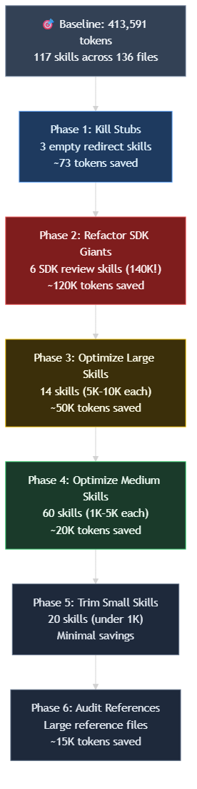
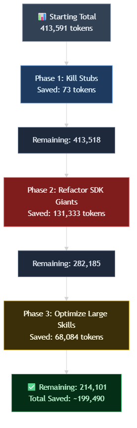
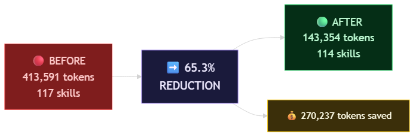

# Optimizing Copilot Skills: 65% Token Reduction Across 117 Skills


I'd been ignoring the `.copilot/skills/` directory for a while. I knew it was growing. Every time I built a new feature or onboarded a new domain, I'd add a skill. Sometimes three. My thinking was: more skills = more capability. And for a while, that was true.

Then I actually counted.

**413,591 tokens across 136 skill and reference files (117 distinct skills).** Six SDK sample review skills alone were consuming 140K tokens — 34% of the total budget — and I hadn't even noticed. Dead stub skills sitting around redirecting to nothing. Duplicated prose across six language variants. It was the kind of growth that creeps in when you're building fast and not auditing.

Skills are different from context — they're loaded on demand, not held open. Optimizing them doesn't free your active context window. But it makes agent spawns faster and skill loading cheaper. Different lever, different win. I wanted both.

The optimization patterns I found — reference extraction, checklist compression, shared references — work whether you're editing skills by hand or using Copilot CLI to batch the refactoring. I used GitHub Copilot CLI with Squad orchestration to process multiple skills in parallel, but the techniques themselves are tool-agnostic. You could apply them manually in any editor.

## Measuring Token Usage with microsoft/waza

I'd been meaning to look at [Waza](https://github.com/microsoft/waza) for a while. It's a skill quality toolkit, and `waza_tokens count` is exactly what I needed — it scans your skills directory and gives you a sorted breakdown of token usage. No guessing, no eyeballing file sizes.

Here's what the output looked like on my directory:

```
$ waza_tokens count .copilot/skills/
┌─────────────────────────────────┬────────┐
│ Skill                           │ Tokens │
├─────────────────────────────────┼────────┤
│ data-plus-ai-sdk-java-sample... │ 25,841 │
│ data-plus-ai-sdk-python-samp... │ 23,921 │
│ ...                             │        │
│ dina-small-utility              │    312 │
├─────────────────────────────────┼────────┤
│ Total: 117 skills               │413,591 │
└─────────────────────────────────┴────────┘
```

That top number hit hard. 25K tokens for a single skill. Waza has a few other useful tools too — `waza_tokens suggest` for optimization ideas, `waza_quality` to verify I hadn't broken anything post-optimization, and `waza_dev --copilot` for frontmatter work on new skills. But for this cleanup, the tokens count was the starting gun.

## Planning the Work

I analyzed the skills directory and decomposed the work into phases, ordered by expected savings. The logic was simple: don't spend time on small wins until you've cleared the big ones.

| Phase | Target | Est. Savings |
|-------|--------|-------------|
| 1. Kill stubs | 3 empty redirect skills | ~73 tokens |
| 2. Refactor giants | 6 SDK review skills (140K!) | ~120K tokens |
| 3. Optimize large | 14 skills (5K–10K each) | ~30–50K tokens |
| 4. Optimize medium | 60 skills (1K–5K each) | ~10–20K tokens |
| 5. Trim small | 20 skills (under 1K each) | minimal |
| 6. Audit references | Large reference files | ~10–15K tokens |



The key insight: start with the biggest consumers. Phases 1–3 were going to capture roughly three-quarters of the savings. Phases 4 and 5 were nice-to-haves — we'd do them if there was time and energy.

Spoiler: we didn't finish Phase 4. More on that in the lessons section.

## Phase 1: Killing the Stubs

Three skills turned out to be redirect stubs — they pointed to other skills and contained under 50 tokens of actual content. No routing logic, no checklist, no value.

Deleted instantly.

**Savings: −73 tokens.** Barely worth counting, but this is the boring-is-good part of the work — a clean directory is easier to reason about, and stubs are just future confusion waiting to happen.

## Phase 2: The Giants

This is where things got interesting.

Six SDK sample review skills — one per language (Java, Python, Go, .NET, TypeScript, Rust) — were enormous. Each one had been built with the same template: 15–16 detailed rule sections, full code examples inline, everything an agent could possibly need to review a code sample in that language. The problem was that *everything* meant every token, every time.

The technique here is what I'd call reference extraction. Instead of keeping all those detailed rules inline in `SKILL.md`, you move them into `references/` files and keep the `SKILL.md` slim — just routing info, a quick checklist, and the blocker-level issues. When an agent loads the skill, it gets the overview. If it needs the deep rules, it reads the reference files on demand. Two-tier architecture, essentially.

I ran all six in parallel, one per language:

| Skill | Before | After | Reduction |
|-------|--------|-------|-----------|
| Java | 25,841 | 1,541 | **94%** |
| Python | 23,921 | 1,083 | **95%** |
| Go | 24,355 | 1,815 | **93%** |
| .NET | 23,355 | 1,378 | **94%** |
| TypeScript | 21,543 | 1,525 | **93%** |
| Rust | 21,303 | 1,643 | **92%** |
| **Total** | **140,318** | **8,985** | **~131K saved** |

Zero content removed from the skill suite. Every rule, every code example — preserved in reference files. This is the trade-off worth naming: agents now navigate a two-tier structure (SKILL.md → references/) instead of having everything in one place. Discoverability costs something. I decided it was worth it here because these skills are used frequently enough that agents will learn the pattern.


## Phase 3: Large Skills

14 more skills in the 5K–10K range, processed in 4 parallel batches. `azure-mcp-content-generation`, `dina-reskill`, `context-diagnostics` — all optimization targets, all following the same pattern as Phase 2. Extract the verbose sections, keep the core routing slim.

**Savings: −68,084 tokens (76% reduction)**

## Running Totals After 3 Phases

By this point we'd done the heavy lifting:

```
Phase 1 (stubs):  −73 tokens
Phase 2 (giants): −131,333 tokens  
Phase 3 (large):  −68,084 tokens
────────────────────────────────
Total saved:      ~199,490 tokens
```



About halfway through the session I started feeling good about the numbers. That's usually when something goes sideways.

## The PR and the Review

PR #147: **106 files changed, 12,176 insertions, 18,571 deletions.**


I ran four automated review passes — structural integrity, waza_quality scores, trigger precision, and an adversarial over-trimming check. Three passed or passed with notes. The adversarial pass caught two real blockers: a reference file with a broken relative path, and a skill trimmed past the point of usefulness — the `SKILL.md` was essentially just a title and a pointer, with no routing context left to tell an agent when or how to use it.

Both issues were fixed and re-reviewed. Second pass: ✅ SHIP.

The lesson from those blockers: don't reduce a `SKILL.md` below ~800 tokens. Below that, you risk losing enough routing context that agents can't determine when or how to use the skill. If your `SKILL.md` is just a title and a link to references, you've gone too far.

The exception: skills with strong internal routing (like the unified SDK skill at 469 tokens) can go lower because their dispatch logic plus behavioral evals compensate for the reduced routing context. The ~800-token floor applies to standalone skills without that scaffolding.

## Phases 4–6: The Gap Closer

Phases 4–6 added another ~70K in savings — medium skills got checklist compression, and the reference audit caught oversized files. We didn't finish all of Phase 4, but what we did complete closed the gap to the final 270K number.

### Final Numbers

```
Before:  413,591 tokens (117 skills)
After:   143,354 tokens (114 skills)
Saved:   270,237 tokens (65.3% reduction)
```



These numbers reflect the main optimization pass (PR #147). The Bonus Round consolidation described next happened in a separate follow-up session.

The 143K figure is pre-deduplication. The shared reference extraction in the next section further reduced maintenance overhead but didn't significantly change the token count — it consolidated duplicates rather than removing content.

## Bonus Round: From Shared References to Unified Skills

After the PR merged and the dust settled, I was running `waza_quality` checks on the six SDK skills and noticed something in the scoring: **isolation violation**. Each skill had its own `SKILL.md`, its own routing logic, its own boilerplate duplicated across six files. That was flagged as a pattern violation — the waza toolkit prefers skills to be atomic and self-contained, but what I had was six micro-instances of the same thing, all within the waza boundary.

So I reconsidered the architecture. Three options:

1. **Accept the low score** — good-enough is fine for a domain-specific exception
2. **Inline the shared content** — copy the 14 shared reference files into each skill, duplicate the maintenance burden
3. **Single skill with language dispatch** — collapse all 7 skills (6 SDK languages + 1 quickstart template) into one unified skill with language auto-detection

I picked option 3. Not because it was the obvious choice, but because it forced me to think about the actual use case: agents almost never need to review samples in *all* languages simultaneously. They review one language at a time, selected based on the codebase they're analyzing. A single skill with smart routing was actually more correct than the multi-skill pretense.

The result: `azure-sdk-sample-review/` — one skill, 469 tokens in `SKILL.md` (under the 500-token soft limit), with language auto-detection using prompt analysis. The structure is now:

```
azure-sdk-sample-review/
├── SKILL.md (469 tokens)
├── evals/ (7 tasks, 100% passing)
├── references/
│   ├── shared/ (14 files: generic best practices)
│   ├── dotnet/
│   ├── go/
│   ├── java/
│   ├── python/
│   ├── rust/
│   ├── typescript/
│   └── quickstart/
```

This eliminated six duplicated routing SKILL.md files (which were contributing nothing but bulk) and consolidated all the language-specific logic into a single dispatch mechanism. Waza compliance achieved — no more isolation violations. All 7 behavioral evals running at 100%, checking that language detection actually works and that each language's review rules fire correctly.

It's a third evolution: **reference extraction → shared references → unified skill with internal routing**. Each step felt logical at the time, but stepping back, the final architecture is actually simpler and more correct. I wish I'd seen it from the start. (PR #188 captured the work.)

## Dogfooding: The Reskill Skill

The optimization pipeline worked well enough that I captured it as a skill — `dina-reskill` — documenting the 8-pattern optimization workflow (reference extraction, checklist compression, example pruning, and so on).

Then, because I'm apparently incapable of leaving well enough alone, I ran `dina-reskill` on itself:

```
SKILL.md:  2,085 → 1,163 (44% reduction)
Total:     5,401 → 4,288 (21% reduction)
```

Three review passes: two clean approvals, one note flagged and fixed.

The skill practices what it preaches. 🐕

**Note:** The SDK skills themselves went through a third iteration after this optimization pass (described in the Bonus Round section) — from six separate skills with shared references down to a single unified skill. So while `dina-reskill` captured the second-pass improvements here, the SDK consolidation shows how those patterns can evolve further as you live with them.

## What Actually Worked: The Patterns

My perspective on what to reach for first, ranked by impact:

### 1. Reference Extraction

This was the biggest single win by far. Move detailed rules, code examples, and verbose explanations into `references/` files. The `SKILL.md` becomes a routing layer — overview, quick checklist, blocker list. Agents load references on demand. For any skill over 5K tokens, this should be your first move.

### 2. Checklist Compression

Turn paragraph-style guidance into concise checklists. "When reviewing error handling, ensure that all errors are properly caught, logged with appropriate context, and returned with meaningful messages to the caller" becomes "✅ Errors: caught, logged with context, meaningful messages." Same information, fraction of the tokens.

### 3. Example Pruning

One good example per pattern. If your skill has 3 examples of the same concept, pick the clearest one and reference-extract the rest.

### 4. Shared References → Unified Skill Routing

If multiple skills share common guidance, the first instinct is to extract it once and link (classic `shared-references/` pattern). That works, but I discovered it's often a stepping stone toward something better: collapsing the multi-skill pseudo-duplication into a single skill with internal language or domain dispatch. The shared references pattern is useful when you genuinely have separate skills with independent concerns; when you have N near-identical skills differing only by one dimension (language, framework, etc.), a unified skill with auto-detection is cleaner. One `SKILL.md`, one set of evaluations, one routing boundary. Zero isolation violations.

### 5. Stub Elimination

If a skill just redirects to another skill, delete it. The router doesn't need a placeholder, and stubs will confuse future agents trying to decide what to use.

## Honest Lessons: How I Should Have Run This

I ran this over 8 user messages. Here's what that actually looked like, and what I'd do differently:

| What Happened | What Would Have Been Better |
|---------------|---------------------------|
| "get ready" + "can you plan" (2 turns) | State the goal upfront with the tool name |
| "keep going" × 2 | "Run all phases, don't stop between them" |
| SDK dedup discovered late (turn 6–8) | Mention "deduplicate shared content" upfront |
| Asking about PR + review + results separately | Bundle deliverables: "PR, team review, results file" |
| Stopped at Phase 4 halfway through | Front-load scope: "all phases including medium skills" would have kept momentum |

The pattern I should have followed: front-load three things — (1) the tool or technique, (2) the full scope with known edge cases, (3) all the deliverables I want at the end. One prompt, not eight.

The planning phase is cheap; the execution phase is expensive. I skipped the planning phase because I was impatient. I paid for it in "keep going" messages.

## The Setup

For reference, here's what I was running:

- **[GitHub Copilot CLI](https://github.com/github/copilot-cli)** v1.0.40
- **[Squad](https://github.com/bradygaster/squad)** v0.9.4-insider.1 for multi-agent orchestration
- **[microsoft/waza](https://github.com/microsoft/waza)** for skill quality analysis
- **Model:** Claude Opus 4.6 with 200K context window

## Where to Go From Here

If you're curious whether your own skills directory needs this treatment, `waza_tokens count` is the quick answer. If your total is over 100K tokens, you probably have meaningful room to optimize. If you have skills over 5K tokens, reference extraction is almost always worth it.

I'm not going to hand you a checklist and call it a day — everyone's skill architecture is different, and the interesting work is figuring out which patterns actually fit your setup. But if you do try this and discover something that works or something that breaks badly, I'd genuinely be curious to hear what you found.

Main optimization session ran on May 11, 2026. 8 user messages, about 2 hours, 270K tokens saved. The Bonus Round consolidation (PR #188) happened in a follow-up session.

---

*Fun stuff!* The repo is at [github.com/diberry/project-dina](https://github.com/diberry/project-dina) if you want to dig into the skill structure directly.
