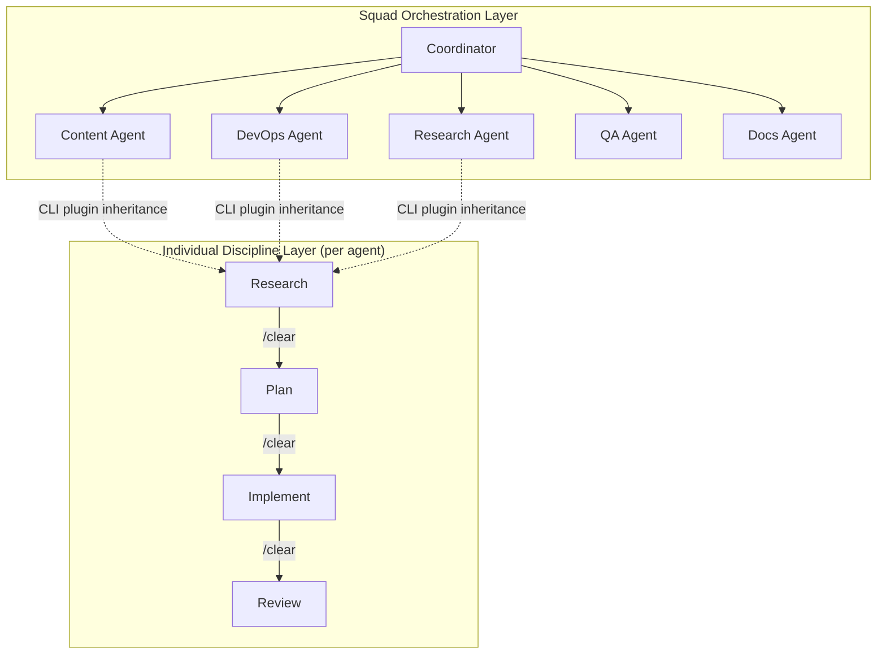
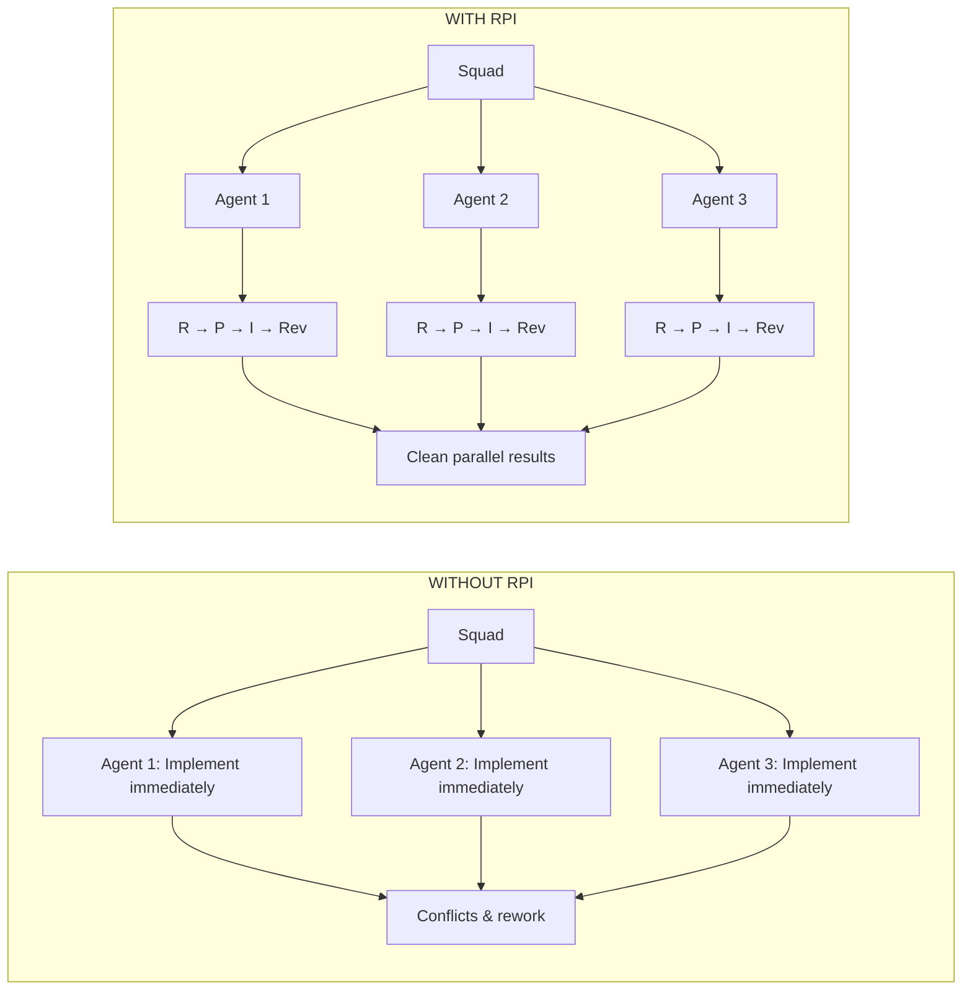

# Adopting HVE Core: Individual Discipline Meets Team Orchestration

<!-- Hero image: A workshop floor showing two complementary workbenches — one with precision measuring tools organized in drawers (individual discipline), the other with a project board mapping team coordination. Both lit by Pacific Northwest morning light through high windows. Watercolor style. -->

You don't have to choose between individual discipline and team orchestration. They operate at different layers.

That's the insight I landed on after investigating [microsoft/hve-core](https://github.com/microsoft/hve-core) — Microsoft's prompt engineering library for GitHub Copilot. I run a multi-project operations hub with 30+ Squad agents managing 8 projects across 30+ repos. When I first saw hve-core's **RPI methodology** (Research → Plan → Implement → Review), I thought it competed with Squad's parallel fan-out. It doesn't. Hve-core provides individual-level discipline; Squad provides team-level coordination. Installing hve-core as a CLI plugin means every agent spawn inherits RPI discipline without touching Squad infrastructure.

This post is my investigation into how hve-core fits into a sophisticated multi-agent setup, what I adopted, what I skipped, and how the two systems complement each other rather than conflict.

## What is HVE Core?

HVE stands for "Hypervelocity Engineering" — Microsoft's prompt engineering discipline for GitHub Copilot, now [open-sourced as a CLI plugin](https://github.com/microsoft/hve-core). The name reflects that software velocity is constrained not by typing speed but by **investigation time before you're ready to implement**. LLMs collapse that time, but only if you structure the work correctly.

The inventory: 49 specialized agents, 102 auto-applied coding conventions, 63 reusable prompts, 11 skills packages, and 11+ curated collections (flagship has 41 artifacts, all has 221).

The core philosophy is **RPI**: Research → Plan → Implement → Review. It's structured phase separation designed to counteract the LLM's inability to distinguish between investigating and implementing. Humans know the difference. LLMs don't — they treat "research this codebase" and "modify this codebase" identically unless you give them structural cues. RPI forces research first, then carries findings forward through artifacts (files, not chat history).

## How I Discovered HVE Core

I stumbled across hve-core while investigating context engineering patterns for my recent [context window optimization work](https://dfberry.github.io/blog/2026-05-06-tuning-up-copilot-context). I'd just cut my context usage from 52% to 13%, and I was curious about other established patterns for managing LLM context at scale. What caught my attention was the **explicit `/clear` discipline**. The hve-core methodology treats context window management as a first-class concern — `/clear` between RPI phases, `/compact` mid-phase, `/checkpoint` cross-session. These aren't suggestions; they're built into the workflow. I'd been solving similar problems differently. This was a chance to compare approaches.

## The Layered Architecture Insight

The breakthrough came when I realized hve-core and Squad operate at **different abstraction layers**: hve-core addresses how a single agent approaches a task (research before acting, carry context through files, manage the conversation window), while Squad addresses how multiple agents coordinate (who owns what, how decisions propagate, how to parallelize work). These aren't competing systems — they're complementary. Hve-core doesn't address multi-agent orchestration; Squad doesn't prescribe individual work methodology. Neither does what the other does. That's the opportunity.

*Individual discipline (hve-core) flows up into team orchestration (Squad) without friction. The CLI plugin makes it automatic.*

## What I Tried First (And What Surprised Me)

My initial instinct was to clone the hve-core repo into `.copilot/skills/` and reference specific agents. That was wrong. Hve-core is designed as a **CLI plugin**, not a file-based skill library. When you install it via `copilot plugin install hve-core@hve-core`, everything becomes available to every Copilot CLI session — including every agent spawn. Zero-config at the repo level. Nothing goes in your repo. You install once per machine, and it's available everywhere. For a multi-project hub like mine, that's transformative. I can experiment without committing infrastructure to version control. If it works, it propagates automatically. If not, I uninstall cleanly.

## The RPI Methodology vs Squad's Fan-Out

Let me dig into the core methodology difference, because this is where I initially thought there was a conflict.

**RPI: Research → Plan → Implement → Review** — The hve-core thesis is: AI can't tell the difference between investigating and implementing. If you say "add auth to this API," the LLM will start modifying files before it understands the codebase. RPI formalizes the discipline: (1) Research phase spawns task-researcher, gathers context, outputs research artifact; (2) Plan phase spawns task-planner, loads research, proposes approach, outputs plan artifact; (3) Implement phase spawns task-implementor, loads plan, makes changes; (4) Review phase spawns task-reviewer, checks correctness. Between phases, you `/clear` the chat. Each phase starts fresh with only the artifact from the previous phase.

**Squad: Parallel Fan-Out with Ownership** — When you invoke Squad ("squad, run a content audit"), the coordinator agent decomposes the work and fans out to specialists simultaneously. Parallel spawn → concurrent execution → results convergence → human decision. Squad optimizes for parallelism. RPI optimizes for sequential discipline.

**Where They Complement** — Squad tells you who does the work. RPI tells each agent how to do it. When Squad spawns an agent, that agent can follow RPI internally: research what files it owns, plan the smallest change, implement, review for edge cases. The coordinator doesn't need to know the agent is following RPI — the agent just does better work.

*Adding individual discipline doesn't slow down parallel execution — it improves the quality of what each thread produces.*

## Context Engineering Alignment

One reason hve-core resonated is that I'd already been solving the same context problems — just differently. Both systems treat the context window as a constrained resource requiring active management; both prioritize signal-to-noise ratio over raw capability. My instinct was to optimize what's always-loaded (scoped Azure MCP namespaces, cut agent instruction file size, optimized 117 skills from 413K to 143K tokens, used worktrees to isolate branches). HVE's instinct is to periodically reset the window with explicit `/clear` between RPI phases, `/compact` mid-phase when conversation gets long, and `/checkpoint` to save session state for cross-session resume. Both work. They're not mutually exclusive. The artifact-based handoff pattern is what hve-core taught me — instead of skimming 200 turns of conversation, the next agent loads a 2-page checkpoint file containing only what matters. I've started applying this to Squad: when an agent completes investigative work, it writes findings to `.squad/artifacts/{date}-{topic}.md` for the next agent to load. Cleaner handoffs, less repetition.

## What I Actually Use (And What I Don't)

I installed the full hve-core plugin three weeks ago. Here's what stuck and what I skip:

**What I use daily:**
- **RPI phase discipline** — the biggest win. I don't spawn named agents, but I've internalized "Research → Plan → Implement → Review" with explicit `/clear` between phases. This stopped the "implementation ignores constraints" problem.
- **Auto-applied instructions** — 102 language conventions that activate based on file type. Replaced about 15 of my language-specific skills. Python files get PEP 8 + type hints, TypeScript gets strict mode, Markdown gets sentence-case headings — all automatic.
- **`/clear`, `/compact`, `/checkpoint` discipline** — now habitual. I treat context management as part of the workflow, not an emergency measure.
- **Design-thinking collection** — for requirements gathering when the problem statement is fuzzy. The `dt-coach` agent breaks down epics, identifies unstated assumptions, refines vague requests into actionable tasks.
- **Memory agent occasionally** — after gnarly debugging sessions, it extracts learnings and writes them to `.squad/decisions.md` or agent history files.

**What I skip:**
- **Named agent spawns** — hve-core has 49 specialized agents (task-researcher, code-reviewer, security-auditor), but Squad already has domain agents with overlapping roles. I use RPI methodology with my existing agents instead.
- **The full `all` collection** — 221 artifacts is overkill. I installed `flagship` + `coding-standards` + `design-thinking` and skipped ADO/Jira/GitLab/data-science collections.
- **Prompts library** — 63 reusable templates for commits, PRs, standups. Well-written, but redundant for my established workflow (conventional commits, Squad's scribe agent, `/chronicle standup`).
- **Language instructions I don't use** — hve-core covers 15+ languages; I work in TypeScript, Python, PowerShell, Bash. The Ruby/Rust/Go/C#/Java instructions sit dormant.

## Honest Assessment: What's Valuable, What's Missing

### What's Valuable

**The RPI discipline is the killer feature.** Everything else is negotiable, but the Research → Plan → Implement → Review structure with explicit `/clear` between phases has noticeably improved the quality of agent output. I'm getting fewer "this implementation ignores constraints" moments. I'm spending less time backtracking to explain context the agent already saw 50 turns ago.

**Auto-applied instructions reduce cognitive load.** I no longer think "did I load the TypeScript conventions?" when opening a `.ts` file. They just apply. Small win, but it compounds over dozens of daily agent spawns.

**Collections as plugins = zero repo bloat.** I can experiment with hve-core across all my projects without committing infrastructure. If it doesn't fit, I uninstall cleanly. No residue.

**Decision guidance:** If you take one thing from hve-core, make it the RPI discipline. Everything else — the 49 agents, the collections, the auto-applied conventions — is optional. RPI is the core value proposition because it addresses the fundamental LLM failure mode: acting before understanding. The collections are nice-to-have accelerators, but the phase discipline is what changes outcomes. And adoption is genuinely low-commitment: `copilot plugin install` adds it, `copilot plugin uninstall` removes it. No repo changes, no config files, no team coordination needed. You can try it for a day, decide it's not for you, and uninstall with zero residue. That's rare for methodology tooling.

### What's Missing

**No multi-agent orchestration story.** Hve-core assumes a single agent working sequentially through RPI phases. It doesn't address parallel coordination. That's Squad's domain. If you're running 30+ agents across 8 projects, hve-core gives you individual discipline but doesn't replace your orchestration layer.

**No integration with Copilot CLI session storage.** I wanted hve-core's `memory` agent to query `/chronicle` data. It doesn't. The memory agent asks questions and writes artifacts but doesn't analyze past session patterns. That integration would close the loop I described in my [session storage investigation](https://dfberry.github.io/blog/2026-04-16-session-storage-decision-guide).

**No repo-specific customization.** Plugin collections apply globally to every project. You can't say "use Python type hints in repo A but skip them in repo B." Workaround: layer project-specific instructions in `.github/copilot-instructions.md` to override plugin defaults. Also, when hve-core updates its instruction library, every project inherits the new version immediately — fine for solo work, limiting for team repos that need staged rollouts.

<!-- Closing image: A single bridge spanning Deception Pass at sunrise. On one shore, precision tools (individual discipline). On the other, a project board (team coordination). Morning light suggests new possibilities. Watercolor style. -->

*The bridge exists now. What you build on it is up to you.*

## What Actually Changed

The biggest change isn't tooling — it's **workflow cadence**. Before hve-core, I'd spawn an agent with a fuzzy request and course-correct mid-implementation. Now I pause to research first, clarify the plan, then implement. The extra upfront time is offset by less backtracking.

The second change is **context hygiene**. I `/clear` regularly now. I `/checkpoint` after discoveries. I treat the context window as a workspace that needs tidying, not an append-only log. That mindset shift came from hve-core's explicit guidance.

The third change is **less cognitive load on language conventions**. I used to mentally track "did I load the TypeScript skill?" or "should I manually explain Python type hints?" Now those conventions auto-apply. Small win, but compounding.

What didn't change: Squad's orchestration structure, my repo architecture, my git workflow. Hve-core layered on top without requiring infrastructure rewrites. That's the key — **it's additive, not invasive**.

## Related Reading

If you're exploring similar territory:

- [Copilot CLI Context Window: How I Cut Token Usage from 52% to 13%](https://dfberry.github.io/blog/2026-05-06-tuning-up-copilot-context) — my context optimization investigation
- [Optimizing Copilot Skills: 65% Token Reduction Across 117 Skills](https://dfberry.github.io/blog/2026-05-11-tuning-up-copilot-skills) — skill token reduction patterns
- [Exploring Copilot CLI Session Management to Improve Squad](https://dfberry.github.io/blog/2026-04-16-session-storage-decision-guide) — session storage as Squad knowledge source
- [microsoft/hve-core GitHub repo](https://github.com/microsoft/hve-core) — official docs, agent catalog, collection definitions
- [Squad CLI GitHub repo](https://github.com/bradygaster/squad) — multi-agent orchestration framework

---

The payoff: individual agents work better, parallel execution stays fast, and infrastructure stays unchanged.

*How do you structure multi-agent workflows? Have you tried layering individual methodology onto team orchestration? I'm always curious how others approach this. Reach out if you're experimenting with similar patterns.*
