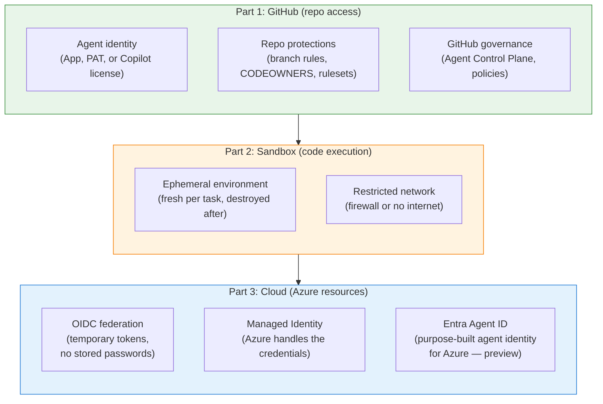
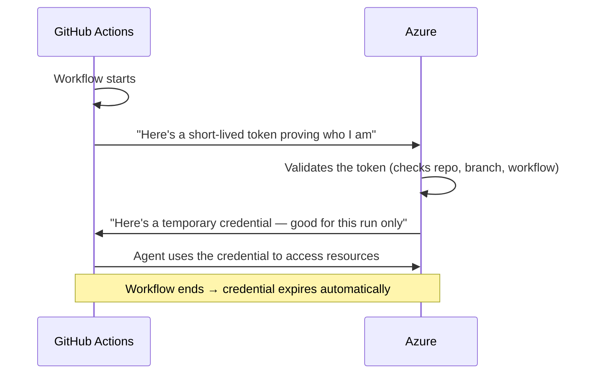
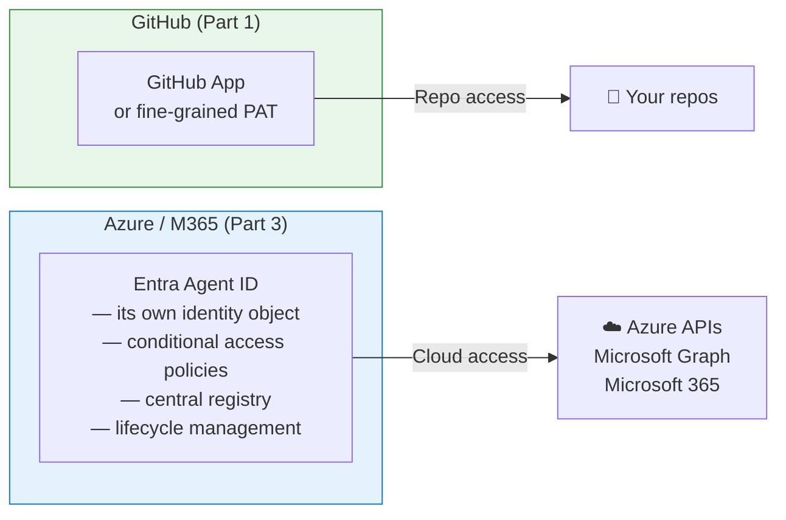
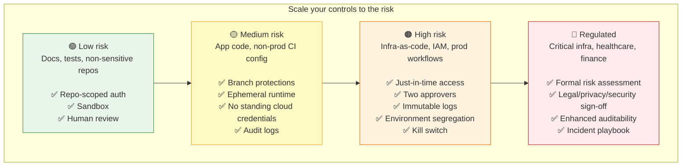
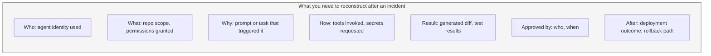

This is Part 3 of a three-part series on giving AI agents access to your code. This post covers what happens when agents need to reach beyond GitHub — into Azure, Microsoft 365, or other cloud services — plus how to scale your security controls to match the actual risk.

- [Part 1: Who gets the keys to your repo?](/blog/2026-05-12-ai-agents-repo-auth)
- [Part 2: Where does agent code actually run?](/blog/2026-05-12-ai-agents-sandboxing)
- **Part 3: When agents reach the cloud** (you are here)

*If your agents only interact with GitHub repos, Parts 1 and 2 have everything you need. This post is for when your agents also call Azure APIs, query databases, or interact with cloud services.*

## The full picture

Here's how all three layers connect:



Each layer handles a different question:
- **Part 1:** Can this agent touch the repo? What can it do there?
- **Part 2:** Where does the agent's code run? What if it misbehaves?
- **Part 3:** Can this agent reach cloud resources? With what permissions? For how long?

## Connecting GitHub to Azure without storing passwords

### OIDC federation — temporary passes instead of stored keys

When your agent runs inside GitHub Actions and needs to reach Azure, OIDC federation is the modern approach. In plain terms: **instead of storing an Azure password in GitHub, the two systems do a handshake each time.** GitHub says "this is a legitimate workflow run," Azure checks and says "okay, here's a temporary pass." When the workflow ends, the pass expires.



```yaml
# What this looks like in a GitHub Actions workflow
permissions:
  id-token: write
  contents: read

steps:
  - uses: azure/login@v2
    with:
      client-id: ${{ secrets.AZURE_CLIENT_ID }}
      tenant-id: ${{ secrets.AZURE_TENANT_ID }}
      subscription-id: ${{ secrets.AZURE_SUBSCRIPTION_ID }}
```

**An important caveat:** OIDC removes stored passwords, but it doesn't eliminate all risk. If untrusted code runs in a workflow job that has `id-token: write` permission, that code could potentially mint and use tokens. Scope your OIDC configuration tightly:
- Pin to specific repos, branches, and environments
- Never combine `pull_request_target` triggers with token-bearing jobs
- Separate "plan" steps from "apply" steps in infrastructure workflows

### Managed Identity — Azure handles the credentials entirely

For agents running on Azure infrastructure (Container Apps, AKS, Functions), Managed Identity takes the concept further. Your compute resource authenticates directly to Azure services — no credentials in your code, no credentials in your environment variables, no credentials anywhere you manage. Azure handles it.

Think of it like a building keycard system: the building knows this computer belongs here because of where it is, not because someone typed in a password.

## Microsoft Entra Agent ID — agent identity for the cloud

[Microsoft Entra Agent ID](https://learn.microsoft.com/entra/identity/workload-identities/) introduces a purpose-built identity type specifically for AI agents that access Azure and Microsoft 365 resources.

Two important things upfront:

1. **This is about cloud access, not repo access.** Entra Agent ID governs what agents can do in Azure and Microsoft 365. For GitHub repo access, use the approaches from [Part 1](/blog/2026-05-12-ai-agents-repo-auth).
2. **As of this writing, this is in preview.** I'm describing the direction Microsoft is heading, not a battle-tested production system. Treat it as promising but emerging.



What Entra Agent ID is designed to provide:
- **A unique identity per agent** — separate from user accounts and traditional service accounts, so you can tell agents apart in logs and apply policies specifically to them
- **Conditional Access for agents** — rules about when, where, and how agents can access resources (think: "this agent can only access this API from this IP range during business hours")
- **A central Agent Registry** — a directory of all the agents in your organization, who owns them, and what they can access
- **Lifecycle management** — onboarding, access reviews, and automatic deactivation when an agent is retired

If your agents need Azure or Microsoft 365 access, this is worth tracking as it moves toward general availability.

## Scaling controls to risk level

Not every agent task carries the same risk. A docs typo fix and an infrastructure-as-code change are not the same thing, even if the same framework produces both.

[a colleague](https://www.linkedin.com/in/intrepidtechie/) — who teaches [Navigating the EU AI Act](https://www.linkedin.com/learning/navigating-the-eu-ai-act) on LinkedIn Learning and works in security governance — helped me see this through a regulatory lens. The EU AI Act is explicitly risk-based: obligations increase with the impact of what the AI system can affect. Even if you're not subject to EU regulation, the proportionality principle is useful everywhere: **match your controls to the actual damage that could happen.**



| Risk level | Example | What I'd put in place |
|-----------|---------|----------------------|
| **Low** | Docs updates, test generation in non-sensitive repos | Repo-scoped credentials, sandbox, one human reviewer |
| **Medium** | Application code PRs, CI config in non-production | Branch protections, ephemeral runtime, no long-lived cloud credentials, audit logs |
| **High** | Infrastructure-as-code, identity config, production workflows | Time-limited access, two approvers, immutable logs, separate environments, ability to shut down quickly |
| **Regulated** | Essential services, safety-relevant systems, financial/healthcare | Formal risk assessment, legal and privacy sign-off, detailed audit trail, tested incident response plan |

## Repos contain more than just code

One thing I underestimated at first is the EU data protection angle: **a GitHub repository isn't just source code.** It contains commit metadata (names, emails), issue and PR threads with people's identities, reviewer comments, and sometimes pasted logs with customer data or debugging output.

If an AI agent can read repos, issues, and PRs, that's often **personal data processing** — which has implications for data handling policies, retention, and in some jurisdictions, regulatory obligations like GDPR.

For teams operating in or serving European markets, this means thinking about:
- What data can the agent see?
- Where are prompts and traces stored?
- How long are they kept?
- Does any of it leave your jurisdiction?

The rule of thumb that resonated with me is this: **the closer the agent gets to production authority, the more it should be governed like a regulated operational control, not a developer convenience feature.**

If agent telemetry could be used to profile developer behavior or productivity, involve privacy and legal early — in Europe that can raise employee-monitoring concerns. Even outside Europe, it's worth thinking through.

## The evidence trail: what you need after an incident

The three-layer model (repo access → sandboxing → cloud identity) describes controls, but after an incident you also need **evidence.** A security review of this post pushed me to think about what "meaningful human oversight" actually requires.



Branch protections give you some of this (who approved, CI results). Audit logs give you more. But the full chain — from "why was this agent triggered" to "what happened after merge" — requires intentional design.

The question to ask: **if something goes wrong at 2 AM, can you reconstruct what the agent did, why it did it, who approved it, and how to undo it?** If the answer is "not really," the controls look stronger on paper than they are in practice.

## Putting all three parts together

### If you're just getting started
Use Copilot's coding agent with strong branch protections ([Part 1](/blog/2026-05-12-ai-agents-repo-auth)). You already have identity (your license), sandboxing (managed environment, [Part 2](/blog/2026-05-12-ai-agents-sandboxing)), scanning (CodeQL), and the review gate. Start there.

### If you're building custom agents
Use a GitHub App for repo access. Sandbox each task in a fresh container. Use OIDC for cloud resources. Keep credentials short-lived and scoped to the minimum needed.

### If you're at enterprise scale
Layer GitHub's Agent Control Plane with Azure's identity features. Classify repos by risk level before enabling agent access. Track Entra Agent ID as it matures. Build audit trails that connect the full chain from trigger to outcome.

### The thing I keep coming back to
No single layer is enough on its own. Scoped repo credentials, ephemeral sandboxes, short-lived cloud tokens, and human review work together. But they only reduce damage if the layers are actually separated — if the same runtime holds every credential and can reach every system, the layers collapse into one compromise.

---

*This post reflects what I found as of April 2026. The agent security landscape is moving fast — GitHub, Microsoft, and the broader ecosystem are all shipping new capabilities. If something here is wrong or outdated, I'd appreciate a note.*

*Thanks to colleagues and public write-ups that helped sharpen the risk-scaling and implementation details in this series.*

*Dina Berry works on Azure developer documentation and runs AI agent workflows daily.*
