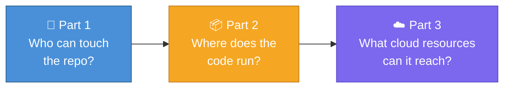
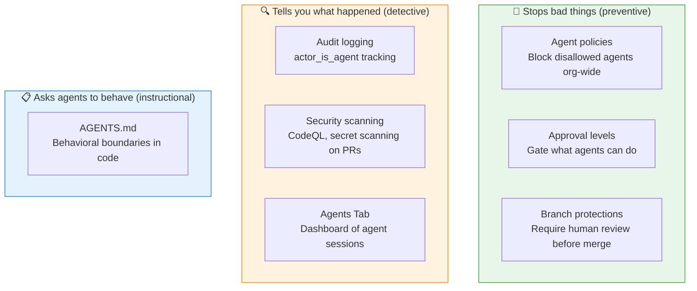
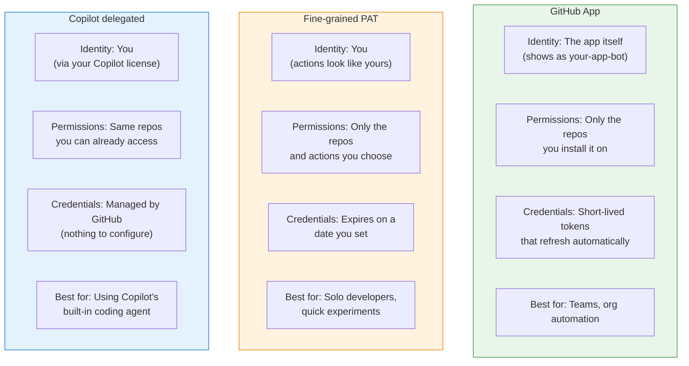
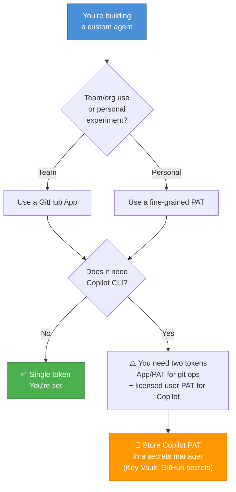

This is Part 1 of a three-part series on giving AI agents access to your code. This post covers the GitHub layer — how agents prove who they are, what they're allowed to do, and how to set up your repo so you're comfortable with it.

- **Part 1: Who gets the keys to your repo?** (you are here)
- [Part 2: Where does agent code actually run?](/blog/2026-05-12-ai-agents-sandboxing)
- [Part 3: When agents reach the cloud](/blog/2026-05-12-ai-agents-cloud-identity)

I run AI agents on my repos daily as part of my work on Azure developer documentation. I kept hitting the same question: *what credentials should this agent have?* I spent time digging into GitHub's docs, the security architecture blog posts, and the API surface. What follows is a snapshot of where things stand in mid-April 2026. This space moves fast — some of this may have changed by the time you read it, and I may have gotten details wrong. If you spot something, I'd genuinely appreciate a correction.

## The big picture

Think of agent security as three separate questions:



This post focuses on the first question. If you only care about the GitHub layer — and many people do — this post has everything you need.

## What GitHub has built for agent governance

GitHub shipped agent-specific governance features in early 2026. Before diving in, I want to be upfront about something: **rules that stop things from happening and tools that tell you what happened are different things.** I'll label each so it's clear which is which.



### The preventive controls (these actually block things)

**The Agent Control Plane** (generally available February 2026) is the enterprise governance layer:

- **Agent policies** — decide which agents and AI models are allowed across your organization or on specific repos. If it's not on the list, it can't run.
- **Approval levels** — three tiers: "Default Approvals" (human must approve certain actions), "Bypass Approvals" (agent can skip some gates), and "Autopilot" (agent runs freely). You set this per-repo.

### The detective controls (these catch problems)

- **Audit logging** — every agent action gets tagged with `actor_is_agent` so you can tell humans and agents apart in logs
- **Security scanning** — Copilot's agent automatically runs code analysis, secret scanning, and dependency checks on its own PRs before a human even sees them
- **Agents Tab** — a per-repo dashboard showing all agent sessions, so you can review what happened

### The instructional layer (this is guidance, not enforcement)

**AGENTS.md** — a file in your repo that describes behavioral boundaries for agents. I initially called this "policy-as-code." That's too generous. **It's instructions, not a wall.** The agent reads it and hopefully follows it, but nothing mechanically prevents the agent from doing something AGENTS.md says not to do. Think of it like a sign on the door, not a lock on the door.

Real boundaries come from permissions, approval gates, and sandboxing.

For the full security architecture, see:
- [Under the hood: Security architecture of GitHub Agentic Workflows](https://github.blog/ai-and-ml/generative-ai/under-the-hood-security-architecture-of-github-agentic-workflows/)
- [How GitHub's agentic security principles make our AI agents as secure as possible](https://github.blog/ai-and-ml/github-copilot/how-githubs-agentic-security-principles-make-our-ai-agents-as-secure-as-possible/)
- [Enterprise AI Controls & agent control plane — generally available](https://github.blog/changelog/2026-02-26-enterprise-ai-controls-agent-control-plane-now-generally-available/)

## Three ways agents can log in to your repos

I found three main approaches. Here's how they compare in plain terms:



### GitHub Apps — the machine identity

A GitHub App is its own thing — separate from any person. It:
- Gets temporary credentials that expire and refresh (no long-lived passwords)
- Gets installed on specific repos with only the permissions you choose
- Has its own rate limits, separate from yours
- Shows up in logs as `your-app[bot]`, so you can always tell it apart from humans

The tradeoff: more setup. You register the app, store a private key, and handle token refresh in your code.

### Fine-grained PATs — a limited copy of your access

Here's a mental model I find useful: **a fine-grained PAT is like giving someone a copy of your house key, but one that only opens specific rooms and stops working after a set date.**

It traces back to you (so you're accountable), but it only allows a slice of what you can do (so the damage is limited if something goes wrong).

The key discipline: **one token per agent per task.** Don't reuse tokens across agents. If one gets compromised, you only lose what that one token could access.

> **Note:** Older-style "classic" PATs (the `ghp_` tokens) can't be scoped to specific repos. If you're using those for agents, switching to fine-grained PATs is a meaningful upgrade. As of this writing, fine-grained PATs can only be created through the GitHub website — there's no API for it.

### Copilot's approach — using your license

Copilot's coding agent works differently — it acts **as you**:

- It can only touch repos you already have access to
- Its code goes to `copilot/*` branches under your name
- It can't approve or merge its own work
- Your org admin can turn it on or off per-repo

The safety net: all the same repo rules (required reviews, required tests, CODEOWNERS) still apply to Copilot's PRs. The agent suggests; a human decides.

## Lock it down with code

This is the part I wish someone had collected in one place. Here's how to script the repo settings that matter, so you can version-control your security posture.

### Protect the main branch

This is the single most important thing. It means no one — human or agent — can push directly to `main`. Everything goes through a pull request with at least one human reviewer.

```bash
# Require reviews, status checks, and block force pushes on main
gh api -X PUT repos/{owner}/{repo}/branches/main/protection \
  --input - <<'EOF'
{
  "required_status_checks": {
    "strict": true,
    "contexts": ["build", "test"]
  },
  "required_pull_request_reviews": {
    "dismiss_stale_reviews": true,
    "require_code_owner_reviews": true,
    "required_approving_review_count": 1
  },
  "enforce_admins": true,
  "restrictions": null,
  "allow_force_pushes": false,
  "allow_deletions": false
}
EOF
```

### Use rulesets (GitHub's newer, more flexible system)

GitHub is moving from branch protection rules to "rulesets." They do the same job but can be managed at the org level and support more conditions. I'd use these for new repos:

```bash
# Create a ruleset: require reviews, status checks, no force pushes
gh api -X POST repos/{owner}/{repo}/rulesets \
  --input - <<'EOF'
{
  "name": "Agent safety net",
  "target": "branch",
  "enforcement": "active",
  "conditions": {
    "ref_name": {
      "include": ["refs/heads/main"],
      "exclude": []
    }
  },
  "rules": [
    {
      "type": "pull_request",
      "parameters": {
        "required_approving_review_count": 1,
        "dismiss_stale_reviews_on_push": true,
        "require_code_owner_reviews": true,
        "required_review_thread_resolution": true
      }
    },
    {
      "type": "required_status_checks",
      "parameters": {
        "strict_required_status_checks_policy": true,
        "required_status_checks": [
          { "context": "build" },
          { "context": "test" }
        ]
      }
    },
    {
      "type": "non_fast_forward"
    }
  ]
}
EOF
```

```bash
# Verify your rulesets
gh api repos/{owner}/{repo}/rulesets \
  --jq '.[] | {name: .name, enforcement: .enforcement}'
```

### Set repo-level merge settings

```bash
# Squash merge only, auto-delete branches, require signoff
gh api -X PATCH repos/{owner}/{repo} \
  -F allow_squash_merge=true \
  -F allow_merge_commit=false \
  -F allow_rebase_merge=true \
  -F delete_branch_on_merge=true \
  -F web_commit_signoff_required=true
```

### Designate file owners with CODEOWNERS

A CODEOWNERS file says "these people must review changes to these files." Put it at `.github/CODEOWNERS`:

```
# Everyone reviews everything by default
*                       @myorg/core-team

# Workflow files and agent definitions need security review.
# These are high-value targets — an agent that can change
# its own rules is a problem.
/.github/workflows/     @myorg/devops @myorg/security
/.github/agents/        @myorg/security
/AGENTS.md              @myorg/security

# Infrastructure code needs a higher review bar
/infra/                 @myorg/platform @myorg/security
```

Then turn on CODEOWNERS enforcement:

```bash
gh api -X PUT repos/{owner}/{repo}/branches/main/protection \
  -f required_pull_request_reviews='{"require_code_owner_reviews":true,"required_approving_review_count":1}'
```

## Setting up auth for a custom agent like Squad

If you're building something like [Squad](https://bradygaster.github.io/squad/) — a multi-agent framework where AI agents clone repos, write code, and open PRs — here's the decision tree I've landed on.



### The Copilot CLI licensing gap

Here's a friction point: **GitHub Apps can't hold Copilot licenses.** Copilot CLI checks that the token belongs to a real user with an active Copilot subscription. App tokens fail that check.

If your agent needs Copilot CLI (as Squad does), you need two tokens — one for git operations, one for Copilot:

```bash
# Copilot needs a licensed user's token
export GITHUB_TOKEN="${COPILOT_PAT}"
copilot --agent squad

# Git operations use the App token
export GITHUB_TOKEN="${APP_TOKEN}"
git push origin "${BRANCH}"
gh pr create ...
```

One public implementation documented this dual-token pattern when building Squad on Azure Container Apps.

**A security tradeoff I initially missed:** two tokens in one runtime means a compromised environment gets both. Ideally you'd isolate the Copilot step from the git-push step in separate containers. I haven't seen anyone implement that level of separation yet, but it's the right direction.

### What permissions does the agent need?

Keep it minimal:

| Permission | Access level | What it's for |
|-----------|-------------|---------------|
| `contents` | read & write | Read code, create branches, push commits |
| `pull_requests` | write | Open and update pull requests |
| `issues` | read | Read issue context for task assignments |
| `metadata` | read | Required for all App installations |

Don't grant `admin`, `workflows`, or `actions` unless the agent specifically needs them.

## What branch protections don't cover

I used to call branch protections the "universal safety net." After a security review of this post, I've dialed that back. They're important, but narrower than they feel.

**What they handle well:**
- No code reaches `main` without a human reviewer
- CI must pass before merge
- Specific people must review specific files (via CODEOWNERS)
- No force pushes, no branch deletion

**What they can't help with:**
- An agent leaking data through PR comments, commit messages, or artifacts
- A convincing-looking but malicious PR that a reviewer approves
- An agent modifying workflow files on a non-protected branch (which then triggers with higher privileges later)
- Anything that happens during the agent's execution, before a PR exists

Branch protections belong in every repo an agent can touch. They're just not the whole story.

## Risks I'm still thinking about

### Prompt injection — tricking the agent

In April 2026, researchers showed that AI agents could be manipulated through crafted PR titles, issue comments, and hidden text to steal secrets. The vendors patched their agents, but the underlying problem is this: **if an agent reads untrusted content (issues, PRs, comments) and can take privileged actions (push code, mint tokens), those two things can be connected by an attacker.**

Scoping credentials helps limit the damage, but I don't think we've fully solved this yet.

### Workflow poisoning — delayed attacks

An agent that can edit `.github/workflows/` or build scripts can plant changes that look harmless but trigger later with higher privileges. I now treat workflow files as off-limits to agents unless there's a specific review process for them.

### Supply chain — hidden code execution

When an agent runs `npm install` or `pip install`, it's executing code from other people's packages — setup scripts, build hooks, lifecycle events. This is one of the easiest paths from "write code" to "run attacker-controlled code." Pinning dependencies and restricting package registries helps, but it's a gap in most agent setups I've looked at.

### Leaking data without the internet

An agent doesn't need internet access to exfiltrate data. It can encode information in PR comments, commit messages, branch names, or artifacts — all GitHub-native channels that bypass network firewalls. "Contained" is more nuanced than it sounds.

---

## What I'd do today

**If you're just getting started:** Use Copilot's built-in coding agent with strong branch protections. You already have the identity model (your license), security scanning (CodeQL), and the review gate (required PR reviews). Run the `gh api` commands above to double-check your settings.

**If you're building custom agents:** Use a GitHub App for repo access. If you need Copilot CLI, use the dual-token pattern. Store secrets in Key Vault or GitHub encrypted secrets. Add CODEOWNERS. Treat workflow files as off-limits.

**Next up:** [Part 2 covers where agent code actually runs](/blog/2026-05-12-ai-agents-sandboxing) — what happens between "the agent has repo access" and "a PR appears."

---

*This post reflects what I found as of April 2026. If something is wrong or outdated, I'd appreciate a note.*

*Dina Berry works on Azure developer documentation and runs AI agent workflows daily.*
