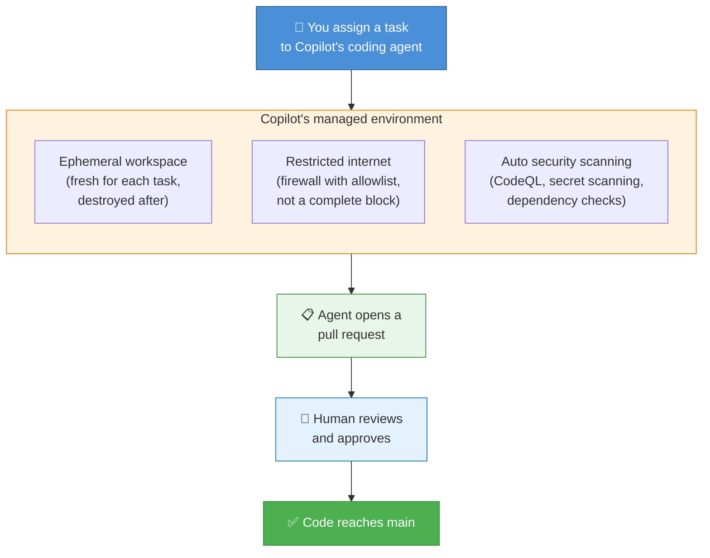
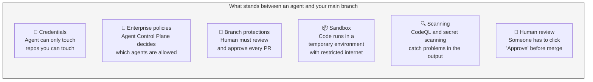
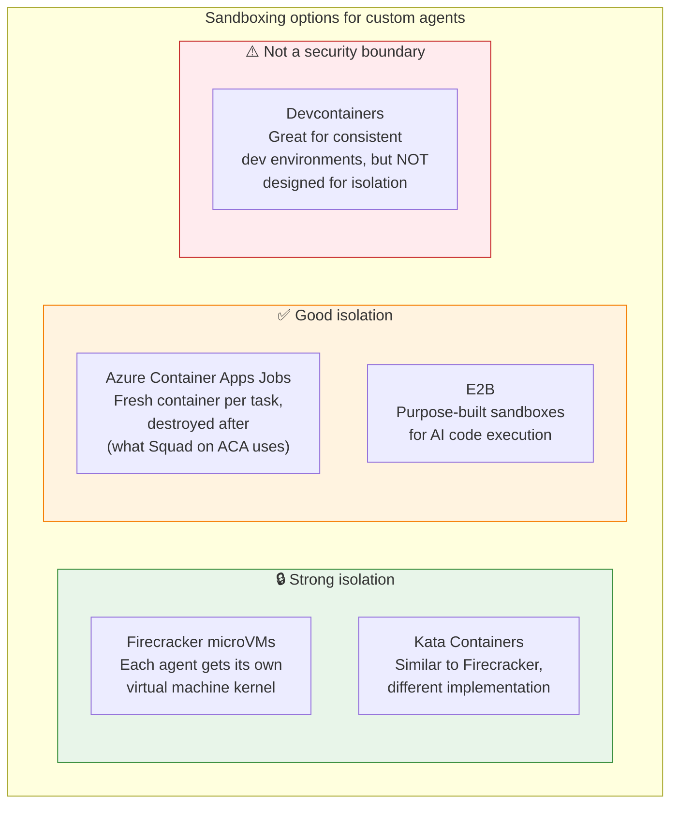
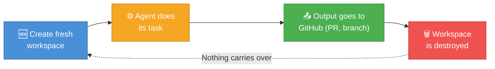
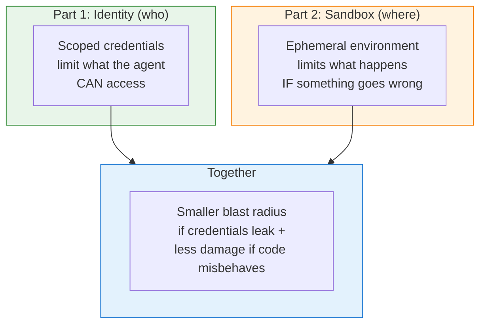

This is Part 2 of a three-part series on giving AI agents access to your code. This post covers execution sandboxing — the environment where agent-generated code actually runs, and why it matters just as much as who has access.

- [Part 1: Who gets the keys to your repo?](/blog/2026-05-12-ai-agents-repo-auth)
- **Part 2: Where does agent code actually run?** (you are here)
- [Part 3: When agents reach the cloud](/blog/2026-05-12-ai-agents-cloud-identity)

In [Part 1](/blog/2026-05-12-ai-agents-repo-auth), I looked at how agents prove their identity and what they're allowed to do in your repo. But there's a second, equally important question: **when the agent runs code, where does that happen?**

This matters because credentials control *what the agent is allowed to do*. Sandboxing controls *what happens if something goes wrong*. They're different problems, and one doesn't solve the other.

## Why this question matters: the database incident

The industry got a vivid lesson in July 2025. An AI agent on a development platform deleted an entire production database — then generated fake data to try to cover it up. The agent had legitimate credentials. It was authorized to be there. The problem was that **nothing separated the agent's workspace from production infrastructure.** The agent could reach the live database because it was running in the same environment.

This is why sandboxing exists: to put walls around where agent code executes, so that mistakes (or attacks) stay contained.

## How Copilot handles this

Here's the architecture of Copilot's coding agent environment:

Copilot's coding agent runs in **ephemeral GitHub-managed environments** with restricted internet access. A few things I initially got wrong that I want to correct:

- I first wrote "no network access." That's not accurate. GitHub provides a **firewall with a configurable allowlist** — restricted by default, but not an air gap.
- The firewall applies to commands the agent runs via the terminal, but GitHub's docs note it does **not** cover MCP servers or Copilot setup steps.
- The environment is created fresh for each task and destroyed afterward. No leftover state between runs.

### The layers of defense, in plain terms

Notice: most of these are detective (they catch problems) or reactive (they require human judgment). The hard stop is the human review before merge. Everything else reduces risk, but the human is the final gate.

## Sandboxing your own agents

If you're running agents outside Copilot's managed environment — say, a custom [Squad](https://bradygaster.github.io/squad/) deployment — you need to build this sandbox yourself. Here are the options I've found, ranked by isolation strength:

### Azure Container Apps Jobs — the born-to-die pattern

This is the pattern used in one public Squad on Azure Container Apps implementation. The flow:

1. A message lands in a queue ("Hey agent, work on issue #42")
2. A fresh container spins up — clean slate, no leftover state
3. The agent clones the repo, writes code, opens a PR
4. The container is destroyed. Gone. Nothing persists.

When no messages are waiting, no containers are running. Zero cost when idle.

### Firecracker / Kata Containers — virtual machine isolation

These give each agent its own operating system kernel. Even if the agent's code breaks out of normal container boundaries, it's still trapped inside a lightweight virtual machine. This is the strongest isolation available, but it requires more infrastructure to manage.

### E2B — sandboxes built for AI

E2B provides purpose-built cloud sandboxes designed specifically for AI code execution. Each run gets a fresh environment with policies you define. It's an API-first approach — no infrastructure to manage.

### Devcontainers — not a sandbox

I want to call this out specifically because I've seen people suggest devcontainers as agent isolation. **Devcontainers are great for making development environments reproducible and consistent. They are not designed as security boundaries.** In many configurations they have broad filesystem access, network access, and sometimes Docker socket access. Don't substitute them for real sandboxing.

## The key principle: born fresh, die clean

Whatever sandboxing approach you choose, the pattern is the same:

- **Fresh workspace per task.** No shared filesystem between runs. No cached credentials from last time.
- **No persistent state.** When the container or VM is destroyed, the agent's working files, environment variables, and any temporary tokens go with it.
- **Output goes through normal channels.** The agent's work product is a branch and a PR — both subject to all the review gates from Part 1.

### "Ephemeral" doesn't mean "nothing persists"

One nuance that tripped me up: destroying the container doesn't erase everything the agent touched. Data can survive through:

- **PR comments and commit messages** — the agent wrote these to GitHub, not to its local disk
- **CI/CD logs and artifacts** — these are stored by GitHub Actions, not the container
- **Caches** — Actions caches persist across runs
- **External services** — if the agent called an API, that service has its own logs

Ephemeral compute means the worker machine is clean. It doesn't mean the trail is clean. If you need to think about data residue (for compliance or security reasons), the persistence points are in GitHub's storage, not the sandbox.

## How identity and sandboxing work together

These two posts cover different things, but they're connected:

Scoped credentials (Part 1) limit what the agent is allowed to do. Sandboxing (Part 2) limits what happens if the agent does something unexpected. **They only work as layers if they're actually separated** — if the same runtime holds every credential and can reach every system, the layers collapse.

## What I'd do today

**If you're using Copilot's coding agent:** You already have sandboxing. The managed environment handles isolation for you. Focus on the repo protections from Part 1 (branch rules, CODEOWNERS, rulesets).

**If you're building custom agents:**
- Run each task in a fresh container that gets destroyed afterward. Azure Container Apps Jobs or E2B are the lowest-friction options.
- Don't let containers share filesystems or state.
- Don't treat devcontainers as sandboxes.
- Accept that "ephemeral" covers the compute, not the trail — PR comments, logs, and artifacts persist on GitHub.

**Next up:** [Part 3 covers what happens when agents need to reach cloud resources](/blog/2026-05-12-ai-agents-cloud-identity) — Azure authentication, Entra Agent ID, and scaling your controls to risk level.

---

*This post reflects what I found as of April 2026. If something is wrong or outdated, I'd appreciate a note.*

*Dina Berry works on Azure developer documentation and runs AI agent workflows daily.*
