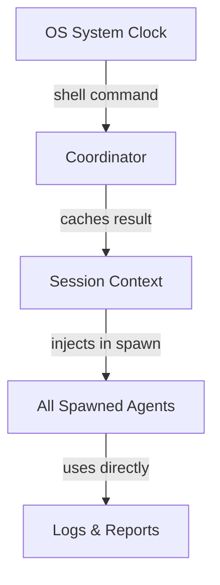
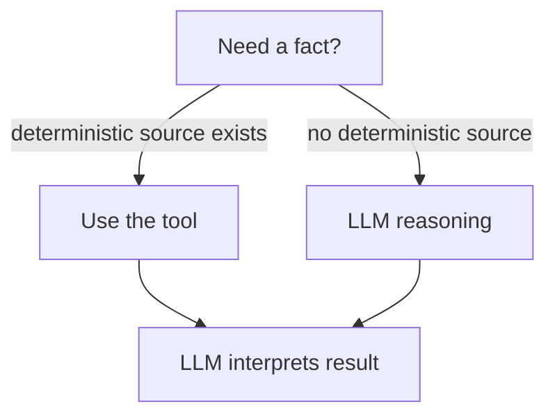

# Your AI Agent Doesn't Know What Day It Is

I asked my agent what day it was. It said Thursday. It was Monday.

Not a hallucination in the traditional sense — it had the right date. `2026-05-05T14:23:07-07:00`. Correct to the second. But when I asked "what day of the week is that?" it confidently said Thursday. May 5, 2026 is a Monday.

I laughed it off the first time. The second time, it said Wednesday for a Tuesday. The third time, I started counting. Over the next week, across different sessions and different agent spawns, the day-of-week answer was wrong roughly **30-50% of the time**. Not random — confidently wrong, with plausible-sounding reasoning about how many days since some reference date.

This isn't a Squad problem. It's not a Copilot CLI problem. It's a fundamental LLM limitation that affects **every custom agent** that needs to know what day it is. And the fix isn't what you'd expect.

## How I Found It

I run [Squad](https://github.com/bradygaster/squad) — a multi-agent orchestration framework for Copilot CLI. My coordinator agent spawns specialist agents for different tasks: code review, exploration, documentation, scribing. Each agent gets context when it starts, including (theoretically) the current datetime.

One afternoon I asked the coordinator a simple question: "What day and time is it?"

It answered confidently. Wrong day.

I tested again in a new session. Wrong again — a different wrong day. I opened a fresh session, asked the same question five times across five sessions, and got three different wrong answers. The ISO timestamp was always correct. The day-of-week was a coin flip.

My initial assumption was that the system prompt's `current_datetime` tag was broken or missing. It wasn't. The tag was there, the timestamp was correct, and the model was reading it. The problem was simpler and worse: the model was doing calendar math in its head.

Here's what that looks like from the model's perspective. It sees `2026-05-05T14:23:07-07:00` and thinks: "May 5, 2026. January 1, 2026 was a Thursday. January has 31 days, February has 28, March has 31, April has 30... that's 124 days... 124 mod 7 is..." and somewhere in that chain of modular arithmetic, it makes an error. Not every time. But often enough that you can't trust it.

## Why LLMs Can't Do Calendar Math


*The model sees the trail behind it clearly — the ISO timestamp is right there. But the path forward, the day-of-week derivation, disappears into fog.*

Here's what happens when you give a language model an ISO 8601 date like `2026-05-12T14:23:07-07:00` and ask what day of the week it is:

The model doesn't have a calendar. It doesn't have Zeller's congruence memorized as executable code. What it has is pattern matching over training data — billions of examples of dates paired with days. For common dates near the training cutoff, it gets lucky. For dates in the future or dates that require actual modular arithmetic, it guesses. And it guesses with the confidence of someone who's never been wrong.

I tested this informally across about 20 sessions over a week. The methodology was simple: ask "what day of the week is it?" in a fresh session, compare the answer to the actual day. The result was roughly 30-50% incorrect. I didn't run a rigorous benchmark — this was a "something is wrong and I need to quantify how wrong" investigation, not a paper. But the error rate was high enough that I stopped treating it as an edge case.

The math isn't hard for a computer. Any shell can do it instantly:

```powershell
# PowerShell — always correct
Get-Date -Format "dddd, yyyy-MM-ddTHH:mm:ssK"
# Tuesday, 2026-05-12T14:23:07-07:00
```

```bash
# Bash — always correct
date +"%A, %Y-%m-%dT%H:%M:%S%z"
# Tuesday, 2026-05-12T14:23:07-0700
```

The model can run these commands. It just doesn't think it needs to. It believes it can derive the answer from the date string. It can't — not reliably.

## The Blast Radius Is Bigger Than You Think

When I started investigating this in my Squad setup, I realized the bug wasn't just in the chat response. It was everywhere datetime flows through an agent system. Every feature that depends on knowing the current time is a potential failure point.

I mapped out the blast radius — every place in an agent system where an incorrect day-of-week silently corrupts something. The list was longer than I expected.

### Agent Orchestration

In a multi-agent system like Squad, a coordinator spawns specialist agents. Each spawn includes context — the task, the working directory, and (ideally) the current datetime. If the coordinator derives the day-of-week from mental math instead of a shell command, every spawned agent inherits the wrong day.

Think about what that means for a scribe agent writing a session log:

```
## Session Log — Thursday, 2026-05-05

- 14:23: Coordinator spawned explore agent for codebase analysis
- 14:35: Agent completed — found 3 relevant files
```

That log says Thursday. May 5 is Monday. Now anyone reading the log has the wrong context. Merge it with other records and the timeline is corrupted.

### Scheduling and Deadlines

"Is this due this week?" requires knowing what day it is. If the agent thinks Monday is Thursday, it might tell you a Friday deadline is two days away when it's actually four. Or worse — it might say "that was due yesterday" when you still have time.

I hit this one personally. I asked my agent to check if a PR review was overdue. It told me the review was three days late. It was one day late. The agent thought it was Wednesday; it was Monday. The math was internally consistent with its wrong premise — which made it harder to catch.

### Git Operations

Commit timestamps come from the system clock, so those are fine. But agent-generated commit messages or PR descriptions that reference "today" or "this week" can be wrong. "Created during Thursday's sprint review" — except it wasn't Thursday.

### Log Correlation

When you're debugging across multiple agents, timestamps matter. If Agent A thinks it's Thursday and Agent B gets the correct Monday, their logs don't align conceptually even if the ISO timestamps match. The human reading the logs gets confused because the narrative doesn't match the timeline.

### Relative Time Expressions

"Yesterday's meeting notes," "last week's deployment," "the PR from this morning" — all of these require accurate day-of-week awareness. A model that thinks it's Thursday when it's Monday will calculate "yesterday" as Wednesday instead of Sunday.

### Status Reports and Summaries

Weekly rollups, standup summaries, sprint reviews — any agent-generated content that references the current day or week. If the agent thinks it's later in the week than it is, it might summarize work that hasn't happened yet or miss work from the current day.

## The First Fix That Didn't Work

Before I landed on the architecture I'll describe below, I tried the obvious thing: just inject the date into the spawn prompt.

Someone on the Squad team had the same idea and opened [PR #1106](https://github.com/bradygaster/squad/pull/1106). The approach was reasonable:

```typescript
// From PR #1106 — fan-out.ts
const timestamp = new Date().toISOString();
// Injected as: **Current Date:** 2026-05-12T21:23:07.000Z
```

This fixed the "no datetime at all" problem but introduced two new ones.

**Problem 1: UTC-only timestamps.** `toISOString()` always returns UTC. At 11pm Pacific on a Sunday, the UTC time is already Monday. An agent on the US West Coast working on Sunday evening gets told it's Monday — technically correct in UTC, practically wrong for the user's context.

**Problem 2: The agent still has to derive the day.** Giving it `2026-05-12T21:23:07.000Z` and expecting it to know it's Tuesday is the exact same calendar-math problem. We just moved it from the system prompt to the spawn prompt.

The PR also updated three copies of a scribe template but missed the canonical source file. The mirrors would revert on the next template sync, silently undoing part of the fix.

Copilot's own review caught some of these issues — four comments pointing out the UTC problem, missing timezone assertions in tests, and the canonical template gap. The PR was closed.

I stole the good parts of this approach and built on them.

## The Trust Chain Model

The fix I landed on is architectural, not a prompt tweak. I think of it as a **trust chain** — borrowed from certificate validation — where datetime originates from a trusted source (the operating system clock) and flows through every layer without any LLM reinterpretation.



*Like a chain of custody for evidence — if any link re-derives instead of passing through, the whole chain breaks.*


*Water flows from one lock chamber to the next, level by level — clean, measured, controlled. That's what a datetime trust chain looks like: the OS clock is the headwater, and each agent downstream receives the same verified time.*

The key principle: **no LLM in the chain ever derives datetime from an ISO string.** Every agent receives pre-computed `CURRENT_DATETIME`, `DAY_OF_WEEK`, and `TIMEZONE` values. If it needs to know the day, it reads the field. It never calculates.

## Three Fields, Not One

Most datetime injection I've seen — including that first attempt at fixing this in Squad — passes a single ISO timestamp:

```
**Current Date:** 2026-05-12T14:23:07Z
```

This is better than nothing, but it re-introduces the exact problem. The agent still has to derive the day from the date. And `Z` (UTC) means agents in Pacific time see the wrong date near midnight.

The fix I landed on uses three explicit fields:

```
CURRENT_DATETIME: 2026-05-12T14:23:07-07:00
DAY_OF_WEEK: Tuesday
TIMEZONE: America/Los_Angeles (-07:00)
```

Why three?

1. **CURRENT_DATETIME** with offset — not UTC. An agent working at 11pm Pacific on Sunday shouldn't see Monday's date because the server is in UTC.
2. **DAY_OF_WEEK** pre-computed — the whole point. The LLM never touches calendar math.
3. **TIMEZONE** explicit — so agents can reason about deadlines, schedules, and cross-timezone coordination without guessing.

A note on timezone vs offset: the shell command gives you the local offset (`-07:00`). That alone doesn't identify an IANA timezone — `-07:00` could be `America/Los_Angeles` in PDT or `America/Denver` in MST. If your framework needs the IANA zone name, source it from user configuration or the host environment. Don't infer it from the offset alone. For most agent use cases, the offset is enough.

## The Four Layers of a Complete Fix

Through fixing this in Squad, I identified four layers that need updating in any agent system. Missing even one layer leaves a gap. The part I missed the first time was that "fix the coordinator" is only one layer — there are three more.

### Layer 1: Coordinator Instructions

The coordinator (or primary agent) needs to run a shell command as its first action in every session. Not "when it seems relevant." Not "if the user asks about time." Every session, first tool call. The rule I landed on:

```markdown
## Session Start — Mandatory

Run this command IMMEDIATELY as your first tool call:

PowerShell: Get-Date -Format "dddd, yyyy-MM-ddTHH:mm:ssK"
Bash:       date +"%A, %Y-%m-%dT%H:%M:%S%z"

Parse the result to extract:
- CURRENT_DATETIME (full ISO with offset)
- DAY_OF_WEEK (from the leading day name)
- TIMEZONE (from the offset)

Cache these values. Use them for ALL datetime references in this session.

> NEVER derive day-of-week by mental math from an ISO date string.
> LLMs miscalculate ~30-50% of the time. Always use the shell result.
```

The warning isn't just documentation — it's a guardrail. Without it, the model will "helpfully" try to calculate the day anyway, especially when the shell command result isn't immediately available. I found this out the hard way: the first version of the fix had the shell command but no warning, and the model would sometimes skip the command and answer from the system prompt's `current_datetime` tag directly.

### Layer 2: Spawn Templates

Every agent spawn needs to include all three datetime fields. This is where the trust chain either holds or breaks.

```markdown
## Context for Spawned Agent

CURRENT_DATETIME: {current_datetime}
DAY_OF_WEEK: {day_of_week}
TIMEZONE: {timezone}

Use these values directly. Do not recalculate.
```

In Squad, there are four spawn templates — lightweight, explore, full, and scribe. Each one needed the three fields added. Missing even one template means some agents get datetime and others don't. The first fix attempt updated one template. The other three kept spawning agents with no datetime context — I only caught this because the test suite checks all four.

### Layer 3: SDK Code

If your agent framework injects datetime programmatically (like Squad's `fan-out.ts`), the code needs to use local time with offset — not `new Date().toISOString()`.

```typescript
// WRONG — UTC only, no day-of-week
const timestamp = new Date().toISOString();
// "2026-05-13T06:23:07.000Z" — it's still Tuesday in Pacific time

// RIGHT — local time with offset and day-of-week
const now = new Date();
const dayOfWeek = now.toLocaleDateString('en-US', { weekday: 'long' });
const offset = -now.getTimezoneOffset();
const sign = offset >= 0 ? '+' : '-';
const hh = String(Math.floor(Math.abs(offset) / 60)).padStart(2, '0');
const mm = String(Math.abs(offset) % 60).padStart(2, '0');
const localISO = now.getFullYear() + '-' +
  String(now.getMonth()+1).padStart(2,'0') + '-' +
  String(now.getDate()).padStart(2,'0') + 'T' +
  now.toTimeString().slice(0,8) + sign + hh + ':' + mm;
const dateLine = `**Current Date:** ${dayOfWeek}, ${localISO}`;
```

Yes, this is more code. That's the point — the complexity lives in code that's tested once, not in an LLM that guesses every time.

### Layer 4: Template Priming

This one surprised me. Static templates — charter files, example prompts, README templates — sometimes contain hardcoded dates for illustration. Replace those with dynamic placeholders or remove them entirely.

A template that says "example: Thursday, 2025-07-01" primes the model to associate that date with Thursday, poisoning future calculations. In Squad's scribe charter, there were hardcoded 2025 dates used as examples. The model would sometimes anchor on those when doing day-of-week derivation in adjacent contexts.

## The UTC Midnight Edge Case

This deserves its own section because it's the subtlest failure mode and the one most datetime injection approaches get wrong.

Consider a developer in Seattle (UTC-7) working at 11:30pm on Sunday, May 10, 2026. In UTC, it's already Monday, May 11 at 06:30. If you inject `new Date().toISOString()`, the agent sees:

```
2026-05-11T06:30:00.000Z
```

The agent now thinks it's Monday. The developer is still working on Sunday. Any scheduling logic, deadline checking, or "what did I do today" queries are off by a day.

The fix is straightforward — use the local time with its offset:

```
2026-05-10T23:30:00-07:00
```

Now the agent sees Sunday, which matches the developer's reality. The offset tells downstream systems how to convert if they need UTC.

For local CLI workflows, the OS local timezone is usually right. But if you're running agents in containers, Codespaces, or cloud-hosted environments, the server's timezone might not match the user's. In those cases, timezone should be an explicit configuration value, not an assumption from the host environment.

## How to Test This

Testing datetime awareness is tricky because you're validating the structure of instructions, not runtime output. You can't run the agent and check if it knows the day — you need to verify that the instructions make it impossible to get the day wrong.

The test suite I built for Squad has 46 tests across 20 categories. Here's the approach I used:

### What to Validate

1. **Mandatory shell command exists** — the coordinator instructions include the exact `Get-Date` or `date` format string
2. **Mental math warning exists** — there's an explicit warning against deriving day-of-week manually
3. **All spawn templates include all three fields** — CURRENT_DATETIME, DAY_OF_WEEK, TIMEZONE in every template
4. **No hardcoded dates in templates** — grep for date patterns that shouldn't be there
5. **Day format is correct** — `dddd` gives full day name, not abbreviated
6. **Bash equivalent exists** — cross-platform coverage
7. **Direct Mode exemplar** — the "what day is it?" question is in the exemplar list

### Example Test (Pester)

```powershell
Describe "Session-start instructions" {
    It "requires Get-Date with dddd format" {
        $content | Should -Match 'Get-Date\s+-Format\s+"dddd'
    }

    It "warns against mental math derivation" {
        $warningLine = ($content -split "`n") | Where-Object {
            $_ -match "NEVER" -and $_ -match "derive"
        }
        $warningLine | Should -Not -BeNullOrEmpty
    }
}

Describe "Spawn template datetime fields" {
    It "includes DAY_OF_WEEK in all spawn templates" {
        $templates = @($content | Select-String 'DAY_OF_WEEK' -AllMatches)
        $templates.Count | Should -BeGreaterOrEqual 4
    }
}
```

### Why Static Tests Matter More Than Runtime Tests

You might think: "Just run the agent and ask what day it is." And that works for a smoke test. But it's not reliable as a regression test because:

- The agent might get the day right by luck (50-70% of the time, it does)
- Runtime tests are slow and flaky
- The real question isn't "does it work right now?" — it's "are the instructions structured so it can't fail?"

Static tests against the instruction file are fast, deterministic, and they catch structural regressions immediately. If someone reorganizes the coordinator instructions and accidentally removes the mental math warning, the test fails on the next CI run. That's the safety net you need.

The full test suite validates all four layers across every template and instruction block. If the coordinator instructions change format, the tests break loudly — which is exactly what you want.

## The Broader Pattern: Ground Truth Belongs to the OS

This datetime bug taught me something I should have known already: **LLMs should never be trusted with computations that have a known-correct source.**

The system clock is one example. Others include:

- **File system state** — don't ask the model if a file exists; run `Test-Path` or `test -f`
- **Git state** — don't ask "what branch am I on?"; run `git branch --show-current`
- **Environment variables** — don't ask the model to guess; run `echo $VAR`
- **Math operations** — don't ask for arithmetic; use a calculator tool or Python
- **Network state** — don't ask "is the server running?"; run `curl`
- **Package versions** — don't ask "what version of X is installed?"; run `npm list` or `pip show`

The pattern is the same every time: if there's a deterministic tool that gives the correct answer, use it. The model's job is to decide *when* to use the tool and *what to do* with the result — not to replicate the tool's functionality from pattern matching.



*When a ground-truth source exists, the LLM's job is interpretation, not computation.*

I think of it as a division of labor. The model is extraordinary at language, reasoning, planning, and synthesis. It's terrible at calendar math, file system queries, and anything that requires precise state tracking. The tools are extraordinary at precision and terrible at judgment. Put them together correctly and you get reliability. Put them together wrong — letting the model do the tool's job — and you get confident errors.

## Before and After

Here's what datetime injection looks like before and after the fix, in a concrete example:

| Aspect | Before (broken) | After (fixed) |
|--------|-----------------|---------------|
| Source | `current_datetime` system tag | `Get-Date` shell command |
| Format | `2026-05-12T14:23:07-07:00` | `Tuesday, 2026-05-12T14:23:07-07:00` |
| Day-of-week | Derived by LLM mental math | Pre-computed by OS |
| Timezone | Implicit in offset | Explicit `TIMEZONE` field |
| Spawn injection | Not present | 3 fields in every template |
| Error rate | ~30-50% wrong day | 0% (deterministic) |

The fix is boring, which is exactly what you want from datetime infrastructure.

## What I Learned

I spent two weeks on what turned out to be a one-line shell command. But the fix isn't the command — it's the architecture around it. The trust chain, the three fields, the four layers, the test suite. The command is the easy part. Getting every agent in the system to use it consistently — that's the work.

A few things that surprised me:

**The error rate is high.** I expected occasional mistakes. 30-50% was shocking. Models that can write complex code and reason about distributed systems genuinely cannot reliably tell you what day of the week a given date falls on.

**UTC is a trap.** The first fix attempt used `new Date().toISOString()` — UTC with a `Z` suffix. Near midnight, this gives the wrong date for anyone not in UTC. It's technically correct and practically wrong.

**One template is never enough.** In Squad, there are four spawn templates. The first fix updated one. The other three kept spawning agents with no datetime context. If your system has multiple code paths for agent creation, they all need the fix.

**Tests catch drift.** The datetime instructions are in a markdown file that gets edited for lots of reasons. Without tests, the fix will silently regress the next time someone reorganizes the document. With tests, the build fails and you know immediately.

**The warning matters as much as the command.** Adding the shell command without the "NEVER derive by mental math" warning resulted in the model sometimes skipping the command. It thought it could figure out the day faster than running a shell command. It was right about the speed and wrong about the answer.

## The Checklist I'd Use Now

If I were checking another agent system for datetime reliability, here's what I'd look for:

1. **A mandatory shell command** for datetime at session start — `Get-Date -Format "dddd, yyyy-MM-ddTHH:mm:ssK"` or the bash equivalent
2. **An explicit warning** against LLM mental math on dates — the model needs to know it can't trust itself on this
3. **Three fields injected** into every agent spawn: `CURRENT_DATETIME`, `DAY_OF_WEEK`, `TIMEZONE`
4. **Local time with offset**, not UTC — agents should work in the user's timezone
5. **All spawn paths audited** — if you have multiple templates, they all need datetime
6. **No hardcoded dates** in templates and examples — they prime the model with wrong associations
7. **Static tests** that validate the instructions exist and cover all templates

The fix is boring. That's the point. Boring is good. Reliable datetime shouldn't be interesting — it should just work. And now it does.

---

## Watercolor Prompts

The images in this post are generated with [dfberry/image-generation](https://github.com/dfberry/image-generation). Prompts follow the PNW nature metaphor style I use across this blog.

**Foggy trail junction** — *A watercolor painting of a hiking trail in the North Cascades, Pacific Northwest. Dense fog obscures a trail junction marker, making it impossible to read the direction signs. A hiker stands at the fork, uncertain. The trail behind is clear; the trails ahead disappear into mist. Soft grays, misty greens, a single warm-toned backpack on the hiker for contrast. Pacific Northwest wilderness atmosphere. No text overlays.*

**Ballard Locks trust chain** — *A watercolor painting of the Ballard Locks in Seattle, Pacific Northwest style. Crystal-clear water flows from one level to the next through a series of connected lock chambers. Each chamber is labeled with a small wooden sign. Soft morning light, misty atmosphere, evergreen trees in the background. Muted blues, greens, and warm wood tones. No text overlays.*

---

*The datetime trust chain is part of an ongoing investigation into agent reliability. The full test suite is in [diberry/project-dina](https://github.com/diberry/project-dina/tree/test/datetime-awareness-suite/tests) (46 Pester tests, 20 categories) and the fix is being contributed to [bradygaster/squad](https://github.com/bradygaster/squad). The test suite is portable to any agent system that uses a coordinator-and-spawn architecture.*
