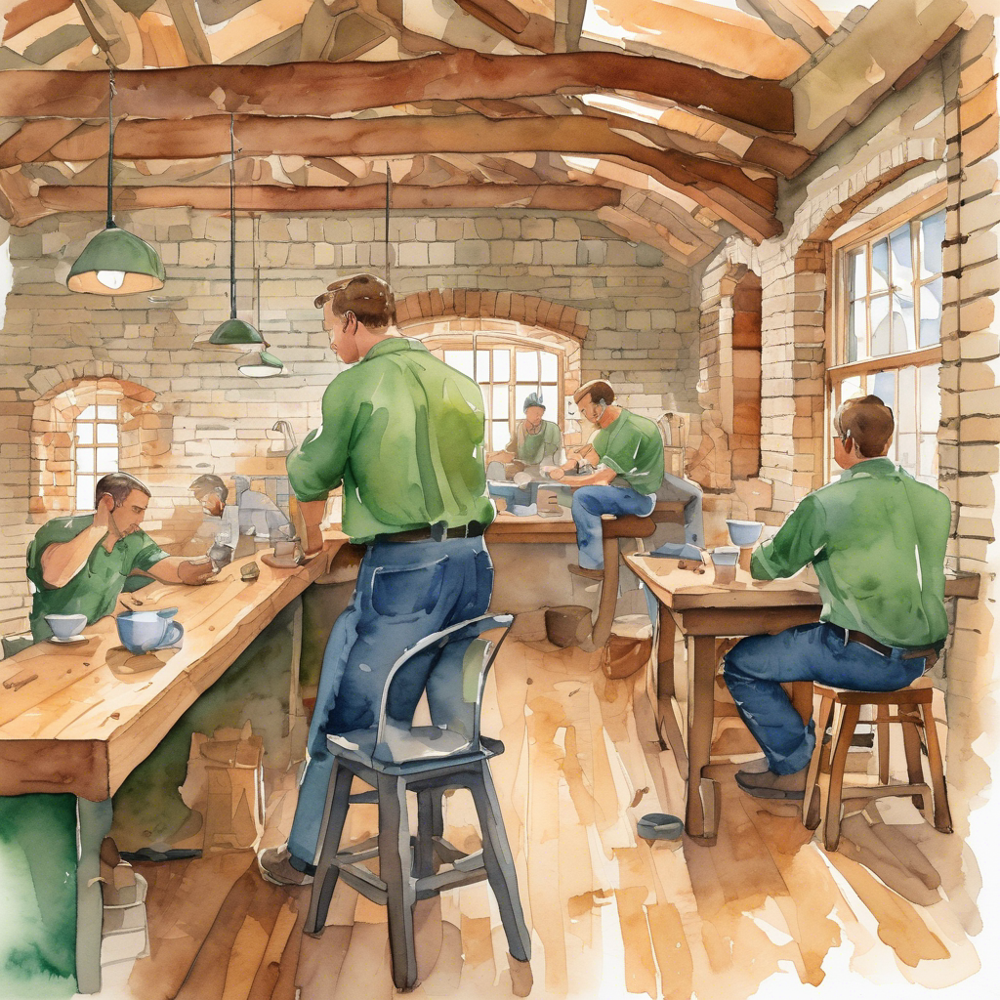

# From Autocomplete to AI Team: A Developer's Journey Through the Copilot Ecosystem

<!-- IMAGE PROMPT: Watercolor illustration, warm muted tones. One man in blue shirt and leather apron at a maple workbench, holding a welcome sign. A man in green shirt beside him offering a chisel. Brick walls, oak beam ceiling, arched windows, pegboard with saws, sawdust floor -->


*Imagine a furniture workshop. You're the craftsperson in the blue shirt — the one with the vision, the taste, the final say. The helpers in green shirts? Those are your AI agents. At first there's just one, handing you the right chisel at the right moment. By the end of this journey, you'll have a whole crew in green building furniture to your specifications while you direct, decide, and review.*

A year ago, I was tab-completing function signatures. Today, I manage a team of named AI agents that handle PR reviews, documentation sweeps, and infrastructure audits.

That sounds like a sales pitch. It's not. It's a progression that happened one level at a time, each building on the last. And the best part? You can start the same journey in about 15 minutes.

Here's the path I took — four levels, from "ooh that's cool" to "wait, this changes everything."

## The TL;DR

| Level | What Changes | Time to Value |
|-------|-------------|---------------|
| 1. First Day | You get an AI pair programmer (IDE + CLI) | 15 minutes |
| 2. Making It Yours | Copilot learns YOUR codebase (instructions, MCPs, skills) | 1-2 hours |
| 3. Squad | A team of agents working in concert | 1 day |
| 4. Autonomous Ops | Fully defined work executes itself | 2-3 days |

Each level builds on the previous one, and each is independently useful. Once you see what's possible at each stage, you'll want to keep climbing.

> **Badge legend:** 🖥️ VS Code · ⌨️ CLI · 👤 Interactive · 🤖 Autonomous · 💻 Local · ☁️ Cloud · 🌐 GitHub.com

---

## Level 1: Your First Day with Copilot

🖥️ VS Code · ⌨️ CLI · 👤 Interactive · 💻 Local

<!-- IMAGE PROMPT: Watercolor illustration, warm muted tones. On the LEFT a man wearing a bright cobalt blue long-sleeve shirt holding a mallet at a maple workbench fitting a dovetail joint. On the RIGHT a man wearing a vivid emerald green long-sleeve shirt beside him steadying the joint. The blue-shirted man and the green-shirted man contrast clearly. Brick walls, oak beam ceiling, arched windows, pegboard with hand saws, sawdust floor -->


*Your first day in the workshop. You're at the bench with your mallet (blue shirt), fitting a dovetail joint. Your one helper in green steadies the piece, hands you the right tool before you ask, and suggests a better angle — but you swing the mallet.*

This is where everyone starts — and honestly, where most of the immediate productivity gains live. Level 1 spans two environments: **Copilot in your IDE** (VS Code, JetBrains, etc.) and the **standalone Copilot CLI** in your terminal.

### In the IDE: Inline Completions & Inline Chat

🖥️ VS Code · 👤 Interactive · 💻 Local

**Inline completions** — the thing most people think of as "Copilot." You type, it suggests. But it's more than autocomplete. It reads your open files, your comments, your function signatures, and generates contextually aware suggestions. This happens directly in your editor as you type.

**Inline chat** — highlight code, press `Ctrl+I`, ask a question. "Explain this regex." "Refactor this to use async/await." "Add error handling." It edits in place within the current file.

### In the IDE: Copilot Chat Panel

🖥️ VS Code · 👤 Interactive · 💻 Local

The Chat panel (`Ctrl+Shift+I` or the sidebar) opens a conversation with Copilot that has broader awareness:

- **Open file context** — ask questions about the file you're looking at: "What does this function do?" "Find the bug in this logic."
- **@workspace** — ask about the entire repository: "Where is authentication handled?" "Show me all API routes." Copilot searches across your project.
- **@terminal** — get help with shell commands without leaving the IDE: "How do I find large files?" "What's the git command to squash commits?"
- **Agent mode** — Copilot Chat also has an "agent" mode where it can make multi-step edits, run terminal commands, and iterate. This is powerful for IDE-based workflows, but note: this is different from the Squad "agents" discussed later. Agent mode is a single AI working iteratively; Squad agents are specialized team members working in concert.

### The Standalone Copilot CLI

⌨️ CLI · 👤 Interactive · 💻 Local

The `copilot` command brings the full Copilot agent to your terminal — file editing, shell commands, sub-agents, and more:

```bash
# Non-interactive prompt mode:
copilot -p "extract a .tar.gz file preserving permissions"

# Ask about git:
copilot -p "undo my last commit but keep the changes"

# Start an interactive session:
copilot
```

The standalone CLI (`copilot`) is a full agent runtime — it can read/write files, run commands, and orchestrate complex tasks from your terminal. It's distinct from the IDE chat panel but equally powerful.

### When to Use Each

| Context | Best For |
|---------|----------|
| Inline completions | Flow-state coding, writing new functions |
| Inline chat (`Ctrl+I`) | Quick edits to selected code |
| Chat panel (open file) | Understanding code you're reading |
| Chat panel (@workspace) | Finding things across a project |
| Chat panel (@terminal) | Shell command help inside IDE |
| Agent mode (IDE) | Multi-step edits within a project |
| `copilot` CLI | Terminal-first workflows, scripting, automation |

### Try This Now

1. Install [GitHub Copilot](https://marketplace.visualstudio.com/items?itemName=GitHub.copilot) in VS Code
2. Open any project, start a new file, write a comment:

```typescript
// Parse a CSV string into an array of objects using the first row as headers
```

Copilot will generate the implementation. Tab to accept.

3. Install the [standalone Copilot CLI](https://docs.github.com/en/copilot/github-copilot-in-the-cli) and try:

```bash
copilot -p "explain why this Node.js app leaks memory when processing large CSV uploads"
```

### What I Learned at Level 1

The biggest gain wasn't the code generation — it was the **velocity shift in unfamiliar territory**. Working in a language I don't know well? Copilot bridges the gap between "I know what I want" and "I know the syntax." It turned 30-minute research into 30-second completions.

The limitation: Copilot at this level generates generic best-practice code. It knows nothing about your specific conventions or preferences. That leads to ...

---

## Level 2: Making Copilot Yours

🖥️ VS Code · ⌨️ CLI · 👤 Interactive · 💻 Local

<!-- IMAGE PROMPT: Watercolor illustration, warm muted tones. Man in blue shirt ALONE at maple workbench arranging custom jigs, labeled drawers, and pinning reference cards to pegboard. NO green shirts visible. Brick walls, oak beam ceiling, arched windows, sawdust floor -->


*No green shirts in sight — this is setup time. You're alone at the bench, labeling drawers, building custom jigs, and pinning reference cards to the pegboard. You're not building furniture yet; you're building the system that makes your workshop uniquely yours. When the green-shirted helpers return, they'll know exactly where everything goes.*

Level 1 Copilot is smart but generic. Level 2 is where it starts feeling like a teammate who's read your wiki. This level works in **both the IDE and CLI** — the same instruction files and MCP configs are picked up by Copilot Chat in the IDE and Copilot CLI.

### Custom Instruction Files

Drop [instruction files](https://code.visualstudio.com/docs/copilot/customization/custom-instructions) in your repo and Copilot learns your conventions:

**`.github/copilot-instructions.md`** — global instructions for all Copilot interactions:

```markdown
# Project Conventions

- Use TypeScript strict mode with explicit return types
- Prefer `Result<T, Error>` pattern over throwing exceptions
- All API responses follow our envelope format: `{ data, error, meta }`
- Tests use vitest with the `describe/it` pattern
- Never use `any` — prefer `unknown` with type guards
```

**`AGENTS.md`** — agent instructions that can live **anywhere** in your repo. Unlike `copilot-instructions.md` (which must be in `.github/`), you can place multiple `AGENTS.md` files at different directory levels — the nearest one in the directory tree takes precedence. This makes it ideal for **monorepos** where each package needs its own agent behavior:

```
my-monorepo/
├── AGENTS.md              ← shared team-wide instructions
├── packages/
│   ├── frontend/
│   │   └── AGENTS.md      ← React-specific agent rules (wins here)
│   └── backend/
│       └── AGENTS.md      ← API-specific agent rules (wins here)
```

Every suggestion Copilot makes now respects these rules. No more "helpful" suggestions that violate your architecture.

### MCP Servers: Giving Copilot New Abilities

[Model Context Protocol (MCP)](https://github.com/microsoft/mcp) servers let you plug external data sources and tools into Copilot's context. Think of them as APIs that Copilot can call mid-conversation — in both the IDE and CLI.

```json
// .copilot/mcp.json
{
  "mcpServers": {
    "azure": {
      "command": "npx",
      "args": ["-y", "@azure/mcp@latest", "server", "start"]
    }
  }
}
```

Now Copilot can query your Azure resources, check deployment status, or read your database schema — all within the conversation.

Some MCP servers I use daily:
- **[Copilot for Azure](https://github.com/microsoft/GitHub-Copilot-for-Azure)** — query Azure resources, check deployments
- **[GitHub MCP](https://docs.github.com/en/copilot/how-tos/provide-context/use-mcp-in-your-ide/set-up-the-github-mcp-server)** — deep repo operations beyond what's built-in
- **[Microsoft Learn MCP](https://learn.microsoft.com/training/support/mcp)** — let Copilot read/write files outside the workspace

### Skills: Repeatable, Deterministic Work

Skills are the underrated powerhouse of Level 2. A [skill](https://code.visualstudio.com/docs/copilot/customization/agent-skills) is a directory with a `SKILL.md` file that defines a repeatable pattern — including deterministic steps from scripts and code.

```
.<directory>/skills/
├── pr-review/
│   └── SKILL.md        # "Run lint, check test coverage, review diff"
├── doc-sync/
│   └── SKILL.md        # "Compare API surface to docs, flag drift"
└── sdk-sample-check/
    └── SKILL.md        # "Validate all samples compile and match SDK version"
```

Read the [Visual Studio documentation](https://code.visualstudio.com/docs/copilot/customization/agent-skills#_create-a-skill) for the best directory location for your skill usage.

Skills differ from instructions in that they define **executable workflows** — not just preferences. A skill can include shell commands to run, files to check, and decision trees to follow. They're reusable across sessions and agents.

Why skills matter:
- **Repeatable** — same process every time, no drift
- **Composable** — skills can reference other skills
- **Deterministic where needed** — embed scripts and validation steps that always run the same way
- **Shareable** — check them into your repo, the whole team benefits

### Try This Now

1. Create `.github/copilot-instructions.md` with your project's conventions
2. Add an MCP server for a tool you use daily (Azure, database, etc.)
3. Create a `.github/skills/quick-review/SKILL.md` that describes your code review checklist

Then open Copilot Chat or run `copilot` and notice the difference — it follows YOUR patterns now.

### What I Learned at Level 2

Custom instructions are absurdly high-leverage. A 50-line markdown file eliminates 80% of the "no, not like that" moments. MCP servers bridge "Copilot that knows code" and "Copilot that knows your infrastructure." Skills turn tribal knowledge into executable processes.

The limitation: everything is still per-session. Copilot doesn't automatically carry context between sessions — it won't remember decisions from yesterday's refactor. It doesn't have persistent context about your project's evolving state. It doesn't coordinate with other instances of itself. 

Enter [Squad](https://bradygaster.github.io/squad/).

---

## Level 3: Squad — A Team Working in Concert

🖥️ VS Code · ⌨️ CLI · 👤 Interactive · 💻 Local

<!-- IMAGE PROMPT: Watercolor illustration. Four men total standing at a large shared maple workbench building furniture together. One man wears a bright cobalt blue shirt, three men wear vivid emerald green shirts. Blue shirt man points at plans, green shirt men saw and hammer. Warm tones, brick walls, oak beams, arched windows, sawdust -->


*The workshop is getting busy. You're at the bench, studying the blueprint. Around you, a small team of helpers is assembling a cabinet together — one holds the frame, another drives the dowels, another checks the level. Each knows their role. Each stays in their lane. The work moves faster because they each know their job and coordinate with each other, not just with you.*

This is where the mental model shifts from "AI assistant" to "AI team."

[Squad](https://github.com/bradygaster/squad) gives you a team of specialized agents working **in concert** to complete tasks, where each member's expertise and boundaries positively impact the result. It's not just "named agents with memory" — it's a coordinated system where the reviewer's standards shape the coder's output, and the docs writer's perspective catches gaps the implementer missed.

Squad runs on the **Copilot CLI** (`copilot --agent squad`) and adds the organizational layer that makes agents feel like a real team rather than a single assistant wearing different hats.

### What Makes Squad Different

| Feature | Regular Copilot | Squad |
|---------|----------------|-------|
| Memory | Session-based | Persistent across sessions |
| Identity | Generic assistant | Named agents with charters |
| Coordination | You manage context | Agents hand off to each other |
| Specialization | Same agent for everything | Domain-specific agents with boundaries |
| Result quality | One perspective | Diverse perspectives improve output |

### Installing Squad

```bash
# Install Squad CLI
npm install -g @bradygaster/squad-cli

# Initialize in your project
npx @bradygaster/squad-cli init

# Start Copilot with Squad (standalone CLI)
copilot --agent squad
```

This scaffolds a `.squad/` directory:

```
.squad/
├── agents/
│   ├── ralph/           # Orchestrator
│   │   └── charter.md
│   ├── reviewer/
│   │   └── charter.md
│   └── docs-writer/
│       └── charter.md
├── ceremonies/
│   └── sweep.md
└── memory/
    └── decisions.md
```

### Agent Charters: Expertise + Boundaries

Each agent has a charter — a markdown file that defines who they are and what they do and, critically, what they won't do:

```markdown
# Reviewer Agent Charter

## Identity
You are the code reviewer for this project. You focus on:
- Security vulnerabilities
- Performance anti-patterns
- Consistency with project conventions

## What I Own
- TypeScript files and build system

## Boundaries
- Never approve your own changes
- Escalate architectural concerns to the team lead
- Don't refactor code that isn't in the PR scope
```

The boundaries matter as much as the expertise. A reviewer that knows when to escalate produces better outcomes than one that tries to handle everything. The interplay between agents — where one's output becomes another's input — is what makes Squad feel like a team rather than parallel solo workers.

### Ceremonies: On-Demand Structured Workflows

Ceremonies are repeatable workflows you trigger when needed:

```markdown
# Ceremonies & Rituals

## Design Review

**When:** Before PRD implementation begins  
**Who:** <list of named agents>
**Purpose:** Validate requirements, issue templates, and process flow before work starts

## Retrospectives

**When:** After major deliveries (GitHub Projects setup, issue templates, Actions automation)  
**Who:** All team members  
**Facilitator:** <single agent name> 
**Purpose:** Reflect on what worked, what didn't, continuous improvement

## Cross-Repo Sync

**When:** As needed  
**Owner:** <single agent name>
**Purpose:** Ensure coordination across all projects (reads repos.json for scope)
```

Ceremonies encode your team's best practices into executable workflows that any agent can run consistently.

### Try This Now

With the Squad open in a Copilot CLI interactive chat, assign work to the squad.

```bash
# Then talk to the team:
"Team, fan out and review this PR for security issues"
"Ralph go"
```

### What I Learned at Level 3

The agents and charter system is what makes Squad click. With it, you have agents that maintain consistent behavior, remember decisions, and build expertise over time. Without it, you have "Copilot with extra steps."

The real insight: **diversity, expertise, coordination, and boundaries create quality**.When the reviewer can't approve its own work, when the docs writer must verify against actual code, when the security agent escalates instead of guessing — the team produces better results than any single agent could alone.

The honest trade-off: Squad requires investment in codifying your work patterns and practices. A poorly-defined agent is worse than no agent because it gives inconsistent results. Spend the time upfront.

---

## Level 4: Autonomous Operations

🖥️ VS Code · ⌨️ CLI · 🤖 Autonomous · 💻 Local · ☁️ Cloud

<!-- IMAGE PROMPT: Watercolor illustration. Six men all wearing vivid emerald green shirts working at separate maple workbenches building furniture. All shirts are green, no blue shirts. One saws wood, one hammers, one planes a board, one uses clamps. Warm muted tones, brick walls, oak beams, sawdust floor, arched windows -->


*The helpers are working independently across the shop — each at their own bench, each building a different piece from your specifications. One saws, one hammers, one planes. You glance across the room and trust the work because you wrote clear blueprints for your team of experts. They don't need you hovering.*

Level 4 is where the work has been **fully defined** and you just need it completed. You've already figured out what needs to happen — now you hand it off and let the system execute.

This is the difference between "AI that helps me work" and "AI that does the work I've specified."

### Five Ways to Run Autonomously

#### 1. VS Code Agent Mode

🖥️ VS Code · 🤖 Autonomous · 💻 Local

In VS Code, Copilot's agent mode executes multi-step tasks — reading files, running commands, editing code — without manual intervention. You describe the outcome, and agent mode figures out the steps:

```
# In VS Code Copilot Chat (agent mode):
"Refactor all API handlers to use the new error envelope format"
```

Agent mode uses your custom instructions and MCPs from Level 2, so it already knows your project's conventions. Best for: well-scoped tasks while you're in the IDE.

#### 2. Copilot CLI Agent Mode

⌨️ CLI · 🤖 Autonomous · 💻 Local

The standalone CLI provides the same autonomous execution outside VS Code:

```bash
# CLI agent mode — executes the full task autonomously
copilot -p "Refactor all API handlers to use the new error envelope format"
```

Best for: well-scoped tasks from the terminal, scripted workflows, or when you prefer the command line over the IDE.

#### 3. "Ralph, go" — Squad Work Queue (In-Session)

⌨️ CLI · 🤖 Autonomous · 💻 Local

Ralph, the Squad work monitor, processes your entire work queue autonomously within a Copilot session. First, connect Squad to your repo's issues (`"pull issues from owner/repo"`). Then Ralph triages those issues, assigns work to the right specialist agents, monitors progress, and keeps going until the board is clear:

```bash
# In a Copilot CLI session with Squad:
copilot --agent squad

# Then:
"Ralph, go"          # → Starts processing the work queue
"Ralph, status"      # → Shows what's open, stalled, or ready to merge
```

Ralph monitors GitHub issues, triages incoming work, and drives tasks through your agent team without you intervening. It doesn't stop between tasks — it keeps cycling until everything is done.

Best for: in-session work queue processing, multi-agent coordination, and batching related tasks.

#### 4. Squad Watch — Persistent Local Monitoring

⌨️ CLI · 🤖 Autonomous · 💻 Local

When you're away from the keyboard but your machine is on, `squad watch` provides persistent polling of your GitHub issues:

```bash
# Polls every 10 minutes (default)
npx @bradygaster/squad-cli watch

# Custom intervals
npx @bradygaster/squad-cli watch --interval 5    # every 5 minutes
npx @bradygaster/squad-cli watch --interval 30   # every 30 minutes
```

This runs as a standalone local process (not inside Copilot) that auto-triages issues from your connected repo, assigns work based on team roles and keywords, and routes issues to agents or `@copilot` for pickup. It runs until you Ctrl+C. (Requires the same repo connection set up via Squad.)

Best for: overnight monitoring, catching issues while you're in meetings, and persistent triage between active sessions.

#### 5. Copilot Cloud Agent (GitHub Issues)

☁️ Cloud · 🤖 Autonomous · 🌐 GitHub.com

Assign a GitHub issue to Copilot and it works independently — no terminal open, no local setup. The cloud agent runs in a GitHub Actions-powered ephemeral environment: it researches your repo, creates a plan, makes code changes, and opens a PR.

Trigger it from a GitHub issue comment:

```markdown
<!-- In a GitHub issue comment: -->
@copilot implement this
```

Or assign the issue to Copilot directly from the GitHub Issues UI, VS Code, JetBrains, or the GitHub CLI.

The cloud agent works best for well-scoped, clearly described issues: "add a new endpoint that follows the existing pattern," "write tests for this module," "update the config schema to support the new field." Think of this as a single async task you hand off — describe the outcome clearly, and come back to a PR.

It uses GitHub Actions minutes and Copilot premium requests, so you're trading compute for time. No local session required; the work happens entirely on GitHub's infrastructure.

### When to Use Each

| Approach | Best For | Runs On | Requires Active Session? |
|----------|----------|---------|--------------------------|
| VS Code agent mode | IDE-scoped tasks | Your machine | Yes |
| `copilot` CLI | Terminal-scoped tasks | Your machine | Yes |
| "Ralph, go" | Work queue + coordination | Your machine (Squad) | Yes |
| `squad watch` | Persistent monitoring | Your machine (background) | No — standalone process |
| Copilot cloud agent | Issue-driven implementation | GitHub's cloud | No — fully async |

### The Autonomy Spectrum

These options form a spectrum from "I'm here watching" to "I'm asleep":

```
You're present              You're away              You're asleep
─────────────────────────────────────────────────────────────────
VS Code agent mode    →    squad watch        →    Copilot cloud agent
Copilot CLI           →    (machine on)       →    (GitHub cloud)
Ralph, go                                         
```

### What I Learned at Level 4

The key insight: **autonomous execution requires fully-defined work**. The quality of autonomous output is directly proportional to how clearly the task was specified. Vague issues get vague results. A well-written issue with acceptance criteria, examples, and constraints? That's where autonomous execution shines.

The cloud agent on GitHub is the lowest-friction option — no local setup, just assign an issue. `squad watch` bridges the gap between active sessions and cloud — your machine monitors and triages even when you're not in a Copilot session. Ralph is best when you're actively working through a backlog and want coordinated multi-agent execution.

---

## Finding Your Path

Not everyone takes the same route through these levels:

| Role | Start Here | Quick Win | Level Up |
|------|-----------|-----------|----------|
| **Engineer** | Level 1 (completions + CLI) | Custom instructions for your stack | Skills for repeatable reviews |
| **PM/Content** | Level 1 (chat for drafting) | Custom instructions for voice/style | Squad ceremonies for sweeps |
| **Team Lead** | Level 2 (instructions + MCPs) | Skills for team processes | Squad for coordinated reviews |
| **Platform** | Level 2 (MCP + infra context) | Squad for monitoring | Squad for always-on monitoring |

---

## The Ecosystem at a Glance

The Copilot ecosystem is growing fast. Here are the key resources:

### Essential Tools
- **[GitHub Copilot Extension](https://marketplace.visualstudio.com/items?itemName=GitHub.copilot)** — the IDE extension (VS Code, JetBrains, etc.)
- **[Copilot CLI](https://docs.github.com/en/copilot/github-copilot-in-the-cli)** — standalone `copilot` command for terminal
- **[Squad CLI](https://github.com/bradygaster/squad)** — named agents working in concert (`npm i -g @bradygaster/squad-cli`)

### Learning & Community
- **[Agentic SDLC Handbook](https://github.com/danielmeppiel/agentic-sdlc-handbook)** — patterns for AI-first development
- **[Copilot Insights](https://github.com/jackbatzner/copilot-insights)** — measure your Copilot usage
- **[Awesome Copilot](https://awesome-copilot.github.com)** — community-curated extensions, skills, and tools ([repo](https://github.com/github/awesome-copilot))

### Infrastructure
- **[Microsoft MCP](https://github.com/microsoft/mcp)** — Model Context Protocol servers
- **[Copilot for Azure](https://github.com/microsoft/GitHub-Copilot-for-Azure)** — Azure resource context in Copilot

---

## What Actually Changed for Me

I want to be honest about what's different after six months at Level 3+:

**What improved:**
- PR turnaround dropped from days to hours (the green shirts handle first-pass review)
- Documentation stays in sync with code (sweep ceremonies catch drift)
- I work in unfamiliar codebases with dramatically less ramp-up time
- Boilerplate tasks that used to take 30 minutes take 2 minutes
- Skills encode my best practices — I define a process once, it runs the same way forever

**What didn't change:**
- Architecture decisions still require human judgment
- Debugging subtle logic errors still requires deep thought
- Agent output needs review — trust but verify
- Writing good charters and instructions is a skill that takes time to develop, update, and improve

**The mental model shift:**
I stopped thinking "what code do I need to write?" and started thinking "what work needs to happen, and who should do it?" Sometimes the answer is me — blue shirt at the bench, swinging the mallet. Often it's a green shirt with clear instructions and a well-scoped task.

---

## Start Today

You don't need to plan all four levels. Start where you are:

**Never used Copilot?** → Install the extension, write a comment, press Tab. That's it.

**Using Copilot but it's generic?** → Write a `copilot-instructions.md` file and one skill. 10 minutes, massive payoff.

**Want more than autocomplete?** → Install Squad CLI, write one agent charter, run `copilot --agent squad`.

**Ready for autonomous execution?** → Try `copilot --autopilot` on a well-defined task, or assign an issue to the cloud agent.

The progression is natural. Each level solves a real problem you'll discover at the previous one. And unlike most "AI transformation" pitches, you can validate the value at every step before investing in the next.

The future of development isn't AI replacing developers. It's developers who know how to orchestrate AI systems outperforming those who don't. The tools are here. The ecosystem is open source. The only question is which level you start at.

*Want to go further? Read [Cloud-Scale Agent Fleets](/blog/2026-05-15-cloud-scale-agent-fleets) for Level 5.*

---

## 📣 GitHub Copilot Dev Days — Next Week!

Want to go deeper? GitHub Copilot Dev Days are happening next week with sessions in multiple languages and time zones:

- 🗓️ **May 25, 2026 at 7 PM (BRT)** — [GitHub Copilot Dev Days Brazil](https://developer.microsoft.com/reactor/events/27091/) [Portuguese]
- 🗓️ **May 26, 2026 at 12 PM (CDMX)** — [GitHub Copilot Dev Days LATAM](https://developer.microsoft.com/reactor/events/27094/) [Spanish]
- 🗓️ **May 26, 2026 at 7:30 PM (CST)** — [GitHub Copilot Dev Days 中文版](https://developer.microsoft.com/reactor/events/27114/) [Simplified Chinese]
- 🗓️ **May 27, 2026 at 9 AM (PST)** — [GitHub Copilot Dev Days](https://developer.microsoft.com/reactor/events/27096/) [English]

These are free, virtual events covering the latest in Copilot extensibility, agentic development, and the ecosystem tools discussed in this post. See you there!

---

*Have questions or want to share your own journey? Find me on GitHub at [@dfberry](https://github.com/dfberry) or check out [my other posts](/blog) on the Copilot ecosystem.*
