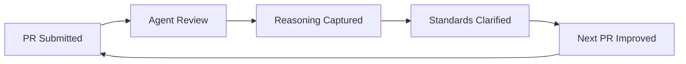

# Agent-Led PR Reviews: What Actually Changed in My Workflow

<!-- IMAGE PROMPT: Watercolor illustration, soft wet-on-wet washes, visible paper texture, warm muted tones, loose brushwork. A girl with pink hair stands before a tall wall of colorful Post-it notes and printed code review comments, studying them thoughtfully with a magnifying glass in hand. Morning Pacific Northwest light filters through a tall window behind her. Some notes are green (approved), some amber (needs discussion), some are covered in dense handwriting. The overall feeling is of discovery rather than overwhelm. -->


*The first time an agent actually told me why it was approving my PR, I stopped and read the comment twice. Not because it was wrong. Because nothing like it had happened before.*

PR #8648 had 14 review comments across 3 files. Statler found them.

I was documenting the tool server's SQL tools — translating entries from `tools-list.json` into parameter tables for the documentation platform article. Standard work. I've done around 40 of these tool articles at this point. I submitted the PR and Statler, my adversarial Squad agent, came back with this:

> **Statler — Adversarial Review**
>
> The `subscription` parameter appears in your parameter table for `azmcp_sql_server_list`. The SQL namespace tools receive subscription via the Azure plugin's ambient context — it shouldn't be listed as a required parameter because callers never pass it directly. Compare the pattern in `azmcp_storage_account_list`: same tool family, no subscription in the table.
>
> This will confuse readers looking for what to actually pass.

That comment isn't "missing semicolon." It's a specific claim about a pattern across the SQL namespace, a comparison to another tool family, and a prediction about reader confusion. It was right about all three.

I fixed the table and replied: "Confirmed — subscription, resource-group, and devlang slug formatting follow the same ambient pattern across storage, SQL, and container apps. Adding to reviewer notes for the series." Sam (my fact-checking agent) verified the pattern against the upstream `tools-list.json`. The PR merged with one exchange and no ambiguity.

The same PR also came back with a second Statler flag I hadn't noticed at all: three of my seven Example sections used `node` as the devlang slug while the rest of the tool server documentation series uses `javascript`. It would have built fine. Readers filtering by language tab would have gotten partial results.

14 comments. 3 files. Every flag was right.

---

## Why "LGTM" Costs You More Than You Think

The obvious problem with "LGTM" is that it gives you nothing to work with. You don't know what the reviewer checked. You don't know whether they caught the edge case you were worried about. You don't know whether your interpretation was right.

The less obvious problem: it breaks the feedback loop going the other direction too. When you know most reviews will be "LGTM," you stop writing detailed PR descriptions. Why spend ten minutes on a scope definition if the reviewer isn't going to read it? So the description degrades, which makes future reviews even less useful, which makes future descriptions even shorter. It adds up.

I lived that loop for years. Writing documentation PRs for internal approval cycles where the reviewer was too stretched to engage — I'd get a green stamp or silence, and I'd move on without knowing if what I'd written was right or just unopposed.

The other failure mode is the pointed review delivered with heat. Strong language, implied criticism, "why did you do it this way" as an accusation rather than a question. That's not better than LGTM. You learn something is wrong without learning what right looks like. You learn to feel bad about the decision, which is not the same as learning to make a better one.

<!-- IMAGE PROMPT: Watercolor illustration, soft wet-on-wet washes, visible paper texture, warm muted tones, loose brushwork. Two contrasting scenes split by a diagonal wash. Left: chaotic, crumpled papers, a stressed figure in yellow at a desk surrounded by red-stamped "LGTM!" notes and question marks, foggy atmosphere. Right: calm, organized workspace where the pink-haired girl reads structured feedback cards pinned neatly to a corkboard, morning light, calm blues and greens. -->


*Before agent reviews, feedback was either a green stamp or a heat storm — rarely the clear, reasoned signal in between.*

What I wanted — and I think most people want — is a reviewer who reads carefully, explains their reasoning, and raises questions rather than making accusations. That doesn't require AI. But it does require time and consistency that most human reviewers, who are also doing their actual jobs, can't reliably provide at the PR-by-PR level.

---

## What My Squad Actually Does in a PR Review

My review setup uses [Squad v0.9.4](https://github.com/bradygaster/squad) running on the Copilot CLI. Three agents run on documentation PRs:

**Sam** (Fact Checker) compares my claims against the source. For the tool server articles, that means checking parameter names, types, and descriptions against the upstream `tools-list.json`, and verifying that tool descriptions match the annotation text in the source repo. Sam approved PR #8648 after confirming the corrected subscription removal matched the pattern in the upstream JSON — and flagged a minor drift in one tool description where I'd added "against a specified database" that wasn't in the source text.

**Statler** (Adversarial) looks for what will confuse readers, break patterns, or create maintenance problems. Statler caught both the subscription parameter issue and the devlang slug inconsistency on PR #8648. On a recent Azure Skills article PR, Statler caught a parameter marked as "Required" in my table that the CLI JSON schema had as "Optional" — a discrepancy I'd introduced by following the pattern from an older article rather than checking the current schema.

**Scooter** (Quality) checks structure: do headings follow the expected pattern, is the frontmatter complete, do parameter tables have the right columns, are there missing Example sections. For the tool server documentation series, that means verifying every tool article has a Description, Parameters table, and Example section in the right order.

Sam goes first (verify facts), Statler second (find problems), Scooter last (check structure). If Sam fails, the others still run — I want all the feedback, not a fail-fast stop.

For content areas outside my expertise, I configure the reviewer with patterns from domain-specific feedback. The SQL tool articles got a reviewer trained on akromm's published review patterns from the SQL article series — things like the exact format expected for the parameters table, which columns are required, and what "Required" vs "Optional" should actually mean for Azure CLI parameters. The agent applies akromm's standards consistently across every PR, which is something akromm can't do while also managing their own work.

This is where agent reviews add something human reviews often can't at this scale: the same reviewer standards, applied to every PR, with no variance based on who's available or how busy the review queue is.

---

## Step 1: Write the PR Description as a Contract

The quality of the review scales with the quality of the information you put in the description. Human reviewers fill in gaps with assumptions and prior knowledge. Sam and Statler work with what's in front of them.

This forced me to rethink what a PR description is actually for.

My old mental model: a PR description is a summary so the reviewer knows roughly what to expect. Good description = more detail, maybe a link to the ticket.

My current model: a PR description is a goal statement and a scope contract. It defines what "done" looks like, what the reviewer should evaluate, and what the author is explicitly not doing. Writing it is the first act of review.

For tool server articles — where I'm translating entries from `tools-list.json` into structured documentation — I now include:

- **Goal**: which tools this PR covers, from which source file, to which output file
- **Source of truth**: a link to the specific commit in `upstream-repo` I'm translating from
- **Scope**: which tools are covered, and explicitly which are not (some tools are internal, some belong in a different article)
- **Open questions**: things I'm genuinely uncertain about, asked directly to the reviewer

When Statler reviews that PR, it checks the translation against the stated source. When Sam reviews it, it compares my descriptions against the upstream annotation text. When I have a real question — like whether `subscription` belongs in the params table — Sam looks at the pattern across the namespace and answers it rather than guessing.

<!-- IMAGE PROMPT: Watercolor illustration, soft wet-on-wet washes, visible paper texture, warm muted tones, loose brushwork. The pink-haired girl at a wooden desk, writing on large paper that unfurls like a scroll. On the scroll are structured sections with headers and bullet points, glowing softly. Through the window, Pacific Northwest cedar trees in morning mist. The feeling is of careful, deliberate craftsmanship. -->


*When you write the PR description for a thoughtful reader — not a rubber stamp — the document becomes the first act of review.*

There's a side effect of writing at this level of detail: I catch scope creep before submitting. While writing the scope section for a recent Azure Skills article PR, I noticed I'd edited three files that weren't in the goal statement. Two were legitimate scope expansions I should have documented. One was an accidental change I reverted before submitting. The description-writing does that.

Writing for a thoughtful reader changes how you think about what you're doing. The rubber-stamp model lets you be vague because the reviewer will fill in the gaps. The contract model requires precision because the reviewer will hold you to it.

---

## What Sam's Review on PR #8648 Actually Said

For context: PR #8648 covered the SQL tool documentation. 7 tools across the SQL namespace, each needing a Description, Parameters table, and Example section. Source was the SQL namespace block in `tools-list.json` plus the tool-specific annotations in the upstream repo.

Sam's review (fact-check pass):

> **Sam — Fact Check**
>
> I compared all 7 tool descriptions against `tools-list.json` (commit `a4f9c31`). Six match exactly. One diverges: `toolserver_sql_database_query` — your description says "executes a SQL query against a specified database" but the upstream annotation says "runs an arbitrary SQL query." "Executes" vs "runs" is a style call, but "against a specified database" is an addition not in the source. Intentional clarification, or drift?
>
> Parameters tables are accurate with the exception flagged by Statler. Example sections are present for all 7 tools.

Two things to notice: Sam cited the specific commit it compared against (`a4f9c31`), and it distinguished between minor word choice drift ("executes" vs "runs") and a substantive addition. "Against a specified database" is something I added that's not in the source — Sam is right to flag it as a question rather than a correction, because it might be a legitimate clarification for readers.

I answered: yes, intentional — "runs an arbitrary SQL query" is technically accurate but unhelpful for someone trying to understand when to use this tool. The clarification stays. Sam closed the question.

Statler's review ran against a different standard:

> **Statler — Adversarial Review**
>
> The `subscription` parameter appears in your parameter table for `azmcp_sql_server_list`. The SQL namespace tools receive subscription via the Azure plugin's ambient context — it shouldn't be listed as a required parameter because callers never pass it directly. Compare the pattern in `azmcp_storage_account_list`: same tool family, no subscription in the table. This will confuse readers looking for what to actually pass.
>
> Secondary: three of the seven Example sections use `node` as the devlang slug. Your other articles in this series use `javascript`. Pick one — readers filtering by language tab will get partial results otherwise.

I'd completely missed the devlang inconsistency. I copied an example from a different article in the series that used `node` and didn't notice. Statler caught it in a single pass.

A linter doesn't catch that. A "LGTM" definitely doesn't. A human reviewer working through 14 articles in a sprint might not either, because the inconsistency breaks across files rather than within one.

That's what 14 comments across 3 files looks like when the reviewer is actually reading.

---

## How the Feedback Compounds

The subscription parameter question came up in three consecutive SQL tool PRs before I fixed it. Not because I forgot — I genuinely wasn't sure whether the pattern I was seeing was intentional or a gap in the existing docs. After the third flag, Sam verified the pattern across the full SQL namespace and I added a rule to my reviewer notes: "subscription, resource-group, and tenant-id are ambient context params in the SQL and Storage namespaces — do not include in parameter tables."

That note is now in my PR description template for the tool server documentation series. Statler stops flagging it. Sam stops verifying it. The question is answered and closed.



*Each review's reasoning teaches the system — and me — what "good" looks like for the next PR.*

The loop only works if you maintain it. The agents don't automatically update my template. Roughly every five PRs, I spend fifteen minutes reading through the flags I've closed, identifying the ones that represent settled rules, and adding them to the reviewer notes section of the template. That's the maintenance cost.

It adds up in the right direction, though. Before I had the subscription rule documented, I spent time on every SQL tools PR second-guessing whether I had it right. After? It's a known rule that gets checked automatically. That fifteen-minute update bought back maybe two hours of per-PR uncertainty across the series. I'll take that trade every time.

A note on where this doesn't compound cleanly: the agents don't catch conceptual errors. If I've misunderstood what a tool does at the API level, Sam will confirm that my description matches my misunderstanding. That requires a human who knows the Azure SQL namespace to catch — someone like akromm who's actually used these tools. Agent reviews and human reviews are doing different jobs. The agent handles pattern consistency and fact-checking against documented sources; the human catches the gaps between what's documented and what's true.

---

## Professional by Default

Some of the most technically accurate feedback I've received in my career was delivered in ways that made it hard to hear. All-caps emphasis, phrasings that implied I should have known better. That delivery activates something in you that competes with the information transfer. You spend effort managing your response to the tone instead of engaging with the substance.

Agent reviews are impersonal by default. Not cold — they engage with the content directly. But Statler doesn't get frustrated with the third consecutive PR that has the same devlang issue. Sam doesn't have strong opinions about "executes" vs "runs" that spill into how it phrases the flag. Scooter doesn't passively approve things because it's tired.

The practical effect: I read agent review comments at face value. When Statler raises an issue, it's because a pattern check fired. When Sam flags a divergence, it's because the source doesn't match. There's no subtext to parse. The only question is whether the flag is right. If yes, fix it. If no, explain why. That's the whole exchange.

There's a real gap here, though: agents don't know your team's unwritten context. When a decision involves an architectural mistake being corrected incrementally, or a stakeholder preference that lives in someone's head, an agent will flag it correctly — the pattern diverges — but can't know why. My practice when I'm overriding a flag deliberately: explain it in the PR description. Not for the agent — for the humans who read the PR history later.

<!-- IMAGE PROMPT: Watercolor illustration, soft wet-on-wet washes, visible paper texture, warm muted tones, loose brushwork. The pink-haired girl sits cross-legged on a park bench in a lush Pacific Northwest garden, reading a clipboard of organized review notes. Her expression is calm and focused. Around her, other figures at desks show contrasting emotions — frustration, typing forcefully, crumpled papers. The pink-haired girl's space is serene, illuminated by diffuse green light through cedar branches. -->


*When feedback is professional by default, you can engage with the content rather than managing the relationship.*

One more thing on tone: agents ask rather than assume when something is ambiguous. A human reviewer who sees something they don't understand might mark it wrong, or leave a comment that implies the author made a mistake, or approve silently with a mental note. Sam says "is this intentional clarification or drift?" That's an invitation to confirm, not a verdict. For documentation work where many scope decisions are legitimately ambiguous — whether a behavior is user-facing or internal, whether a parameter should be in the table or treated as ambient — getting a question is almost always the right response.

---

## When Someone Else's Agent Reviews Your PR

Everything so far has been about my agents reviewing my work. That's one direction.

The other direction is when your PR lands in a queue owned by a different team — one with their own standards, their own patterns, their own accumulated history of what "correct" means for their content area. Before agent reviews, that came back as "LGTM," or a one-liner with no context, or silence. You had no idea what the reviewer actually checked or what standard you were being held to.

When another team's agent reviews your PR, you get to see the standards.

A recent PR went to a platform team for review. Their agent came back with this:

> **Platform Reviewer — Standards Check**
>
> Parameter table uses "server name" in the Description column. The convention in this content area is "resource name" for all Azure resource identifiers, consistent with the Compute and Storage namespace articles. See: `storage_account_list`, `vm_list`.
>
> This inconsistency will create problems for readers switching between namespaces and may conflict with automated tooling that normalizes on "resource name."

I didn't know that convention existed. There's no onboarding doc that says "resource name, not server name, for Azure resource identifiers." That standard lived in the platform team's collective head — or, now, in their reviewer notes.

Before the agent, I'd have gotten "LGTM" or a terse inline comment: "resource name." No explanation. No comparison point. I'd fix it for that PR and still not understand the rule. The next PR would have the same issue. I'd fix it again. We'd repeat this indefinitely, neither side getting anything durable from the exchange.

The agent gave me the rule. I added it to my template's reviewer notes. That exchange happened once.

---

This is the part that gets undersold in conversations about AI-assisted reviews: the transfer of standards across team boundaries.

When you're not the subject matter expert and your PR lands with a team that is, you're dependent on their review being informative. "LGTM" from an SME is the worst possible outcome — they looked, they approved, and you learned nothing about whether what you wrote was actually right or just not wrong enough to reject. A correction without context gives you a fix but not the rule. And a review that's professionally marginal — terse, dismissive, delivered with implied frustration — buries whatever useful content it contains under the overhead of processing the delivery.

An agent from their team applies their standards with full reasoning and no tone variance. No ALL CAPS. No "this is incorrect." Just: here's what we check, here's what doesn't match, here's what it's compared against. You don't need a relationship with that team to get a useful review. You don't need them to have time. You need their agent configured for the work.

The practical version: PR goes to a team whose standards I don't fully know. Their agent flags 4–6 things, all specific, all grounded in a stated pattern or comparison. I fix the flags. I add the novel standards to my template's reviewer notes. My next PR to that team starts from a documented baseline instead of from zero.

That's not the same as a review from a human expert on that team. The agent doesn't catch things that aren't in its standards — the things that are wrong because of a recent architectural shift, or a stakeholder preference that lives in one person's head. But it catches everything that's in the standards, consistently, every time. And it tells me what those standards are. Before agent reviews, that information was inconsistent at best. Often it wasn't transmitted at all.

The feedback loop works the same across teams as it does within your own. First PR: their agent teaches you the standards. Second PR: you apply them. Third PR: those flags don't fire. Not because the standard disappeared. Because you learned it.

<!-- IMAGE PROMPT: Watercolor illustration, soft wet-on-wet washes, visible paper texture, warm muted tones, loose brushwork. Two figures in separate pools of warm lamplight, each at a different wooden desk — one in a Pacific Northwest cabin, one in a modern studio. Between them, a single glowing thread or paper note floats in the space, carrying handwritten text. The feeling is of standards being transmitted across distance without friction. Soft greens and ambers. -->


*When the review is professional by default, the standard travels cleanly. No relationship required. No bandwidth negotiation. Just the rule, with the reasoning.*

---

## Why I Can Audit Every Decision From the Last Year

<!-- IMAGE PROMPT: Watercolor illustration, soft wet-on-wet washes, visible paper texture, warm muted tones, loose brushwork. The pink-haired girl standing in front of a glowing glass display case, like a museum exhibit. Inside the case, a PR review card is preserved and illuminated, surrounded by artifacts: a code snippet, a decision note, a timestamp. The light is amber and warm, like a fire or late afternoon sun. Outside the display case window, a winter scene — bare trees, snow on the Cascades in the distance. The feeling is of preservation and permanence. -->


*A year later, the PR is still there. The reasoning is still there. The "why" — the hardest thing to recover — is captured in the record.*

Last week I needed to know why the Cosmos DB tool article doesn't document the `query_items_with_partition_key` behavior as a separate tool. I went back to the PR. The scope section said: "Cosmos DB tools in this PR are limited to the publicly-listed namespace entries in `tools-list.json`. The partition key query behavior is exposed through `toolserver_cosmos_query` and is not a separate tool entry." Sam's review confirmed it: "partition key query is a parameter pattern of `toolserver_cosmos_query`, not a separate tool — correct to omit."

Thirty seconds to verify. Without that review reasoning, I'd be digging through commit messages and Slack threads trying to reconstruct intent from behavior.

The before/after is stark. **Before:** I'm looking at a documentation file that handles authentication. I see a note that says "token refresh is not documented here." I have no idea why. Was it intentional? Missed? A scope decision? The PR that introduced this file says "Add authentication docs." The review says "LGTM." I have nothing.

**After:** Same scenario. The PR description has a scope section: "internal token refresh timing is not documented here — this is implementation-specific behavior covered in the internal runbook." The review says "scope boundary honored. Token refresh timing omitted per scope definition. Aligns with pattern in storage.md." Now I know what was decided, why, and what it was compared against.

That's not a small difference. That's the difference between archaeological guesswork and documentation you can actually use.

Code comments go stale. Architecture diagrams drift — the diagram from eighteen months ago shows three services; now there are seven. PR reasoning doesn't drift. It captures the state of thinking at the moment the change was made. A PR from eight months ago that says "this scope decision was intentional, here's why" is useful even if the decision has since been revisited, because it tells you the decision was deliberate.

The "why" is the hardest thing to recover in any software system. Code tells you what. Tests tell you what was expected. Almost nothing tells you why a specific decision was made, with specific constraints in mind, at a specific moment. Agent-led reviews capture it as a byproduct of doing the review. Not perfectly, not always — but as a default rather than only when someone had time to be thorough.

<!-- IMAGE PROMPT: Watercolor illustration, soft wet-on-wet washes, visible paper texture, warm muted tones, loose brushwork. A wide, peaceful view of the Nooksack River valley at dusk, with the Cascade foothills in the background. In the foreground, the pink-haired girl stands at the water's edge holding a glowing lantern. The water reflects both the lantern light and the last of the sunset. Carved into a nearby wooden post is a small plaque with a date and a few words — the feeling of something marked, preserved, permanent. The mood is contemplative and warm. -->


*The reasoning, once captured, doesn't drift. It stays exactly where you left it — a marker in the record that future you will actually be able to read.*

---

## Writing for a Thoughtful Reviewer Changes How You Think

<!-- IMAGE PROMPT: Watercolor illustration, soft wet-on-wet washes, visible paper texture, warm muted tones, loose brushwork. The pink-haired girl at a bright studio window overlooking Bellingham Bay, writing with a fountain pen in a large notebook. The notebook is open to a structured page — sections, bullet points, a small diagram. On the windowsill, a cup of tea steams. The bay is calm outside, a lighthouse visible in the middle distance. The feeling is of thoughtful, unhurried preparation. -->


*Writing for a thoughtful reader changes your relationship with your own work — you ask the questions before they're asked of you.*

Before agent reviews, I wrote PRs for a rubber stamp. That's rational. If most reviews are "LGTM," a detailed description doesn't get you much. You write just enough to remind yourself what you were doing.

When you know Sam will compare your descriptions against `tools-list.json` at commit `a4f9c31`, you check that comparison yourself first. Not every time — that would defeat the purpose. But it shifts what you pay attention to while you write. You think about what the reviewer needs to know rather than what you want to tell them.

A lot of the things a thoughtful reviewer wants to know are things you should have been thinking about anyway. The scope boundary isn't bureaucratic overhead. It's the question that determines whether the PR does what it's supposed to do. Spelling that out before you submit means catching it yourself rather than in a review comment.

There's something that builds over time too. Working with the same reviewer configuration across the tool server documentation series has created a shared vocabulary — not just terminology, but a shared understanding of what counts as an in-scope parameter, what belongs in a Parameters table versus an Example section, when "Required" means required by the tool vs. required by the namespace context. That vocabulary now lives in the reviewer notes in my PR template. A new article starts from that baseline instead of from zero.

You'd traditionally build that kind of shared vocabulary by working closely with a human expert over many PRs, until you internalized their standards. Most people don't have access to that. The expert who has the deep standards isn't always reviewing your PRs. And when they are, consistency is a casualty of a full workload. The same reviewer standards applied to every PR, with no variance based on who's available, builds the vocabulary faster than occasional reviews from domain experts who are also managing six other priorities.

---

## What Actually Doesn't Work

Some things still need a human.

Agents don't catch conceptual errors against the truth. Sam verifies my descriptions match the source text. Sam doesn't know if the source text is wrong. If a tool description in `tools-list.json` is misleading about what the tool actually does at runtime, Sam will confirm that my article matches the misleading description. That requires someone who's actually used the tool.

The feedback loop only works if you maintain it. The agents don't update my template. That's a fifteen-minute task every five or so PRs, but it's manual, and if I skip it for a few weeks the same flags start showing up again. The system runs on the work I put into it.

Some conversations need to happen between people. When a PR decision involves content strategy — whether a new Azure service should get its own article or be folded into an existing one, whether a pattern I've established for the MCP Server series should apply to the Skills articles — that's not a fact-check question or a pattern violation. That's a judgment call about direction and it needs a real conversation.

My rule of thumb: agent reviews on every documentation PR. Human review on anything involving a judgment call about scope, a new content pattern I haven't done before, or a tool area where I know I'm working outside my knowledge. The agent reviews handle the mechanical consistency work so the human review time goes to what actually needs human judgment.

---

## The Template I Actually Use Now

This is the PR description template I've built over ~60 documentation PRs in the last six months. It's gone through several iterations. This is the version I stopped changing.

```markdown
## Goal

[One or two sentences: what does this PR accomplish and which source does it translate from?]

## Source of truth

- Source file: [link to specific commit in upstream repo]
- Target format: [link to an existing article that matches the expected pattern]
- Reviewer notes: [settled decisions from prior PRs in this series, if any]

## Scope

**In scope:**
- [Specific tools, sections, or files covered]

**Out of scope:**
- [Things intentionally excluded — don't skip this section]

## Open questions for reviewer

- [Specific things I'm uncertain about, with enough context to actually answer them]

## Files changed

- `[filename]` — [one-line description of what changed and why]
```

The "Reviewer notes" field in Source of truth is where settled decisions live. My current notes for the tool server documentation series:

> subscription, resource-group, and tenant-id are ambient context params in SQL and Storage namespaces — do not include in parameter tables. Devlang slug is `javascript` not `node` for all JS/TS examples in this series. Tool descriptions should match upstream annotation text exactly; any additions or clarifications require an open question to the reviewer.

Those three lines prevent roughly 8–10 agent comments per PR. They came directly from Statler and Sam's flags across the first three SQL tool PRs, turned into documented rules.

To run the reviews with Squad v0.9.4 via Copilot CLI:

```bash
copilot --agent squad
```

Then in the session:

```
Sam, Statler, Scooter — review the PR branch in content-repo
```

The agents run in sequence, post their findings, and I work through the flags before pushing for human review. Agent review plus fixes: about 30 minutes per PR. That's faster than waiting for a human reviewer to have time, and what I bring to the human review is cleaner because the pattern and fact-check issues are already resolved.

Before that setup, I was getting back LGTM or silence. Now I'm getting back 14 specific, accurate comments with reasoning. The comments are better than what I was getting from human reviews on most PRs — not because Sam and Statler are smarter than people, but because they read every line, every time, and they tell me what they found.
