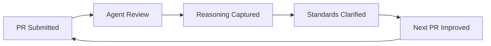

# The Quiet Revolution: How Agent-Led PR Reviews Changed My Quality Feedback Loop

<!-- IMAGE PROMPT: Watercolor illustration, soft wet-on-wet washes, visible paper texture, warm muted tones, loose brushwork. A girl with pink hair stands before a tall wall of colorful Post-it notes and printed code review comments, studying them thoughtfully with a magnifying glass in hand. Morning Pacific Northwest light filters through a tall window behind her. Some notes are green (approved), some amber (needs discussion), some are covered in dense handwriting. The overall feeling is of discovery rather than overwhelm. -->


*The first time an agent actually told me why it was approving my PR, I stopped and read the comment twice. Not because it was wrong. Because nothing like it had happened before.*

I want to be transparent about something before I get into this: I spent years working in codebases where the review culture was, charitably, "inconsistent." Some PRs got thorough, constructive feedback. Most got "LGTM." A few got feedback that was, let's say, delivered with more passion than precision — all caps, exclamation points, the whole show. What I almost never got was a clear statement of what the reviewer had actually looked at, what standards they applied, and why the PR was or wasn't meeting them.

When I started working with agent-led PR reviews — where an AI agent is the primary reviewer, not just a linter or a spell-checker — I expected something in between. Maybe a more consistent version of what I already knew. What I actually got was qualitatively different enough that I've been thinking about it ever since.

This post is my attempt to work out why.

Here's what I discovered: agent-led PR reviews don't just add consistency to code review. They transform what code review is *for*. The review stops being a gate and starts being a knowledge system. The PR description stops being a formality and becomes a canonical contract. The reviewer's comments stop being ephemeral opinions and start being durable records of reasoning. And the whole feedback loop tightens in a way that I hadn't anticipated and still find genuinely surprising.

I'm going to walk through all of it. The wins, the places where humans still have the edge, and the parts that took me a while to understand.

---

## The "LGTM" Problem Was Bigger Than I Thought

I want to start here because this is the real origin of everything that follows, and I think it's easy to underestimate how much damage "LGTM" culture actually causes — not in the obvious, catastrophic way, but in a slow, quiet, information-drain kind of way.

Consider a scenario I lived through more times than I'd like to count. You write a PR. It's a meaningful change — maybe a refactor of a service layer, or a translation of internal source comments into public documentation. You write a description, link to the ticket, and request review from whoever is on the rota. A few hours later — or a few days later if you're unlucky — you get a notification: "Approved." Two letters. No comment about what they looked at. No indication that they ran the code, or reviewed the tests, or even understood the domain. Just: good to go.

And here's the part that people don't talk about enough: if you're not the subject-matter expert on the underlying system you're changing, "LGTM" isn't just unsatisfying — it's actively useless. You needed to know what the reviewer checked. You needed to know whether they caught the edge case you were worried about. You needed to know whether your interpretation of the spec was correct. What you got was a green checkmark.

There's a related problem that goes the other direction. Sometimes the review isn't "LGTM" — it's pointed. Strong language. An implicit (or explicit) "why did you do it this way" delivered in a tone that doesn't leave much room for discussion. This kind of feedback carries the same information problem as "LGTM," just with more heat. You learn that something was wrong, but you don't necessarily learn why, or what the right approach looks like, or how to do it differently next time. You learn to feel bad. That's not the same as learning.

<!-- IMAGE PROMPT: Watercolor illustration, soft wet-on-wet washes, visible paper texture, warm muted tones, loose brushwork. Two contrasting scenes split by a diagonal wash. Left: chaotic, crumpled papers, a stressed figure in yellow at a desk surrounded by red-stamped "LGTM!" notes and question marks, foggy atmosphere. Right: calm, organized workspace where the pink-haired girl reads structured feedback cards pinned neatly to a corkboard, morning light, calm blues and greens. -->


*Before agent reviews, feedback was either a green stamp or a heat storm — rarely the clear, reasoned signal in between.*

I think about it like driving along the coast of Bellingham Bay on a foggy morning. You know the lighthouse is out there. You know the channel exists. But the fog means you're navigating on memory and guesswork rather than real-time signal. The lighthouse doesn't stop existing because you can't see it — but you also can't use information you can't perceive.

"LGTM" is that fog. The reviewer may have looked at everything. They may have caught every subtle issue and decided everything was fine. But you don't know that. You can't use their reasoning because they didn't share it. And the next time you write a PR like this one, you're still navigating by memory. The fog doesn't lift.

---

## A Different Kind of Reviewer Shows Up

My first real encounter with an agent-led PR review came through GitHub Copilot's code review functionality, and I want to be honest about my initial skepticism. I expected it to be a fancier linter — something that would flag unused imports, suggest slightly better variable names, and helpfully remind me to add comments to my public functions.

That's not what happened.

The agent left a comment that was, in structure, something like this:

> I reviewed the changes to the documentation pipeline. The PR description states the goal as translating internal API comment blocks into user-facing documentation. I verified that the three modified files match the source comments linked in the description. The translation is accurate and the format follows the existing documentation conventions.
>
> One question: the source comment in `service.ts` line 47 mentions a rate-limiting behavior that doesn't appear in the translated documentation. Is this intentional — perhaps considered an implementation detail rather than user-facing? If it should be documented, I'd suggest adding a note in the "Limitations" section.

That was it. Two paragraphs. No drama. No "LGTM." But also — and this is the part that stopped me — it told me exactly what it looked at, what it checked against, and what it found. It raised one precise question. And it framed that question as a genuine inquiry rather than a criticism.

I found myself actually wanting to answer the question. Not defensively. Just... it was a real question worth answering.

Here's what I discovered after that first review: the information content of a well-reasoned agent review is substantially higher than most human reviews I'd received. Not because the agent is smarter than a human reviewer. But because the agent is structurally more consistent about *externalizing its reasoning*. It doesn't assume you can infer why it approved or rejected. It tells you.

That difference compounds over time in ways I didn't anticipate until I'd been working with it for a while.

---

## The PR Description Becomes a Contract

One of the first things I changed after starting to work with agent-led reviews was how I write PR descriptions. This wasn't a conscious decision at first — it evolved through trial and error.

Here's the thing about agent reviews: the quality of the review scales directly with the quality of the information you give the reviewer. This is also true of human reviews, but human reviewers will often fill in the gaps with assumptions, prior knowledge, or a quick Teams message. Agents work with what's in front of them. If you give them a PR description that says "updated the docs," they'll review what they can see. If you give them a PR description that explains the goal, the constraints, the source material, and the expected outcome, they can review against all of that.

This forced me to think about what a PR description is actually *for*.

My previous mental model was something like: a PR description is a summary for the reviewer so they know roughly what to expect. A good description, in that model, is just more detailed. More context. Maybe a link to the ticket.

My current mental model is different: a PR description is a goal statement, a context package, and a contract. It defines what "done" looks like. It defines the scope of review. It makes explicit the assumptions the author is making, the source of truth they're working from, and what they want the reviewer to evaluate.

When I'm working on a documentation PR — where I'm translating source code comments or architecture notes into public-facing content — I now include in the description:

- The explicit goal: "This PR translates the internal API annotations in `service.ts` into user-facing documentation in `docs/api.md`."
- The source of truth: "Source annotations are linked here: [link]. The documentation standard we're targeting is [link or quoted excerpt]."
- The scope boundary: "I am NOT documenting internal error codes or rate-limiting internals, which are covered in the internal runbook."
- The open questions: "I'm uncertain about the correct terminology for the authentication flow — I've used 'token exchange' but the source calls it both 'token exchange' and 'credential refresh.' What's preferred?"

When the agent reviews that PR, it has everything it needs to do a meaningful review. It can check the translation against the source. It can evaluate whether the scope boundary is honored. It can engage with the open question. And when it approves — or raises concerns — it can explain why, because it has a clear contract to reason against.

Here's what a PR description that functions as a contract looks like in practice:

```markdown
## Goal

Translate internal API annotations from `src/services/auth-service.ts` into user-facing
documentation at `docs/api/authentication.md`.

## Source of truth

- Internal annotations: `src/services/auth-service.ts` lines 45–120
- Target format: existing pattern in `docs/api/storage.md`
- Relevant spec: Auth Flow Design doc (internal link)

## Scope

**In scope:**
- Public authentication methods (login, logout, token refresh)
- Error codes returned to callers
- Rate limiting behavior for the public API

**Out of scope:**
- Internal token storage implementation
- Session management internals
- Admin-only endpoints

## Open questions for reviewer

1. Should the "token refresh" method document the 15-second retry window, or is
   that considered an internal implementation detail?
2. The existing `storage.md` uses the phrase "connection handle" but the auth
   service uses "session token." Should I align the terminology?

## Files changed

- `docs/api/authentication.md` — new file
- `docs/api/toc.json` — added entry
```

This description takes maybe ten minutes to write. What it returns is a review that can actually evaluate the translation, raise the right questions, and document its reasoning against a clear contract. That's a good trade.

<!-- IMAGE PROMPT: Watercolor illustration, soft wet-on-wet washes, visible paper texture, warm muted tones, loose brushwork. The pink-haired girl at a wooden desk, writing on large paper that unfurls like a scroll. On the scroll are structured sections with headers and bullet points, glowing softly. Through the window, Pacific Northwest cedar trees in morning mist. The feeling is of careful, deliberate craftsmanship. -->


*When you write the PR description for a thoughtful reader — not a rubber stamp — the document becomes the first act of review.*

There's a second-order effect here that I find genuinely interesting. Writing a PR description at this level of detail is, itself, a form of self-review. In drafting the scope boundary, I've often noticed that something I'd planned to include was actually out of scope for this PR. In listing the open questions, I've sometimes answered them myself before the reviewer had a chance. The description-writing forces clarity that the review then validates.

Writing for a thoughtful reader changes how you think about what you're doing. The rubber-stamp model lets you be vague because the reviewer will fill in the gaps. The contract model requires precision because the reviewer will hold you to it.

---

## Here's What I Discovered: The Reasoning Chain

I want to spend some time on what a well-reasoned agent review actually looks like, because I think the gap between "automated review comment" and "reasoning-rich review comment" is larger than it sounds.

An automated linter comment looks like this:

```
Line 47: Missing semicolon.
Line 89: Unused variable 'tempData'.
Line 102: Function exceeds 50-line limit.
```

Useful. Mechanically correct. Not reasoning — just rule application.

An agent-led review comment with reasoning looks like this:

> **Authentication Flow Translation — Review**
>
> I reviewed the translation of `auth-service.ts` annotations into `docs/api/authentication.md`.
>
> **What I checked:**
> - Compared each documented method against its source annotation
> - Verified error codes match the public-facing enum values
> - Checked format consistency against `docs/api/storage.md`
>
> **What I found:**
> The translation is accurate and the format is consistent. The scope boundary you defined
> is honored — internal token storage is not documented here.
>
> **On your open questions:**
>
> 1. *Token refresh retry window:* The 15-second window is referenced in the public API
>    spec, so I'd consider it in scope for documentation. Users who are building retry
>    logic need this. I'd suggest a note in the "Rate Limits" section.
>
> 2. *Terminology alignment:* The auth service is the newer of the two — "session token"
>    is likely the forward direction. Worth noting in a comment that storage.md should
>    be updated in a follow-on PR to align.
>
> **Overall:** Approved. The translation meets the stated goal and the scope is well-defined.

That comment is, at minimum, five times the information content of "LGTM." It tells me:
- What the reviewer looked at
- What they checked against
- What they found
- How they reasoned through my open questions
- Why they approved

Every one of those five things is useful. Every one of them was absent from most reviews I'd received in my career before this.

### The Reviewer Brings Their Own Standards

One thing I had to get comfortable with: the agent reviewer might come from a different part of the codebase, a different team's standards, or a different domain entirely. This is especially true when the reviewer is configured to apply the standards of a specific content area or quality framework.

At first, this felt uncomfortable. "Who configured this reviewer? What standards are they applying? Are these my standards?"

Here's what I discovered: it doesn't actually matter. When the reviewer explicitly states the standards they're applying — "I'm checking this against the existing documentation format in `storage.md`" or "I'm evaluating the error codes against the public-facing enum" — you have enough information to engage with their reasoning. You can agree or disagree. You can say "that standard doesn't apply here because..." and have a real conversation about it.

The explicitness of the reasoning is what makes this possible. A reviewer who says "this doesn't meet our standards" without saying what standards, or how the PR fell short, gives you nothing to work with. A reviewer who says "this doesn't meet the format in `storage.md` because X, Y, Z" gives you a specific, actionable thing to respond to.

And when the reviewer comes from a completely different part of the organization — when they're a domain specialist who doesn't know your codebase but knows the standards deeply — their explicit reasoning becomes doubly valuable. They're not just checking your work. They're showing you what their domain looks like from the inside.

---

## The Feedback Loop That Didn't Exist Before

Here's the thing that surprised me most, and that I think is the most consequential long-term change: the feedback loop.

Before agent-led reviews, the feedback I received on a PR existed in roughly three states:

1. **No feedback.** "LGTM." I had no idea what the reviewer checked or how the PR met or didn't meet quality standards. The next PR I wrote started from scratch.

2. **Inconsistent feedback.** One reviewer cared deeply about test coverage. Another cared about naming conventions. A third would only engage with architecture decisions. Feedback was a function of who reviewed, not what standards existed.

3. **Heated feedback.** Occasionally feedback arrived with emotional charge — frustration, strong opinions, implied or explicit criticism of past decisions. This was occasionally useful and often not, because emotional charge frequently occludes signal.

In none of these states did feedback from one PR improve the starting condition for the next PR in any systematic way. You might learn something. You might not. It depended on whether the feedback was actionable and whether you retained it.

Agent-led reviews create a different loop:



*The feedback loop tightens over time. Each review's reasoning teaches the system — and the author — what "good" looks like for the next PR.*

The key mechanism is the captured reasoning. When the agent explains why it approved, flagged, or questioned something, that reasoning becomes part of the persistent record. The *next time* I write a similar PR, I can look at what was flagged last time. I can see what the reviewer considered in scope and out of scope. I can pre-answer the questions I know will come up.

More practically: the agent itself can be configured to learn from its own prior reviews. If I include prior review feedback in the reviewer's context window, the next review starts from a higher baseline. The reviewer knows what I've already addressed. The reviewer knows what standards we've already agreed on. The conversation picks up where it left off rather than starting from zero every time.

Before agent-led reviews, this kind of accumulating knowledge existed only in the heads of long-tenured team members. It was real but inaccessible — tribal knowledge that you acquired by being in the right meetings, on the right threads, or by asking the right people the right questions. Agent-led reviews don't eliminate the need for domain expertise. But they do make the application of standards visible and repeatable in a way that tribal knowledge never was.

### The Compounding Effect

I want to be specific about what "compounding" looks like in practice, because I think it's easy to hear "the feedback loop improves over time" and nod along without really internalizing what that means.

Here's a concrete example. Six months ago, I was writing documentation PRs where I consistently under-specified the scope boundary. I'd say "documenting the auth service" without defining which parts of the auth service were in scope. Agent reviews would consistently ask: "Is the rate-limiting behavior in scope here?" Because this question appeared in three consecutive reviews, I added a scope section to my PR description template. The question stopped appearing. Not because the reviewer stopped caring about scope — because I started defining scope before the reviewer had to ask.

That's the compounding effect. The first review surfaces a gap. The second review confirms it's a pattern. By the third review, you've internalized the standard and it no longer shows up as a gap. Your starting point has permanently moved.

Before agent-led reviews, this kind of compounding happened too — but only if you had a consistent reviewer who was paying close enough attention to notice patterns across your PRs, who was willing to name those patterns explicitly, and who did so in a way you could hear and act on. That's a lot of conditions. In practice, it was rare.

---

## Professional by Default

I want to spend time on tone, because I think it's systematically undervalued in discussions about code review culture. We talk a lot about what feedback should contain. We talk less about how it should be delivered. And the "how" matters more than most people admit.

Here's my honest experience: some of the most technically accurate feedback I've received in my career was delivered in ways that made it hard to hear. Not because I was being defensive. Because the delivery carried emotional charge that got in the way of the signal. All-caps emphasis. Exclamation points. Phrasings that implied I should have known better. These things aren't neutral. They activate a defensive response — in me and in most people — that interferes with the actual information transfer.

Agent reviews are, by default, professional and impersonal. Not cold. Not bureaucratic. Just... not personal. The agent doesn't have a bad morning. It doesn't get frustrated with the third documentation PR in a row that forgets to include the scope section. It doesn't have strong feelings about your choice of variable names that spill over into how it phrases its comments.

This consistency creates something I've started to think of as psychological safety in the review process. Not the big kind of psychological safety that org-culture consultants talk about — the feeling that it's safe to take risks, to be wrong, to speak up. More specific than that. The safety to read the review comments without bracing for impact. The safety to take the feedback at face value rather than parsing it for embedded emotion.

When feedback is impersonal, you can engage with it on its merits. When it's personal — when the phrasing tells you the reviewer is irritated, or rushed, or has a horse in this race — you spend cognitive resources managing the relationship rather than the feedback. That's a tax on every human review, and agent reviews eliminate it.

<!-- IMAGE PROMPT: Watercolor illustration, soft wet-on-wet washes, visible paper texture, warm muted tones, loose brushwork. The pink-haired girl sits cross-legged on a park bench in a lush Pacific Northwest garden, reading a clipboard of organized review notes. Her expression is calm and focused. Around her, other figures at desks show contrasting emotions — frustration, typing forcefully, crumpled papers. The pink-haired girl's space is serene, illuminated by diffuse green light through cedar branches. -->


*When feedback is professional by default, you can engage with the content rather than managing the relationship.*

### Agents Ask Questions Rather Than Making Assumptions

One more thing on tone: agent reviews, in my experience, tend to handle ambiguity by asking rather than assuming. A human reviewer who sees something they don't understand might mark it as wrong. They might leave a terse comment that implies the author made an error. They might approve with a silent mental note of "well, this is their call."

Agent reviews tend toward explicit inquiry. "I'm uncertain whether the rate-limiting behavior is intended to be documented here — can you confirm the scope intention?" That's different from "this doesn't belong here" or silent approval. It's an invitation to clarify, which is almost always the right response to genuine ambiguity.

This matters practically because documentation work — which is a lot of what I do — involves many legitimately ambiguous scope decisions. Whether a particular behavior is a user-facing feature or an implementation detail isn't always obvious from the source. Whether a particular error code should be documented for callers or hidden behind an opaque response is a real design question. Agents surface these questions. They don't resolve them unilaterally.

---

## Captured in Perpetuity

There's a dimension of agent-led PR reviews that I didn't appreciate until I found myself going back through old PRs looking for the reasoning behind a past decision. Let me describe what that experience looks like in the before-and-after.

**Before:** I'm looking at a documentation file that handles authentication. I see a note that says "token refresh is not documented here." I have no idea why. Was it intentional? Was it a mistake? Was it a scope decision that someone made deliberately, or was it just something that got missed? The PR that introduced this file is in the history. The description says "Add authentication docs." The review says "LGTM." I have nothing.

**After:** Same scenario. The PR is in the history. The description includes a scope section that says "internal token refresh timing is not documented here — this is implementation-specific behavior covered in the internal runbook." The review comment says "I confirmed the scope boundary is honored. The token refresh timing is not documented per the scope definition. This aligns with the existing pattern in storage.md." Now I know. Not only did someone make this decision deliberately — I know exactly what they were thinking, what they compared it against, and what they concluded.

That's not a minor difference. That's the difference between archaeology and documentation.

<!-- IMAGE PROMPT: Watercolor illustration, soft wet-on-wet washes, visible paper texture, warm muted tones, loose brushwork. The pink-haired girl standing in front of a glowing glass display case, like a museum exhibit. Inside the case, a PR review card is preserved and illuminated, surrounded by artifacts: a code snippet, a decision note, a timestamp. The light is amber and warm, like a fire or late afternoon sun. Outside the display case window, a winter scene — bare trees, snow on the Cascades in the distance. The feeling is of preservation and permanence. -->


*A year later, the PR is still there. The reasoning is still there. The "why" — the hardest thing to recover — is captured in the record.*

### What Gets Lost Over Time

Code comments change. Or rather — code gets refactored, and the comments that were accurate a year ago are now describing a function that no longer exists in the same form. Architecture diagrams drift. The diagram from eighteen months ago shows three services; you now have seven. The diagram is technically still there, but it's lying to you.

PR feedback is different because it's a snapshot in time. It doesn't drift. It captures the state of thinking at the moment the change was made. A PR from three years ago that says "we're not documenting this behavior because it's considered internal" is useful even if that decision has since been revisited — because it tells you that the decision was *made*, that someone was deliberate about it, and what the reasoning was at the time.

The "why" is the hardest thing to recover in any software system. Code tells you what. Tests tell you what was expected. Architecture documents tell you what the intended design was. Almost nothing tells you why a specific decision was made, at a specific moment, by a specific person, with specific constraints in mind.

Agent-led PR reviews, when they're doing their job, are capturing the "why" in a structured, queryable form. Not perfectly. Not always. But systematically, in a way that "LGTM" culture never did.

I think about this like the tidal records kept at the NOAA station on Bellingham Bay. The station doesn't tell you what the tide will do. It tells you what the tide has done — the exact measurements, hour by hour, for decades. That record is the foundation for every prediction, every dredging schedule, every coastal engineering decision that comes after. The record doesn't have opinions. It just has the data, accurate to when it was taken.

PR reasoning is that tidal record for your codebase. The agent doesn't know what decisions you'll make a year from now. But it's making sure that when you get there, you have the measurements.

---

## The Author Mindset Shift

I mentioned this briefly in the section on PR descriptions, but I want to return to it more directly because I think it's the most personal part of this whole change, and the hardest to quantify.

Before agent-led reviews, I wrote PRs for a rubber stamp. That's not a criticism of my past self — it was a rational response to the incentive structure. If most reviews are going to be "LGTM," then the marginal value of a detailed PR description is low. You might as well write just enough to remind yourself what you were doing, and a little more to give the reviewer a fighting chance.

When you know that the reviewer will read carefully, reason explicitly, and hold your scope definition to account — you write differently. Not more formally. More *deliberately*. You think about what the reviewer needs to know, rather than what you want to tell them. You think about the questions they'll ask, and you either answer them preemptively or you flag them explicitly. You think about the scope boundary before you're asked to defend it.

This is the mindset shift: from writing for a rubber stamp to writing for a thoughtful reader.

And here's the interesting thing — writing for a thoughtful reader makes you a better author, even before the review. Because a lot of the things a thoughtful reader would want to know are things you probably should have been thinking about anyway. The scope boundary. The source of truth. The open questions. These aren't bureaucratic overhead. They're the questions that determine whether the PR actually does what it's supposed to do.

<!-- IMAGE PROMPT: Watercolor illustration, soft wet-on-wet washes, visible paper texture, warm muted tones, loose brushwork. The pink-haired girl at a bright studio window overlooking Bellingham Bay, writing with a fountain pen in a large notebook. The notebook is open to a structured page — sections, bullet points, a small diagram. On the windowsill, a cup of tea steams. The bay is calm outside, a lighthouse visible in the middle distance. The feeling is of thoughtful, unhurried preparation. -->


*Writing for a thoughtful reader changes your relationship with your own work — you ask the questions before they're asked of you.*

### The Shared Language Between Author and Reviewer

There's a related benefit that I didn't expect: over time, working with the same reviewer configuration builds a shared vocabulary. Not just "use this term instead of that one." A shared understanding of what counts as in-scope documentation, what belongs in the limitations section versus the overview, what level of implementation detail is appropriate for different audiences.

This shared language is something you'd traditionally acquire by working closely with a human expert — by getting consistent feedback from the same person over many PRs, over a long period, until you internalized their standards. Most people don't have that. The expert who has the deep standards is often not the person reviewing your PRs. And if they are, they're reviewing many other PRs too, and consistency is a casualty of that workload.

Agent-led reviews give you something like that consistency at scale. The reviewer applies the same standards on your tenth PR as on your first. It doesn't forget what it decided on PR seven. It doesn't have an off day where it approves things it would normally flag.

This is not the same as having a wise mentor who knows your work deeply. I want to be careful not to oversell it. But it's a consistent source of standards application that most knowledge workers have never had access to, and the compounding effect of that consistency is real.

---

## My Perspective: What Still Doesn't Work

I've been arguing for the value of agent-led reviews for several thousand words now, and I want to make sure I'm being honest about the limitations. Because there are real ones.

**The agent doesn't know your team's politics.** Sometimes a PR decision involves factors that aren't in the code or the description — a past architectural mistake that's being incrementally unwound, a stakeholder preference that isn't documented, a known technical debt that everyone has tacitly agreed to live with. Human reviewers who are embedded in the team know these things. Agents work with what's visible. If the invisible context is what makes a decision make sense, the agent will flag the decision as questionable, and it won't necessarily be wrong to do so — but the reasoning will be incomplete.

**The agent doesn't replace the domain expert.** If you're writing code that has safety implications, security requirements, or domain-specific correctness criteria that aren't captured in the review configuration, the agent isn't going to catch those gaps. An agent reviewing a cryptographic implementation doesn't know what it doesn't know about cryptography. A human expert does.

**The feedback loop only works if you build it.** The compounding effect I described — where each review improves the starting point for the next PR — doesn't happen automatically. You have to put the prior feedback into the context. You have to update your PR description templates. You have to review the review. The agent creates the conditions for the feedback loop. You have to run it.

**Some things need human conversation.** There are review conversations that aren't really about the code. They're about priorities, about direction, about what we're trying to do and whether this PR is doing it. Those conversations require a human. They require the kind of implicit shared understanding and real-time back-and-forth that a review comment thread, however thorough, can't fully replicate.

My perspective is that agent-led reviews don't replace the high-value human review conversations. They replace the low-value ones — the rubber stamps, the inconsistently-applied standards, the feedback that should have been there but wasn't. That's a good trade. It frees human reviewers to engage with the genuinely complex and contextual questions, because the mechanical and standards-based review work is covered.

But I want to be clear: it's a complement, not a replacement. The teams I see getting the most value from agent-led reviews are the ones that use them to elevate human review time, not eliminate it.

---

## Reflection: One Year of Captured "Why"

Here's the part I think about most.

If I go back through the PRs from the last year — the ones where agent reviews were part of the workflow — I can reconstruct the reasoning behind almost every significant decision. I know why the authentication documentation is scoped the way it is. I know why the terminology settled on "session token" instead of "connection handle." I know which rate-limiting behaviors were considered user-facing and which were treated as internal. I know when those decisions were made and what the alternatives were.

That's not a small thing. It's closer to having a design history than to having a git log.

The git log tells me what changed. The PR descriptions tell me what was intended. The agent review comments tell me what was evaluated, what standards applied, what questions were asked and how they were resolved. Together, those three layers give me something close to a complete picture of the thinking behind the codebase at any moment in its history.

I've been a developer long enough to know how rare that is. Most codebases are archaeological sites. You dig down and find layers you can't date and decisions you can't explain. You learn to reverse-engineer intent from behavior, which is slow and unreliable and frequently wrong.

A codebase with good PR hygiene — good descriptions, good reviews, captured reasoning — is something different. It's legible. Not just to you, right now, but to anyone who comes after you. The institutional knowledge stops being locked in people's heads and starts being accessible in the record.

Agent-led reviews didn't create this possibility. But they made it systematic. They made it the default rather than the exception. They made it something that happens every PR rather than on the rare occasions when someone had the time and clarity to write a thorough review.

<!-- IMAGE PROMPT: Watercolor illustration, soft wet-on-wet washes, visible paper texture, warm muted tones, loose brushwork. A wide, peaceful view of the Nooksack River valley at dusk, with the Cascade foothills in the background. In the foreground, the pink-haired girl stands at the water's edge holding a glowing lantern. The water reflects both the lantern light and the last of the sunset. Carved into a nearby wooden post is a small plaque with a date and a few words — the feeling of something marked, preserved, permanent. The mood is contemplative and warm. -->


*The reasoning, once captured, doesn't drift. It stays exactly where you left it — a marker in the record that future you will actually be able to read.*

---

## Next Steps: How I'm Changing My Workflow

All of this reflection has produced some concrete changes in how I work, and I'll share them here in case they're useful as a starting point.

**The PR description template.** I've built a description template that includes the goal, the source of truth, the scope definition (in and out), and a section for open questions. I use it for every meaningful PR. It takes ten minutes and returns consistent, higher-quality reviews. Here's the rough shape:

```markdown
## Goal
[One or two sentences: what does this PR accomplish?]

## Source of truth
[Links or quotes from the canonical source for this change]

## Scope

**In scope:**
- [Explicit list]

**Out of scope:**
- [Explicit list — this is the one most people skip]

## Open questions for reviewer
- [Any genuine ambiguities you want the reviewer to engage with]

## Files changed
- [Brief description of each file's role in the PR]
```

**The prior-review context injection.** For significant projects where I'm writing a series of related PRs, I include a section in the description that summarizes the review decisions from previous PRs: "In the previous PR, we agreed that implementation-specific error codes would not be documented here. This PR follows the same convention." This gives the reviewer context about decisions already made, prevents re-litigating settled questions, and makes the compounding effect of the feedback loop explicit.

**The review digest.** When a PR gets a substantive agent review, I take five minutes after it's merged to summarize the key decisions in a running document for the project. Not every comment — just the ones that represent settled standards or significant choices. This becomes the input for future PR descriptions and future reviewer configurations.

**Trusting the professional tone.** I've learned to read agent review comments at face value rather than searching them for subtext. When the agent asks a question, it's asking because it's genuinely uncertain, not because it's implying I made a mistake. When it flags something, it's flagging it against a stated standard, not passing judgment. This sounds simple, but it took a while to fully internalize after years of reading human review comments that had layers.

If you're just starting to work with agent-led reviews, my suggestion is: invest in the PR description first. The quality of the review you get scales almost linearly with the quality of the information you provide. Start there, and the rest follows.

---

## Closing: The Fog Lifts

I started this post with the image of driving along Bellingham Bay in the fog — knowing the lighthouse is out there but unable to use its signal. That fog was what most PR review culture felt like to me for a long time. The expertise existed. The standards existed. But they weren't in a form you could work with, and they weren't reliably shared.

Agent-led reviews don't claim to be more expert than the human reviewers they're working alongside. They're not. They don't have the deep domain knowledge, the organizational context, or the judgment that comes from years of experience with a specific codebase. What they do have is consistency, explicit reasoning, and a commitment to capturing the "why" in a form that persists.

That turns out to be worth more than I expected.

The fog doesn't completely lift. But the lighthouse is legible now. The signal is there. And twelve months from now, when I come back to a decision I made today, I'll be able to read exactly why I made it, what standards I held it against, and what questions I was trying to answer.

That's not nothing. That's, actually, quite a lot.

*How are you using agent-led reviews in your workflow? I'd genuinely like to know — especially if you've found patterns for the pieces I've described as still not working. You can find me on GitHub at [dfberry](https://github.com/dfberry).*
