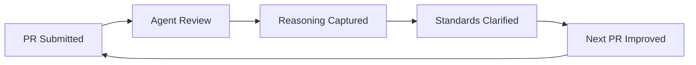

# My Squad's PR Reviews: What Sam, Statler, and Scooter Actually Catch

<!-- IMAGE PROMPT: Watercolor illustration, soft wet-on-wet washes, visible paper texture, warm muted tones, loose brushwork. A girl with pink hair stands before a tall wall of colorful Post-it notes and printed code review comments, studying them thoughtfully with a magnifying glass in hand. Morning Pacific Northwest light filters through a tall window behind her. Some notes are green (approved), some amber (needs discussion), some are covered in dense handwriting. The overall feeling is of discovery rather than overwhelm. -->


*The first time an agent review came back with actual reasoning — here's what I checked, here's what I think, here's why — I realized I'd never gotten that from a human reviewer.*

PR #8648 had 14 review comments across 3 files. Statler found them.

I was documenting the tool server's database tools — translating entries from `schema.json` into parameter tables for the documentation platform article. Standard work. I've done around 40 of these tool articles at this point. I submitted the PR and Statler, my adversarial Squad agent, came back with this:

> **Statler — Adversarial Review**
>
> The `subscription` parameter appears in your parameter table for `db_server_list`. The database namespace tools receive subscription via the platform's ambient context — it shouldn't be listed as a required parameter because callers never pass it directly. Compare the pattern in `storage_account_list`: same tool family, no subscription in the table.
>
> This will confuse readers looking for what to actually pass.

That comment isn't "missing semicolon." It's a specific claim about a pattern across the database namespace, a comparison to another tool family, and a prediction about reader confusion. It was right about all three.

I fixed the table and replied: "Confirmed — subscription, resource-group, and devlang slug formatting follow the same ambient pattern across storage, database, and container apps. Adding to reviewer notes for the series." Sam (my fact-checking agent) verified the pattern against the upstream `schema.json`. The PR merged with one exchange and no ambiguity.

The same PR also came back with a second Statler flag I hadn't noticed at all: three of my seven Example sections used `node` as the devlang slug while the rest of the tool server documentation series uses `javascript`. It would have built fine. Readers filtering by language tab would have gotten partial results.

14 comments. 3 files. Every flag was right.

---

## Why "LGTM" Costs You More Than You Think

The obvious problem with "LGTM" is that it gives you nothing to work with. You don't know what the reviewer checked. You don't know whether they caught the edge case you were worried about. You don't know whether your interpretation was right.

The less obvious problem: it breaks the feedback loop going the other direction too. When you know most reviews will be "LGTM," you stop writing detailed PR descriptions. Why spend ten minutes on a scope definition if the reviewer isn't going to read it? So the description gets shorter, which makes future reviews even less useful, which makes future descriptions even shorter. I lived that loop for years. Writing documentation PRs for internal approval cycles where the reviewer was too stretched to engage — I'd get a green stamp or silence, and I'd move on without knowing if what I'd written was right or just unopposed.

The other failure mode is the pointed review delivered with heat. Strong language, implied criticism, "why did you do it this way" as an accusation rather than a question. That's not better than LGTM. You learn something is wrong without learning what right looks like. You learn to feel bad about the decision, which is not the same as learning to make a better one.

<!-- IMAGE PROMPT: Watercolor illustration, soft wet-on-wet washes, visible paper texture, warm muted tones, loose brushwork. Two contrasting scenes split by a diagonal wash. Left: chaotic, crumpled papers, a stressed figure in yellow at a desk surrounded by red-stamped "LGTM!" notes and question marks, foggy atmosphere. Right: calm, organized workspace where the pink-haired girl reads structured feedback cards pinned neatly to a corkboard, morning light, calm blues and greens. -->


*Before agent reviews, feedback was either a green stamp or a heat storm — rarely the clear, reasoned signal in between.*

The LGTM loop is self-reinforcing in a particularly bad way: you start writing worse descriptions because the feedback doesn't reward good ones. The description degrades. The reviewer has even less to work with. The review gets even more shallow. By the time you're four months into a project, you're getting one-word approvals on PRs with three-word descriptions.

Agent reviews break that loop because they respond to description quality directly. Write a vague scope section and you'll get flags that a precise scope would have answered up front. Write a detailed scope section and you'll get flags only on the things that weren't captured by the scope — the edge cases worth discussing. The quality of what you get back scales with the quality of what you put in. That creates the opposite incentive structure from the LGTM world.

What I wanted — and still want — is a reviewer who reads carefully, explains their reasoning, and raises questions rather than making accusations. That doesn't require AI. It requires time and consistency that most human reviewers, who are also doing their actual jobs, can't reliably provide at the PR-by-PR level. Sam, Statler, and Scooter have time. They're consistent. They read every line.

---

## What My Squad Actually Does in a PR Review

My review setup uses [Squad v0.9.4](https://github.com/bradygaster/squad) running on the Copilot CLI. Three agents run on documentation PRs:

**Sam** (Fact Checker) compares my claims against the source. For the tool server articles, that means checking parameter names, types, and descriptions against the upstream `schema.json`, and verifying that tool descriptions match the annotation text in the source repo.

Sam's output on a good PR is mostly confirmations: "6 of 7 tool descriptions match `schema.json` at commit `a4f9c31`." When something drifts, Sam calls it out specifically: "db_query — your description says 'executes a SQL query against a specified database' but the upstream annotation says 'runs an arbitrary SQL query.' 'Against a specified database' is an addition not in the source. Intentional clarification, or drift?"

That distinction — between style variance ("executes" vs "runs") and a substantive addition ("against a specified database") — is something Sam catches because it's doing a line-by-line comparison against a specific commit. A reviewer who knows the source well might catch it. A reviewer working from memory or from a general familiarity with the content area won't.

**Statler** (Adversarial) looks for what will confuse readers, break patterns, or create maintenance problems. Statler's value is in the cross-file, cross-PR pattern work. It's not checking one file against one source — it's checking whether this PR is internally consistent with the rest of the series.

On PR #8648, Statler caught both the subscription parameter issue and the devlang slug inconsistency in a single pass. The subscription issue required knowing the pattern across the database and storage namespaces. The devlang inconsistency required knowing what I'd used in other articles in the same series. Both of those are things that require scope that extends beyond the current PR — which is exactly the scope Statler operates with.

On a recent platform skills article PR, Statler caught a parameter marked as "Required" in my table that the CLI JSON schema had as "Optional." I'd introduced the discrepancy by following the pattern from an older article rather than checking the current schema. Statler flagged it with: "Parameter `resource_group` is marked Required in your table but is Optional in the CLI JSON schema at the current version. The older article you may have referenced predates the schema change."

That's a specific flag with a specific reason and a specific call-out of where I probably went wrong. Without that flag, the article would have shipped with incorrect Required/Optional documentation. Sam wouldn't have caught it — Sam checks descriptions against annotations, not parameter status against schema. Statler caught it because Statler is checking different things.

**Scooter** (Quality) checks structure: do headings follow the expected pattern, is the frontmatter complete, do parameter tables have the right columns, are there missing Example sections. For the tool server documentation series, that means verifying every tool article has a Description, Parameters table, and Example section in the right order — and that the frontmatter fields are all populated with the right format.

Scooter catches things like: a missing `updated` timestamp in frontmatter, a Parameters table that has the right columns but in the wrong order, an Example section that exists but is empty because I forgot to fill in the sample call. These are the structural checks I'd run manually if I remembered to. Scooter runs them every time.

The sequence matters: Sam goes first (verify facts), Statler second (find problems), Scooter last (check structure). If Sam finds something substantively wrong with my descriptions — a mismatch against the upstream source — I want to know that before Scooter tells me the formatting is fine. The facts come first. If Sam fails, the others still run. I want all the feedback, not a fail-fast stop on the first error category.

For content areas outside my direct expertise, I configure the reviewer with patterns from domain-specific feedback I've received. The database tool articles got a reviewer trained on the domain expert's published review patterns from the database article series — things like the exact format expected for the parameters table, which columns are required, and what "Required" vs "Optional" should actually mean for CLI parameters. The agent applies those standards consistently across every PR, which is something the domain expert can't do while also managing their own workload.

---

## Write the PR Description as a Contract

The quality of the review scales with the quality of the information in the description. Human reviewers fill in gaps with assumptions and prior knowledge. Sam and Statler work with what's in front of them.

This forced me to rethink what a PR description is actually for.

My old mental model: a PR description is a summary so the reviewer knows roughly what to expect. Good description means more detail, maybe a link to the ticket.

My current model: a PR description is a goal statement and a scope contract. It defines what "done" looks like, what the reviewer should evaluate, and what the author is explicitly not doing. Writing it is the first act of review.

The shift matters because when you're writing for a thoughtful reader instead of a rubber stamp, you think about the work differently. You ask the questions that the reviewer will ask before the reviewer asks them. You find the edge cases you were going to leave implicit and make them explicit. You notice the scope you've drifted into that isn't in the goal statement.

For tool server articles — where I'm translating entries from `schema.json` into structured documentation — I now include:

- **Goal**: which tools this PR covers, from which source file, to which output file
- **Source of truth**: a link to the specific commit in the upstream repo I'm translating from — not "the main branch," the specific commit, so Sam can check the exact same source
- **Scope**: which tools are covered, and explicitly which are not, with reasons for each exclusion
- **Open questions**: things I'm genuinely uncertain about, asked directly to the reviewer
- **Reviewer notes**: the settled decisions from prior PRs in this series — the rules I've already learned

When Statler reviews that PR, it checks the translation against the stated source and compares patterns against the stated context. When Sam reviews it, it compares my descriptions against the annotation text at the specific commit. When I have a real question — like whether `subscription` belongs in the params table for this tool family — Sam looks at the pattern across the namespace and answers it rather than applying a default.

<!-- IMAGE PROMPT: Watercolor illustration, soft wet-on-wet washes, visible paper texture, warm muted tones, loose brushwork. The pink-haired girl at a wooden desk, writing on large paper that unfurls like a scroll. On the scroll are structured sections with headers and bullet points, glowing softly. Through the window, Pacific Northwest cedar trees in morning mist. The feeling is of careful, deliberate craftsmanship. -->


*When you write the PR description for a thoughtful reader — not a rubber stamp — the document becomes the first act of review.*

The "Out of scope" section is the one I skipped the most when I first started writing this way, and it's the one that does the most work. Stating what you're deliberately not doing forces you to make a decision about it rather than leaving it implicit. Three times in the last month, writing out what's excluded, I noticed I'd edited files that weren't in my stated goal. Two were legitimate scope expansions I should have documented. One was an accidental change from an earlier edit session that I reverted before submitting. The description-writing caught them before review did.

The "Open questions" section changed my relationship with uncertainty in the work. Before this format, I'd make judgment calls on the ambiguous cases and hope the reviewer agreed. With a question in the description, I get a clear answer either way: Sam either confirms the pattern or flags the deviation. The exchange closes rather than leaving both sides guessing.

---

## What Sam and Statler's Reviews on PR #8648 Actually Said

For context: PR #8648 covered the database tool documentation. 7 tools across the database namespace, each needing a Description, Parameters table, and Example section. Source was the database namespace block in `schema.json` plus the tool-specific annotations in the upstream repo.

Sam's review (fact-check pass):

> **Sam — Fact Check**
>
> I compared all 7 tool descriptions against `schema.json` (commit `a4f9c31`). Six match exactly. One diverges: `db_query` — your description says "executes a SQL query against a specified database" but the upstream annotation says "runs an arbitrary SQL query." "Executes" vs "runs" is a style call, but "against a specified database" is an addition not in the source. Intentional clarification, or drift?
>
> Parameters tables are accurate with the exception flagged by Statler. Example sections are present for all 7 tools.

Two things to notice: Sam cited the specific commit it compared against (`a4f9c31`), and it separated minor style variance from a substantive addition. "Against a specified database" is something I added that's not in the source. Sam is right to flag it as a question rather than a correction, because it might be a legitimate clarification for readers. The phrasing "runs an arbitrary SQL query" is technically accurate but not particularly helpful to someone trying to understand when to use this tool versus `nosql_query`.

I answered: yes, intentional — the clarification stays. Sam closed the question with: "Confirmed intentional clarification. Noted for future `db_*` tool descriptions in this series."

That last line is Statler's territory in terms of the thing it's tracking — consistency across the series — but Sam's acknowledgment that it's noted means the same question won't come up as drift on the next `db_*` PR. The agents coordinate.

Statler's review ran against a different standard:

> **Statler — Adversarial Review**
>
> The `subscription` parameter appears in your parameter table for `db_server_list`. The database namespace tools receive subscription via the platform's ambient context — it shouldn't be listed as a required parameter because callers never pass it directly. Compare the pattern in `storage_account_list`: same tool family, no subscription in the table. This will confuse readers looking for what to actually pass.
>
> Secondary: three of the seven Example sections use `node` as the devlang slug. Your other articles in this series use `javascript`. Pick one — readers filtering by language tab will get partial results otherwise.

I'd completely missed the devlang inconsistency. I'd copied an example from a different article in the series that used `node` and didn't notice it was inconsistent. Statler caught it in a single pass because Statler has context on the full series, not just this PR.

A linter doesn't catch that — it's not a syntax error, it's a cross-article consistency issue. A "LGTM" definitely doesn't. A human reviewer working through 14 articles in a sprint might not, because the inconsistency spans files rather than existing within one file.

The subscription issue was more fundamental. I'd included `subscription` because I saw it in other parameter tables in the database namespace — ones that weren't up to date. Statler caught it because Statler knows the pattern, not just the precedent.

That's 14 comments across 3 files. Every flag was something that needed to change.

---

## How the Feedback Compounds

The subscription parameter question came up in three consecutive database tool PRs before I added a rule for it. Not because I forgot — I genuinely wasn't sure whether the pattern I was seeing was intentional or a gap in the existing documentation. After the third flag, Sam verified the pattern across the full database namespace and I added a rule to my reviewer notes: "subscription, resource-group, and tenant-id are ambient context params in the database and storage namespaces — do not include in parameter tables."

That note is now in my PR description template for the tool server documentation series. Statler stops flagging it. Sam stops verifying it. The question is answered and closed.



*Each review's reasoning teaches me — and the template — what "good" looks like for the next PR.*

The loop works because the reasoning is preserved. When Statler flags something and I close the question, I can look back at that exchange and extract the rule precisely rather than paraphrasing from memory. The reviewer notes in my template are direct quotes or close paraphrases of resolved flags, not reconstructions. That matters because the precision of the rule determines whether Statler will keep flagging edge cases of the same issue.

The maintenance cost is real. The agents don't automatically update my template. Roughly every five PRs, I spend fifteen minutes reading through the flags I've closed, identifying the ones that represent settled rules, and adding them to the reviewer notes section of the template. If I skip it for two or three weeks, the same flags start showing up again on new PRs — not because Statler forgot, but because I haven't incorporated the lesson.

It adds up in the right direction. Before I had the subscription rule documented, I spent time on every database tools PR second-guessing whether I had it right. After? It's a known rule that gets verified automatically. That fifteen-minute update bought back roughly two hours of per-PR uncertainty across the series. Not profound math, but it compounds.

By the time I'd completed ten database tool PRs with this loop running, my reviewer notes for the series were substantial:

> subscription, resource-group, and tenant-id are ambient context params in the database and storage namespaces — do not include in parameter tables.
>
> Devlang slug is `javascript` not `node` for all JS/TS examples in this series.
>
> Tool descriptions should match upstream annotation text exactly; any additions or clarifications require an open question to the reviewer.
>
> "Required" and "Optional" status must match the CLI JSON schema value, not the pattern from adjacent namespace tools.
>
> Example sections use the published production endpoint format, not the development environment format.

Five rules. Each one came from a Statler or Sam flag on a specific PR. None of them are things I would have invented independently — they came from the review process surfacing where my defaults diverged from the established patterns.

The agents don't catch conceptual errors. If I've misunderstood what a tool does at the API level, Sam will verify that my description accurately matches my misunderstanding. Sam checks my text against the annotation — if the annotation is wrong, Sam confirms that my wrong description is consistent. That's a real limitation and it's why human review doesn't disappear from the workflow. Agent reviews handle pattern consistency and fact-checking against documented sources. Human review handles the gap between what's documented and what's operationally true.

---

## Writing for a Thoughtful Reviewer Changes How You Think

<!-- IMAGE PROMPT: Watercolor illustration, soft wet-on-wet washes, visible paper texture, warm muted tones, loose brushwork. The pink-haired girl at a bright studio window overlooking Bellingham Bay, writing with a fountain pen in a large notebook. The notebook is open to a structured page — sections, bullet points, a small diagram. On the windowsill, a cup of tea steams. The bay is calm outside, a lighthouse visible in the middle distance. The feeling is of thoughtful, unhurried preparation. -->


*Writing for a thoughtful reader changes your relationship with your own work — you ask the questions before they're asked of you.*

Before agent reviews, I wrote PRs for a rubber stamp. That's a rational response to the environment — if most reviews are "LGTM," a detailed description doesn't get you much return. You write just enough to remind yourself what you were doing.

When you know Sam will compare your descriptions against `schema.json` at commit `a4f9c31`, you check that comparison yourself first. Not every time — that would defeat the purpose — but it shifts what you pay attention to while you write. You think about what the reviewer needs to know rather than what you want to tell them. That's a different question.

The scope boundary isn't bureaucratic overhead. It's the question that determines whether the PR does what it's supposed to do. Spelling it out before submitting means catching it yourself rather than in a review comment. Stating what you're not doing means making a conscious decision about it rather than leaving it implicit. Both of those move the thinking forward in a way that writing "covered the db namespace tools" doesn't.

There's something that builds over the months too. Working with the same reviewer configuration across the tool server documentation series has created a shared vocabulary — not just terminology, but a shared understanding of what counts as an in-scope parameter, what belongs in a Parameters table versus an Example section, when "Required" means required by the tool versus required by the namespace context. That vocabulary lives in the reviewer notes in my template. A new article starts from the accumulated decisions of the previous forty, not from zero.

You'd traditionally build that kind of shared vocabulary by working closely with a human expert over many PRs, until you internalized their standards. Most people don't have consistent access to that. The expert who has the deep context isn't always reviewing your PRs. When they are, consistency is a casualty of a full workload. The same reviewer standards applied to every PR, with no variance based on who's available, builds the vocabulary faster than occasional thorough reviews from domain experts who are also managing six other priorities.

---

## Professional by Default

Some of the most technically accurate feedback I've gotten in my career was delivered in ways that made it hard to engage with. All-caps emphasis, phrasings that implied I should have known better, "why did you do it this way" as an accusation. That delivery competes with the information transfer. You spend effort managing your response to the tone instead of engaging with the substance.

Agent reviews are impersonal by default. Not cold — they engage with the content directly. But Statler doesn't get frustrated with the third consecutive PR that has the same devlang issue. Sam doesn't have strong opinions about "executes" vs "runs" that spill into how it phrases a flag. Scooter doesn't passively approve things because it's been a long week.

The practical effect: I read agent review comments at face value. When Statler raises an issue, it's because a pattern check fired. When Sam flags a divergence, it's because the source doesn't match. There's no subtext to parse. The only question is whether the flag is right. If yes, fix it. If no, explain why. That's the whole exchange.

Agents also ask rather than assert when something is genuinely ambiguous. A human reviewer who sees something they're uncertain about might mark it wrong, approve silently, or leave a vague comment. Sam says "is this intentional clarification or drift?" That's an invitation to confirm, not a verdict. For documentation work where many scope decisions are legitimately ambiguous — whether a behavior is user-facing or implementation-specific, whether a parameter should be in the table or treated as ambient context — getting a question is almost always the more useful response.

When I'm overriding a flag deliberately — when I know the pattern diverges but I have a reason — I explain it in the PR description. Not for Sam or Statler, who will flag the deviation regardless. For the humans who read the PR history later and need to know whether the exception was intentional and why it was made.

---

## What Actually Doesn't Work

Some things still need a person.

Sam doesn't catch conceptual errors against the truth. If a tool description in `schema.json` is misleading about what the tool actually does at runtime, Sam confirms that my documentation accurately matches the misleading description. It checks descriptions against the source — if the source is wrong, Sam's approval is not a useful signal about correctness. That requires someone who's actually used the tool and knows the gap between the annotation and the behavior.

The feedback loop only works if I maintain it. The agents don't update my template. That's a fifteen-minute task every few PRs, but it's manual and optional, and if I skip it the same flags come back. The system runs on the work I put into it.

Some conversations need to happen between people. When a PR decision involves content strategy — whether a new service gets its own article or folds into an existing one, whether a pattern I've established for the tool server series should apply to the platform skills articles — that's not a fact-check question or a pattern violation. It's a direction question. Sam and Statler can tell me whether a PR is consistent with what exists. They can't tell me whether what exists is the right structure going forward.

My rule of thumb: agent reviews on every documentation PR. Human review on anything involving a judgment call about scope, a new content pattern I haven't done before, or a tool area where I know I'm working outside my documented knowledge. The agent reviews handle the mechanical consistency work so the human review time goes to what actually needs human judgment. A PR that's already been through Sam and Statler arrives at human review with pattern and fact-check issues resolved. The human reviewer's attention goes to the parts that require their specific knowledge.

The agents also aren't a substitute for a domain expert on the first few PRs in a new content area. When I started the database tool articles, I didn't have enough context to write good reviewer notes — I didn't know what I didn't know. The first two or three PRs needed a human with database namespace knowledge to review, because Sam and Statler can only apply the patterns I've captured and I hadn't captured the important ones yet. The agent reviews got useful after I'd built the baseline.

---

## The Template I Actually Use Now

This is the PR description template I've built over roughly 60 documentation PRs in the last six months. Several iterations. This is the version I stopped changing.

```markdown
## Goal

[One or two sentences: what does this PR accomplish and which source does it translate from?]

## Source of truth

- Source file: [link to specific commit in upstream repo]
- Target format: [link to an existing article that matches the expected pattern]
- Reviewer notes: [settled decisions from prior PRs in this series, if any]

## Scope

**In scope:**
- [Specific tools, sections, or files covered]

**Out of scope:**
- [Things intentionally excluded — don't skip this section]

## Open questions for reviewer

- [Specific things I'm uncertain about, with enough context to actually answer them]

## Files changed

- `[filename]` — [one-line description of what changed and why]
```

The "Reviewer notes" field in Source of truth is where settled decisions live. My current notes for the tool server documentation series:

> subscription, resource-group, and tenant-id are ambient context params in database and storage namespaces — do not include in parameter tables. Devlang slug is `javascript` not `node` for all JS/TS examples in this series. Tool descriptions should match upstream annotation text exactly; any additions or clarifications require an open question to the reviewer.

Those three lines prevent roughly 8–10 agent comments per PR. They came directly from Statler and Sam's flags across the first three database tool PRs, turned into documented rules.

To run the reviews with Squad v0.9.4 via Copilot CLI:

```bash
copilot --agent squad
```

Then in the session:

```
Sam, Statler, Scooter — review the PR branch in content-repo
```

The agents run in sequence, post their findings, and I work through the flags before pushing for human review. Agent review plus fixes: about 30 minutes per PR. That's faster than waiting for a human reviewer to have time, and what I bring to the human review is cleaner because the pattern and fact-check issues are already resolved.

Before that setup, I was getting back LGTM or silence. Now I'm getting back 14 specific, accurate comments with reasoning. The comments are better than what I was getting from human reviews on most PRs — not because Sam and Statler are smarter than people, but because they read every line, every time, and they tell me what they found.

The sixty-PR baseline is where the template started earning its cost. The first ten PRs, I was still figuring out what to capture in reviewer notes. By PR 20, the template had stable patterns. By PR 40, I stopped changing it. Now each new article in the series starts from a documented set of conventions that took forty PRs to build. That's the actual return on the fifteen-minute maintenance investment per five PRs — the reviewer notes are the artifact that makes every subsequent PR faster than the one before it.
