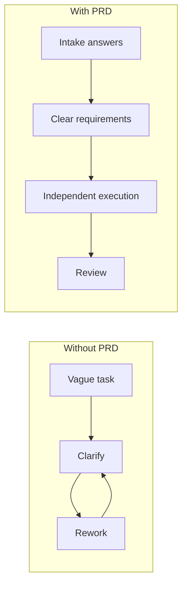
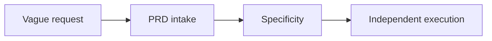
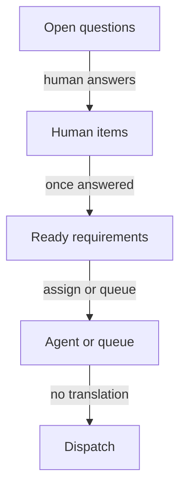
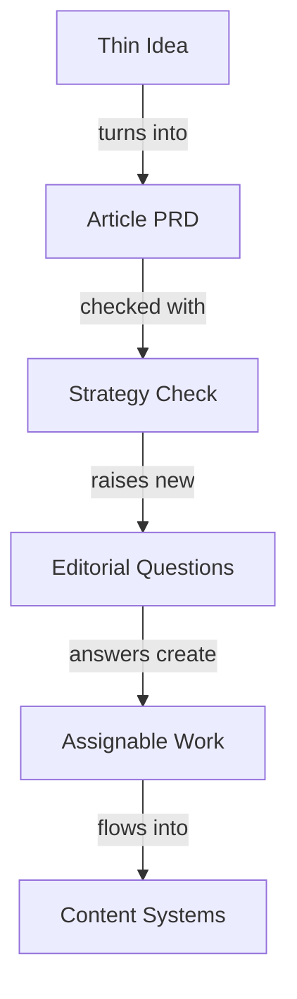

# PRDs Aren't Just for Code: Communication clarity that travels

A PRD agent took a one-line issue in my workspace and turned it into a real implementation PRD: nine intake questions, phased work, named agents, acceptance criteria, and dispatch scripts. That one-line issue was enough for me because I already knew the repo, the conventions, and the missing context. It was not enough for an agent that had to move without me standing there to explain the rest. It was also not enough to show my management or partner teams what the intended work was or the value of that work. The PRD captured that communication clarity.

That same pattern showed up two more times this week. I used one PRD as a baseline against roughly three months of branding work and found a gap in the setup process I had missed. Then I used another PRD to compare planned scope against delivered work so the unanswered questions could turn into queued issues instead of another vague "we should look at this later."

<!-- IMAGE PROMPT: White female with pink hair at desk turning one vague note into structured PRD pages, faint helper agents moving around her, watercolor illustration, soft wet-on-wet washes, visible paper texture, warm muted tones, loose brushwork, no text -->

_The work starts looking like it can move on its own only after the thinking stops being casual._

I keep hearing PRDs talked about as if they only belong to software feature work. I use them there too. But this week I kept reaching for the same pattern in project work, product work, and content work. Each time, the value was the same: the PRD made me write down the part I normally carry in my head.

A PRD is communication clarity. That's it. The document works because it makes the request unambiguous for the next reader. Sometimes that reader is a person. Sometimes it's an agent. The value is the same.

## Start with what a PRD is

A product requirements document (PRD) is a structured answer to three questions: what are we building, for whom, and why? More simply, it is the place where I stop assuming the other side will fill in the blanks for me.

Before anyone starts building, the PRD turns the idea into requirements other people can actually act on. In a lot of teams, that means engineering, design, product, and sometimes marketing can line up around the same page before work starts.

That is still useful. What changed for me is what happens next. Now the same clarity has to carry agent work too. I can draft a PRD from rough bullets, update it as the work changes, and use it as the source for agent assignments, review checks, and follow-up issues.

That shift is why I started applying the pattern outside code. The useful part is the habit of slowing down long enough to answer the structured questions that make handoff possible. Agents need the same clarity humans do. Once I saw that clearly, it was hard not to use the same pattern for project planning and content operations too.

## Stop treating clarity as optional

The easy story about AI agents is that I can stay incomplete — not specific enough — and the system will figure it out.

I have tried that often enough to know what happens next. The agent fills in the gaps. It makes assumptions. Those assumptions land as wrong choices. Then I'm back in, steering it turn by turn because every guess it made was wrong. Sometimes the work still gets done. But I'm driving now, not the agent.

That is why I keep coming back to PRDs. A good PRD is not useful because it looks formal. It is useful because it forces me to answer questions I would normally leave fuzzy.

Questions like:

- What problem am I actually trying to solve?
- What does done look like in a way another person or agent can check?
- What is out of scope?
- Which repo, project, or workflow owns this?
- What existing documents already limit the answer?
- What dependencies have to exist before anyone starts?
- What acceptance criteria tell me the work is complete?
- Who or what should do each phase?
- What evidence would prove the work happened correctly?

Nine questions is not a magic number. It just kept surfacing in my sessions this week. It pushed me past the comfortable version of the request. "We should improve our PRD workflow" sounds fine until I have to answer which workflow, which repos, which gaps, which owners, and what exact result counts as success. That is the moment the request stops being a loose idea and starts becoming something the system can actually use.

## Run the experiment on work that isn't a feature

Requests that felt clear in my head were not clear enough to run independently. Once I started using PRD patterns outside their usual lane, the same document kept helping in different ways.

### Session 1: Expand a one-line issue until agents can move

I had a one-line issue that made sense to me because I live in this project every day. It had enough context for a human who already knew the setup. It did not have enough context for a system that needed to break the work into phases, assign work to named agents, and move without waiting for me to answer basic questions.

So the PRD agent expanded that short issue into a real implementation PRD. The useful part was the added structure.

The PRD turned a compressed request into something other actors could use:

- the problem statement stopped assuming insider context
- the work broke into phases instead of one blended paragraph
- acceptance criteria became explicit instead of implied
- agent assignments were named instead of hand-waved
- dispatch scripts could be generated because there was finally enough detail

Before the PRD, the request depended on me being available to explain the rest. After the PRD, that logic lived in the document. Once the requirements were explicit, dispatch was no longer a hope. The tooling had something solid to run.

The time investment moved to the front, which is boring in the best way. In my experience, that is where the payoff shows up later. I stop rescuing ambiguity after the fact because the plan can survive handoff.

### Session 2: Use the PRD as a mirror, not a starting point

The second session changed how I think about PRDs. I was reviewing PRD-driven branding work, but instead of treating the document as a fresh plan, I treated it as a claim and compared it against the artifacts the week had already produced.

One of the most useful findings was a missing validation step I'd overlooked. That kind of check was easy to miss while the surrounding work was already moving. The PRD gave me something stable to compare against. Without it, that omission would have stayed buried inside the blur of ongoing work.

Once the gap was visible, the next step was obvious. I spawned two follow-on actions from the review findings:

- one to fix the ownership document so responsibilities were clear
- one to create a CI triage skill

The review did not end at "interesting gap." It created follow-on work with owners and specific files to update. One agent fixed the ownership document. Another created a validation skill so the check would run next time.

### Session 3: Compare scope to outcomes, then let the gaps create work

The third session pushed the same pattern one step further. I used the PRD not just to plan or review, but to ask what actually happened. I compared PRD scope against real work outcomes to find the places where my planned story and the delivered story did not match.

The completeness check surfaced open questions. Once those questions existed in a named list, I could answer them directly and turn the unresolved gaps into issues for later agent work.

The flow was simple: planned scope checked against reality produced open questions, my answers turned those questions into queued issues, and the queued issues were ready for later agent work. It was repeatable.

With the PRD, I had a stable statement of intent. I handled the judgment calls, and the agents handled the mechanical translation after the missing information was written down.

If I strip the three sessions down to their bones, this is what happened:

| Session | Starting point | What the PRD did | What became possible next |
| --- | --- | --- | --- |
| Convert a one-line issue to a PRD | one-line issue | expanded intent into phases, acceptance criteria, and agent assignments | hands-off dispatch with less human follow-up |
| Review PRD for branding | existing PRD plus three months of work | exposed mismatch between intended scope and actual execution | spawned targeted follow-on agents for ownership-document updates and CI triage skill work |
| Compare PRD with work | finished work compared against planned scope | surfaced open questions and unresolved gaps | generated issues that could be queued for later agent execution |

The PRD was not just a status document. It was a conversion layer between what I meant and what could be done.

## Follow the pattern that kept repeating

### Start by forcing the intake answers into the open

The biggest misconception I had to drop is that the initial request is the hard part. Usually it is not. Usually the hard part is everything the request assumes.

A sentence like "convert this issue into a real plan" sounds efficient because it compresses the task. But that efficiency is fake if the next actor has to unpack hidden assumptions before doing anything useful.

For me, the PRD intake phase looked less like "writing a document" and more like pinning down the variables that were floating around informally:

- what the request is asking for in plain language
- what should exist at the end
- what phase boundaries keep the work from smearing together
- which constraints come from project conventions, operating rules, or ownership docs
- what needs human approval versus what can run on its own
- what evidence will make review easy later

This is the thinking tax. It costs something up front. It slows down the moment where I get to feel like I already started. I have to stop, answer, narrow, and sometimes admit I do not actually know what I want yet. The payoff shows up later.

### Check completeness before you confuse motion with coverage

The second phase is the one I underused before this week: completeness checking.

I used to think of PRDs mostly as forward-looking documents that I would write and then execute. They are just as useful as review tools.

A PRD lets me ask a direct question: did the work we actually did cover the work we said mattered?

When work moves across multiple agents, multiple repos, and multiple days, motion starts to feel like progress whether or not the original scope has been covered. A completeness check interrupts that illusion.

In practical terms, it helped me inspect:

- whether every major acceptance area had corresponding work
- whether implied dependencies had been made explicit
- whether ownership boundaries were still accurate
- whether validation steps existed, not just good intentions
- whether the missing pieces were small omissions or larger design gaps

The branding review session made this concrete for me. A missing check in the onboarding workflow was not the kind of thing I would have reliably caught by reading status updates alone. It became visible because I had a clear frame for what should have been there.

### Turn the gaps into dispatchable work

Once the PRD review surfaced missing pieces, the follow-up path became much cleaner than I expected:

I like that because it keeps the human work and the automation work in the right places. The human work is making decisions. The automation work is transforming those decisions into execution steps. If the document is sloppy, those jobs collapse into each other and I end up doing both.

<!-- IMAGE PROMPT: White female with pink hair overseeing small helper agents carrying folders from PRD board to task queues, watercolor illustration, soft wet-on-wet washes, visible paper texture, warm muted tones, loose brushwork, no text -->

_The payoff is not that the human disappears. It's that the human gets to stop re-explaining the same intent._

### Let work run on its own after the meaning is stable

By the end of the week, the line I kept writing down was simple: work runs best on its own after the meaning is stable.

I need a PRD because independent work magnifies whatever level of clarity I provide. If I hand over a fuzzy request, the system scales fuzz. If I hand over a bounded requirement with owners and checks, the system scales useful action.

That is why I think PRDs are underused outside code. A lot of non-code work still assumes human availability will absorb the ambiguity for free. Project work, product work, and content work are full of requests that sound understandable in conversation but are not clear enough to survive handoff.

## Push the pattern into project management

I keep seeing a gap between backlog clarity for humans and backlog clarity for agents.

Project systems are often optimized for coordination among people who already know how to fill in the blanks. We can see a short title, remember the meeting, infer the constraint, and keep going. Agents are much more literal. If the work item does not carry the missing pieces, the queue looks fuller than it really is.

When I look at project management through the PRD lens, I stop asking whether the board is organized and start asking whether each major item can survive handoff without live clarification. That changes the shape of the document.

Instead of a loose epic with a few bullets, the more useful version looks like this:

- clear statement of the problem the epic is trying to solve
- boundaries between phases so tasks do not overlap
- acceptance criteria that can be checked after work lands
- routing clues about which agents or teams own which slice
- dependency notes that prevent premature execution
- validation expectations so the review step is not invented on the fly

Once the project document is explicit enough, breaking the work down gets easier. Work items stop being reminders for future humans and start becoming units that can move.

<!-- IMAGE PROMPT: White female with pink hair arranging PRD cards across a kanban board while helper agents pull work items into columns, watercolor illustration, soft wet-on-wet washes, visible paper texture, warm muted tones, loose brushwork, no text -->

_The board gets more useful the moment each card carries enough meaning to travel on its own._

It means putting detail where it changes execution and leaving everything else light.

One shift that helped me was seeing acceptance criteria as scheduling tools, not just review tools. If an epic says it is done when three specific outcomes exist, decomposition gets cleaner. If the epic just says "move this initiative forward," the board can look busy for a long time without telling me whether the right work is actually in flight.

The practical signal for me is simple: if I expect the work to be done asynchronously, across roles, or by agents, the request probably needs PRD treatment whether or not the output is software.

## Push the pattern into product management

Traditionally, product teams used PRDs to line people up before code started. The PRD was the single place where the team could see the user problem, the proposed solution, the requirements, the success measures, and the boundaries. What changes now is that the same document also has to support AI-assisted drafting, routing, review, and execution.

The old mental model was document first, handoff second. The newer one I am experimenting with is requirement first, routing second, independent execution third. A product document that is only persuasive is not enough. A product document that supports execution has to name decisions, constraints, success conditions, and trade-offs in a way other actors can use.

The PRD session where a short issue got expanded into a full implementation artifact made this very concrete for me. The expansion was not about adding more words because longer is better. It was about adding enough structure that each downstream actor could tell what they owned. Implementation phases, acceptance criteria, agent assignments, and dispatch scripts existed because the PRD supported dispatch.

That matters because product requests are often written for alignment first and execution second. That is fine if humans are going to sit together and negotiate the rest in real time. But once I want agents, or loosely coupled teams, to move without hand-holding, the requirement has to answer the follow-up questions before they are asked.

<!-- IMAGE PROMPT: White female with pink hair studying feature sketches and requirement pages while helper agents build from precise notes, watercolor illustration, soft wet-on-wet washes, visible paper texture, warm muted tones, loose brushwork, no text -->

_The specification earns its keep when other actors can move from it without guessing what I meant._

One thing I appreciate here is how PRDs expose whether I really made a decision or just postponed it. If the document leaves a major constraint unstated, that is not neutrality. That is hidden work for whoever picks it up next.

That is one of the clearest ways AI acts like a collaborator instead of a magician. It makes my vagueness expensive.

The useful thing was not the system pretending to know the answers. The useful thing was that it made the missing answers painful enough that I finally wrote them down.

Where it broke down was whenever I tried to skip that step and expected the system to infer intent from shorthand. It can infer a lot. It still should not be asked to infer the core requirements.

The sweet spot is not maximum detail. It is enough detail that other actors can move without reopening the problem definition every hour.

## Push the pattern into content management

Content management may be the least obvious place for this, but content work is full of documents that already behave like PRDs even when nobody calls them that. Article plans, content strategy docs, editorial calendars, coverage matrices, freshness reviews, taxonomy decisions, and publishing workflows all describe intended outcomes, constraints, ownership, sequence, and validation.

Content work often has the same hidden-context problem. We know an article is stale. We know a strategy doc implies missing tutorials. We know a calendar entry means someone needs a draft, images, metadata, and review. But unless that thinking lands in a document with clear boundaries, the work stays socially clear and practically fuzzy.

It breaks down when I want content audits, freshness checks, coverage-gap detection, or article scaffolding to run with less manual glue.

If an article plan is written like a real requirement document, I can review it for completeness, compare planned coverage against published coverage, detect gaps, and route the missing work with less back-and-forth. The artifacts are concrete: a markdown file, a matching media folder, frontmatter fields like `draft: true` and `keywords`, and a build command that fails if something is wrong. The operations around it do not have to stay mysterious.

<!-- IMAGE PROMPT: White female with pink hair at editorial desk sorting article outlines, calendar pages, and review notes while helper agents manage content folders, watercolor illustration, soft wet-on-wet washes, visible paper texture, warm muted tones, loose brushwork, no text -->

_The content strategy starts acting like a system once the editorial intent is written in a form the system can inspect._

The three sessions from this week map cleanly to content operations:

If I sketch what an article PRD needs in order to support content operations without me stepping in, it looks a lot like the software version: audience, intent, angle, exclusions, source material, freshness risk, required assets, review checkpoints, and a definition of done that is more concrete than "publish something good."

## Choose when the thinking tax is worth it

Speed was the first one. If I have a request in my head and a path that feels mostly clear, the last thing I want is a form asking me to pin down acceptance criteria, boundaries, or dependencies. Not every task deserves full PRD treatment.

One guardrail I keep coming back to is handoff count. If the work will stay with one person in one short session, I probably do not need a full PRD. If the work will cross time, tools, repos, reviewers, or agents, the cost of under-specifying it rises fast. That is when the thinking tax looks cheap compared to cleanup.

False confidence was the second rough edge. A polished document can look complete even when it missed an important gap. The answer is "treat the PRD as something I can review and revise."

Judgment was the third rough edge. When the completeness check surfaced open questions in Session 3, I still had to answer them. The system could not responsibly invent those answers for me. The point of the PRD pattern is not to erase human decision-making. It is to capture it cleanly enough that it happens where it should.

PRDs expose where I am still hand-waving. A vague request lets me keep the illusion that I know what I mean. A requirement document asks me to prove it. Sometimes I discover that I do not actually have an answer yet.

## Keep following the work toward more independent systems

The PRD is valuable because it makes the request clear enough that someone else can act on it without guessing.

Those are different surfaces of the same idea: a PRD is communication clarity. I used to think of PRDs mostly as a prelude to implementation. Now I think of them as a reusable requirement document that can support planning, auditing, routing, comparison, and dispatch across much more than code.

I do not think the future is "agents replace planning." My week suggested the opposite. The more I want the system to work on its own, the more seriously I have to take the planning document. The document works because it makes the request unambiguous for whoever reads it next, human or agent.

My next test is whether article PRDs can survive metadata review, asset checks, and `npm run build` without me reconstructing the brief from memory. Editorial judgment — the moment when a sentence sounds unlike me, or a claim needs a receipt — still needs a human in the loop. That is a limit on what the document can carry, not a reason to skip writing it.
