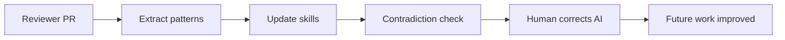

# Learning from a Reviewer's PR — Teaching Your AI to Improve Itself

The AI flagged an inconsistency. I pulled up the official product documentation, sent a screenshot, and said: I think whatever guidance we have for this name is wrong and the reviewer is right.

The AI responded immediately: you are correct. The name in the skill file does not match the official documentation. Let me correct it.

It updated the product name. It updated the scoring rule that referenced the name. It noted that the previous version had been wrong — for anyone wondering why old review scores might not match new ones. Three changes, because I sent a screenshot.

That correction is now permanent. Every document review that uses that skill evaluates against the right name. The reviewer and the official documentation are aligned. The skill finally matches both of them.

<!-- IMAGE PROMPT: White female with pink hair holding a phone showing an official documentation page up beside a printed skill document page pinned to a corkboard, correction marks appearing on the corkboard document, warm morning light, fir trees outside a wide window, watercolor illustration, soft wet-on-wet washes, visible paper texture, warm muted tones, loose brushwork, no text -->

_Low tide on a rocky Washington beach reveals what's been there all along — sometimes the right answer was already in the PR, and you just needed to hold it next to the evidence._

That is the point of this post. The rest is the work that got me there — a PR, a pattern extraction, a contradiction check, and the moment I told the AI it was wrong and it agreed because I showed it the proof.

<!-- truncate -->

## All the AI-plus-PR posts are running the wrong direction

Every blog post I read about AI and pull requests covers the same scenario: AI reads the PR, AI gives feedback, AI catches bugs the human missed. The human submits. The AI reviews. If any learning happens, it goes to the human.

This post runs that direction backwards.

A senior colleague submitted a PR. It was good — substantially better than what was there before. I asked my AI to read his PR and figure out what it should learn from him. The human reviewed. The AI learned.

The difference matters more than it sounds. When AI reviews a human's PR, the feedback is ephemeral — the AI tells you something, once, in this session, about this code. The next PR starts fresh. When a human's review teaches the AI, the learning is durable — it lands in a skill file that gets applied to every future piece of work.

In one direction, the AI is a reviewer. In the other, the human reviewer is an AI trainer.

The second direction is dramatically underused.

## What skills are and why they accumulate

I use "skill" to mean a file — a markdown document in a repository — that contains knowledge my AI reads before doing a specific kind of work. Not a prompt I type at the start of a session. Not a system instruction I paste into a chat window. A file. Committed to git. Readable by anyone. Updatable through a pull request.

A skill for reviewing documentation quality might contain: what makes a strong introductory sentence, how to handle abbreviations, which product names to use and how to capitalize them, how to score an article against a style checklist. The AI reads the skill at the start of a documentation review task and applies everything in it.

The value is not the review. The value is the baseline that every review starts from.

Because the baseline is a file, it accumulates. When I learn something new about what good documentation looks like — from a colleague's PR, from a style guide update, from my own experience of what works — I write it into the skill and it stays there. The AI's understanding of "what good looks like" improves continuously rather than resetting when the session ends.

This is the opposite of prompting, where you carry the knowledge in your head and re-express it every time. It is also different from model fine-tuning, which requires retraining. Skills are more like an expert colleague's mental checklist — externalized, readable, and incrementally improvable by anyone who can open a text editor.

The catch is that skills can be wrong. The file might have been written with incomplete information. A product might rename itself. A best practice might get superseded. Unless someone checks, wrong guidance accumulates quietly — the AI applies it faithfully every time, the reviews look reasonable, and nobody notices.

The wrong kind of wrong is the one that points in the wrong direction. A skill rule that says "avoid jargon" is probably directionally correct even if it is imprecisely stated — most violations of that rule produce worse writing. But a rule that says "this product is named X" when the correct name is Y is wrong in a way that penalizes correct usage. The AI does not know the names of products; it knows what is written in the skill. When the skill is wrong about a name, every review is measuring against a broken ruler.

That is exactly what happened here.

## The PR arrives

A senior colleague opened a pull request against the documentation repository. Eight files. Over 200 individual edits.

Every change was a style improvement, not a content change. The technical information stayed the same — the procedures still worked, the instructions were still accurate. But the voice, formatting, and phrasing were substantially better after his edits than before them.

He did not write a detailed explanation for most of the changes. Reviewers with deep domain expertise often don't — when you have been writing and editing technical documentation for years, the patterns become fluent. You see a stiff sentence and fix it. You notice an inconsistent term and regularize it. The PR expresses the knowledge even when the commit messages do not annotate it.

What struck me reading through the diff: the changes were not scattered. They were not a reviewer's idiosyncratic preferences applied unevenly across files. The same patterns appeared in file after file. A term that was hyphenated in three files became unhyphenated in all three. A product name written two different ways was unified across all eight files. A habit of floating pronouns — "this causes problems" instead of "this configuration causes problems" — was corrected wherever it appeared.

Consistency at that scale means something. It says the changes are not noise. They express a point of view about what good looks like, applied methodically.

That methodical consistency is what makes a PR worth extracting patterns from. A single improved sentence teaches you one thing. The same improvement applied the same way across eight files teaches you the principle behind it.

I read through the full diff, noted a few things that caught my attention, then asked my AI: go through this PR and figure out how you can take the changes and apply them to the content quality skill.

<!-- IMAGE PROMPT: White female with pink hair leaning over a wide table covered in before-and-after document printouts in two columns, warm afternoon light through tall windows, Pacific Northwest rain streaking the glass, watercolor illustration, soft wet-on-wet washes, visible paper texture, loose brushwork, no text -->

_Two hundred edits across eight files — the signal isn't in any single change, it's in the pattern that repeats._

## Extract patterns from the PR

The AI read all eight changed files, compared the before-and-after state for each edit, and reported back.

It found 11 patterns. Two categories: 3 patterns not currently covered in the content quality skill, and 8 patterns already present in the skill in some form.

For the 8 already-covered patterns, the AI noted that the PR reinforced existing guidance — the reviewer had applied rules the skill already contained. No skill changes needed for those. Good signal that the existing rules were sound.

The 3 new patterns, in the AI's words:

> **Pattern 1 — Full product name on first mention:** The PR consistently used the complete official product name on first mention within each article, even where the shorter form was commonly understood. The skill contained guidance about correct product names but no specific rule requiring the full form on first use. The reviewer applied this without exception across all eight files.
>
> **Pattern 2 — Demonstrative pronouns followed by explicit nouns:** The PR replaced every instance of "this causes...", "that results in...", "this means..." with a version where the demonstrative was followed by an explicit noun: "this configuration causes...", "that setting results in...", "this behavior means...". A floating demonstrative is hard to catch in isolation — you read past it because context suggests what "this" refers to. Seeing the correction applied twenty-odd times across eight files made the pattern visible.
>
> **Pattern 3 — Compound word styling for a specific term set:** Six terms that had been hyphenated were consistently written as single words throughout the PR. Not a global rule about compound words — a specific list of terms where the hyphenated form was wrong for this domain's conventions.

For each of the 8 reinforced patterns, the AI confirmed the existing rule and noted which file changes demonstrated it. Active voice, present tense, avoiding Latin abbreviations, commas after introductory clauses, consistent capitalization — the PR contained examples of all of them, applied well. For the active voice rule, the AI noted 14 instances in the PR where passive constructions had been converted to active ones. For the abbreviation rule, 9 instances of "e.g." and "i.e." had been rewritten as "for example" and "that is." Confirmation, not noise.

The complete list of 11 patterns, for the record:

1. Full product name on first mention
2. Bullet list formatting consistency — parallel grammatical structure within a list
3. Contractions for conversational tone (e.g., "don't" over "do not" in non-procedural sections)
4. Active voice and present tense
5. Comma after introductory prepositional phrases
6. Spell out abbreviations rather than using Latin shorthand
7. Add "the" before specific product and service names
8. Split compound sentences where two distinct ideas were joined with "and"
9. Demonstrative pronouns followed by explicit nouns
10. Consistent capitalization of product names (all instances, not just the first)
11. Hyphen removal for a specific compound term list

That is what 200 edits across 8 files resolves to: 11 patterns, 3 of which the skill did not know.

The AI did not pad its findings. Three new patterns, eight confirmations. Not every pattern from a PR needs to become a new rule — some patterns are evidence the existing rules are working. The AI recognized the difference.

## Expand beyond the original skill

Once I confirmed the three new patterns and added them to the content quality skill, I asked a follow-up question: are any of these patterns general enough to apply to other skills beyond the content quality one?

The content quality skill covers documentation review. But my AI reads other skills too — for blog post voice, for release notes, for developer guides, for general writing style. Some patterns from the reviewer's PR were domain-specific. The compound term list was specific to this documentation domain. But most were not. The demonstrative noun rule applies everywhere I write. Active voice applies everywhere. Commas after introductory phrases are not a documentation convention — they are a clarity convention for any prose.

The AI identified 6 skill files that could benefit from updates:

1. **Content quality skill** — already updated with the 3 new patterns
2. **General writing style skill** — the demonstrative noun rule and the comma rule, stated as general principles rather than documentation-specific ones
3. **Blog post voice skill** — active voice and present tense reminder, framed for informal technical writing
4. **Documentation structure skill** — full product name on first mention, as a structural rule that applies regardless of domain
5. **Release notes skill** — abbreviation handling, since release notes face different format pressure but the same underlying preference for plain English
6. **Developer guide skill** — both the compound term list and the product name rule

Total across all six files: 9 individual edits. Some skills got one addition. Some got two. Nothing was copied wholesale from one skill to another — each rule was restated in the context of the skill it was going into, with framing appropriate for that work type.

Before making any changes, the AI presented each proposed edit as a before-and-after pair. For the general writing style skill, the demonstrative noun rule went in as:

> **Demonstrative clarity:** When using "this," "that," "these," or "those" as subjects or objects, follow the demonstrative with an explicit noun. Write "this configuration" not "this." Write "that setting" not "that." This prevents ambiguous reference and removes reader effort.

For the blog post voice skill:

> **Active voice in explanations:** Favor active constructions when explaining how something works. "The agent reads the config file" over "the config file is read by the agent." Present tense for describing behavior; past tense for describing what you did.

Clean restatements, appropriate to the new context. Not copy-pasted. Not inflated.

<!-- IMAGE PROMPT: White female with pink hair connecting glowing rectangular pattern cards between six floating panels on a wall, each panel representing a different skill type, warm study light, misty Puget Sound visible through tall windows, watercolor illustration, soft wet-on-wet washes, visible paper texture, warm muted tones, loose brushwork, no text -->

_Nine edits across six files — not one rule dumped into every skill, but each rule placed where it actually belongs._

I confirmed all 9 edits. The skills were updated.

One PR, 8 documentation files changed, 11 patterns extracted, 9 skill updates across 6 files. At that point I thought the exercise was done.

I was wrong.

## Run the contradiction check

After updating 6 skill files, I asked: is there anything contradictory, inconsistent, or wrong across what we just changed?

Most people skip this step. You make a change, the change looks good, you move on. But skills are a system — rules in different files can conflict. A rule in the general writing style skill might contradict a rule in the domain-specific documentation skill. A term written one way in one skill might be written differently in another. Small inconsistencies in isolation become confusing guidance in practice — the AI does not know which rule takes precedence when two of them point in opposite directions.

The check takes a few minutes. The AI reads all the relevant skill files, looks for conflicts, and reports.

It found 3 issues.

**Issue 1: Competing abbreviation guidance.** The general writing skill said to avoid abbreviations. The release notes skill said to use established abbreviations for conciseness, since release notes serve technical audiences who prefer brevity. Both rules are defensible in context. Stated as absolutes they contradict each other. Fix: the general writing skill became more precise — "avoid unexplained abbreviations; spell out on first use in non-technical contexts." That resolved the conflict by adding conditions rather than declaring a winner.

**Issue 2: Compound term appeared in two places.** Two of the six terms in the new hyphen-removal list appeared in the developer guide skill with their hyphenated forms — old entries that predated the PR. The AI had added the unhyphenated versions to the content quality skill without checking whether those terms existed elsewhere. Fix: both legacy occurrences updated to match.

**Issue 3: Product name in the quality skill did not match official documentation.**

That third one is what this post is really about.

## Check the product name

The AI flagged it as an inconsistency between the reviewer's PR and the skill. The reviewer had used one form of the name. The skill file had a slightly different form. They did not match.

The AI did not know which was right. It presented both versions and asked me to verify against the product's official documentation.

I looked at the PR. The reviewer's version was spelled and capitalized a specific way — consistently, across every file he had touched. Then I looked at the skill. The guidance in the skill had the name in a slightly different form — something I must have written from memory at some point, or copied from somewhere that itself had it wrong.

Then I looked at the official product documentation. Not my notes. Not the PR commit history. The actual product page.

The reviewer was right. The official documentation matched his version exactly. My skill had the wrong form.

I sent the AI a screenshot of the product page showing the name as it appeared in the official documentation. Then I said: I think whatever guidance we have for naming is wrong and the reviewer is right.

<!-- IMAGE PROMPT: White female with pink hair at a standing desk, phone in left hand showing an official product documentation page, printed skill document in right hand, the two names visibly different, soft overcast Pacific Northwest daylight, cedar trees outside the window, watercolor illustration, soft wet-on-wet washes, visible paper texture, warm muted tones, loose brushwork, no text -->

_The screenshot is the receipt. Without it, it's one version of a name against another. With it, there's only one answer._

The AI's response:

> You are correct. The name in the content quality skill does not match the official documentation. The skill currently contains [wrong form]. The official documentation and the reviewer's PR both use [correct form]. I will correct the skill now.
>
> Note: This means any article I reviewed that used the correct form may have been incorrectly flagged as inconsistent with the skill's guidance. Any article I reviewed that used the wrong form may have been scored as though it was correct when it was not. The scoring in those earlier reviews was based on wrong information.

Then it made three changes:

1. Updated the product name in the content quality skill to the correct form
2. Updated the scoring rule that referenced the name to use the correct form
3. Added a note in the skill's revision history that the previous entry had contained an incorrect name

The third change was the AI's addition, not something I asked for. It explained its reasoning: if anyone looks at past review scores and wonders why newer reviews score differently on this criterion, the revision note explains why. The baseline changed because the previous baseline was wrong.

I approved all three. The skill was updated.

## What changed, and what it means for past reviews

Let me be direct about what the wrong name in the skill actually cost.

The content quality skill is used to review documentation articles. Each review produces a score and a set of improvement suggestions. Product name consistency is one of the scoring criteria.

While the skill had the wrong name, every article that used the correct name was being measured against an incorrect standard. The correct form — matching official documentation — may have been flagged as inconsistent with skill guidance. The wrong form — matching the skill — may have been praised as consistent.

I do not know how many reviews were affected. Skills accumulate over time, and I could not pinpoint exactly when that particular piece of guidance was written. Long enough that the AI had been using it as a scoring signal across many reviews. The direction of the error: the skill was rewarding the wrong answer and penalizing the right one for this specific criterion.

This is the uncomfortable part of working with written-down AI knowledge: errors are durable too. Good knowledge accumulates in skill files, but bad knowledge also accumulates. The AI applies both faithfully, without knowing which is which. That judgment belongs to the human in the loop.

The fix does not retroactively correct past reviews. But it corrects all future ones. Every article reviewed after the skill update gets evaluated against the right name. The reviewer is no longer in conflict with the guidance. The AI and the official documentation are aligned.

The reviewer surfaced the error without knowing it. His PR had the right name. The contradiction check made the discrepancy visible. The screenshot closed the argument.

## The learning loop

Here is the sequence in full:

Six steps. The AI did most of the analytical work in steps 2 through 4. The reviewer contributed step 1 just by doing his job well. My contribution was asking the right questions — extraction, expansion, contradiction, correction.

Steps 5 and 6 are what make this different from a one-time improvement. Step 5 — human corrects AI — is the moment most workflows skip. The AI flags the inconsistency. The human has two choices: ignore it, or resolve it with evidence. Ignoring it leaves wrong guidance in place. Resolving it with evidence creates a permanent correction.

Step 6 — future work improved — follows automatically from step 5, but only because the knowledge is written down. If the correction lived in my memory, I might remember it for the next review and forget it by the third. Because it lives in the skill file, every review that follows benefits without any additional effort.

The loop is what I want to run regularly. Not on every PR — only on PRs from people whose judgment I trust, and only when the changes are dense enough to contain real patterns. When those conditions are met, the loop takes less than an hour and the improvements persist.

<!-- IMAGE PROMPT: White female with pink hair walking a circular stone path on a misty Puget Sound beach, each large flat stone engraved with one step of the loop — PR, extract, update, check, correct, persist — watercolor illustration, soft wet-on-wet washes, visible paper texture, cool muted blues and greens, loose brushwork, no text -->

_Each pass around the loop leaves the path slightly changed — one correction at a time, the baseline gets more reliable._

## Your best reviewers are your best AI trainers

The reviewer in this story did not know he was doing AI training. He submitted a PR with style improvements. That is part of his work, and he does it well.

The insight: the properties that make someone a good reviewer are the same properties that make their PR good training material.

A good reviewer applies knowledge consistently. They do not fix a problem in file 3 and miss it in file 6. Consistency is what makes patterns extractable — if the same correction appears twice, it might be personal preference; if it appears twenty-two times across eight files, it is a principle.

A good reviewer has deep domain knowledge. They catch errors a surface-level reader would miss — the wrong product name, the subtly ambiguous pronoun, the term that is hyphenated in the legacy version but not the current one. That depth is exactly what you want in a skill. A skill built from shallow patterns is a shallow skill.

A good reviewer is reliable. When they mark something as correct, it usually is. When they change a product name, they have probably verified it. The reviewer in this story had the right product name. The AI had the wrong one. When those two were in conflict, the reviewer's version was the one to trust — and the screenshot confirmed it.

The practical test I use: do I read this person's PRs carefully because I expect to learn something from them? If yes, that is a PR worth running the extraction loop on. If I skim their PRs because I expect mostly mechanical cleanup, the loop will find mechanical patterns — which is fine but lower value.

I have maybe four or five people whose PRs reliably teach me something. Their collective judgment, extracted through this loop, is accumulating in the skills. Not just my point of view about what good looks like — a composite of several people's perspectives, captured when they expressed them most clearly.

That is the thing about a senior colleague's PR: it is a dense, high-fidelity expression of expertise applied to real material. You do not get that from a style guide alone. Style guides are written in the abstract. A PR is expertise applied to something specific, and the specificity makes the principle concrete. The floating pronoun rule lands differently when you can see twenty-two instances of it fixed, with before-and-after context, than when you read it as a bullet point in a style doc.

There is also a selection effect worth noting. A person who submits a PR with 200 style improvements across 8 files is someone who cares about this work. Caring about the work is a prerequisite for producing training material worth using. Indifferent PRs do not teach you much. PRs from people who are paying attention do.

One more thing: timing matters. Running the extraction loop on a PR right after it merges, while the changes are fresh in your memory, is faster and produces better results than trying to do it a week later when you have forgotten why a particular change was interesting. The instinct to ask "what can we learn from this?" needs to fire during the review window, not after the PR is already forgotten in the merged-and-closed queue.

I now add a mental note to my PR review checklist: if this reviewer is someone whose judgment I trust, flag the PR for extraction before approving. It takes 30 seconds to flag it. It saves the effort of reconstructing why the changes were notable later.

## What permanent actually means

I have used "permanent" several times. Let me be precise about where the claim holds and where it stops.

Permanent means the skill file was updated and committed. Every task that reads that skill now gets the corrected guidance. The correction does not expire at the end of a session. It does not need to be re-expressed each time. It was made once and it persists.

What it is not: a guarantee that the guidance never needs updating again. The product might rename itself. The official documentation might change. A future reviewer might find a better way to handle the same pattern. When that happens, the skill file gets updated again — another commit, another correction, another entry in the revision history.

The distinction that matters is accumulation versus evaporation. With prompts, knowledge evaporates between sessions — you start fresh each time, carrying everything in your head, and if you forget to mention something the AI proceeds without it. With skill files, knowledge accumulates — each correction builds on the previous state rather than resetting it. The baseline keeps moving forward.

There is a second distinction: knowing versus applying. The AI applies whatever is in the skill, faithfully. If the skill is wrong, it applies wrong guidance faithfully. If the skill is right, it applies right guidance faithfully. The AI does not know the difference — that judgment belongs to the human in the loop. The contradiction check is the mechanism that makes silent errors visible. Run it after major updates. Run it when a trusted reviewer's PR conflicts with your guidance and you are not sure which is right.

The product name error had been in the skill for a while. I would not have found it through normal use, because the AI's reviews looked reasonable even while scoring against a wrong baseline. The check surfaced it. The screenshot resolved it. The fix will hold until there is evidence it needs to change.

## Run this on the next PR

The workflow is short:

1. A PR arrives from someone whose judgment you trust
2. Ask the AI: what patterns in this PR belong in my skills?
3. The AI categorizes: new patterns vs. reinforcement of existing ones
4. Confirm the new patterns; add them to the relevant skill
5. Ask: do any of these patterns apply to other skills beyond the obvious one?
6. Confirm the cross-skill additions
7. Ask: is there anything contradictory, inconsistent, or wrong across what we just changed?
8. If the AI flags something, verify it against the source
9. Correct any errors with evidence; commit the updated skills

Steps 1 and 8 are judgment calls. Everything else is straightforward.

The hardest part is developing the instinct for step 1. Not every PR is worth this treatment. A PR with two spelling fixes and a reformatted table does not contain 11 patterns. A PR from a reviewer applying your existing style guide contains confirmation that the existing patterns are being followed, not new ones. Both are valuable as PRs. Neither is particularly valuable as training material.

The signal I look for: density and consistency. Dense means many changes, not a few. Consistent means the same principle applied multiple times, not scattered fixes. When the same kind of correction appears ten times, there is a principle behind those ten corrections. That principle might already be in the skills — but it might not, and finding out is worth the 20 minutes.

One friction point: skills need to be close to the work for the habit to form. If they live in a remote system you rarely open, you will not think to update them after a PR. If they live in the same repository you are already working in — readable, editable, committed through normal git workflows — the update feels like a natural extension of the review rather than a separate project. Keep them accessible.

I do not run this loop on every PR. A few times a month, after PRs that look like they have a point of view. The extraction exercise takes maybe 20 minutes including the contradiction check. The accumulated benefit is larger than that time investment suggests, because each improvement compounds — it does not just affect this review, it affects every review from this point forward.

<!-- IMAGE PROMPT: White female with pink hair reviewing a pull request on a laptop at an outdoor table near a rain-streaked Pacific Northwest cafe window, small glowing file cards floating from the screen into an open binder beside her, overcast sky and Douglas firs outside, watercolor illustration, soft wet-on-wet washes, visible paper texture, warm muted tones, loose brushwork, no text -->

_The habit forms when the files are close enough to reach — PR review and skill update in the same motion._

## The compound effect over time

Here is the version of this story that plays out over six months.

The reviewer submits another PR in July. Eight files again, or maybe twelve. Different patterns this time — or some of the same ones, applied to a new set of problems as the domain evolved. I run the extraction loop. Three more patterns, or two, or five. Some contradict something already in the skills; most do not. The skills get a bit more accurate, a bit more complete.

Another colleague opens a PR in September. She is a different kind of reviewer — where the first focuses on terminology and product naming, she focuses on sentence-level clarity and rhythm. Her patterns complement rather than duplicate. The skills gain a second perspective.

By month six, the skills reflect more than my own understanding of what good looks like. They reflect the accumulated judgment of three or four people who are each excellent at different things. My blind spots are partially offset by their expertise. My incorrect assumptions — like the product name — get corrected when they surface in a PR.

The baseline keeps rising. Not dramatically, not all at once — one extraction loop at a time, after PRs that are worth the treatment.

And errors keep getting surfaced. The contradiction check after each major update is what makes the system self-correcting. Without it, patterns accumulate indefinitely without anyone knowing when old ones have gone stale or wrong. With it, each update is an opportunity to audit the whole.

The thing I keep coming back to is the scope change. The reviewer improved eight documentation files. Those improvements affected those eight files, permanently. When I ran the extraction loop, his improvements affected every documentation file I work on from now on. The scope of his contribution expanded — not because he did more work, but because I turned his specific changes into generalizations.

That generalization requires a question: what principle does this specific change express? It is a cheap question when someone else has done the hard work of applying the principle consistently across many examples. The principle is already visible in the PR. You just have to name it. And naming it is what the AI is good at — given twenty-two instances of the same fix, it can describe the underlying rule clearly and precisely.

The reviewer does the domain work. The AI does the pattern articulation. I do the judgment call about what to keep. That division holds up well across the loop.

The reviewer in this story contributed to that baseline without knowing it. His PR expressed his expertise, clearly and consistently, across eight files. The extraction loop turned that expertise into a durable improvement in the AI's guidance. The screenshot corrected the one place where the AI had been wrong all along.

The AI's baseline is better now. Not because I sat down and rewrote the skill from scratch. Because I asked the right question after a good PR.

---

Next time a thoughtful reviewer opens a PR in a repository you work in, read it carefully. Not just to approve the changes — to ask what it knows that your AI doesn't.

The answer might be more than you expect. It might also include a correction your AI needed and did not know it needed. Mine did.
