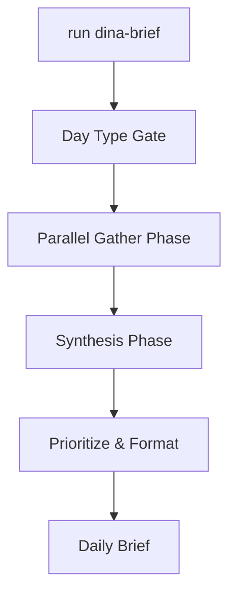
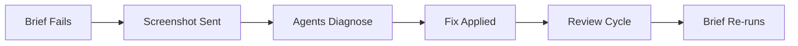
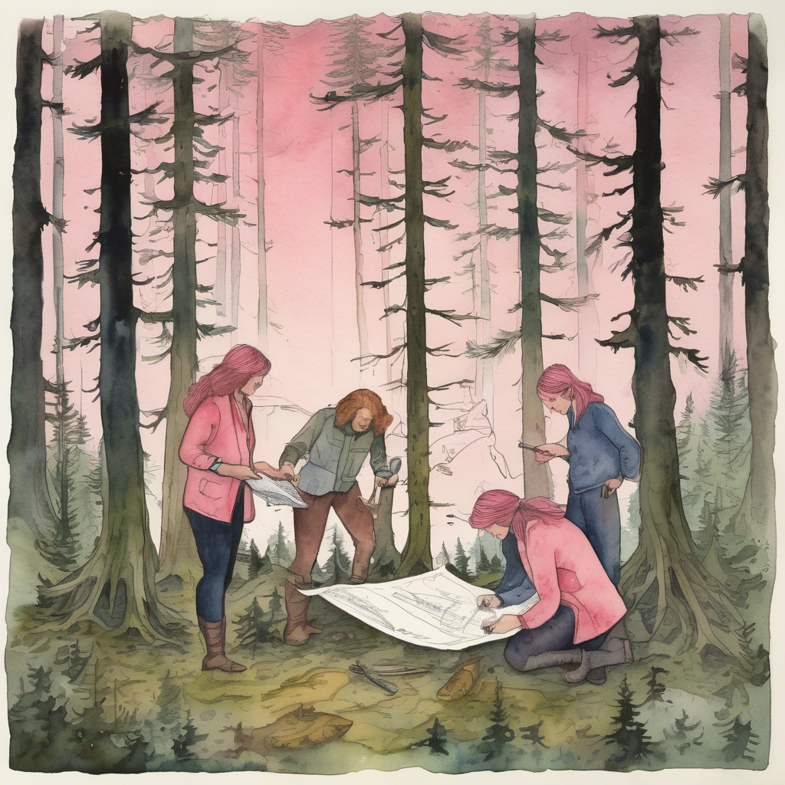

# The Morning Brief — Building a Personal AI Intelligence Report

`run dina-brief`

That's the whole command. One line. By the time the output stops scrolling, I have a structured report pulling from fourteen distinct data sources: open GitHub PRs ranked by how long they've been waiting, upstream release activity for the projects I track, content performance signals from the past seven days, work items from my project management board that haven't moved in 48 hours, carry-forward tasks I flagged yesterday and didn't finish, and eight more categories I used to assemble by hand every morning while drinking coffee and switching between browser tabs.

I've been running this brief since January. Most days it's invisible infrastructure — the kind of thing that works reliably enough you stop thinking about it. Last Tuesday it broke. A formatted data table came back with one column empty when it should have had data in every row. I sent a screenshot to my agent team with a single line: "you should be able to figure out who the creator is."

That message, and the repair chain it triggered, is the most interesting thing that happened with this system all year.

<!-- truncate -->

<!-- IMAGE PROMPT 1: Watercolor illustration of a pink-haired woman sitting at a wooden desk in the blue-gray light just before dawn, a single terminal window glowing on her open laptop screen, steam rising from a ceramic coffee mug beside her, soft fog visible through a rain-streaked window behind her, loose expressive brushwork, cool blue-gray dawn palette with warm amber from the screen light, Pacific Northwest early morning atmosphere -->


*The fog outside hasn't lifted yet, but the brief is already running — that's the whole point of building this.*

## Why an RSS Reader and a Language Model Don't Solve This

Every "build your morning briefing with AI" tutorial I've read follows the same shape: pick a few RSS feeds, optionally add a weather API, pipe the results through a language model, format the output as a digest. It's a satisfying first project. You can watch the model summarize things. It feels like intelligence.

The summarization is the problem.

Summarizing RSS content means you've accepted a premise: that the information mattering to you is information someone else decided to publish. But my morning isn't shaped by what's trending in developer communities or which articles appeared in my subscriptions overnight. My morning is shaped by what's waiting for me specifically — which PRs need a response from me, whether an upstream project shipped a release I need to document, whether an article I published last week is getting anomalous traffic that suggests I should refresh it, whether I said I'd handle something yesterday and didn't follow through.

None of that is in an RSS feed. None of it is aggregatable from public sources without knowing my specific context: my GitHub presence, my project management state, my content portfolio, my task history. Building a morning briefing for that data means building infrastructure to pull it, not subscribing to feeds.

The second failure mode: a briefing that dumps fourteen sections of raw data at you without prioritization has inverted the value proposition. The brief should answer "what needs my attention today" — not generate that question. If I have to read all fourteen sections and decide for myself what's urgent, I've traded one set of browser tabs for another. The synthesis — what do these fourteen things mean together, and in what order should I address them — has to be first-class, not an afterthought.

Third, and this is where the naive version fails hardest: different sources have completely different urgency windows. A GitHub PR that's been open for six hours is normal. One that's been open four days with no activity is stale and probably blocking something downstream. A content signal showing a 30% traffic drop this week could be a weekend pattern artifact or could mean an article's search ranking changed and I need to investigate. The same raw number can be urgent or irrelevant depending on its trend, its history, and its relationship to other signals. A dumb aggregator has no model for any of that. It presents everything with equal weight and leaves the interpretation to you.

I tried patching the RSS version with prompt engineering. "Flag items as urgent or routine based on their publish date and context." The model would try. But it had no real data about staleness — just whatever appeared in the feed item's metadata, which was inconsistently populated. After I caught it flagging a year-old article as "recent and high priority," I stopped trusting the output and stopped opening the brief. The problem was upstream of the model. You can't prompt your way to good data.

The fix wasn't a better prompt. The fix was pulling different data entirely — my data, with my urgency semantics built in from the start.

## Anatomy of the Three-Layer System

The brief is a product, not a script. That distinction matters more than it sounds, and it took me longer to internalize than I'd like to admit.

Scripts are for you. You built it, you know that it has to run from a specific directory because of a relative path in line 43, you know that if the GitHub API is rate-limited you have to wait 60 seconds and re-run manually. Scripts tolerate brittleness because their author is always the operator. Products need to work for someone who didn't build them — including future-you, six months from now, who doesn't remember why past-you made the choices she made.

I decided to treat this as a product after the third time I ran my early version, got questionable output, and couldn't tell whether the data was wrong or the script was wrong. That uncertainty was the failure. A product has observable behavior and explicit contracts. A script runs and produces something.

Three layers resulted from that decision.

**The gather layer** — fourteen source files, each atomically responsible for one data source. Query logic, response parsing, output shape, error handling, and caching behavior all live in the source file. Nothing in one source file references another. Sources don't communicate with each other and don't know what day it is. They gather, shape the data into a defined output contract, and return. If the project management API is unreachable, that source fails and returns an error object in the same defined shape. The other thirteen continue unaffected.

The atomicity wasn't my first approach. My initial version had sources entangled — the GitHub source also read the local project board because project board entries referenced GitHub URLs. When the GitHub API was rate-limited, the project board section also failed. Untangling them took most of a day and immediately made everything more stable.

**The workflow layer** — a YAML configuration file that defines execution order, parallelism groups, and day-type gating. The logic about what runs when lives here, not in any source file. Changing the day-type configuration is a YAML edit. I've made that change seven times since January as I tuned what "useful" means for each day of the week. Each change took about two minutes. If I'd embedded that logic in code, those same seven changes would each have involved a script edit, a test run, and a review.

**The synthesis layer** — where gathered data becomes the brief. Sections are formatted, items prioritized within sections, and the document assembled. Synthesis also explicitly distinguishes between "this source produced no data" (quiet days happen — section is cleanly omitted) and "this source failed to gather" (annotated in the output at the point where the section would appear, so I know I'm looking at a gap, not silence). That distinction matters more than I expected.

Here's how execution flows:



<!-- IMAGE PROMPT 2: Watercolor illustration of a pink-haired woman standing on a rocky bank at the confluence of several rivers flowing together into a single wide channel, she holds a clipboard and looks downstream toward where the streams merge, cool blue-greens and slate grays, misty Pacific Northwest river valley atmosphere, loose impressionist watercolor brushwork, expressive and slightly abstract -->


*Fourteen tributaries, one river — the value isn't in any individual source, it's in what you can see when they flow together.*

## How the Workflow YAML Works

The workflow file is the brief's nervous system. It tells the runner what to execute, in what order, under what conditions. Here's its structure:

```yaml
workflow:
  name: dina-brief

  day_types:
    monday:
      extras: [weekly-carryforward, project-board-full-sweep]
    midweek:
      skip: [content-maintenance-scan, heavy-analytics-pull]
    monthly_first:
      extras: [content-maintenance-scan, stale-article-audit]

  phases:
    - name: gather-network
      parallel: true
      sources:
        - github-prs
        - github-issues
        - release-feeds
        - analytics-signals
        - work-tracking
        - content-signals
        - workflow-health

    - name: gather-local
      parallel: true
      sources:
        - project-boards
        - carryforward

    - name: gather-optional
      parallel: true
      day_gated: true
      sources:
        - weekly-carryforward
        - content-maintenance-scan
        - stale-article-audit

    - name: synthesize
      depends_on: [gather-network, gather-local, gather-optional]
      steps:
        - prioritize
        - format-sections
        - assemble
```

`gather-network` and `gather-local` run in parallel with each other. Network-bound sources — GitHub API, analytics platform, project management API, release feeds — go into one group. Local file reads — project boards loaded from a local config file, carry-forward items from a local state file — go into another. Splitting them means a slow network call doesn't delay a fast local read.

`gather-optional` has `day_gated: true`, which tells the runner to consult the `day_types` config before executing anything in that group. On a Wednesday, `content-maintenance-scan` is in the `skip` list — excluded. On the first of the month, it's in `extras` — runs in addition to the standard sources.

`synthesize` depends on all three gather phases. It won't start until they all complete, whether successfully or with documented failures. The synthesis step receives a manifest of what succeeded, what failed, and what was skipped. It builds the brief from that manifest.

The separation between gathering and synthesis is what makes failures observable. When a source fails, the synthesis step gets `{ status: "failed", source: "work-tracking", reason: "API timeout at 09:14" }`. It annotates that in the brief output rather than leaving a blank section or crashing. I can see exactly what I'm missing.

Wall-clock time for the full gather phase on a Monday (all sources active): around 28 seconds. Synthesis adds about 12 seconds. Total: roughly 40 seconds from command to report, when nothing is rate-limited. Midweek, with the heavier sources gated off: under 25 seconds.

## Walking Through Four Sources

Fourteen sources span a wide range of complexity, latency, and data freshness requirements. Four of them illustrate the design choices that made the system reliable.

### Pull GitHub PR health

The brief's most time-critical source. It queries all open PRs across the repositories I actively maintain, calculates staleness (hours since the last meaningful update or review activity), and applies two rules:

1. PRs open more than 48 hours without new activity get flagged with ⚠️
2. PRs where someone left a review comment I haven't responded to get flagged with 💬

Output is a sorted list, oldest first, with the priority flags attached. On a typical morning I have three to eight open PRs across all my repos. Maybe one is stale, sometimes none are.

What this source deliberately doesn't do: read PR diffs, assess code quality, evaluate review comments, or generate any opinions. It's pure metadata — staleness plus comment status. The brief points me at the right PRs; I do the reading. When I experimented with adding AI-generated summaries of the review discussion, the source started producing plausible-sounding assessments that weren't grounded in the actual code changes. I'd read the summary, feel informed, then open the PR and find a completely different situation than described. I stripped it back to metadata. Latency is 2-3 seconds now, and I trust what it tells me.

### Track upstream release feeds

This one surprised me with how quickly it became indispensable.

The projects I maintain documentation for release frequently. Missing a release means my docs describe an outdated version of the tool — embarrassing, and sometimes actively misleading to readers. The release feeds source polls GitHub Releases for a curated list of upstream repositories and compares each against a local state file recording the last version I acknowledged.

New release detected: flagged in the brief.

That's the obvious part. The detail that made this source genuinely useful is a follow-on check: after identifying new releases, the source queries my project management board to see whether an open work item already exists for each one. If yes — work item is open, I'm tracking it, I haven't forgotten — the release appears in the brief but not prominently. If no — "upstream project released v2.4.1, no work item open" — that gets a ⚠️ and surfaces near the top of the section.

Without that check, new releases accumulated in the brief every morning until I handled them. Three consecutive mornings of seeing the same release flagged without acting on it and the section became noise I scrolled past. The check eliminated re-notification for things I was already tracking. The section now shows me gaps, not status.

State lives in a local JSON file. Ugly, but it has never caused a problem.

### Surface analytics signals

The source that required the most calibration before it became useful rather than overwhelming.

Raw analytics data is a firehose. An article with 1,200 views last week is a number. That same article averaging 400 views per week for the prior 30 days and suddenly getting 1,200 is a signal — something is linking to it, or it's ranking for a new query. An article averaging 400 views per week and dropping to 100 is a different kind of signal — possibly stale, possibly seasonally slow, possibly the search ranking changed. The delta is what I need, not the absolute volume.

The source calculates a 7-day rolling count for each article in my documentation portfolio, compares it against a trailing 30-day average, and flags articles with a delta greater than 25% in either direction. Traffic spike above 25%: refresh candidate — is this article still accurate and current for the readers who are suddenly finding it? Traffic drop below 25% of baseline: investigation candidate — what changed?

I arrived at 25% as the threshold after watching my own behavior for about six weeks. Below 20% delta: I saw the flag and scrolled past it. Above 50%: usually a weekend pattern artifact or a single viral link that wouldn't persist. The 25-50% range was where I actually changed my behavior based on what the brief told me — either refreshed an article or opened a work item to investigate. So that's what I tune for.

The source's configuration block:

```yaml
analytics-signals:
  spike_threshold: 0.25
  drop_threshold: 0.25
  window_days: 7
  baseline_days: 30
  minimum_baseline_views: 100
```

`minimum_baseline_views` matters. Articles with very low baseline traffic — under 100 views over 30 days — are excluded from delta calculations. A 200% spike from 5 views to 15 views isn't a signal; it's noise. Including those in the report creates urgency where there isn't any.

### Surface carry-forward items

The humblest source. The one I read first, every morning.

At the end of each brief review, I can mark any item as "carry forward" — meaning I intend to handle it that day but haven't yet, or I'm mid-task and don't want it to fall off my radar. Those items get appended to a local plain-text file called `carryforward.txt`. The following morning, this source reads that file and surfaces the items at the top of the report, above everything else.

No language model involved. No prioritization algorithm. No analysis. Just: "here's what you told yourself yesterday you'd handle today."

The simplicity is deliberate. Carry-forward items represent things I explicitly decided matter. Layering any intelligence on top of that would introduce uncertainty into a signal that's supposed to be certain. I said these things mattered. The source remembers that I said so. That's the entire function.

What I didn't anticipate: the carry-forward became an honesty check. An item that carries forward three days in a row is telling me something — either I'm avoiding it, or it's blocked on something external I haven't named yet. Seeing "Day 3: Review PR #487" at the top of the brief creates a specific kind of discomfort that's productive. The brief reflects my avoidance patterns back at me.

I considered adding a "stale carry-forward" alert — automatically flagging items that have been carried forward more than three consecutive days. I decided against it. The discomfort of seeing a day counter is information I should sit with, not automatically convert into another urgent flag. Some things get carried forward for a reason. The system should surface the pattern; I should interpret it.

<!-- IMAGE PROMPT 3: Watercolor illustration of a pink-haired woman standing in front of a large wooden instrument panel with 14 different gauges, dials, and small screens, each showing a different measurement, she looks closely at one gauge while the others are visible in the background, warm amber interior light, Pacific Northwest workshop or observatory aesthetic, watercolor impressionist technique, textured paper effect -->


*Each source is a different instrument measuring a different thing — staleness, velocity, anomaly, state.*

## The Day It Broke

Last Tuesday, the brief ran. Most of it looked correct. But one section — a formatted table summarizing open work items from my project management board — had a problem. The table had five columns: title, status, date created, assignee, creator. Every row in the creator column was blank.

Not `null`. Not an error message. Just empty formatted cells in an otherwise well-formatted table.

I took a screenshot and sent it to my agent team with one message: "you should be able to figure out who the creator is."

That's the entire bug report. No stack trace, no reproduction steps, no log output. Just the screenshot and the observation that the data should be recoverable.

The gather script for the work tracking source had been updated four days earlier to add the creator field to the output. The update had been reviewed. The tests had passed. The PR was merged. The field appeared in the table header from day one.

The tests passed because the test fixtures used an API response shape that was slightly out of date. The live API returned creator information under `createdBy.uniqueName`. The test fixtures — and the script — were looking for `assignedTo.displayName`. That field path existed in an earlier API version. The live API response no longer included it. Optional chaining — `item.assignedTo?.displayName` — returned `undefined` when `assignedTo` wasn't in the response. `undefined` serialized to an empty string. An empty string passed the output format validation because it's still a string. The brief assembled correctly. The column was blank and nothing in the pipeline complained about it.

Silent failures are the worst kind because the system is telling you everything is fine when everything is not fine. The script succeeded. The output was well-formed. The brief ran to completion. The only signal that something had gone wrong was a human looking at a table and noticing that a column containing no data was suspicious.

Four days of empty creator columns before I caught it. All four briefs looked polished.

<!-- IMAGE PROMPT 4: Watercolor illustration of a pink-haired woman sitting at a kitchen table in the morning, studying a printed data report closely, one column visibly blank where data should appear, she holds a pencil and has a slight frown, soft rainy-day light coming through a window, Pacific Northwest morning domestic atmosphere, loose watercolor technique with paper texture -->


*Empty cells that should contain data are more alarming than error messages — at least errors tell you something is wrong.*

## How the Agents Fixed Their Own Tooling

The repair chain started with the screenshot.

The agent team examined the gather script, the expected API response shape, and the blank column output. The field name mismatch was straightforward to find: `createdBy.uniqueName` in the live response versus `assignedTo.displayName` in the mapping code. At that level, the fix was a one-line change.

But one of my agents — I call him Statler, he's the adversarial one, built to find problems rather than confirm solutions — asked a different question. Not "what's the wrong field name?" but "why did this fail silently?"

The script was performing a field path lookup on the API response object and mapping the result to an output column. When the field path was absent, it returned `undefined`. The `undefined` value propagated through serialization without triggering any log statement, warning, or error state. The output was valid. The pipeline didn't know anything was wrong.

Statler's observation was that any of the eleven fields the script was mapping from the API response could fail silently the same way. One was broken right now, but there was no defensive code preventing the other ten from breaking quietly if the API response shape changed again in the future. The root problem wasn't just the wrong field name. It was that the script had no way to make missing fields visible.

The fix had two parts.

First, correct the field path with a fallback for API version variation:

```javascript
// Before
const creator = item.assignedTo?.displayName;

// After
const creator = item.createdBy?.uniqueName
  ?? item.createdBy?.displayName;
```

The fallback to `displayName` is a hedge against API version inconsistency. Different versions of the same API sometimes use different field names for the same concept. The fallback costs nothing if `uniqueName` is present.

Second, make missing data visible rather than silent:

```javascript
const creator = item.createdBy?.uniqueName
  ?? item.createdBy?.displayName
  ?? '[creator unavailable]';
```

The `[creator unavailable]` string is intentional and ugly on purpose. An empty cell looks like data that wasn't recorded for this item — which might be normal, might not be. `[creator unavailable]` looks like a problem, which is what it is: the field was expected, it was absent, and the system noticed. If I see that string in the brief, I know the data shape changed again and I need to investigate. If I see an empty cell, I might assume the data is legitimately missing.

Statler then flagged a second case the first fix didn't cover. The optional chaining on `createdBy?.uniqueName` handles the situation where `createdBy` is present but the `uniqueName` subfield is absent. It doesn't handle the situation where `createdBy` itself is absent from the top-level response object. A missing top-level field doesn't throw an error with optional chaining — it returns `undefined` and the chain evaluates to `undefined ?? undefined ?? '[creator unavailable]'`. So the fallback works for that case. But Statler pointed out that the two failure modes — "creator field present but name subfield missing" versus "creator field not in response at all" — are different problems that probably have different root causes. Distinguishing them in the output makes future debugging faster:

```javascript
const creator = item.createdBy?.uniqueName
  ?? item.createdBy?.displayName
  ?? (item.createdBy !== undefined
      ? '[creator name unavailable]'
      : '[creator field missing from response]');
```

Now the output distinguishes "creator was present but the name subfield was empty" from "the creator field wasn't in the API response at all." Different messages, different diagnoses.

After applying the fix to the creator field, the agents ran the same defensive pattern across all eleven fields in the mapping. Three other fields had single-path lookups without fallbacks or visibility strings. Those got updated to the same pattern. The PR included all four field fixes, not just the one I originally reported.



<!-- IMAGE PROMPT 5: Watercolor illustration of a small team of figures with diverse appearances working together in a forest clearing at dusk, a pink-haired woman at the center reviewing a glowing blueprint or schematic, the others around her with tools and notebooks, old-growth Pacific Northwest trees visible in the background, warm lantern light illuminating the group, watercolor loose impressionist style with soft atmospheric edges -->



*The agents fix what they own — not because they were told to fix exactly that, but because the diagnostic path was clear and they followed it further than I did.*

Total time from screenshot to merged fix: about 40 minutes. I re-ran the brief immediately after merge. Creator column populated across all rows. Boring, good.

## The 8-Agent Review Cycle

The repair didn't run through a single agent that looked at the script, identified the bug, and wrote the fix. It ran through a structured cycle that's worth describing briefly because the structure explains why the fix caught more than I asked for.

The PR Review ceremony uses eight agents with different roles in sequence. They're not all running the same quality check. Each one cares about something different:

A **code correctness agent** verifies the logic is right, edge cases are handled, and the fix does what it claims to do. This is the one that confirmed the field path update was correct.

A **test coverage agent** checks whether the fix is testable and whether tests were added or need to be added. In this case, it flagged that the existing tests needed to be updated to use accurate API response fixtures — which was how the original bug slipped through in the first place.

An **infrastructure agent** checks that the fix doesn't introduce new external dependencies: new environment variables, new API permission scopes, new required configuration. Field name fixes usually don't touch any of that, but the agent still runs.

A **security agent** looks for credential exposure, injection points, and unsafe handling of external data. On a field mapping fix there's almost nothing to find. But skipping the agent creates a habit of skipping it, and the habit is the problem.

**Statler**, the adversarial agent, is explicitly tasked with finding reasons the fix is wrong or incomplete. His job is to assume the approved fix isn't good enough and look for evidence of that assumption. The `createdBy`-is-undefined case came from Statler. The code correctness agent saw the updated field path and said it looked correct. Statler asked "what happens when `createdBy` itself isn't present" and worked backward from that failure mode to the code.

The cycle takes 10-15 minutes to run through all eight agents and produce a consolidated review report. For a three-line field name fix, that's objectively more process than the change warrants in isolation.

I ran it anyway, for two reasons.

First: the gather scripts are production code. They run every morning and their output shapes my planning. A partially-fixed gather script that looks correct but has a latent failure produces a brief that I'll trust and shouldn't. The trust erosion from another silent failure is more expensive than 15 minutes of review.

Second: the cycle found things beyond what I reported. The three other fields with single-path lookups weren't in my bug report. They were identified because the review cycle examined the entire script, not just the diff. Without the cycle, those three fields would have stayed as latent failure points, waiting for the next API shape change to trigger the same class of silent bug.

That second-order return — the review finding more than the issue described — is the reason the ceremony exists. A targeted code review finds what you pointed at. A structured multi-agent review finds what's next to what you pointed at.

## What I Learned About Workflow-as-Product

The brief has been running for about five months. It's not particularly impressive as software — fourteen source files, a handful of API calls, some JSON mapping and string formatting, and a workflow runner. The code is mundane. That's good.

What took most of those five months to figure out is the product thinking behind it. Three principles emerged from running it, breaking it, and fixing it.

**Explicit contracts make failures recoverable.** Every source file returns data in a defined shape — or returns an error object in a defined shape. The synthesis layer never assumes success. It reads the shape, checks the status field, and handles each case explicitly. This is what prevented the Creator column failure from breaking the rest of the brief. The work-tracking source returned good data with one empty field. The synthesis layer rendered the row with the empty field visible and continued assembling everything else. The contract was honored; the data was just incomplete.

Before I enforced contracts, source failures cascaded. One API timeout would sometimes cause the downstream section to produce malformed output, which would sometimes cause the synthesis step to crash, which would leave me with no brief and no clear indication of what failed. Explicit contracts mean failures are bounded and observable. The worst thing that happens is one section of the brief has a gap annotation instead of data.

**Visible failures beat silent ones, every time.** Every time I've been tempted to clean up the output by suppressing error states — "the brief will look more polished if I omit sections that failed" — I've eventually regretted it. The blank Creator column is the canonical example. The output was polished. The data was wrong. Four mornings of making plans based on a table that was missing creator information.

The `[creator unavailable]` string is ugly in the output. It's supposed to be. A polished brief that contains invisible errors is actively harmful. A brief that shows me its gaps is honest. I've made this a design rule for the whole system: if something is missing or failed, annotate it at the point in the output where the data should appear. Not in a log file I'll never open. Not in a summary section at the top. Right there, in the cell, where I'll see it.

**Day-type gating is product logic, not infrastructure config.** This took the longest to internalize, and getting it wrong cost me two months of briefs that weren't as useful as they should have been.

I originally thought of the workflow YAML as technical infrastructure — just telling the runner what order to execute things. It's not. The decision about which sources run on which days is a product decision about what information I actually need on a Monday morning versus a Wednesday morning versus the first of the month. That's the same category of decision as what goes in a product feature, not what goes in a deployment config.

Treating it as infrastructure meant I changed it casually, without reviewing the downstream effects carefully. I added the content maintenance scan to the Wednesday schedule without thinking about what that section would add to a midweek brief, and the Wednesday brief became longer without becoming more useful. It took a few weeks of mildly worse Wednesdays to notice the pattern, trace it to the YAML change, and revert it.

Now I treat the `day_types` configuration the same way I'd treat a product change: I think through what the brief will look like with the change applied, I try it for a week before deciding to keep it, and I write a one-line note in a comment explaining why that source is gated to that day type. The YAML is version-controlled. Changes to it go through the same review as changes to source files.

One thing I got wrong that I haven't fully fixed: the synthesis layer's prioritization logic is still mostly static. Items are sorted by staleness or by a manually assigned weight. I haven't built anything that adjusts priority based on the intersection of signals — a GitHub PR that's both stale and connected to an upstream release I already flagged should probably surface higher than a PR that's equally stale but isolated. The data to support that reasoning exists; I just haven't wired it together.

## Where This Goes Next

Three things I'm actively thinking through. None of them are built.

**Add trend data across runs.** Right now, each source produces a point-in-time snapshot. I want to add trajectory signals for the sources where direction matters more than current state. GitHub PRs: is my average review latency increasing over the last 30 days? Analytics: is that content area declining consistently week-over-week, or did I just have a bad week? Answering those questions requires sources to append to a rolling state file rather than overwriting it. The data model change is small. The synthesis implications are larger, because the brief would need to reason about trajectories, not just snapshots.

**Build cross-source reasoning.** The sources don't communicate right now. Each one gathers independently, and the synthesis layer formats them into separate sections. But some of the most actionable signals would come from cross-referencing: analytics traffic spike on an article + recent upstream release affecting that article's subject + no open work item for that release = something I should probably address today. Building that requires the synthesis layer to actively reason across gathered results rather than just formatting each one into its section. I have a rough design for how this works. I'm moving slowly on it because cross-source reasoning is where the system could start generating plausible-sounding conclusions that aren't actually grounded in the data. That's exactly the failure mode I built this to escape. I want to think carefully before I build it.

**Adaptive polling frequency.** Some sources produce high-signal output most days. Some are quiet for stretches of three or four consecutive days. If the GitHub PR source has returned "no new activity" three days running, pulling it at full depth on day four costs API quota and time for probably the same empty result. I want the system to track signal density per source over time and automatically reduce polling frequency when a source has been consistently quiet — not reduce its importance, just stop making the API call every day when the data hasn't changed. The risk is missing something on a day when I didn't poll. The mitigation is a "last polled" annotation in the section header so I know how stale the data might be.

These are extensions on a system that currently does its job. I'm not in a hurry. The brief runs every morning. It surfaces the right things in roughly the right order. It failed once in five months, the agents fixed it in 40 minutes, and it ran correctly the following morning.

The part I haven't solved: cross-source synthesis without generating hallucinated conclusions. The analytics spike plus recent release pattern is easy to verify — I can confirm both facts are present before drawing the inference. More complex patterns — "these three signals appearing together usually precede X" — require the synthesis layer to generalize from past behavior. Generalizing from a dataset that's five months old and one person's usage patterns is a short path to confident-sounding nonsense. I don't know yet how to build the cross-source reasoning layer without reintroducing the trust problem I built the whole system to avoid.

That's the real unsolved problem. If you've hit the same wall — building inference across multiple data sources without losing trust in the output — I want to know how you've approached it.

---

The source for this brief's workflow structure is the `dina-brief` skill in my ops hub. The PR Review ceremony is part of the same hub. Both are running on the [Squad CLI](https://github.com/bradygaster/squad-cli) agent framework.
