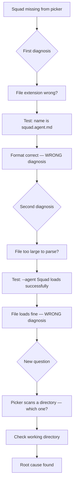
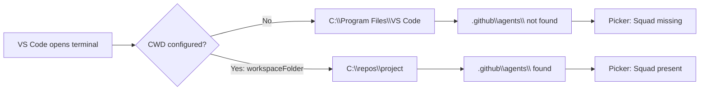

# When the Agent System Stops Recognizing Itself

I asked the AI terminal assistant to tell me why it couldn't find itself.

That sentence sounds like philosophy. It was Tuesday morning. I had work to do. The Copilot CLI agent picker was showing three agents and not showing one — the one I needed, the one that had been working fine last week. The file was there. I could navigate to `.github/agents/squad.agent.md` in the terminal and open it without a problem. The CLI just wasn't surfacing it when I typed `/agent` in interactive mode.

So I asked the system to look at itself and explain the problem.

It told me the file extension was probably wrong.

The file extension is `.md`. It has been `.md` for every agent file I've ever created. The agent I was looking for — Squad, an open-source AI team orchestrator — had been loading correctly with that exact extension for weeks before this moment. The CLI I was using to diagnose the problem was the same CLI that had been running Squad just fine the previous Tuesday.

There is a particular quality to being told, by the tool that's broken, that the problem is a thing that isn't broken. I spent that morning chasing two wrong diagnoses before landing on a root cause that had nothing to do with either of them — a single VS Code setting I had never thought to verify.

This is the story of that debugging session: what I found, what I initially thought I found, and what it taught me about the specific failure mode where your diagnostic tool is the same system you're trying to diagnose.

<!-- IMAGE PROMPT: White female with pink hair sitting at a wooden desk in a misty Pacific Northwest forest clearing, holding up a small hand mirror to a glowing terminal screen, the mirror's reflection shows only a question mark, watercolor illustration, cool grey-blue and seafoam palette with warm amber desktop lamp glow, loose wet-on-wet washes, visible paper texture, soft morning mist through Douglas firs in background trees, no text, no labels, no UI elements -->


*The hardest debugging sessions are the ones where the tool you're using to debug is the tool you're debugging.*

---

## Understanding what the Squad agent system does

Before getting into what broke, the shape of the system matters — because the shape of the failure follows directly from it.

[Squad](https://github.com/bradygaster/squad-cli) is an open-source CLI built around the concept of AI agent teams. Instead of one monolithic assistant that tries to do everything, Squad lets you define specialized agents — each with a role, a persona, a set of rules and tools — and then coordinates them to work together on a project. You build an AI team, and the CLI is how you talk to that team.

Each agent lives in a markdown file in `.github/agents/`. The file defines everything about the agent: its name, what it does, what tools it can use, how it should respond, what it should never do. The naming convention is `[name].agent.md`. So the Squad orchestrator itself lives at `.github/agents/squad.agent.md`.

In interactive mode, you can type `/agent` and get a picker: a list of all the agents the CLI has found by scanning your repository's `.github/agents/` directory. You select the agent you need. It loads that agent's definition into the conversation context, and from that point forward you're working with that agent's persona, tools, and behavioral rules.

My Squad file is substantial. Over months of refinement it grew to roughly 47KB — somewhere around 10,000 words of agent definition. It contains tool configurations, routing logic, behavioral guardrails, a long charter describing what Squad does and doesn't do, formatting conventions, and references to other agents. It's the most complex agent file I have by a significant margin.

The other three agents in my `.github/agents/` directory are much smaller. One is under 5KB. Two are under 10KB. Squad is the outlier by design — the more context it has, the better it routes work.

On a normal day, my workflow is: open VS Code, open the integrated terminal, launch the CLI, type `/agent`, pick Squad, start dispatching work. The whole sequence takes about thirty seconds from opening VS Code to having an AI team running. It's the kind of thing that becomes invisible when it works reliably — you stop thinking about it as a setup step and it just becomes how you start the day.

On May 24, step four produced the wrong list.

<!-- IMAGE PROMPT: White female with pink hair standing at center of a softly glowing web of connected circles, three circles glow clearly and one at the edge is faded and dim, forest dark background, watercolor illustration, midnight blue with warm gold connection lines, loose expressive brushwork, visible paper grain, no text, no labels -->


*An agent team only functions when all its members are discoverable.*

---

## The day the picker showed three instead of four

That Tuesday morning, `/agent` returned three agents. ContentReviewer, PRDWriter, Researcher. Squad was not in the list.

No error. No "failed to load `squad.agent.md`." No warning of any kind. Just absence. The other three agents loaded fine, the picker rendered correctly, and the rest of the CLI was working normally — I could run it in non-agent mode, ask questions, use tools. Everything functioned except that one specific agent wasn't appearing in the discovery list.

My first instinct was file corruption. I navigated to `.github/agents/squad.agent.md` and opened it. The file was intact — all 47KB of it. The YAML frontmatter at the top looked correct. The agent name was defined. The content was what I expected. Nothing was obviously wrong.

My second instinct was that I had accidentally moved the file. I hadn't. It was exactly where it had always been, in the same directory as the three agents that were showing up fine.

My third instinct was to ask the CLI to diagnose itself.

This is where the session gets interesting, and not in a good way.

---

## The first wrong answer

I opened a Copilot CLI session — without the Squad agent, since the picker wasn't surfacing it — and asked: *What is wrong with `squad.agent.md` that you don't recognize it as an agent?*

Here is approximately what came back.

---

**Session exchange, May 24, 2026**

*Me:* What is wrong with `squad.agent.md` that you don't recognize it as an agent?

> The file may not be recognized as a valid agent definition because the agent loader expects files to follow a specific naming convention. Agent files in `.github/agents/` should use the `[name].agent.md` format — so the file needs both the name portion and the `.agent.md` extension. Depending on the loader configuration, there may also be constraints on what characters are valid in the name portion, or requirements that the file be directly in `.github/agents/` rather than in a subdirectory. I'd recommend verifying that the file name matches exactly what the loader expects, and that there's no version mismatch between how the file was created and how the current loader parses it.

---

I read this and had two immediate problems with it.

The file extension: `squad.agent.md` is `[name].agent.md` where name is `squad`. That is the correct format — precisely the format the AI had just described. My other three agents follow the exact same pattern. They were loading fine. If the naming convention were wrong, none of them would load.

The subdirectory concern: the file is directly in `.github/agents/`. Not nested anywhere. I could see it right there.

The AI had looked at the symptoms — an agent file not being recognized — and reached for the most common explanation in that symptom category. File naming issues and path problems are genuinely the first things to check when a config file isn't being picked up. The reasoning was sound. The application was wrong.

I pushed back.

---

*Me:* The file is named `squad.agent.md` and it's directly in `.github/agents/`. Last week agents were recognized from `.github/agents/` and Squad worked fine. The format hasn't changed since then.

> You're right to push back on that. If the file was working with that path and format last week, the naming convention isn't the issue — I shouldn't have led with that. Let me reconsider. One possibility that could cause a file to be silently skipped is file size. Your Squad definition file is significantly larger than typical agent files — if it's approaching or exceeding an internal threshold, the loader might skip it during startup to avoid performance issues. This behavior isn't always documented, but some loaders have soft limits on file size when scanning a directory. The loader might read the directory listing, see the file, and then decide not to parse it because of the size.

---

The AI had pivoted. File format: abandoned. New theory: file size.

That second response landed differently.

<!-- IMAGE PROMPT: White female with pink hair standing before two large weathered wooden signposts in a misty Pacific Northwest clearing, both pointing confidently in different directions with equal certainty, she stands between them with arms crossed looking skeptically at both signs, fog in background, tall Sitka spruce trees at forest edge, watercolor illustration, soft cool grey morning light with muted earth tones, no text anywhere in image -->


*Two confident answers. Neither right. The problem with confident signposts is you might follow one before checking if the road exists.*

---

## Why the file size theory was harder to dismiss

The thing about the second diagnosis: it was at least coherent.

Size-based skipping during startup is a real pattern in config-loading systems. I've run into it in linters that skip large generated files. I've seen it in schema validators that bail on files over a certain threshold. A system that scans dozens of files at startup might reasonably decide to skip files above some limit to keep initialization fast. The Squad file at ~47KB is genuinely unusual — my other agent files are all under 10KB. The gap is real. It's not unreasonable to wonder if there's a limit I'd inadvertently crossed by packing too much content into the definition.

And critically: I couldn't immediately disprove it. The file format diagnosis was easy to refute because I could look at the file name and see it was correct. File size required actually testing behavior. I had no immediate evidence either way.

The AI also framed the second response more carefully. "This behavior isn't always documented" and "soft limits" — that's hedging language, not the confident assertion the first response had. The pushback worked. I had pulled the AI away from pattern-matching into more cautious territory.

Here's the thing about a cautious-but-plausible wrong answer: it's harder to dismiss than a confident wrong one. A confident wrong answer invites immediate pushback. A carefully hedged wrong answer that matches a real pattern in similar systems makes you go do work instead of arguing.

So I went and did the work.

---

## Testing both theories with actual evidence

At this point I had two hypotheses that needed testing, not debating:

1. Something about the file format or location was wrong (the AI's first answer, mostly disproven by visual inspection but worth confirming)
2. The file was too large and the loader was silently skipping it (the AI's second answer, plausible and undisproven)

The fastest test for both was the same: try to load Squad explicitly, bypassing the picker entirely.

The Copilot CLI supports an `--agent` flag. You give it an agent name directly, and it loads that agent without going through the picker discovery process. If `--agent Squad` worked, the file was parseable. If it failed, I'd get an error message with more information.

```powershell
copilot --agent Squad
```

The session started. No error. The agent loaded.

I checked the token count at the start of the session. Then I opened a second session without the `--agent` flag and checked the token count there. The difference was measurable — the session with `--agent Squad` started with significantly more context tokens, by an amount consistent with loading a ~47KB agent definition. The file was being read. It was being parsed. Nothing was skipping it.

I confirmed this a second way: I asked a question that would only produce a characteristic response if Squad's persona was active.

Squad has specific framing it uses when routing work — particular phrasing that reflects its role as an orchestrator, ways of naming agents and describing dispatch decisions that don't appear in generic responses. I asked "what agents do you have available and how should I think about routing work to them?" With `--agent Squad` loaded, I got back Squad's characteristic orchestration language. Without the flag, I got a generic assistant response about agent files.

The file was fine. It had always been fine.

Size wasn't the issue. Format wasn't the issue. The CLI could load and run the file when pointed at it directly. The picker just wasn't finding it.

That realization shifted the question entirely. The picker and the `--agent` flag don't use the same discovery mechanism. The flag takes a name and resolves the file. The picker populates by scanning a directory. If the directory being scanned doesn't contain the file — because the scanner is looking in the wrong place — the file won't appear in the picker even though the CLI can find it another way.

Which directory was the picker scanning?



---

## Finding the actual problem

I opened a fresh PowerShell terminal in VS Code and ran `Get-Location`.

```
C:\Program Files\Microsoft VS Code
```

Not my project directory.

Not `C:\repos\my-project` or wherever the code actually lives. The terminal had started from the VS Code application directory — the folder where VS Code itself is installed, not the folder where my project is.

There it was.

The Copilot CLI populates the agent picker by scanning `.github/agents/` relative to the current working directory. When you're in your project root, it scans `[project-root]\.github\agents\` and finds all your agent files. When you're in `C:\Program Files\Microsoft VS Code`, it scans `C:\Program Files\Microsoft VS Code\.github\agents\` — a path that doesn't exist.

The three agents that were showing up in the picker — ContentReviewer, PRDWriter, Researcher — those were discoverable for a different reason. I had loaded them using `--agent` flags in earlier sessions, which seeds the agent into session context regardless of CWD. Those sessions had cached something useful. Squad, which I had always loaded exclusively through the picker, had no such fallback. When the picker scanned from the wrong directory and found nothing, Squad vanished from the list.

I had been opening VS Code and the integrated terminal had been launching from the application installation directory instead of the workspace directory. Every time. For an unknown period of time. And nothing else had broken, so I had never noticed.

The VS Code integrated terminal uses the application directory as its default CWD when no workspace configuration specifies otherwise. The fix is a single line in VS Code's `settings.json`:

```json
{
  "terminal.integrated.cwd": "${workspaceFolder}"
}
```

`${workspaceFolder}` is a VS Code variable that resolves to the root of the currently open workspace. When the integrated terminal opens, it starts there instead of wherever VS Code is installed. After adding this setting, I closed the terminal, reopened it, ran `Get-Location`, and got my project root. Then I launched the CLI and typed `/agent`.

Squad was in the picker.



<!-- IMAGE PROMPT: White female with pink hair seated at a clean minimal wooden desk, a single laptop screen glows with a code editor showing a settings file with one line highlighted in warm amber, her expression is calm and relieved, warm late afternoon Pacific Northwest light streams through a large window, tall evergreen trees visible outside in soft gold-hour light, watercolor illustration, warm amber and soft sage green tones with cool blue shadows, loose expressive brushwork, visible paper grain, no readable text in image -->


*The file was never broken. The path was never wrong. The working directory just needed to know where home is.*

---

## The problem with asking a broken system to explain itself

Here's what I want to slow down on, because the debugging experience itself is the more interesting thing.

The AI gave two wrong answers. Both wrong answers were drawn from real patterns — file naming issues and size-based skipping are both genuine causes of config-loading failures. The AI wasn't hallucinating anything exotic. It was pattern-matching from a reasonable knowledge base about how agent loaders generally work.

What it couldn't do was introspect on the specific state of its own operating environment.

This is the distinction that matters: the AI can reason about its configuration files. It can reason about naming conventions, file formats, YAML syntax, agent loader behavior as described in documentation. What it cannot reliably tell you is where it is. The working directory, the shell version, the PATH that was active when the process launched, which profile loaded — all of that is opaque to it unless you explicitly pass the information in. It doesn't know that VS Code opened the terminal from the wrong directory. It has no signal from the operating system about its own launch context. All it can do is reason from what it knows about how these systems generally work, and generate the most plausible explanation it can find within that space.

In this case, the problem was below that space.

Think about what the AI actually has access to when you ask it to diagnose why it isn't finding an agent file. It has the conversation history. It has whatever tools it can invoke — read a file, run a command if you ask it to. It has general knowledge about agent loaders, file formats, CLI tools. What it doesn't have is a live feed from the operating system saying "you were launched from `C:\Program Files\Microsoft VS Code` and here's why that matters."

The format diagnosis came from: "agent files have naming conventions, and when an agent isn't found, the naming convention is the first thing to check." That's correct reasoning. Incorrect application.

The size diagnosis came from: "this file is unusually large, and some loaders have size constraints, and that could explain silent skipping." Also correct reasoning. Also incorrect application to this specific situation.

Both answers were reasonable extrapolations from general knowledge. Neither answer engaged with the actual environment, because the actual environment wasn't in scope.

<!-- IMAGE PROMPT: White female with pink hair standing at the edge of a deep misty Pacific Northwest ravine, holding a brass lantern that casts warm golden light illuminating only a small circle of ground directly below her feet, the path ahead disappearing into cool blue-grey mist, ancient cedar trees on both sides, she looks down at the illuminated ground rather than ahead into the darkness, watercolor illustration, dramatic contrast between warm lantern gold and cool misty blues, loose expressive washes, no text -->


*An AI can illuminate the files it knows about. The operating environment — where the process launched, what the shell thinks is home — sits below the light.*

---

## What I call the blind spot at the operating layer

I've started thinking about this as a specific class of AI diagnostic failure: the blind spot at the operating layer.

There are roughly three layers where a problem in an AI-assisted workflow can live:

**Configuration layer** — file contents, formatting, naming conventions, YAML syntax. The AI can read and reason about these with high reliability. If your agent file has malformed YAML or the wrong extension, the AI can tell you that with confidence.

**Application layer** — how the tool behaves given its inputs, what the tool's documentation says about its behavior, what the tool's known bugs or limitations are. The AI can reason about this with moderate reliability, depending on how well the tool is documented in its training data. This is where the file size hypothesis came from — a real pattern in the general space of config loaders, applied incorrectly to this specific loader.

**Operating layer** — working directory, environment variables, PATH, shell profile, process launch context. The AI has essentially no live visibility into this unless you give it tools and ask it to check. This is where my actual problem lived.

When the AI diagnoses a problem at the configuration layer, it tends to be reliable. The diagnosis of "your YAML frontmatter is malformed" or "you're missing a required field" is usually accurate. When it diagnoses at the application layer, it depends — broad patterns are often right, but specific behavior requires current documentation, and current documentation may not match what the AI was trained on. When the problem is at the operating layer, the AI is reasoning almost completely in the dark unless you explicitly surface the environment state first.

The practical implication: whenever the AI gives you a configuration or application-layer diagnosis and the file looks correct and the format looks correct, stop arguing about those things and start looking at the operating layer. The AI can't lead you there. You have to walk there yourself.

I tested what happens when you do explicitly surface the environment state. After the Squad debugging session, I ran a different experiment: I told the AI exactly where the terminal was running from before asking anything else.

*Me:* The terminal is running from `C:\Program Files\Microsoft VS Code`. I'm trying to use the CLI's agent picker and it's showing fewer agents than I expect. What might explain that?

> If the CLI is running from `C:\Program Files\Microsoft VS Code`, it's likely scanning for agent files in `.github/agents/` relative to that directory — which is the VS Code application folder, not your project. The agent picker should find agent files relative to your working directory. If you need the picker to show agents from your project, you'll need to either navigate to your project root before launching, or configure your terminal to open in the project directory by default.

That is the correct diagnosis. Not pattern-matching from general knowledge about file formats — a direct answer to the environmental state I described. The information was there. The AI could reason about it. I just had to give it the context first, rather than expecting it to generate the context from nothing.

This is the most actionable takeaway from the whole session: the AI's diagnosis is only as good as the context it's given. For operating-layer problems, the context doesn't exist in the conversation unless you put it there. The AI has no ambient awareness of the environment. Surface the environment explicitly, and the diagnosis often becomes much more useful in the first exchange.

---

## Why graceful degradation made this harder to find

One thing that made the situation particularly difficult to diagnose was that the system degraded gracefully.

The CLI worked. I could use it for almost everything. The three smaller agents appeared in the picker. The tools ran. Nothing crashed, nothing threw an exception, nothing logged a warning to the terminal. The only visible symptom was a shorter picker list than I expected.

Graceful degradation is generally a feature. You want systems to keep running when they encounter something they can't fully process, rather than crashing because one file wasn't parseable. In this case, though, graceful degradation turned what should have been a loud "I cannot find your agent directory" into a quiet "here are the agents I found" — which happened to be an incomplete list that I didn't immediately recognize as incomplete.

If the picker had said "scanning `.github/agents/` from `C:\Program Files\Microsoft VS Code`" somewhere in its output, I would have caught this in thirty seconds. If it had logged "no `.github/agents/` directory found at current working directory," I would have known exactly where to look. Instead it rendered a three-item list and left me to figure out why the list was short.

The silence of the failure directed my attention to the wrong place. Because the picker returned a result (three agents), I assumed the picker was working. I went looking for what was wrong with the file. Nothing was wrong with the file.

There's a lesson here about how failure modes shape investigation. A complete failure — nothing in the picker, an error message — would have been easier to debug than a partial failure that looked like success. The partial failure created a plausible story: "some agents load, Squad doesn't, something is wrong with Squad." The complete failure would have created a different plausible story: "nothing loads, something is wrong with the discovery system." The second story is closer to the truth.

I don't have a strong opinion on whether the CLI should have been noisier here. Logging the CWD on every launch would get annoying. But "agent directory: [resolved path]" in a verbose mode would have saved me a morning.

---

## What confident wrong answers look like in practice

Looking back at both diagnoses, there are patterns in how the AI expressed confident incorrectness that I want to document for my own future reference.

The first answer — file format — came back without qualification. "The file may not be recognized because the agent loader expects a specific naming and extension pattern." No hedging. No "but if you've been running this successfully before, that's less likely." Just the diagnosis, stated as a plausible explanation without accounting for the contradicting evidence (three other files in the same format, working fine).

The pushback broke that confidence immediately. As soon as I said "this was working last week," the AI dropped the format theory and pivoted. That tells me the first answer was surface-level pattern matching — "symptom X maps to common cause Y" — without the AI checking whether Y was consistent with everything else I had told it.

The second answer was structurally different. It came with explicit uncertainty markers: "isn't always documented," "soft limits," "could cause." It acknowledged that I'd already ruled out the previous hypothesis. It engaged with the specific detail (file size) rather than the generic category (file format). It was a better answer, epistemically. It was still wrong, but it had earned more of my trust before I disproved it.

When I think about how to use AI diagnostic assistance more effectively, this contrast is useful. The first answer was confident and immediately provable wrong through basic inspection. The second answer was hedged and required an actual test. Both were wrong in the end, but they require different responses: the first should trigger "let me verify this with my own eyes," and the second should trigger "let me run a quick test to confirm or deny."

In both cases, neither response should have been "accept this and start changing files." But I see why people do that — the first answer was presented with enough authority that it might have convinced someone to rename their file before checking if the name was actually wrong.

---

## When your workflow depends on AI tools

I use AI tools heavily in daily development work. The Copilot CLI, Squad, various scripts that chain agents together. My workflow depends on these tools being available. When they break, I lose access to capabilities I rely on for a significant portion of my daily work.

This creates a specific loop problem that traditional software debugging doesn't have: my diagnostic tool is the same system I'm diagnosing. In this session, I got lucky — the CLI was partially functional, so I could still use it to ask questions even while the agent picker was broken. But I've had sessions where the CLI wouldn't start at all, or where a critical tool the CLI uses wasn't available, and in those cases I was debugging blind.

The experience has pushed me toward a few practical changes in how I think about AI-dependent workflows:

**Identify the fallback first.** Before a tool breaks, know what you'll do when it does. If I know the CLI supports `--agent Squad` as a direct flag, I can use that when the picker breaks. If I know I can run agents from a different terminal, I can fall back there when VS Code's integrated terminal has wrong CWD. Build the fallback into the mental model before the failure happens, not after.

**Document what "working" looks like.** I now have a quick sanity-check sequence I run when starting a new session:

```powershell
Get-Location
Test-Path .github/agents
Get-ChildItem .github/agents
```

Thirty seconds. If any of those three outputs are wrong, I know immediately — before launching the CLI, before asking the AI anything. The correct outputs are: my project root, `True`, and a list of four agent files including `squad.agent.md`. If I get something different, the problem is in my environment, not in the AI.

**Accept that self-diagnosis has a specific coverage gap.** The AI is good at diagnosing problems within the scope of what it can observe — file contents, format, documented behavior. It cannot reliably diagnose problems in its own operating environment, and it won't tell you that unless you ask it to check. "What directory are you running from?" is a question I should have asked immediately. I didn't, because I assumed the answer was obvious. It wasn't.

---

## What I actually changed

The VS Code settings fix is one line:

```json
{
  "terminal.integrated.cwd": "${workspaceFolder}"
}
```

I added this to my user-level VS Code settings so it applies to every workspace. I also added it explicitly to `.vscode/settings.json` in the projects where I use CLI tools that depend on relative path discovery, so new contributors working on the same project won't hit the same issue:

```json
{
  "terminal.integrated.cwd": "${workspaceFolder}",
  "terminal.integrated.defaultProfile.windows": "PowerShell"
}
```

The `defaultProfile` line is unrelated to the original bug. I added it at the same time to remove another assumption I'd been making about which shell was opening by default.

After making this change, I closed and reopened VS Code, opened the integrated terminal, ran `Get-Location` to verify I was in the project root, and launched the CLI. `/agent` returned all four agents. The fix took thirty seconds to apply. Finding it took three hours.

The disproportion there is worth sitting with. A single misconfigured setting had been invisibly shaping my tool behavior for an unknown amount of time. I don't know when VS Code started defaulting the integrated terminal to the application directory — it might have been a VS Code update, it might have been a settings migration, it might have been something about how I set up this particular machine. I never noticed because everything else worked.

The category of bug that's invisible because only one specific workflow path is affected, and that path fails silently, is a genuinely hard bug class. There's nothing to alert you. The system is doing exactly what it's configured to do. You just don't know what it's actually configured to do.

---

## What this debugging session changed about how I work

A few concrete things that are different now:

**The startup check is non-negotiable.** Running `Get-Location` before launching any CLI tool that depends on relative paths takes one second and has already caught two other issues since the Squad debugging session. Both were CWD-related. Both would have cost me time if I'd noticed them after the tool was already running.

**I front-load environment context when asking the AI to diagnose.** Instead of "what is wrong with X," I now say "I'm running from [directory], the tool version is [Y], the file is at [Z], it was working on [date], and here's what I see." The more environmental context I give upfront, the better the diagnosis. The AI doesn't know where it is. Tell it.

**I test theories immediately rather than debating them.** The file size theory was wrong, but I found out it was wrong in about five minutes by running `--agent Squad`. If I had kept arguing with the AI about whether size limits exist in agent loaders, I would have spent twenty minutes in conversation to learn what five minutes of testing would have shown me. The AI is a useful source of hypotheses. It is not a reliable source of confirmed diagnoses.

**I know where the operating-layer blind spot is.** If the AI gives me a diagnosis that's about file format or naming convention, and I can look at the file and see the format is correct, I stop looking at the file. The problem is somewhere the AI can't see. Start checking environment — CWD, PATH, version, profile, env variables. One of them is wrong.

## Verifying AI tool environments before they break

After this session, I went back through every CLI tool in my workflow and asked a question I'd never systematically asked before: does this tool depend on working directory, and have I verified that assumption?

The answer for the Copilot CLI was obviously yes. But I found the same unchecked assumption in three other places. A script that generates reports by reading files with relative paths. A linter config that resolves plugins relative to where it's invoked. A test runner that looks for fixtures in a directory relative to CWD. None of them had failed visibly. All of them had been silently operating in ways I hadn't verified.

The pattern is consistent: tools that use relative-path discovery fail silently when run from unexpected locations. They don't crash. They just return fewer results, miss files, or behave as if part of your project doesn't exist. The failure is partial and quiet, which is why it doesn't surface until you need the thing that's missing.

I now do a brief setup-verification pass when I start working in any project that has CLI tools:

```powershell
# 1. Where am I?
Get-Location

# 2. What's at this location that the tools need?
Test-Path .github/agents      # agent definitions
Test-Path .vscode/settings.json  # VS Code workspace config
Test-Path package.json        # or whatever the project root marker is

# 3. What version of the key tools?
node --version
git --version
```

This isn't sophisticated. It's thirty seconds of checking the ground before I start building on it. The Squad incident converted this from something I'd do when things broke into something I do before anything breaks.

For new project onboarding specifically, I now check `.vscode/settings.json` before I do anything else in a project. If `terminal.integrated.cwd` isn't set, I set it. If it is set to something other than `${workspaceFolder}`, I investigate why before assuming it's intentional.

One thing I still don't know: whether Squad was ever actually behaving incorrectly even when loaded with `--agent Squad`, during the period when the CWD was wrong. The agent definition includes some paths and patterns that are relative to the project root. If those paths weren't resolving correctly, some features might have been silently failing. I didn't go back through session history to check. That's still an open question.

If you're running an AI terminal assistant with local agent definitions, the working directory setting is worth ten seconds of your time to verify. Don't wait for an agent to disappear from the picker to find out. Don't wait for the AI to tell you the file extension is wrong.

Open a terminal. Run `Get-Location`. Make sure you're home.

---

*Squad CLI is open source at [bradygaster/squad-cli](https://github.com/bradygaster/squad-cli). The VS Code `terminal.integrated.cwd` setting is covered in [VS Code's terminal documentation](https://code.visualstudio.com/docs/terminal/basics#_terminal-working-directory).*
