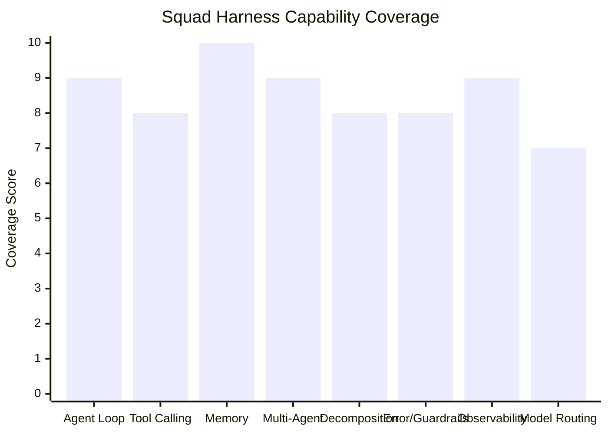
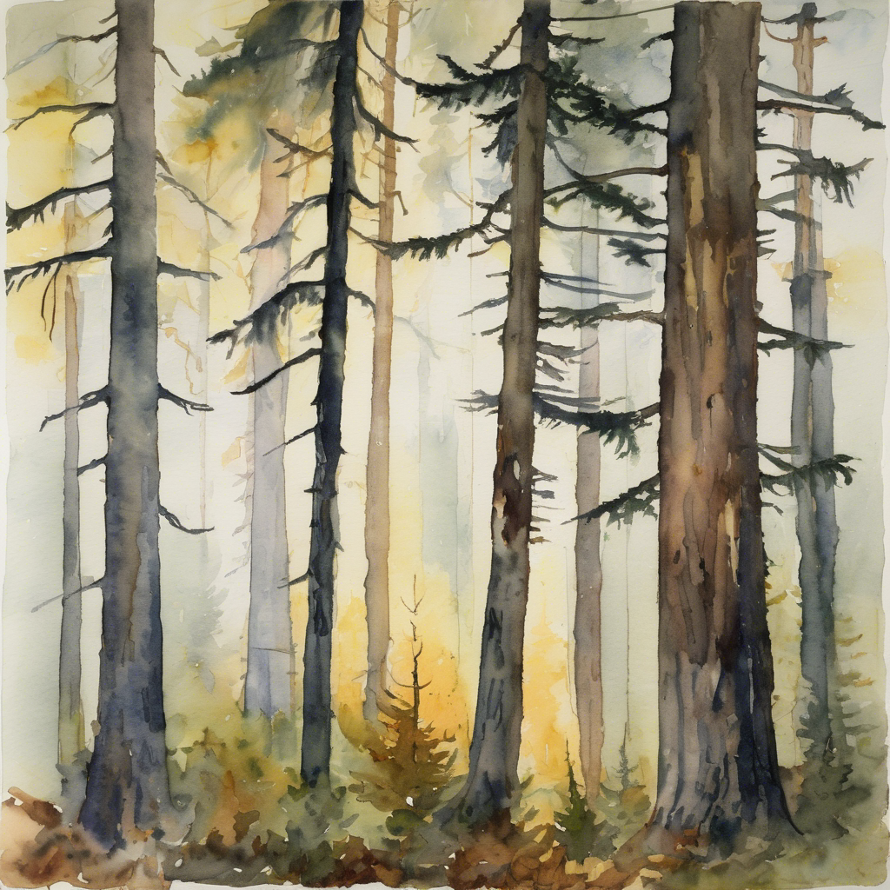
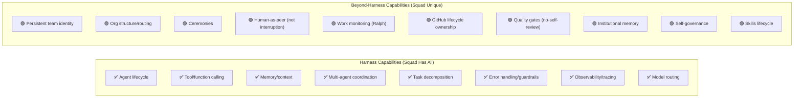

<!-- WATERCOLOR PROMPT (cover):
Pacific Northwest watercolor, early autumn morning. Bellingham Bay at dawn, pale gold light just breaking through silver-gray mist. A single lighthouse stands at the frame's edge, its beam dissolving into fog. On the water, concentric rings of small wooden boats recede into the haze — the innermost ring clearly lit, the outermost barely visible silhouettes. No labels or text. Loose watercolor washes, slight grain texture. Palette: slate blue water, warm amber light, silver-gray mist, touches of deep forest green on the distant shoreline. Expressive and loose, not tight or illustrative. No human figures.
-->


Someone asked me what Squad was, and I fumbled the answer.

I said something like "it's a multi-agent orchestration system built on top of GitHub Copilot CLI." That's not wrong. But it's not satisfying either. It doesn't locate Squad in the landscape of everything else being built right now — LangChain, AutoGen, CrewAI, OpenAI Agents SDK, Google ADK. It doesn't explain what Squad does that those things don't. And it doesn't answer the question I actually started to care about: *what layer is Squad operating at?*

I kept seeing the term "agent harness" pop up in documentation and architecture diagrams. LangChain uses it. Anthropic has a whole engineering post about harness design. arXiv has a paper titled "Code as Agent Harness." The term felt like it wanted to mean something specific. So I decided to actually pin it down. Here's what I discovered and what I think it means.

---

## The Problem with "Agent"

Before we can talk about harnesses, we need to be honest about how overloaded the word "agent" has become.

"Agent" currently means all of the following depending on who's talking:

- A model with tool-calling enabled
- A stateful process that loops until a goal is met
- A microservice with an LLM inside
- A persona with a name and a set of instructions
- An autonomous workflow participant
- A node in a graph

These aren't the same thing. And the confusion bleeds into every conversation about agent architecture, agent tooling, and agent governance. When someone asks "what harness are you using?" they might mean the framework, the runtime, the SDK, the platform, or just the system prompt configuration. The vocabulary hasn't settled.

The term "agent harness" is an attempt at precision. It tries to name the specific layer that sits *around* the model but *below* the user-facing application. Let's try to get specific about what that actually means.

---

## What Is an Agent Harness? The Consolidated Definition

I surveyed seven distinct sources that each offer a definition. They don't perfectly agree, but they converge on something useful.

### The Sources

**LangChain** ([The Anatomy of an Agent Harness](https://www.langchain.com/blog/the-anatomy-of-an-agent-harness), [Agent Frameworks, Runtimes, and Harnesses](https://www.langchain.com/blog/agent-frameworks-runtimes-and-harnesses-oh-my)) puts it bluntly: "Agent = Model + Harness." And then: "If you're not the model, you're the harness." Their definition covers every piece of code, configuration, and execution logic that isn't the model itself — state management, tool execution, feedback loops, constraints, prompts, infrastructure glue, orchestration logic, hooks.

**Parallel.ai** ([What Is an Agent Harness?](https://parallel.ai/articles/what-is-an-agent-harness)) describes it as "software infrastructure that wraps around an LLM, handling everything except the model itself." Slightly more mechanical, but consistent.

**Salesforce** ([Agent Harness](https://www.salesforce.com/agentforce/ai-agents/agent-harness/)) frames it from an enterprise angle: "the operational software layer that manages an AI's tools, memory, and safety." They're emphasizing governance more than others, which makes sense given their context.

**arXiv's "Code as Agent Harness" paper** ([arxiv.org/abs/2605.18747](https://arxiv.org/abs/2605.18747)) offers the most technical definition: "the operational substrate connecting agents to reasoning, action, environment modeling, planning, memory, tool use, feedback-driven control, and multi-agent coordination." This is the most comprehensive — it reads like a capabilities checklist.

**Anthropic's engineering blog** ([Harness Design for Long-Running Apps](https://www.anthropic.com/engineering/harness-design-long-running-apps)) focuses on the harness as "an external system that decomposes work, manages structured handoffs, resets context, and coordinates generator/evaluator/planner agents." They're writing from the perspective of building production applications, so their definition is architectural rather than theoretical.

**Credal** ([Agent Harness vs Agent Runtime](https://credal.ai/blog/agent-harness-vs-agent-runtime)) lands on: "application-layer scaffolding that turns a model into an agent." Short, quotable, but a bit circular (it uses "agent" to define "harness").

**Tejas Kumar** (AI Developer Advocate at IBM) in his talk ["Harnesses in AI: A Deep Dive"](https://www.youtube.com/watch?v=C_GG5g38vLU) offers a five-component definition: Tool Registry, Model, Context Management, Guardrails, and Agent Loop. His definition: "the comprehensive, deterministic infrastructure that wraps a black-box AI model, providing reliability, guardrails, context, validation, and safety so it can perform real-world tasks repeatedly and accurately." Notably — and unusually — Kumar includes the *model itself* as a component of the harness, not as something external that the harness wraps. That's a direct contradiction of LangChain's clean boundary ("if you're not the model, you're the harness"). It's also where his sharpest insight lands: "The model is commodity. The harness is moat."<sup>[10]</sup> If the model is commodity, then making it a swappable internal component of the harness is architecturally honest — you route to whatever model fits the task, and the harness is the differentiator.

### The Synthesis

Across all seven, a consolidated definition emerges:

> **An agent harness is the operational layer between a raw language model and a user-facing application. It provides the execution environment, tool access, memory management, agent lifecycle control, coordination logic, and safety constraints that transform a model into a goal-directed agent.**

Or even shorter: **a harness is what makes a model behave like an agent.**

The harness is *not* the model. It's *not* the application you're building. It's the operational scaffolding in between.

One taxonomic dissent worth noting — and I find this genuinely interesting as a boundary-drawing question: Kumar's definition puts the model *inside* the harness rather than outside it. Most sources draw a hard line here — LangChain's formulation ("if you're not the model, you're the harness") treats the boundary as the whole point. Kumar's framing says: if the model is just a commodity component you swap in and out, why treat it as categorically separate? Both views are coherent. They reflect different mental models of what the harness *is for* — boundary-drawing vs. capability-bundling.

---

## The Taxonomy: A Layered View

Here's the thing I kept running into: "harness" doesn't exist in isolation. It sits in a stack. Different products operate at different layers, and a lot of confusion comes from conflating them.

After working through the research, I landed on this taxonomy:

```mermaid
graph TB
    subgraph L5["Layer 5: User-Facing App / Managed Platform"]
        APP["IDE Copilot | Production App | SaaS Platform"]
    end
    subgraph L4["Layer 4: Agent Harness (Opinionated Wrapper)"]
        HARNESS["Tool execution · Memory · Agent loop · Prompts · Policies · Safety"]
    end
    subgraph L3["Layer 3: Agent Runtime (Durable Execution)"]
        RUNTIME["Persistence · HITL · Tracing · Isolation · Long-running processes"]
    end
    subgraph L2["Layer 2: Agent Framework (Abstractions)"]
        FRAMEWORK["Models · Tools · Agents · Graphs · Chains"]
    end
    subgraph L1["Layer 1: Model + Raw APIs"]
        MODEL["GPT-4o · Claude · Gemini · Llama"]
    end

    APP --> HARNESS
    HARNESS --> RUNTIME
    RUNTIME --> FRAMEWORK
    FRAMEWORK --> MODEL

    style L5 fill:#2d2d2d,stroke:#888
    style L4 fill:#1a3a5c,stroke:#4a8fcc
    style L3 fill:#1a3a2a,stroke:#4acc8f
    style L2 fill:#3a2a1a,stroke:#cc8f4a
    style L1 fill:#2a1a3a,stroke:#8f4acc
```



The important thing about this taxonomy: each layer can exist independently. You can build an agent framework without ever touching a harness. You can build a harness on top of multiple frameworks. You can expose a harness through multiple applications. The layers are composable — not coupled.

---

## The Product Landscape

Where do actual products fit? My research placed them roughly like this:

```mermaid
quadrantChart
    title Agent Product Landscape: Abstraction vs. Scope
    x-axis Low Abstraction (close to model) --> High Abstraction (far from model)
    y-axis Single Agent --> Multi-Agent / Team
    
    Claude Agent SDK: [0.25, 0.35]
    LangChain: [0.35, 0.5]
    Semantic Kernel: [0.3, 0.45]
    Mastra: [0.4, 0.5]
    AutoGen: [0.5, 0.75]
    CrewAI: [0.6, 0.8]
    Google ADK: [0.45, 0.6]
    LangGraph: [0.3, 0.7]
    OpenAI Agents SDK: [0.45, 0.55]
    AWS AgentCore: [0.55, 0.45]
    Google Agent Platform: [0.7, 0.65]
    AWS Bedrock Agents: [0.65, 0.6]
    Squad: [0.85, 0.95]
```

Breaking it down by layer:

| Layer | Products |
|---|---|
| **Frameworks** | LangChain, AutoGen, CrewAI, Semantic Kernel, Google ADK, Mastra |
| **Runtimes** | LangGraph, AWS AgentCore |
| **Harness SDKs** | Claude Agent SDK, Deep Agents |
| **Platforms** | Google Agent Platform, AWS Bedrock Agents |
| **Mixed / Spanning** | OpenAI Agents SDK |

Notice something: the frameworks cluster together. The platforms cluster together. But there's a gap in the taxonomy at the top — where you'd put something that manages *teams* of agents with organizational structure and governance rather than just coordinating individual agents.

That gap is where I eventually realized Squad lives. But let me get there through the comparison first.

---

## Harness Capabilities: The Checklist

Before I can evaluate Squad against the harness definition, I need to make the capabilities concrete. Synthesizing across all sources, here are the eight core capabilities of an agent harness:

1. **Agent loop / lifecycle management** — controlling when an agent starts, runs, pauses, retries, and terminates
2. **Tool / function calling** — connecting the agent to external capabilities (APIs, code execution, file access, web search)
3. **Memory / context management** — short-term context window management and longer-term persistent state
4. **Multi-agent coordination** — passing work between agents, managing handoffs, preventing conflicts
5. **Task decomposition / planning** — breaking a goal into executable steps
6. **Error handling / retry / guardrails** — managing failures, applying safety constraints, enforcing policies
7. **Observability / tracing** — logging what agents do, why, and what happened
8. **Model routing / provider flexibility** — selecting which model handles which task

These eight aren't exhaustive, but they're the capabilities that appear consistently across all the definitions. A harness that's missing several of these is probably a partial harness — closer to a simple wrapper.

Let's now look at how Squad measures up.

---

## Does Squad Have Harness Capabilities?

Before I can compare, a brief orientation: **Squad is a multi-agent team system I built on top of GitHub Copilot CLI.** It manages a roster of named AI agents — each with a defined role, personality, and charter — that collaborate on software engineering tasks through structured protocols. Think of it as an AI engineering team with its own operating manual, org chart, and institutional memory. The agents have Muppet-inspired names: Kermit-the-builder leads, Gonzo-the-journalist scribes, Ralph monitors work queues.

With that context, let's see how Squad maps against harness capabilities.

<!-- WATERCOLOR PROMPT (comparison):
Pacific Northwest watercolor, early autumn morning. A craftsman's wooden workbench near a fog-streaked window, pale gold light angling in from the left. Eight hand tools — planes, chisels, squares, clamps — are arranged on the bench, each distinct in shape and purpose, laid out with intention but not rigidity. No labels or text cards. Outside the window: a stand of Douglas firs in early morning mist. Loose watercolor washes for the background and window, slightly crisper strokes for the tools. Palette: slate blue-gray shadows, warm amber wood tones, silver-gray fog light, deep forest green outside. No human figures.
-->


Let's go through the checklist honestly.

### 1. Agent Loop / Lifecycle Management ✅

Squad manages the full agent lifecycle. When a task arrives — whether from a GitHub issue, a Ralph work-scan, or a direct user request — Squad routes it to the right agent, spawns that agent with the right context, collects results, and chains follow-up tasks. Agents don't run open-ended loops; they run discrete turns with structured outputs, and the orchestration layer decides what happens next.

This is lifecycle management, but Squad's version is *ceremonial* — there are named phases, defined handoff points, and explicit decision checkpoints. It's not just "keep running until done."

### 2. Tool / Function Calling ✅

Agents in Squad get broad CLI tool access — grep, file editing, bash execution, web search, GitHub CLI, Azure DevOps CLI — delegated from GitHub Copilot CLI's tool layer. Squad doesn't implement tool calling itself; it inherits the capability from the underlying runtime and adds routing logic on top.

The nuance here: Squad's tool access is *role-appropriate*. A reviewer agent and a coding agent theoretically have the same tools available, but their charters and skill sets shape which tools they actually use. The harness provides the tools; Squad provides the character.

### 3. Memory / Context Management ✅

This is where Squad starts to diverge from a typical harness implementation in interesting ways. Squad has three types of memory:

- **`decisions.md`** — the team's shared brain, recording key decisions with rationale, author, and date. Any agent can read this. Any agent can write to it. It accumulates across sessions.
- **`history.md`** — each agent's personal history file, tracking their individual contributions, what they worked on, what they learned. It's a personal journal, not just a context window.
- **Orchestration logs** — the Scribe writes structured logs of every team activity, creating a queryable audit trail.

This goes beyond context window management. Squad has *institutional memory* — knowledge that outlasts any individual session or agent invocation. The decisions made last month are still in `decisions.md`. The patterns Scribe observed are summarized in history. The skills the team discovered are formalized and available for routing.

### 4. Multi-Agent Coordination ✅

Squad uses a drop-box pattern for multi-agent coordination: agents write outputs to designated files rather than directly communicating or modifying each other's work mid-flight. This prevents file conflicts and avoids the race conditions that plague naive parallel agent systems.

Beyond the drop-box, Squad has *fan-out and fan-in* patterns for parallel work: Lead decomposes a task, multiple agents execute independently, results are collected and synthesized. The coordination is orchestrated rather than emergent — there's a defined protocol.

### 5. Task Decomposition / Planning ✅

Squad's Lead agent (currently Kermit-the-builder) handles PRD mode: given a product specification, Lead decomposes it into work items, assigns them to agents based on the routing table, and tracks completion. Issue routing from GitHub is another form of decomposition — determining which agent owns which type of work.

The decomposition logic is explicit and inspectable. You can look at the routing table and understand why a given issue went to a given agent. It's not a black box.

### 6. Error Handling / Retry / Guardrails ✅

Squad has a rejection protocol for reviews: if a Reviewer agent rejects work, the original author is strictly locked out — they cannot produce the next version, contribute to the revision, or even advise on the fix. A completely different agent must own the revision independently. If that revision also gets rejected, the second author is locked out too. This escalates until resolved or a human intervenes. It's a hard safety constraint that prevents quality-degrading loops where an agent keeps churning on the same bad output.

There's also retry logic in the orchestration layer for agent spawning failures, and guardrails in the form of the `guardrails.md` file which defines trust boundaries that no agent should cross.

### 7. Observability / Tracing ✅

The Scribe agent (Gonzo-the-journalist in Squad's current roster) writes structured orchestration logs for every team activity. These logs capture: which agent did what, when, what decision was made, what the output was, and any rejection or escalation events. The logs are committed to the repository and persist as permanent history.

This is stronger observability than most harnesses provide by default. The logs aren't just telemetry — they're a readable, searchable narrative of what the team has done.

### 8. Model Routing / Provider Flexibility ✅

Squad has a tier system for model selection:
- **Premium tier** — complex reasoning, architectural decisions, writing
- **Standard tier** — general coding, investigation, review
- **Fast tier** — quick checks, simple transformations, status updates

Each agent's charter specifies which tier is appropriate for their role. The orchestration layer can override this for specific tasks. This is explicit model routing rather than implicit — you can look at any agent invocation and understand which model was used and why.

---

### The Verdict on Harness Capabilities



Squad covers all eight harness capabilities I identified. In some cases — memory, observability — it goes significantly beyond what a typical harness provides. In others — tool calling, model routing — it inherits from the underlying platform and adds a thin Squad-specific layer.

So: **Squad is a harness.** Definitionally. It does everything a harness does.

But calling Squad a harness would be like calling a team's project management system a "task list." Technically accurate. Descriptively wrong. Let me explain what Squad does that doesn't fit the harness definition.

---

## What Squad Does Beyond a Harness

<!-- WATERCOLOR PROMPT (team identity):
Pacific Northwest watercolor, early autumn morning. A circle of old-growth Douglas firs in the Olympic Peninsula — each tree distinct in height, bark texture, and canopy shape, but their crowns interweave into a shared canopy above. Morning mist threads between the trunks, catching pale gold light from above. A few upper branches carry early autumn amber. The feeling is an established community, not a planted row. No text, no figures. Loose, expressive watercolor, no hard outlines. Palette: deep forest green, silver-gray mist, warm amber in the upper canopy, slate blue in the shadowed lower trunks.
-->



This is the part I find genuinely interesting. Squad has ten capabilities that aren't in any harness definition I found. Not as gaps in the research — as things that don't belong at the harness tier at all.

### 1. Persistent Team Identity

Squad's agents aren't anonymous processes. They have names drawn from fictional universes (Muppets, in the current Squad roster). They have charters — written documents that define their role, their expertise, their personality, their escalation behavior. They have personal `history.md` files that accumulate across sessions.

This isn't just cute. Identity enables accountability. When Kermit-the-builder makes an architectural decision, that decision is attributed to Kermit. When Gonzo-the-journalist writes an orchestration log, it's Gonzo's voice. Identity also enables routing — you can make claims like "this task needs the Kermit-class Lead agent" rather than "spawn an agent with these capabilities."

The harness tier doesn't have a concept of *who the agent is*, only *what it can do*.

### 2. Organizational Structure

Squad has an org chart. Not a metaphorical one — a literal assignment matrix that maps task types to agent roles, defines escalation paths, and specifies which agents have authority over which decisions.

The `loop.md` file is the operating protocol — it defines how the team works, what ceremonies happen when, and how decisions get made. This is organizational design applied to AI coordination. It's closer to a team handbook than a software configuration file.

### 3. Ceremonies

Squad has structured team rituals: design reviews where architectural decisions get vetted before implementation begins; retrospectives where the team reflects on what worked; onboarding ceremonies when a new agent is added to the roster. These ceremonies have facilitators, defined inputs and outputs, and expected durations.

Ceremonies exist because teams need shared checkpoints — moments where the whole team aligns before moving forward. Individual agents benefit from fast loops. Teams benefit from periodic synchronization. Squad bakes this in.

There is no concept of a "ceremony" in any harness definition I found. The harness tier is about executing work, not about how the team aligns around the work.

### 4. Human-in-the-Loop as Peers

Most harness and framework designs treat human-in-the-loop (HITL) as an interruption: the agent pauses, asks the human something, waits for a response, continues. The human is an external authority who gets consulted.

Squad treats the human as a team member on the roster. The human (in this case, me) is listed in the same assignment matrix as the agents. Certain tasks are explicitly routed to the human: trust decisions, external communications, sensitive judgments. The human doesn't interrupt the flow — they're *in* the flow.

This is a philosophically different model of human-AI collaboration. The harness tier doesn't have team rosters.

### 5. Work Monitoring and Pipeline Driving

Ralph (the Work Monitor agent in Squad) continuously scans GitHub for open issues, PRs, and work items. Ralph doesn't wait to be asked — Ralph polls the work queue, identifies what's ready, and drives it through the pipeline.

This means Squad has *ambient work awareness*. The team doesn't stop because no one explicitly assigned a task. Ralph finds the work and routes it. This is more like a project management system than an execution harness.

### 6. GitHub Lifecycle Integration

Squad manages the full GitHub lifecycle as a first-class concern: issues get opened, triaged, assigned; branches get created from the right base; PRs get opened with the right description and target; reviewers get assigned; merge decisions get made. Every piece of work is traceable to a GitHub object.

The integration isn't bolted on. It's the spine of the system. Squad agents are GitHub-native.

This is different from "tool calling" in the harness sense. A harness gives agents access to GitHub API calls as tools. Squad has a *philosophy* about how GitHub workflow should map to team workflow — and enforces it through routing rules, PR templates, and lifecycle checkpoints.

### 7. Quality Gates

Squad's review protocol has a hard rule: **when a reviewer rejects work, the original author is completely locked out.** They cannot produce the next version, contribute to the revision in any form, or even advise on the fix. A different agent must independently own the revision. If all eligible agents get locked out, the system escalates to the human rather than re-admitting anyone.

This is an organizational quality gate, not an error-handling mechanism. Error handling in a harness says "if the agent fails, retry." Squad's quality gate says "if a human-readable artifact is rejected, a different agent must address the feedback." The distinction is about *who* validates work, not just *whether* work gets validated.

### 8. Institutional Memory

Squad's `decisions.md` file accumulates every significant decision the team makes: technical choices, strategic pivots, process changes, rejected approaches. Each entry has an author, a date, a rationale, and a consequence. The file is never deleted. It grows.

This is institutional memory — the kind of collective knowledge that makes organizations more than the sum of their current members. New agents onboarding to Squad read `decisions.md` and inherit the team's accumulated wisdom. They don't start from zero.

Harnesses have context management. Squad has memory that outlasts context windows, outlasts sessions, outlasts individual agent instantiations.

### 9. Self-Governance

Squad can modify itself. The team can add new agents (with charter and onboarding ceremony), remove agents (with offboarding ceremony and history handoff), update routing rules, evolve ceremonies, and change the operating protocol. None of these operations require changing code — they're document-level changes that the orchestration layer reads and enforces.

This means Squad can grow and adapt as the work evolves. A harness is typically configured at design time and stays static during execution. Squad is designed to be reconfigured by the team that runs on it.

### 10. Skills Lifecycle

Squad has a pattern for discovering, capturing, and institutionalizing effective agent behaviors as "skills." When an agent solves a problem in a novel way, Scribe can document the approach as a skill. That skill becomes available for future routing — the team learns how to do things, and that learning persists.

The skills live in `.squad/skills/` as structured markdown files. The orchestration layer reads skill files when deciding how to handle a task. New skills can be added by any agent with appropriate authority. Old skills get deprecated when better approaches are found.

This is organizational learning. Harnesses don't learn. They execute.

---

## The Layer Cake, Revised

With Squad's extra capabilities mapped out, the taxonomy needs a new layer at the top:

```mermaid
graph TB
    subgraph L6["Layer 6: Multi-Agent Team Management (Squad's Layer)"]
        SQUAD["Persistent identity · Org structure · Ceremonies · Institutional memory\nSelf-governance · Skills lifecycle · Quality gates · GitHub lifecycle\nWork monitoring · Human-as-peer"]
    end
    subgraph L5["Layer 5: User-Facing App / Managed Platform"]
        APP["IDE Copilot | Production App | SaaS Platform"]
    end
    subgraph L4["Layer 4: Agent Harness (Opinionated Wrapper)"]
        HARNESS["Tool execution · Memory · Agent loop · Prompts · Policies · Safety"]
    end
    subgraph L3["Layer 3: Agent Runtime (Durable Execution)"]
        RUNTIME["Persistence · HITL · Tracing · Isolation"]
    end
    subgraph L2["Layer 2: Agent Framework (Abstractions)"]
        FRAMEWORK["Models · Tools · Agents · Graphs · Chains"]
    end
    subgraph L1["Layer 1: Model + Raw APIs"]
        MODEL["GPT-4o · Claude · Gemini · Llama"]
    end

    SQUAD --> APP
    APP --> HARNESS
    HARNESS --> RUNTIME
    RUNTIME --> FRAMEWORK
    FRAMEWORK --> MODEL

    style L6 fill:#4a1a5c,stroke:#cc4acc,stroke-width:3px
    style L5 fill:#2d2d2d,stroke:#888
    style L4 fill:#1a3a5c,stroke:#4a8fcc
    style L3 fill:#1a3a2a,stroke:#4acc8f
    style L2 fill:#3a2a1a,stroke:#cc8f4a
    style L1 fill:#2a1a3a,stroke:#8f4acc
```



Or you can think of it this way:

| If a harness is... | Squad is... |
|---|---|
| The operational layer around one agent | The organizational layer around a team of agents |
| Configuration | Governance |
| Tool access | Role authority |
| Context window | Institutional memory |
| Agent loop | Team ceremonies |
| Error retry | Quality gate protocol |
| Model routing | Agent assignment matrix |
| Tracing | Scribe's living narrative |

The harness makes one model behave like an agent. Squad makes a team of agents behave like an organization.

---

## The Analogy That Actually Works

<!-- WATERCOLOR PROMPT (analogy):
Pacific Northwest watercolor, early autumn morning. A mountain river in the Cascade foothills, late September. Dozens of salmon move upstream — some near the surface in clear water, others deeper shapes in the current. The composition shows both individual fish close to the viewer and the full directional mass of the run from a slightly elevated angle — the whole ecosystem visible: river, forested banks, an eagle perched on a dead snag above the far bank. No labels or text. Palette: deep red-silver for the salmon, slate blue-gray river, amber-gold autumn foliage on the banks, silver morning mist. Loose watercolor washes. No human figures.
-->


The analogy I keep coming back to: a harness is like the training gear and equipment that makes an individual athlete perform. It wraps them, enables them, constrains them safely, and optimizes their output. It's personal. It's about one agent.

But a team isn't just n athletes each wearing a harness. A team has structure: positions, plays, coaching, film review, locker room culture, institutional knowledge from past seasons. A team has ceremonies: the pre-game, the post-game debrief, the annual camp. A team has memory: the knowledge that "we tried that play in 2022 and it failed because of X." A team has governance: who has authority to call a timeout, who reviews game film, who gets playing time.

None of that is in the harness. None of it should be in the harness. The harness is for individual operational performance. The team layer is for collective organizational performance.

Squad is the team layer.

---

## Where Squad Does NOT Compete

I want to be explicit about this because I've seen people conflate these things: Squad does not compete with LangChain, AutoGen, CrewAI, or any framework-tier product.

Those products operate at Layer 2 in the taxonomy. They provide abstractions for models, tools, and agent graphs. They're excellent at what they do.

Squad operates at Layer 6 — the multi-agent team management layer. Squad *could* theoretically be built on top of any of those frameworks. Currently, Squad is built on top of GitHub Copilot CLI, which provides the agent runtime and harness capabilities. But the governance layer — the identity, the ceremonies, the institutional memory, the routing, the quality gates — those don't depend on what's underneath.

This is similar to how a company's HR system doesn't depend on what programming language the company's products are written in. The organizational layer is mostly independent of the execution layer.

The Microsoft Reference Architecture for Multi-Agent Systems ([microsoft.github.io/multi-agent-reference-architecture](https://microsoft.github.io/multi-agent-reference-architecture/docs/reference-architecture/Reference-Architecture.html)) and Azure's AI Agent Design Patterns guide ([learn.microsoft.com/azure/architecture/ai-ml/guide/ai-agent-design-patterns](/azure/architecture/ai-ml/guide/ai-agent-design-patterns)) both describe multi-agent coordination patterns without defining what sits above the coordination tier. That above-the-coordination-tier space — governance, identity, memory, ceremonies — is where Squad operates.

---

## The Full Capability Comparison

Let me be systematic. Here's Squad's capabilities mapped against the taxonomy:



The harness capabilities are the foundation. The beyond-harness capabilities are what make Squad something different in kind, not just in scale.

---

## My Perspective on What This Means

I want to be careful not to oversell this. Squad is an experiment. It's not a product. It's not a framework other people can install. It's one team's exploration of what happens when you treat agents less like function calls and more like colleagues.

But the exploration has surfaced something I think is real: **there's a missing layer in most discussions of agentic AI.** The frameworks layer gets a lot of attention. The harness layer is getting clearer. The platform layer is getting commercial investment. But the governance layer — the answer to "how do teams of agents make collective decisions, maintain shared memory, evolve their own processes, and maintain quality over time" — is mostly unexplored.

Human organizations figured out this layer over thousands of years: roles, rituals, memory, accountability, escalation, authority structures, onboarding, offboarding, knowledge management. All of that organizational technology exists because groups of people doing complex work need coordination infrastructure that's separate from execution infrastructure.

Multi-agent systems are groups of AI doing complex work. They have the same need.

I stole this idea from watching how software engineering teams work. Not the code — the process. The daily standups, the design reviews, the post-mortems, the RFCs, the on-call rotations, the oncall handoffs. Those rituals exist because they work. They're not bureaucracy for bureaucracy's sake; they're coordination technology that scales. Squad is an attempt to ask: what if we applied that coordination technology to agent teams?

---

## What I'd Change About the Taxonomy

Based on this investigation, the standard taxonomy needs a sixth layer at the top. I showed it in the revised Mermaid diagram above (Layer 6: Multi-Agent Team Management). The governance layer sits above the application layer — not because it's "more user-facing," but because it's the organizational envelope that contains and shapes everything below it. The team's decisions about how to use tools, which agents handle which work, and how quality gets maintained are governance-level concerns that filter down through every other layer.

---

## Concrete Evidence: What Squad Decisions Look Like

Let me show receipts. Here's an example of what a `decisions.md` entry looks like in Squad — not hypothetical, but from actual Squad operation:

```markdown
## Decision: Use drop-box pattern for parallel agent file writes

**Date:** 2026-03-15  
**Author:** Kermit-the-builder (Lead)  
**Status:** Active  

**Decision:**  
When multiple agents work in parallel on the same task, each agent writes to a designated output file rather than directly modifying shared files. The orchestration layer collects and merges outputs after all agents complete.

**Rationale:**  
Direct parallel writes to shared files cause merge conflicts and non-deterministic state. The drop-box pattern adds one coordination step but eliminates race conditions entirely.

**Alternative considered:**  
Distributed locking (agent checks a lock file before writing). Rejected: adds latency, creates deadlock risk, harder to debug.

**Consequence:**  
All fan-out tasks must specify a designated output file in the task description. Orchestration layer must implement a collection/merge step after fan-out completes.

**Known tradeoffs:**  
Slightly higher latency for simple parallel tasks. Accepted.
```

This entry will be in `decisions.md` permanently. Six months from now, if someone asks "why does Squad use the drop-box pattern," the answer is right there, with the rationale, the alternatives considered, and the trade-offs accepted. A new agent onboarding to Squad reads this and doesn't have to reinvent the decision.

That's institutional memory. It's qualitatively different from a context window. It persists across sessions, accumulates over time, and represents the team's collective reasoning — not just the current agent's working memory.

---

<!-- WATERCOLOR PROMPT (stability):
Pacific Northwest watercolor, early autumn morning. The Deception Pass bridge seen from below and slightly to the side — solid, structural, unglamorous against a pale golden sky. Morning mist rises from the churning tidal water below. The current is fast and dark. Beyond the bridge: forested ridgelines in deep green with early autumn amber at the canopy edges, silver mist in the low spots. No figures, no text. The bridge simply exists, doing its job. Loose watercolor style. Palette: slate blue water and sky, charcoal bridge structure, deep forest green ridgeline, warm amber light along the horizon.
-->


## Next Steps (What I'm Still Figuring Out)

I don't think Squad's current implementation is the right answer to the governance layer problem. It's a working prototype, not a blueprint. Here's what I'm still puzzling over:

**Portability** — Squad's governance is encoded in document files deeply coupled to GitHub workflows. What would it look like to make the governance layer portable across different execution environments?

**Verification** — How do you know a governance rule is being followed? Squad relies on agent honesty (instructions-following). A more robust system would have verification mechanisms that don't depend on the governed agents.

**Emergence vs. prescription** — Squad's ceremonies and routing rules are prescribed by the human who set up the team. But real organizations' norms emerge from the team itself over time. Can an agent team develop governance organically? Should it?

**Scaling** — Squad currently has roughly a dozen agents. What happens at 50? The assignment matrix becomes unwieldy. Does the governance layer need to be hierarchical?

**Interoperability** — Can a Squad-governed team interoperate with agents that aren't Squad-aware? What's the protocol for a Squad agent handing work to a LangChain agent that has no concept of identity, ceremonies, or institutional memory?

These are open questions. I'm working through them, slowly.

---

## Where This Lands

Let me try to say it plainly.

Squad is a harness. It does everything a harness does: agent lifecycle, tool access, memory management, multi-agent coordination, task decomposition, error handling, observability, model routing. Check, check, check.

But calling Squad a harness is like calling a city's water utility "a pipe." A pipe is in there. The pipe is important. But the utility is also maintenance crews, billing systems, quality testing protocols, regulatory compliance, historical infrastructure maps, and customer service. The pipe is the foundation. Everything else is the operational reality of providing water at scale.

Squad's harness capabilities are the foundation. The governance layer — identity, ceremonies, institutional memory, quality gates, self-governance, skills lifecycle — is the operational reality of running a team of agents at scale.

And here's the thing that runs against the grain: the most valuable parts of Squad aren't the exciting agent behaviors — the autonomy, the tool use, the emergent capabilities. The most valuable parts are boring. The decision that gets made once and stays made. The routing rule that means I don't manually assign the same type of task every time. The ceremony that creates a checkpoint before something irreversible happens. Boring means repeatable. Boring means the team doesn't reinvent the wheel every session. The harness tier is exciting because it enables the agent to do things. The governance tier is valuable because it enables the *team* to be consistent.

**My perspective**: the industry is converging on good answers for the harness tier. LangChain, AutoGen, CrewAI, and the others are mature and well-understood. As Tejas Kumar framed it in [his IBM talk](https://www.youtube.com/watch?v=C_GG5g38vLU): "The model is commodity. The harness is moat." That framing is landing — the harness tier is where the real engineering investment is going now. The runtime tier is getting commercial investment from AWS and Google. The framework tier is commoditizing fast.

The governance tier is mostly empty. A few products are gesturing at it. Most agent architectures treat it as optional or as someone else's problem. But anyone building multi-agent systems that need to be *reliable over time* — not just functional in a demo — is going to need to solve the governance layer. Squad is one early experiment in what that might look like.

I don't know if Squad's specific approach is right. I suspect it isn't, in detail. But I'm increasingly confident that the layer is real and that it needs to be designed intentionally.

The harness makes one agent operational. Something else makes a team of agents trustworthy.

Squad is an attempt to figure out what that something else is.

---

## References

1. [The Anatomy of an Agent Harness — LangChain](https://www.langchain.com/blog/the-anatomy-of-an-agent-harness)
2. [Agent Frameworks, Runtimes, and Harnesses, Oh My — LangChain](https://www.langchain.com/blog/agent-frameworks-runtimes-and-harnesses-oh-my)
3. [What Is an Agent Harness? — Parallel.ai](https://parallel.ai/articles/what-is-an-agent-harness)
4. [Agent Harness — Salesforce Agentforce](https://www.salesforce.com/agentforce/ai-agents/agent-harness/)
5. [Code as Agent Harness — arXiv](https://arxiv.org/abs/2605.18747)
6. [Harness Design for Long-Running Apps — Anthropic Engineering](https://www.anthropic.com/engineering/harness-design-long-running-apps)
7. [Agent Harness vs Agent Runtime — Credal](https://credal.ai/blog/agent-harness-vs-agent-runtime)
8. [Multi-Agent Reference Architecture — Microsoft](https://microsoft.github.io/multi-agent-reference-architecture/docs/reference-architecture/Reference-Architecture.html)
9. [AI Agent Design Patterns — Azure Architecture Center](/azure/architecture/ai-ml/guide/ai-agent-design-patterns)
10. [Harnesses in AI: A Deep Dive — Tejas Kumar, IBM (YouTube)](https://www.youtube.com/watch?v=C_GG5g38vLU)

---

*This post is part of my ongoing exploration of agent systems, team-scale AI coordination, and what it looks like to build reliable multi-agent pipelines in production. If you're thinking about similar problems, I'd genuinely like to hear about it.*
