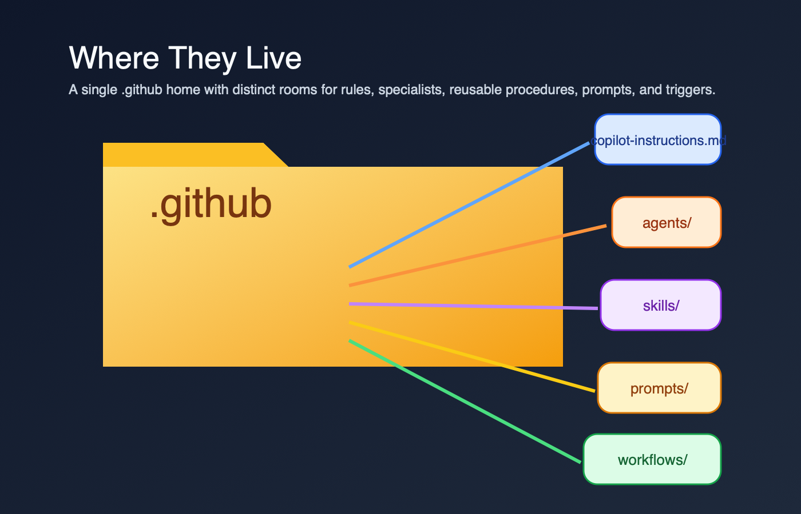
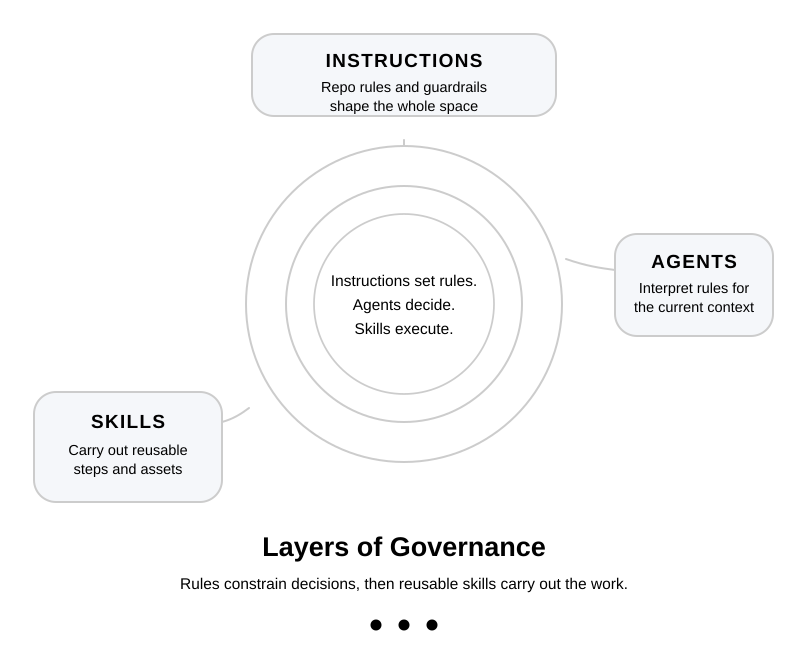
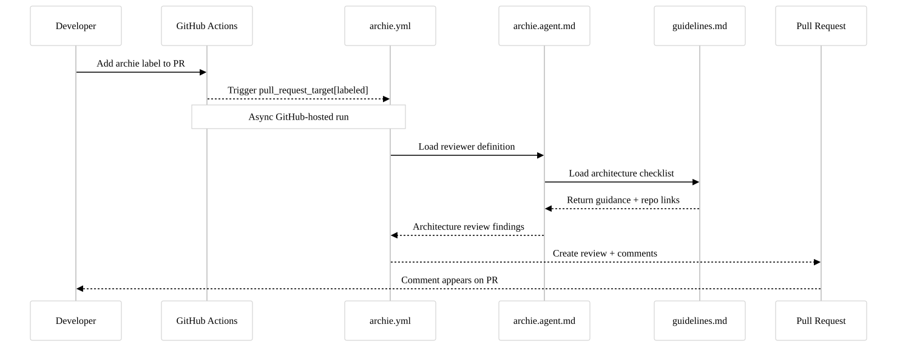

When I work with repos that use Copilot, I keep running into the same confusion: people have these files scattered across `.github/`, but they don't know what each one does, why they exist separately, or how they're supposed to work together.

I'll see `.github/copilot-instructions.md` and `.github/agents/` in the same repo, then a `prompts/` folder, then maybe a workflow file that looks half like YAML and half like agent instructions. The files exist, but the mental model doesn't.

This guide is my attempt to make that mental model boring and usable. I want to show what each file is for, where real repos keep them, and which claims I can actually defend with links.


*The governance metaphor works like nested rings: instructions shape the space, agents interpret it, and skills do the work at the center.*

## Quick Reference: The Six File Families

| File | Lives at | Purpose | When to use |
|------|----------|---------|------------|
| **Copilot instructions** | `.github/copilot-instructions.md` | Repository-wide governance (always-on context) | "All Copilot work in this repo should follow these rules" |
| **Path-specific instructions** | `.github/instructions/*.instructions.md` | Scoped rules for specific directories or file patterns | "My monorepo has areas with different conventions" |
| **Agent definitions** | `.github/agents/` | Specialist persona with its own scope, tools, and constraints | "This task needs a reviewer or specialist with tighter boundaries" |
| **Skills** | `.github/skills/{name}/SKILL.md` | Reusable workflow package with instructions, resources, and optional scripts | "This is a repeatable procedure Copilot should know how to do" |
| **Prompt files / prompt docs** | Official prompt files: `.github/prompts/*.prompt.md`; repo-local docs often live in `.github/prompts/*.md` | Reusable prompt template or task-specific reference context | "I need either a reusable prompt in the IDE or a deeper reference doc for a specific task" |
| **Workflows** | `.github/workflows/` | GitHub Actions automation and remote triggers | "I need this to run on a label, schedule, dispatch, or PR event" |



*This structure diagram turns the six file families into one navigable map so you can see which pieces are baseline, specialized, reusable, or event-driven.*



*The folder-house metaphor emphasizes that these files live together, but each room has a different job.*

<!-- truncate -->

Those are the most commonly confused files. There are also `AGENTS.md` (an OpenAI/Anthropic agent convention — not a GitHub Copilot feature), hooks, and MCP configs. I keep coming back to these six because they're the ones people mix together most often.

## The Copilot Instructions File: Governance Layer

`/.github/copilot-instructions.md` is the ambient context that sits behind Copilot work in a repo. It's not something I invoke manually. It's the baseline.

**What it contains:**
- Coding standards and conventions
- Architecture guidelines
- Documentation expectations
- Review requirements
- What "done" looks like
- Security constraints
- Naming conventions

**Real examples:**

[Microsoft MCP Copilot Instructions](https://github.com/microsoft/mcp/blob/main/.github/copilot-instructions.md) — a focused baseline file. The heading is `Coding Instructions for GitHub Copilot`, not "Comprehensive Overview," and it goes straight into always-apply rules, build expectations, and PR guidance.

[Azure SDK for JavaScript Copilot Instructions](https://github.com/Azure/azure-sdk-for-js/blob/main/.github/copilot-instructions.md) — a denser governance file. The Azure SDK guidance gets specific about API design, implementation choices, and when to explain a deviation from the house style. In my experience, this kind of baseline makes Copilot more likely to produce code aligned with review expectations.

**When you use it in Copilot:**
- Open Copilot chat in the repo
- Ask it to "write a PR description"
- Copilot includes the repo instructions automatically

**How long should it be?**
Short enough that a human can still scan it. MCP's file is compact. Azure's is more opinionated. If the instructions file starts reading like a runbook instead of repo policy, I move the task-specific detail somewhere else.

**Key rule:** Instructions describe outcomes and standards. They are the repo's rules of engagement, not the step-by-step workflow.

### Path-Specific Instructions: Scoped Rules

I missed this feature entirely until I was reviewing a monorepo that had three different instruction files and I couldn't figure out why Copilot kept changing tone between the frontend and backend code. Turns out, Copilot supports **path-specific instruction files** in `.github/instructions/` — and they're additive with the repo-wide file.

**Format:** `{name}.instructions.md` files inside `.github/instructions/`

**Example structure:**
```
.github/
  copilot-instructions.md          # repo-wide (always-on)
  instructions/
    frontend.instructions.md       # applies to /frontend
    backend.instructions.md        # applies to /backend
    tests.instructions.md          # applies to test files
```

Each file uses YAML frontmatter with an `applyTo` key to declare which paths it covers:

```yaml
---
applyTo: "src/frontend/**"
---
Use React functional components with TypeScript.
Prefer CSS modules over inline styles.
```

**Key behavior:** When you're working in a file that matches a path-specific instruction, Copilot combines **both** the repo-wide instructions and the path-specific ones. It doesn't replace — it layers. This is different from how I initially assumed it worked.

**When to use path-specific instructions instead of the repo-wide file:**
- Your monorepo has distinct language/framework areas with different conventions
- Test files need different guidance than production code
- API code has stricter rules than internal scripts

**When NOT to use them:**
- Rules that apply everywhere (keep those in `copilot-instructions.md`)
- Task-specific procedures (those belong in skills)
- One-off guidance (just say it in chat)

**Official docs:** [Adding path-specific custom instructions](https://docs.github.com/en/copilot/how-tos/copilot-on-github/customize-copilot/add-custom-instructions/add-repository-instructions#creating-path-specific-custom-instructions)

---

## Agent Definitions: Specialist Persona

`.github/agents/` is where I expect to find specialist agents — focused reviewers or operators with their own scope, tool boundaries, and output format.

**What an agent file contains:**
- What the agent specializes in
- Which tools it can access
- Task-specific constraints
- Expected output format
- When to use it over the default assistant

**Real examples:**

[Azure SDK: archie.agent.md](https://github.com/Azure/azure-sdk-for-js/blob/main/.github/agents/archie.agent.md) — architecture review specialist. The file defines the reviewer's purpose, allowed tools, scope, and output format. It also references `../prompts/architecture-review-guidelines.md` to load its review guidelines.

[Azure SDK: scribe.agent.md](https://github.com/Azure/azure-sdk-for-js/blob/main/.github/agents/scribe.agent.md) — documentation review specialist. Same pattern, different charter: README, CHANGELOG, snippets, samples, and TSDoc.

**How to invoke it:**
The exact path depends on the surface. GitHub's [customization cheat sheet](https://docs.github.com/en/copilot/reference/customization-cheat-sheet) is the clearest map I found: select the custom agent in the UI, use `/agent` in Copilot CLI, or reference the agent naturally in chat.

**How it differs from instructions:**
- **Instructions:** Always-on, repo-wide governance
- **Agent:** Specialized, on-demand, with its own boundaries

I don't need agents for every repo. A lot of projects are fine with instructions alone. But once I have a recurring task like architecture review or docs review, an agent gives that work a clear owner.

---

## Skills: Reusable Procedures

A skill is a folder with a `SKILL.md` file plus whatever supporting templates, scripts, or resources the workflow needs. GitHub's docs describe skills as packages that Copilot can load when they're relevant to a task. That detail matters. A skill is not just a long prompt. It's a reusable procedure.

**What a skill contains:**
- When to use the skill
- What it does
- Input requirements
- Output expectations
- Links to deeper references
- Templates or helper assets
- Scripts or automation, if the workflow needs them

**Real examples:**

[OpenAI Agents Python: code-change-verification](https://github.com/openai/openai-agents-python/blob/main/.agents/skills/code-change-verification/SKILL.md) — a concrete verification skill. It tells Copilot when to run the verification stack and points to scripts that execute the checks.

[Vercel Next.js: authoring-skills](https://github.com/vercel/next.js/blob/canary/.agents/skills/authoring-skills/SKILL.md) — a nice example of a skill that explains what belongs in a skill versus in `AGENTS.md`.

**How it gets used:**
- In surfaces that support skills, Copilot may auto-load it when the task matches
- You can ask for that workflow explicitly
- A custom agent can rely on it as part of a larger procedure

**Where they live:**
- `.github/skills/` — the GitHub Copilot canonical path
- `.agents/skills/` — the cross-agent open standard path (used by OpenAI, Vercel, and others)

**Skill vs. Agent vs. Instructions — the mental model:**

GitHub's documentation describes what each feature does, but doesn't frame the relationship as explicitly as I'd like. Here's my mental model: **Instructions set the rules. Agents decide. Skills execute.** This is my interpretation, not GitHub's official framing, but it helps me remember which tool to reach for.



*This cascade makes the control flow explicit: rules constrain decisions, and decisions choose the reusable execution path.*

---

## Skills vs. Prompts: The Critical Difference


This is the distinction that tripped me up most, because people use the word "prompt" to mean two different things.

| Aspect | Skill | Prompt file / prompt doc |
|--------|-------|--------------------------|
| **What it is** | Agent-skill package with instructions, resources, and sometimes scripts | Either an official `.prompt.md` template or a repo-local markdown doc used as reference context |
| **How it gets used** | Copilot auto-loads it when relevant, or you ask for it in a supported surface | Official prompt files are typically user-selected or referenced in supported IDEs; repo-local docs can also be linked from agents or workflows |
| **What's inside** | Steps, commands, templates, helper assets | Examples, patterns, checklists, input variables, edge cases |
| **CLI support** | Yes | Official `.prompt.md` prompt files are IDE-focused, not Copilot CLI |

**The caveat that matters:** Official GitHub prompt files use `.prompt.md` and are an IDE feature. Azure's `.github/prompts/*.md` files are different. They're repo-local reference docs that agents or workflows load, not the product feature GitHub documents as prompt files.

That means my old rule of thumb was too neat. Prompts are not always passive reference, and skills are not always the only place with step-by-step guidance. The better distinction is this: skills are packaged workflows Copilot can use as skills; prompt files and prompt docs are reusable context.



*The decision tree compresses the distinction into one question sequence: reusable workflow first, reusable prompt second, reference doc third.*

---

## Prompts: Task-Specific Expertise

`.github/prompts/` is where many repos store task-specific context. Sometimes those files are official GitHub prompt files ending in `.prompt.md`. Sometimes, and this is what Azure JS does, they are plain markdown docs that reviewers load as guidance.

**What a prompt file or prompt doc contains:**
- Patterns and examples
- Detailed guidance for a specific task
- Decision rules
- Known edge cases
- Sometimes input placeholders if it's an official prompt file

**Real examples:**

[Azure SDK: architecture-review-guidelines.md](https://github.com/Azure/azure-sdk-for-js/blob/main/.github/prompts/architecture-review-guidelines.md) — a repo-local reference doc. It defines the review scope and checklist for architecture review, and [Archie points to it directly](https://github.com/Azure/azure-sdk-for-js/blob/main/.github/agents/archie.agent.md).

[GitHub gh-aw: create-agentic-workflow.md](https://github.com/github/gh-aw/blob/v0.71.1/.github/aw/create-agentic-workflow.md#L13-L25) — another repo-local guide. It explains the markdown workflow structure used by `gh-aw`. Useful context, yes. An official GitHub prompt-file feature, no.

**How agents use them:**
Agents or workflows can read these docs at runtime. In Azure JS, the architecture review guidance also points back to `.github/copilot-instructions.md`, which is a nice example of the layers staying connected instead of duplicating each other.

**Where they live:**
- Official prompt files: `.github/prompts/*.prompt.md`
- Repo-local reference docs: often `.github/prompts/*.md`
- Organized by task: architecture review, dependency review, release prep, and so on

**Why separate files?**
Because the detail belongs close to the task, not smeared across every Copilot interaction. When instructions become hard to scan, moving task-specific context into separate files keeps the baseline clean.

---

## Workflows: Automation Triggers

`.github/workflows/` is standard GitHub Actions. I include it here because people often blame Copilot for behavior that is really coming from a workflow trigger.

**What a workflow does:**
- Listens for triggers such as push, label, schedule, or manual dispatch
- Runs remote automation on GitHub
- Starts a reviewer or other automation path
- Posts status, comments, or checks back to the PR

**Real example:**

[Azure SDK for JavaScript reviewer workflows](https://github.com/Azure/azure-sdk-for-js/tree/main/.github/workflows) — not one big controller that fans everything out. Each reviewer has its own workflow file. [Archie](https://github.com/Azure/azure-sdk-for-js/blob/main/.github/workflows/archie.md) and [Dexter](https://github.com/Azure/azure-sdk-for-js/blob/main/.github/workflows/dexter.md) both trigger on `pull_request_target` with `types: [labeled]`, and [Dash](https://github.com/Azure/azure-sdk-for-js/blob/main/.github/workflows/dash.md) says plainly that its job is to review a PR for performance regressions.

**How it connects to agents and skills:**
The workflow is the remote trigger. In Azure JS, each reviewer workflow posts its own findings back to the PR. In other repos, a workflow might also call a custom agent or load a skill, but that's not the part I can prove from this example.

---

## How They Wire Together: A Real Workflow

Here's the version of the Azure SDK flow I can actually defend with links.

**1. A label triggers the run**
In Azure JS, the review workflows listen for `pull_request_target` with `types: [labeled]`, not for PR creation. You can see that in [archie.md](https://github.com/Azure/azure-sdk-for-js/blob/main/.github/workflows/archie.md) and [dexter.md](https://github.com/Azure/azure-sdk-for-js/blob/main/.github/workflows/dexter.md).

**2. Each reviewer has its own workflow**
[Archie](https://github.com/Azure/azure-sdk-for-js/blob/main/.github/workflows/archie.md), [Dash](https://github.com/Azure/azure-sdk-for-js/blob/main/.github/workflows/dash.md), [Dexter](https://github.com/Azure/azure-sdk-for-js/blob/main/.github/workflows/dexter.md), and [Scribe](https://github.com/Azure/azure-sdk-for-js/blob/main/.github/workflows/scribe.md) are separate files under `.github/workflows/`. They can run independently when their trigger label appears. This is not one workflow spawning four reviewers in parallel.

**3. The workflow itself states the review job**
[Dash](https://github.com/Azure/azure-sdk-for-js/blob/main/.github/workflows/dash.md) literally says it reviews the PR for performance regressions and anti-patterns. Archie and Dexter follow the same pattern for architecture and dependency review.

**4. Agent files and prompt docs are the reusable layer**
Separately from the workflow trigger, [archie.agent.md](https://github.com/Azure/azure-sdk-for-js/blob/main/.github/agents/archie.agent.md) defines the architecture reviewer as a reusable custom agent and references `../prompts/architecture-review-guidelines.md`. That prompt doc then points back to the repo instructions in [architecture-review-guidelines.md](https://github.com/Azure/azure-sdk-for-js/blob/main/.github/prompts/architecture-review-guidelines.md).

**5. Findings land on the PR from each workflow**
[Archie](https://github.com/Azure/azure-sdk-for-js/blob/main/.github/workflows/archie.md) and [Scribe](https://github.com/Azure/azure-sdk-for-js/blob/main/.github/workflows/scribe.md) both declare `create-pull-request-review-comment` and `submit-pull-request-review` in `safe-outputs`, with run messages for the PR review lifecycle. So the accurate mental model is: each reviewer workflow posts its own findings. There isn't a separate "collector" workflow in this example.

**6. Skills are adjacent, not proven by this example**
Skills still matter to the overall ecosystem, but Azure's review workflows are not the example I would use to claim that agents are invoking skills behind the scenes. If I want to show skills, I use an actual `SKILL.md` repo.

That's the loop I trust: a label starts a workflow, the workflow runs the reviewer, the reviewer uses repo guidance, and comments come back to the PR.



*This sequence shows the asynchronous handoff from label to workflow to reviewer guidance and back to a PR comment.*

---

## Using Copilot with These Files: Chat and CLI

### In Copilot Chat (Browser or VS Code)

**Scenario:** You're in a repo and you open Copilot chat.

```
You: write a PR description
```

Copilot reads `.github/copilot-instructions.md` and picks up things like:
- PR title format
- Required sections
- Review expectations

Result: the draft is much more likely to match the repo's stored rules.

**Scenario 2:** You want the specialist reviewer.

```
You: use the archie agent to review my API changes
```

Depending on the surface, you might select `archie` in the agent picker, use `/agent` in Copilot CLI, or reference it naturally in chat. The important part is the same: the agent file gives that review task its own scope and constraints.

### In Copilot CLI

**Scenario:** You're working locally and you want a code review from the terminal.

```shell
copilot
/review focus on bugs and security issues in my current changes
```

GitHub documents `/review` as the CLI code review path in its [Copilot CLI docs](https://docs.github.com/en/copilot/how-tos/use-copilot-agents/use-copilot-cli) and [agentic code review guide](https://docs.github.com/en/copilot/how-tos/copilot-cli/use-copilot-cli/agentic-code-review). This is the replacement for the old `gh copilot pr-review` mental model I had in my head.

**Scenario 2:** You want to trigger the remote GitHub Actions reviewer from your terminal.

```shell
gh workflow run archie.md -f item_number=42
```

That command is a **remote workflow dispatch through GitHub CLI**, not local Copilot behavior. Azure's reviewer workflows expose `workflow_dispatch` with an `item_number` input in [archie.md](https://github.com/Azure/azure-sdk-for-js/blob/main/.github/workflows/archie.md), so `gh` can start the run on GitHub.

---

## Decision Table: Which File for What?



*This placement tree turns the file choice into a routing problem: match the task shape, then drop it in the right folder.*

| I need to... | Put it in... | Why |
|--------------|--------------|-----|
| Set coding standards | Copilot instructions | Always-on, repo-wide governance |
| Require testing notes on all PRs | Copilot instructions | It's a rule, not a workflow |
| Automate PR review on labels | Workflows + reviewer definitions | Labels are a GitHub Actions trigger, and the reviewer needs its own scope |
| Store detailed architecture patterns | Prompt docs | Too bulky for baseline instructions; reviewers can load them when needed |
| Make code generation or verification repeatable | Skills | Copilot can load the packaged workflow when the task matches |
| Handle a one-time task | Chat | Some work doesn't need a file at all |

---

## Minimal Repo Setup

If I'm starting fresh and I don't want to overengineer this, I keep it boring.

**Minimal viable setup:**
- `.github/copilot-instructions.md` (recommended baseline)
- No agents yet unless I have a recurring specialist task
- No skills yet unless I keep repeating the same workflow
- No prompt docs yet unless the task-specific context is making the instructions file noisy

**As the repo grows:**
- Add agents when a task needs its own tool restrictions or review charter
- Add skills when a workflow deserves packaging
- Add prompt docs when a reviewer or task needs deeper context than the baseline file should carry

Start minimal, then add layers only when each layer removes confusion.

---

## How to Find Examples in Real Repos

Here are the examples I would study first.

**Azure SDK for JavaScript** — the clearest end-to-end example I found
- Instructions baseline: [`.github/copilot-instructions.md`](https://github.com/Azure/azure-sdk-for-js/blob/main/.github/copilot-instructions.md)
- Architecture reviewer: [`.github/agents/archie.agent.md`](https://github.com/Azure/azure-sdk-for-js/blob/main/.github/agents/archie.agent.md)
- Prompt doc Archie loads: [`.github/prompts/architecture-review-guidelines.md`](https://github.com/Azure/azure-sdk-for-js/blob/main/.github/prompts/architecture-review-guidelines.md)
- Performance reviewer workflow: [`.github/workflows/dash.md`](https://github.com/Azure/azure-sdk-for-js/blob/main/.github/workflows/dash.md)
- Dependency reviewer workflow: [`.github/workflows/dexter.md`](https://github.com/Azure/azure-sdk-for-js/blob/main/.github/workflows/dexter.md)
- Documentation reviewer: [`.github/agents/scribe.agent.md`](https://github.com/Azure/azure-sdk-for-js/blob/main/.github/agents/scribe.agent.md)

**Microsoft MCP** — a readable baseline instructions file
- Instructions: [`.github/copilot-instructions.md`](https://github.com/microsoft/mcp/blob/main/.github/copilot-instructions.md)

**GitHub gh-aw** — a good example of repo-local workflow guidance that looks prompt-like
- Workflow authoring guide: [`.github/aw/create-agentic-workflow.md` lines 13-25](https://github.com/github/gh-aw/blob/v0.71.1/.github/aw/create-agentic-workflow.md#L13-L25)

**Vercel Next.js** — useful for skill design patterns
- Skill example: [`.agents/skills/authoring-skills/SKILL.md`](https://github.com/vercel/next.js/blob/canary/.agents/skills/authoring-skills/SKILL.md)

I stole this idea from reading public repos side by side. Once I stopped looking for one canonical layout, the patterns got easier to see.

---

## The One-Sentence Rule


If I'm stuck deciding where something belongs, this is still the fastest check I know: **If it reads like a rule, put it in instructions. If it reads like a reusable workflow, put it in a skill. If it reads like task-specific context, put it in a prompt doc or prompt file. If it has to run on GitHub events, put it in a workflow.**

That's the mental model I keep coming back to, and it's the first one that has held up once I started checking the links.
