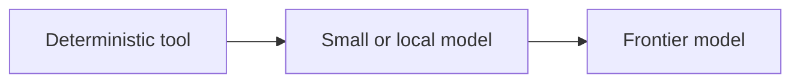
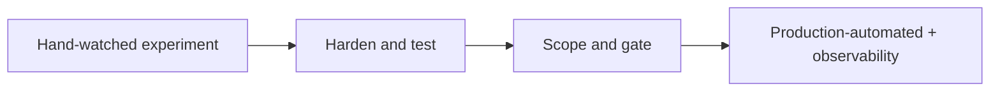

*For the engineers building with AI every day — and the leaders setting the guardrails around them.*

Let's be honest about where we are. We're past the demo phase. The exciting question used to be "can a model even do this?" — and now it's the much less glamorous "how do we run this every day, at a price we can actually justify, without handing an autonomous process the keys to everything?"

That question really has three threads tangled together, and it helps to pull them apart up front:

- **The money** — don't pay twice, and use the right tool for the job.
- **The craft** — move from one-shot prompts to repeatable, testable processes.
- **The guardrails** — least privilege, real observability, and accountability for things that aren't people.

There's one idea underneath all three: **the graduation handoff.** Almost everything here describes a single moment — a skill or agent growing up from "you're watching it work, turn by turn" into "it runs in production on its own." Before that moment, *you* are the scaffolding that earns the trust. After it, your standard production stack — telemetry, observability, authorization — becomes the permanent structure that keeps it. Keep that handoff in the back of your mind. It's the spine of everything below.

## Part 1 — The money: stop paying twice

### Pay for tokens once

Here's the thing about tokens: they're wonderful for exploring and terrible as a permanent runtime. Once you really understand a workflow, push it toward determinism — scripts, apps, tests, CI — so you pay the model once to figure it out, not on every single run.

I want to be straight with you, though: determinism isn't a free lunch, it's a *trade*. Scripts rot. APIs change, schemas drift, dependencies break. You're swapping a per-run token cost for a smaller, recurring maintenance cost — not erasing the cost.

So when do you actually harden something? It comes down to stakes. If a workflow is quick and clearly defined, move it to determinism early. If the consequences are bigger, give it a middle ground: let it mature *with* AI first, and as individual parts settle, move *those* parts into hardened, deterministic form — within the real-world limits of security, maintenance, and interoperability. The two failure modes to avoid: hardening a moving target, and paying frontier prices for something that's already settled.

### Use the right tool for the job — on a cost gradient

"Use AI for everything" isn't a strategy. The real principle is the boring, durable one you already know: *right tool for the job.* And the tools sit on a gradient — a classic **deterministic tool**, then a **small or local model**, then a **frontier model**. Pick the cheapest rung that actually does the work.

Spelling and grammar is a nice illustration, precisely because it usually lands on the *deterministic* rung. Mature tools handle it cheaply and predictably, so you'd never reach for a frontier model — same instinct as "pay once." The interesting rung is the one *above* deterministic but *below* frontier, and that's where small or local models genuinely earn their keep: classification, routing, redaction, embeddings — work that needs more flexibility than a fixed tool can give but doesn't need state-of-the-art reasoning.

A concrete example I like: **redacting PII from your logs before they're stored.** A regex can't reliably catch a name or address it's never seen. A frontier model is overkill on every log line. A small *local* model is right in the sweet spot — flexible enough to generalize, cheap enough to run on every write, and local so the sensitive data never leaves your boundary.

### Turn that gradient into a system: model routing

Don't leave "good enough vs. state of the art" as a gut feeling. Systematize it with **model routing**, or cascades: try the cheap model first, and escalate to the frontier one only when confidence is low. Same instinct as above — but now it's a measurable, tiered spend you can actually reason about instead of a vibe.

### Don't pay for compute you don't need — and remember local buys more than savings

If you don't need cloud or remote access, a small or local model lets you skip the ongoing API bill. But please don't fall for "local is free" — it's a myth. You're really just swapping one kind of cost for two others: you trade a pay-as-you-go bill for a big upfront purchase *plus* a new set of ongoing costs — hardware, electricity, wear-and-tear, and the engineer-hours to run and patch the thing. For low or spiky volume, cloud is often both cheaper *and* more secure than a box you babysit.

So find the real break-even: volume, latency, and data-residency or compliance constraints — not cost alone. And notice the two things local buys you beyond money. First, **privacy and residency** — the data never leaves your boundary, which is honestly the *real* reason to go local more often than cost is. Second, a chance to work in an **emerging space.** Local model management is still young — tools like Ollama, LM Studio, and Docker's Model Runner have made a real start, but enterprise basics are still thin: per-user access control, audit logging, versioning, and cost tracking. If you like building tools, there's real room here.

### Treat AI spend like any other tech spend

After all this talk of cost, let me be clear about the goal: it isn't to fret over every dollar. It's the opposite. AI spend deserves the same deliberate budgeting you give every other part of your stack — it's real, it's recurring, and it should be a line item you own on purpose, tracked per team and per workflow.

## Part 2 — The craft: from prompt to process

### AI builds the prototype; you harden what matters

One of the most durable patterns here is an old one wearing new clothes. AI builds the prototype fast; once it works, *you* decide what becomes a repeatable, testable, secure process. 

What's the artifact of that transition? Today it's a skill, an agent, or some other markdown file — but the *format is incidental.* What matters is the **information that persists**: a durable, reviewable source of truth that outlives whatever wrapper happens to hold it.

And here's a bonus that's easy to miss: the hardening boundary is also the line between your **two test regimes.** What you've hardened gets a deterministic unit test. What stays probabilistic gets an *eval* — golden sets, LLM-as-judge, acceptance bands. Deciding what to harden *is* deciding how each piece gets tested. The test surface didn't shrink when AI showed up; it grew to cover both. Good news: the frameworks for this already exist, so you don't have to invent them.

### Move from one-shot prompts to repeatable processes — and give them an owner

Wrap your deterministic scripts in AI skills that lean toward repeatable processes anyone can pick up. But reuse without ownership just turns into shadow IT — handy, but unowned and ungoverned. So give every reusable thing a home.

A frame I borrowed from a governance thinker in the company helps here: think **federal, state, and local**, where you, the individual contributor, are *local*. Federal assets are organization-wide. State builds on federal. Local builds on both. The pipeline updates assets as they change upstream — a local copy can be refreshed from its non-local source instead of drifting out of date. The point is that every reusable unit has an owning tier and an update path. That's the difference between a library and a junk drawer.

### Chain and gate skills into workflows — but only what you can watch

You can absolutely chain skills into full workflows — just respect the math, because reliability compounds *downward*. Five steps at 95% each lands you around 77% end to end. So chain only what you can observe and gate, and keep your chains short.

What's a "gate"? Any defined checkpoint — a human in the loop or an AI, as long as it's explicit. The simplest version: look at the output or log of the last skill; if it has everything the next skill needs and shows no failures, move on. And a gentle reminder: more agents doesn't automatically produce better results.

### A team of specialists beats one do-it-all generalist

There's a lot of research showing that teams of specialists outperform teams of generalists, and the same holds for AI agents. If you need a team, a set of focused specialist agents will beat one general-purpose agent copied over and over to fill every seat.

The usual objection to agent teams is that things get lost in the handoff — when one agent passes work to the next, the second agent doesn't know what the first one already figured out. That objection is fading fast. Most AI platforms now give agents shared memory (Squad does this for me today), so the specialists all read from and write to the same memory. Nothing has to be re-explained and lost at each step; the context is simply there for whoever needs it next.

So what's actually left to weigh? Mostly cost. A team of agents costs more than a single agent, because each one does its own thinking and runs up its own bill. That's the real trade-off — not lost context — and it's usually worth paying when each specialist does its part better than a generalist would.

The only time to reach for a single agent is when a team would be overkill: a small, simple job where spinning up specialists adds cost and coordination for no real gain. That's a simplicity call, not a limit on what specialists can do.

### Capture tribal knowledge — turn repeatable work into skills

Here's a simple test: if you had to hand your work to someone else before going on vacation, and you'd explain a process step by step, that process is probably a skill. The moment you find yourself writing "first do this, then do that, then check for this" — you're describing something a skill can hold. Capture it. 

Not everything passes the test. Codify the parts that are repetitive and stable; leave the genuinely judgment-heavy or one-off work to a person. Repetition is the tell — when you catch yourself doing the same thing the same way again and again, that's the signal.

## Part 3 — The guardrails: things that aren't people

### Least privilege for agents — and the third thing that's easy to miss

You already put real effort into deciding what access your *people* should have. Do the same for agents — don't let them roam your systems with *your* full authorization. And notice there are three distinct ideas here, not two:

- **Identity** — *who the agent is.* It'll likely look a lot like an app or service principal (Entra Agent ID and similar platforms point that way).
- **Authorization** — *what it's allowed to do.* Scope it as carefully as you'd scope a person.
- **Accountability** — *who answers when it causes harm.*

With an employee, all three exist: a badge, access grants, and a liable person with intent, a contract, and consequences. With an agent, even identity is messier than it looks. Either the agent borrows a real person's identity — so every action it takes shows up as *that human* doing it — or it runs as a service principal that *owns* resources outright, with no person attached at all. Neither option cleanly separates the three ideas, and **accountability has no home** in either. When a correctly-scoped agent still deletes prod, leaks a secret, or does something destructive a human would've paused on, who's liable? The agent has no intent. The IC who launched it didn't author the step. The team that built the skill didn't run it. The vendor's model chose the action.

There's one more wrinkle worth knowing about: an agent can be tricked into misusing access it legitimately has. A well-documented pattern (often called prompt injection) is when text the agent reads — a web page, a file, an email — contains hidden instructions, and the agent treats them as if you'd asked for them. The access was scoped correctly; the agent just used it on the wrong instructions. Weigh it when you decide how much an agent should be allowed to do on its own.

### Log the output your gates depend on

"Log everything" needs a sharper edge, because prompt-and-response logs are a huge new sensitive-data surface. So let me be specific about what I actually mean: not the prompts and responses, but the **core output of each step** — the data flowing through your scripts.

That's the logging that makes chained gates effective. A gate can only ask "did the last step produce what the next one needs, with no failures?" if that output is captured. It's also what tells you when something went wrong and how much it affected. Without those logs, you can't even see how far the damage spread. And that's really the point: before anything runs on its own in production, you map out how far a failure could spread and build up trust in the process over a good stretch of running it with a person watching.

### AI won't stay a black box — until it earns the right to be one

You're going to have to understand what's happening at levels you used to happily ignore. The usual car analogy — turn the key, drop it in gear, hit the gas, never think about the engine — actually cuts the *other* way right now. Cars earned that abstraction by working reliably for a century. AI hasn't earned it yet.

You need to see inside the box *until it consistently succeeds.* There's a whole range from "barely works" to "works every single time," and watching turn by turn is the discipline for the immature end of it. The watching doesn't disappear as the system matures — it **changes form.** When a skill or agent graduates from "watch every turn" to "production-automated," your bespoke attention gets handed off to the standard production stack: telemetry, observability, authorization. Manual vigilance is the *scaffolding* you use to earn trust; mature observability is the *permanent structure* that keeps it. That's the graduation handoff again — the very same moment that hardening, scoped authorization, and step-output logging each describe from their own corner.

## Where this leaves us

Read straight through, these aren't a dozen scattered tips — they're one lifecycle. A capability starts life as an expensive, non-deterministic, hand-watched experiment, and if it proves out, it graduates into something cheap, deterministic, governed, and observable. The money tells you *which* rung to run it on. The craft tells you *how* to harden and test it. The guardrails tell you *what* it can touch and *who* answers when it goes wrong. And the handoff — your scaffolding giving way to standard ops — is where all three meet.

So that's the real work in front of teams and organizations right now. It isn't *adopting* AI. It's *graduating* it. If you're already wrestling with any of this, I'd genuinely love to hear what's working for you and what isn't — that's how all of us find the real value faster.

<!--
---
title: "Image prompts for Running AI at Work"
draft: true
description: "Support file for blog illustration and diagram generation prompts."
---

<!-- truncate -->

# 2026-06-27 Running AI at Work — Image Prompts

## Batch JSON

```json
{
  "post": "2026-06-27-running-ai-at-work",
  "style": "Watercolor illustration, soft wet-on-wet washes, visible paper texture, warm muted tones, loose brushwork",
  "character": "White female with pink hair",
  "images": [
    {
      "filename": "hero-graduation-handoff.png",
      "alt": "Pink-haired woman watching a small agent work turn by turn, while a second copy of it runs on its own in the background",
      "prompt": "White female with pink hair watching a small helper agent work step by step at her desk while an identical agent runs on its own in the background, watercolor illustration, soft wet-on-wet washes, visible paper texture, warm muted tones, loose brushwork, no text"
    },
    {
      "filename": "part-1-cost-gradient.png",
      "alt": "Pink-haired woman choosing the smallest, cheapest tool from a row of increasingly powerful options",
      "prompt": "White female with pink hair choosing the smallest tool from a row of three rising in size and power, weighing cost in her hand, watercolor illustration, soft wet-on-wet washes, visible paper texture, warm muted tones, loose brushwork, no text"
    },
    {
      "filename": "part-2-prototype-to-process.png",
      "alt": "Pink-haired woman taking a rough AI-built prototype and shaping it into a tidy, repeatable process",
      "prompt": "White female with pink hair reshaping a loose rough sketch handed to her by a small helper agent into neat ordered cards, watercolor illustration, soft wet-on-wet washes, visible paper texture, warm muted tones, loose brushwork, no text"
    },
    {
      "filename": "part-3-least-privilege.png",
      "alt": "Pink-haired woman handing a small agent a single key while keeping the rest of the keyring",
      "prompt": "White female with pink hair handing a small helper agent one single key while holding back a large ring of keys, watercolor illustration, soft wet-on-wet washes, visible paper texture, warm muted tones, loose brushwork, no text"
    }
  ],
  "mermaidDiagrams": [
    {
      "filename": "cost-gradient.mmd",
      "prompt": "Create a simple left-to-right Mermaid flow diagram showing a cost gradient: deterministic tool -> small or local model -> frontier model. Keep labels short. Use 3 nodes. Add a note that you pick the cheapest rung that does the work."
    },
    {
      "filename": "graduation-lifecycle.mmd",
      "prompt": "Create a left-to-right Mermaid flow diagram of the graduation handoff: hand-watched experiment -> harden and test -> scope and gate -> production-automated with observability. Keep labels short. Use 4 nodes. Emphasize that human vigilance is scaffolding and observability is the permanent structure."
    }
  ]
}
```

## Individual Watercolor Prompts

### 1. Hero — The Graduation Handoff

- **Filename:** `hero-graduation-handoff.png`
- **Prompt:** White female with pink hair watching a small helper agent work step by step at her desk while an identical agent runs on its own in the background, watercolor illustration, soft wet-on-wet washes, visible paper texture, warm muted tones, loose brushwork, no text
- **Purpose:** Opening image for the central metaphor — a skill or agent growing up from "you watch every turn" to "it runs in production on its own."

### 2. Part 1 — The Money (Cost Gradient)

- **Filename:** `part-1-cost-gradient.png`
- **Prompt:** White female with pink hair choosing the smallest tool from a row of three rising in size and power, weighing cost in her hand, watercolor illustration, soft wet-on-wet washes, visible paper texture, warm muted tones, loose brushwork, no text
- **Purpose:** Visual for "right tool for the job" — picking the cheapest rung (deterministic, then small/local, then frontier) that actually does the work.

### 3. Part 2 — The Craft (Prototype to Process)

- **Filename:** `part-2-prototype-to-process.png`
- **Prompt:** White female with pink hair reshaping a loose rough sketch handed to her by a small helper agent into neat ordered cards, watercolor illustration, soft wet-on-wet washes, visible paper texture, warm muted tones, loose brushwork, no text
- **Purpose:** Visual for "AI builds the prototype; you harden what matters" — turning a fast draft into a repeatable, testable process.

### 4. Part 3 — The Guardrails (Least Privilege)

- **Filename:** `part-3-least-privilege.png`
- **Prompt:** White female with pink hair handing a small helper agent one single key while holding back a large ring of keys, watercolor illustration, soft wet-on-wet washes, visible paper texture, warm muted tones, loose brushwork, no text
- **Purpose:** Visual for least privilege — give an agent only the access it needs, not your full authorization.

## Mermaid Diagram Prompts

### 1. Cost Gradient

- **Filename:** `cost-gradient.mmd`
- **Prompt:** Create a simple left-to-right Mermaid flow diagram showing a cost gradient: deterministic tool -> small or local model -> frontier model. Keep labels short. Use 3 nodes. Add a note that you pick the cheapest rung that does the work.
- **Suggested Mermaid source:**



### 2. Graduation Lifecycle

- **Filename:** `graduation-lifecycle.mmd`
- **Prompt:** Create a left-to-right Mermaid flow diagram of the graduation handoff: hand-watched experiment -> harden and test -> scope and gate -> production-automated with observability. Keep labels short. Use 4 nodes. Emphasize that human vigilance is scaffolding and observability is the permanent structure.
- **Suggested Mermaid source:**



## Notes

- **Style:** Watercolor — soft wet-on-wet washes, visible paper texture, warm muted tones, loose brushwork, no text. Keep each prompt to ~20 words with one clear focal action (see `image-generation-reference.md` from the config-files post for the generation CLI and seed conventions).
- **Character:** White female with pink hair, consistent across all four illustrations.
- **Naming:** Watercolors `*.png`, diagrams `*.mmd`, stored in `website/blog/media/2026-06-27-running-ai-at-work/`.
- **Hero reference in frontmatter:** once generated, add `image: ./media/2026-06-27-running-ai-at-work/hero-graduation-handoff.png` to the post's frontmatter.

-->
