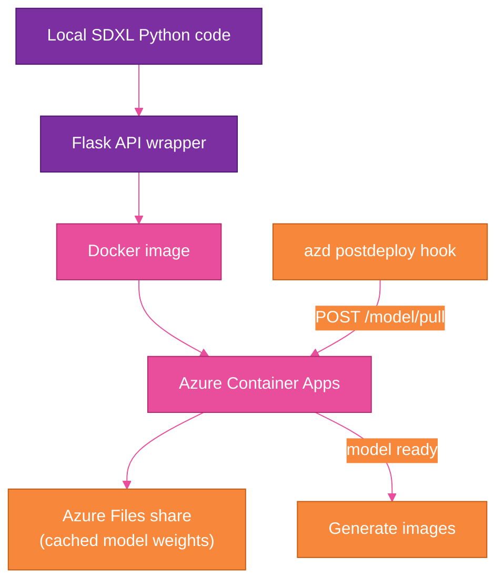
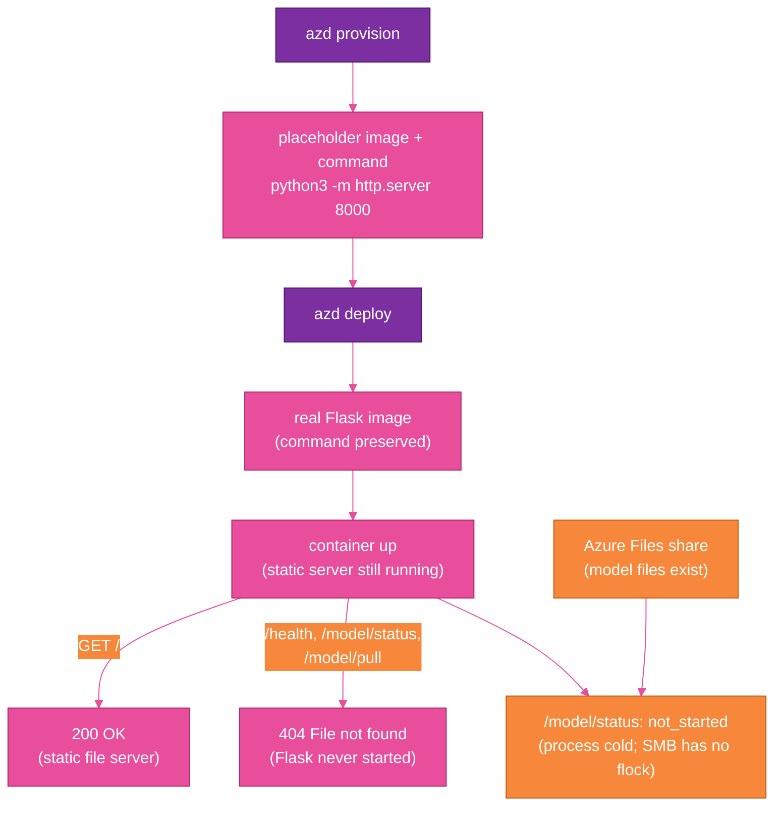

## The False Assumption

Calling a vendor API makes image generation look like one operation: send a request, get an image back. Self-hosting a generative model turns that single operation into a system I have to own.

I wanted control over inference settings, no lock-in to a hosted image API, and a cost model I could reason about. At the top level, the choice sounded simple: stop calling the vendor service and run the model myself.

That choice moved hidden responsibilities into my application boundary. I inherited the model runtime, storage lifecycle, readiness state, and deployment behavior. I also inherited the difference between persisted model assets and a process that has loaded the model and can generate an image.

The container was only the packaging format. Self-hosting meant owning everything the model needed after the container started.

## The Architecture I Expected

The system shape looked straightforward before the edge cases showed up. Local code would become a web API, the web API would run in a container, and the deployed container would use external storage for the model cache.

The first version looked like this:



The concrete version ran my Flask-wrapped SDXL code in Docker on Azure Container Apps, with an Azure Files share mounted for cached model weights and a deployment automation step that runs after deploy, the `azd` postdeploy hook, to pull the model.

The real deployment runs on CPU in Azure Container Apps: **4 vCPU, 16Gi memory, `device=cpu`, and 136Gi ephemeral storage**. The mounted Azure Files share holds the model cache, because the SDXL assets are too large to treat as incidental container filesystem state.

That architecture was directionally right, but it left out most of the operational work.

### What Was Actually Happening

The first clean picture hid two separate truths: the container could be up without running Flask, and model files could exist without the process being ready.



## Surprise #1: Persistent Storage Does Not Mean Warm Application State

The first lifecycle mistake was treating stored model assets as if they were the same thing as a ready application. Persistent storage can keep files between revisions. It cannot keep a new container process warm.

After the first cold download succeeded, I expected the next revision to be warm. The model files were on the Azure Files share, the share was mounted, and the path existed.

Then the app reported readiness state held in the process's memory, through the `/model/status` `state` field:

```json
{
  "state": "not_started"
}
```

That looked wrong until I separated two states I had been mentally combining:

- model assets persisted on disk
- model loaded and ready in this process

Those are not the same lifecycle. The Azure Files share can be warm while the container process is cold. A new revision starts a new process. That process can see the cached files, but it still has to initialize the SDXL pipeline in memory.

The specific `not_started` state did not mean "the share is empty." It meant "this process has not begun loading the model." The useful ready state was `ready`, also reported by `/model/status`.

That distinction changed how I read status. A cold path downloads model assets and then loads the model. A warm path skips the download but still loads the model from the mounted cache. In my deployment, warm load from the cached share was about **48 seconds**. Cold download took minutes.

Those are different costs, and they happen for different reasons. The deployment gate needed to care about readiness, not just file presence. Checking whether a directory exists is not enough. Checking whether the model cache is populated is not enough. The application has to report that this process is ready to serve generation requests.

Persistent storage keeps assets. It does not keep application memory warm. For model-serving systems, readiness is process state.

## Surprise #2: Model Files Are Not Just Files

The next storage mistake was treating model acquisition as a small deployment detail. For a generative model, the weights are a deployable asset with their own lifecycle.

A 7–13GB model is not a small deployment detail. It is its own deployment phase.

The model weights do not appear during `azd up`. Infrastructure provisioning creates the place where the model can live, but it does not populate that place with model assets.

I made model acquisition part of postdeploy. The deployment automation step that runs after deploy, the `azd` postdeploy hook, calls the app's model-download endpoint, `POST /model/pull`:

```bash
curl --fail -X POST "$APP_URL/model/pull"
```

Then it blocks until the app reports through the model-status endpoint, `/model/status`, that the model is ready:

```bash
curl --fail "$APP_URL/model/status"
```

A useful response includes the process readiness state, target device, and model path:

```json
{
  "state": "ready",
  "device": "cpu",
  "model_path": "/models/stable-diffusion-xl-base-1.0"
}
```

That was the right shape, but the storage layer had its own constraints. The mounted network-attached file storage is an Azure Files share, which uses Server Message Block (SMB). SMB does not support POSIX `flock` the way a local Linux filesystem does. The first version of the download logic assumed file locking would behave like local disk, and that assumption broke on the mounted share.

That kind of bug feels like an operating system problem until you remember that self-hosting makes the filesystem part of the application architecture. I had to rework the download logic so the app did not depend on unsupported locking behavior on the mounted share.

Once that was fixed, the cold download was faster than I expected: about **2 minutes 23 seconds** over the Azure backbone. The newer Hugging Face transfer path helped here; `hf_xet` replaced the deprecated `hf_transfer`, and the transfer itself was not the bottleneck I feared.

The useful takeaway was not simply that downloads can be fast. The model is a deployable asset with its own lifecycle. With a vendor API, the weights are someone else's problem. With self-hosting, model acquisition needs ordering, retries, logs, status, and a failure mode that stops the release instead of hiding the problem until the first image request.

## Surprise #3: "CPU Offload" Doesn't Work on a CPU

The runtime mistake was trusting a helper name before checking the hardware contract behind it. I expected memory to be an issue, and it was. The memory-saving helper I reached for had a name that sounded perfect for CPU hosting but failed because the container was actually running on CPU.

In `diffusers`, the helper is `enable_model_cpu_offload()`:

```python
pipe.enable_model_cpu_offload()
```

The name sounds like exactly what a CPU deployment wants. I read it as: use CPU memory carefully, offload model pieces as needed, survive inside the container limits.

That is not what it means. On a pure-CPU container, it raises the kind of error that makes the naming clear:

```text
requires accelerator, but not found
```

`enable_model_cpu_offload()` means "offload *to* CPU *from* an accelerator." It is for a system that has an accelerator and wants to move parts of the model back to CPU memory. It is not a CPU execution mode.

The fix was explicit CPU-safe initialization:

```python
pipe = StableDiffusionXLPipeline.from_pretrained(
    model_path,
    torch_dtype=torch.float32,
    use_safetensors=True,
)

pipe.to("cpu")
pipe.enable_attention_slicing()
pipe.vae.enable_slicing()
pipe.vae.enable_tiling()
```

Model libraries encode hardware assumptions. Sometimes those assumptions are obvious. Sometimes they are hidden inside method names that sound like they were written for your exact scenario.

For this deployment, "CPU offload" means "offload to CPU from somewhere else." It does not mean "run on CPU." The app is not just my Flask routes; it is also the model runtime, tensor dtype, memory behavior, and hardware profile lining up correctly.

## Surprise #4: The Container Was Running, But Not My App

The startup mistake was using a running container as proof that my application was running. A container can be healthy enough to accept traffic while the wrong process is listening.

The container app was up, the revision existed, the endpoint responded, and `GET /` returned `200`. Every real route still returned this exact response:

```text
404 File not found
```

At first, that looked like my Flask routing was broken. Maybe the app was not binding correctly. Maybe the container port was wrong. Maybe the health route was missing. Maybe the image was stale.

The exact error string pointed to the real problem. `404 File not found` is not Flask's default response; it is Python's `SimpleHTTPRequestHandler`. My container was running, but my Flask app was not.

On a fresh environment, `azd` provisions the Azure Container App before the real application image exists. To make the infrastructure deployment succeed, it uses a temporary placeholder web server, `python3 -m http.server 8000`:

```text
python3 -m http.server 8000
```

That is reasonable during provisioning. The surprise came later, when `azd deploy` swapped in my real Flask image and preserved the placeholder command. The image changed, but the runtime command did not.

So my real container image started successfully and then ran Python's static file server instead of my Flask app. That is why `/` returned `200`, and why `/health`, `/model/status`, and `/model/pull` returned `404 File not found`. Those routes only exist in Flask, and Flask was never running.

I stopped treating "container is up" as proof that the application is running. I added a self-heal step in the postdeploy hook that resets the command explicitly:

```bash
az containerapp update \
  --name "$CONTAINER_APP_NAME" \
  --resource-group "$RESOURCE_GROUP" \
  --command "python3" "app.py"
```

Then the hook waits for the actual application route before it does any model work:

```bash
curl --fail "$APP_URL/health"
```

Only after `/health` responds from Flask does the deployment continue. Calling `/model/pull` before proving Flask is running is just sending a request to whatever process happens to be listening.

I now treat the command, the image, and the health endpoint as three separate facts. The deployment is not ready until all three are true.

## Surprise #5: Tooling Silence Is Also a Failure Mode

The verification mistake was trusting quiet tooling. Some failures throw obvious errors. Others look like nothing happened.

One problem was visibility. The `azd` postdeploy hook was running, but when its output was piped or non-interactive, stdout was invisible. Nothing in the terminal made it obvious what the hook was doing, so I verified through the platform logs:

```bash
az containerapp logs show \
  --name "$CONTAINER_APP_NAME" \
  --resource-group "$RESOURCE_GROUP" \
  --follow
```

Those logs became the source of truth.

Another problem was configuration shape. I had invalid keys in `azure.yaml` during one iteration. A top-level `dockerfile:` or `port:` looks plausible if you are moving fast, but `azd` did not fail the way I wanted. It ignored the invalid shape and fell back to default behavior.

The Dockerfile must be configured through the supported `docker:` block in `azure.yaml`:

```yaml
services:
  image-generation:
    project: .
    language: docker
    host: containerapp
    docker:
      path: ./Dockerfile.cpu
      context: .
```

That small indentation decision changed what image was built.

The Dockerfile also had to default to the Flask server as its entrypoint. If the platform command was absent or wrong, the image still needed to know how to run the app:

```dockerfile
CMD ["python3", "app.py"]
```

Without that default, ACA could end up in `ContainerBackOff` or `ActivationFailed`, depending on which part of startup failed.

There was also an infrastructure bug: a circular dependency in the Bicep for the container app failed template validation until I broke the cycle. That was not an SDXL issue. The model deployment made the infrastructure graph more complicated, and the graph had to be correct before the app could even try to start.

Automation needs observable verification. In this setup, a successful command did not prove the deployment was correct, a running container did not prove Flask was running, a mounted share did not prove the model was ready, and a quiet hook did not prove the hook was idle.

## What the Final Architecture Became

The final shape is the concrete version of the earlier diagram. Each piece now has an explicit responsibility, and deployment gates on the application being ready, not just the infrastructure existing.

The container image defaults to Flask:

```dockerfile
CMD ["python3", "app.py"]
```

The runtime behavior is explicitly CPU:

```text
device=cpu
vCPU=4
memory=16Gi
ephemeral storage=136Gi
```

The model pipeline uses CPU-safe initialization:

```python
pipe.to("cpu")
pipe.enable_attention_slicing()
pipe.vae.enable_slicing()
pipe.vae.enable_tiling()
```

The Azure Developer CLI configuration points at the CPU Dockerfile through the supported shape:

```yaml
services:
  image-generation:
    language: docker
    host: containerapp
    docker:
      path: ./Dockerfile.cpu
      context: .
```

The postdeploy hook does four jobs, in order:

1. Reset the container command to the Flask app.
2. Wait for `/health` so I know Flask is actually running.
3. POST `/model/pull` so model acquisition is part of deployment.
4. Poll `/model/status` until `state` is `ready`, with a configurable timeout and fail-fast behavior.

In shell form, the core idea is simple:

```bash
az containerapp update \
  --name "$CONTAINER_APP_NAME" \
  --resource-group "$RESOURCE_GROUP" \
  --command "python3" "app.py"

curl --fail "$APP_URL/health"
curl --fail -X POST "$APP_URL/model/pull"

until curl --fail "$APP_URL/model/status" | grep '"state":"ready"'; do
  sleep 10
done
```

The real script has more defensive handling, because production scripts should fail clearly. But that is the architecture.

The app owns readiness. The hook gates deployment on readiness. Logs validate reality. I did not end up with just a container that runs SDXL; I ended up with a deployment lifecycle for a self-hosted generative model.

## The Decision Framework I Actually Trust Now

I still like the decision to self-host for this project. The tradeoff is just clearer now.

Self-hosting buys control over inference settings, portability, model loading strategy, and deployment lifecycle. It also moves hidden responsibilities into your application boundary: runtime assumptions, model storage, download orchestration, readiness, deployment verification, logs, sizing, and the difference between "files exist" and "the model can answer this request."

A vendor API charges for convenience, but the convenience is real. It is not just inference. It is the operational surface area you do not have to build.

For a prototype, that surface area may not be worth it. For a workflow where settings, portability, and control matter, it can be.

The question I trust now is simpler: do I want to own everything this model needs to be reliable?

## Closing

Self-hosting SDXL showed me how much the vendor API had been handling. Once I owned the model, I owned the runtime, storage, lifecycle, readiness, and observability around it.

Self-hosting a generative model is not just replacing an API call with a container. It means the model is part of the system, with the same deployment and reliability responsibilities as the rest of the application.
