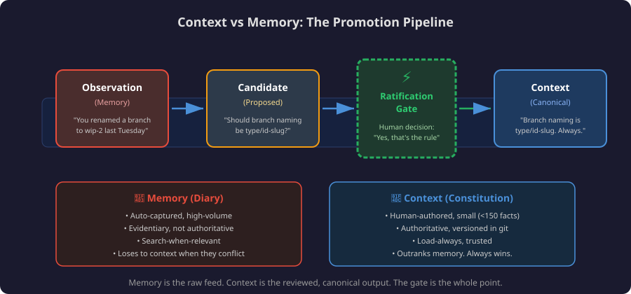
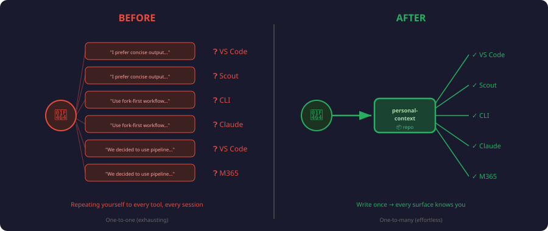
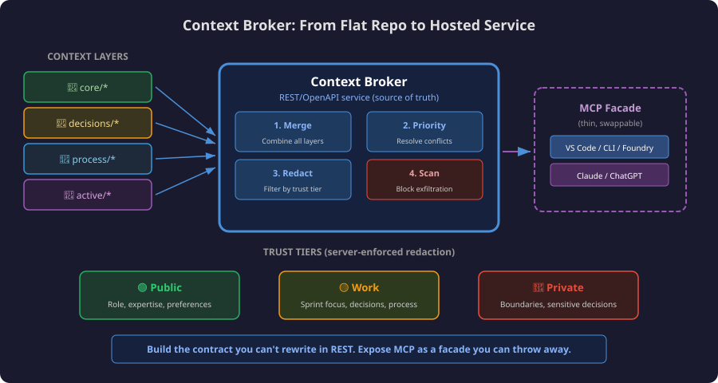

Many developers use multiple AI surfaces daily: GitHub Copilot in VS Code, Copilot CLI, Microsoft 365 Copilot, Microsoft Scout, Claude, ChatGPT, or Cursor.

The problem: each surface starts without the context you gave the last one. Preferences, current work, boundaries, and decisions stay trapped in whichever tool you told.

This post proposes a portable personal context source: structured markdown files in a GitHub repo that AI tools can read. No vendor supports this end-to-end today. The storage can be portable; the behavior is not automatic. Each surface still needs its own wiring.

---

## The Problem: Context Islands


| Surface | What it knows about you | Where that knowledge lives |
|---------|------------------------|---------------------------|
| **Copilot in VS Code** | `.github/copilot-instructions.md` in current repo | Per-repo, per-machine |
| **Copilot CLI** | Local instructions, skills, plugins, MCP servers, and session data | CLI-specific local state |
| **Microsoft 365 Copilot** | Your M365 Graph data (emails, calendar) | Cloud, not exportable |
| **Microsoft Scout** | Memories, preferences, profile | Local app state |
| **Claude** | `CLAUDE.md` per project, memory | Per-project file + cloud memory |
| **Cursor** | Project Rules in `.cursor/rules/*.mdc`, plus `AGENTS.md` support | Per-project rules |

The pattern: each tool has its own user-context format. The result:
- Repeated preferences in every tool ("I prefer concise output," "use TypeScript," "don't auto-push to main")
- Decisions invisible outside the surface where they happened
- Expertise and boundaries known only where you stated them

---

## You Already Know What the Solution Feels Like


| Built-in Feature | What it does | The problem |
|---|---|---|
| **M365 Copilot: Custom instructions** | "Be concise, use tables" | Doesn't reach VS Code or CLI |
| **M365 Copilot: Work profile** | Your role, org, skills | Locked in Microsoft Graph |
| **M365 Copilot: Saved memories** | Facts remembered between sessions | Only M365 Copilot sees them |
| **ChatGPT: Memory** | Auto-extracted facts about you | Only ChatGPT sees them |
| **Claude: CLAUDE.md** | Per-project instructions | Only Claude Code sees them |
| **Cursor: Rules** | Coding preferences | Only Cursor sees them |

Each tool stores personalization separately. Portable context makes the source shared:

```
Today:
  M365 Copilot    → knows you like concise output
  VS Code Copilot → doesn't know (asks again)
  Copilot CLI     → doesn't know (asks again)
  Scout           → has its own separate copy
  Claude          → has its own separate copy

With portable personal context:
  Wired surfaces  → read from the same source → load your preferences
```

---

## Why Not Just Use Those Existing Features?

| | Built-in Personalization | Portable Context |
|---|---|---|
| **Portability** | One surface only | Shared source; manual wiring per surface |
| **Transparency** | Opaque ("View work data") | Human-readable markdown |
| **Exportability** | Can't export | `git clone` anywhere |
| **Versioning** | No history | Full git history |
| **Control** | Platform decides format | You decide format |
| **Decisions** | No structured log | Append-only ledger |
| **Auto-extraction** | Yes (convenient) | Manual (precise) |

Use built-in personalization where it exists; keep portable context as the canonical source you can inspect and version.

---

## Why Not CLAUDE.md, copilot-instructions, or Cursor Rules?

Those files are **instructions TO the AI** for one project. Personal context is **information ABOUT you** across tools. Cursor's current model is Project Rules in `.cursor/rules/*.mdc`; `.cursorrules` is legacy.


```
.github/copilot-instructions.md  → "In this repo, use ESM imports"
personal-context/process/...     → "I always prefer ESM over CommonJS"
```

Repo-level files govern a codebase. Personal context governs how to work with *you*.

---

## Why Not Just an Agent or Skill?

Agents and skills are task-scoped. Personal context is user-scoped.


| | Personal Context | Agent (agent.md) | Skill (SKILL.md) |
|---|---|---|---|
| **Answers** | "Who is this person?" | "How should I behave?" | "How do I do this task?" |
| **Scope** | Everything you do | One role or surface | One repeatable procedure |
| **Lifespan** | Years (grows with you) | Months (evolves with tooling) | Weeks (refined per use) |
| **Portability** | Shared source across wired surfaces | One surface | Some surfaces |

Personal context should feed agents and skills, not duplicate them. Without it, agents start without your quality bar, boundaries, or past decisions.

---

## Why Not Mem0 or a Cloud Memory Service?

[Mem0](https://mem0.ai) is a cloud API for persistent AI memory. It makes different tradeoffs:

| | Mem0 (Cloud) | Personal Context Repo |
|---|---|---|
| **Architecture** | Hosted API service | Local-first (files in git) |
| **Data ownership** | Third-party hosted | You own it (your GitHub) |
| **Works offline** | No | Yes |
| **Vendor dependency** | Yes (Mem0 API key) | No (just git) |
| **Human-readable** | No (vector store) | Yes (markdown you can edit) |
| **Versioned** | No (mutable state) | Yes (git history + blame) |
| **Semantic search** | Yes (their strength) | No (not needed at personal scale) |
| **Best for** | App builders serving many users | Individual developers across their own tools |

For one developer, dozens of curated facts, decisions, and preferences may not need a hosted dependency.

---

## Personal Context Is Not Memory



Key distinction: **personal context is not memory.** They overlap, but they need different storage, governance, and precedence rules.

Context is declared, curated, and authoritative. Memory is accumulated from use.

| | Personal Context | Memory |
|---|---|---|
| **Origin** | Authored intentionally | Accumulated automatically |
| **Nature** | Curated / declared | Accreted / observed |
| **Authority** | Authoritative ("this is the rule") | Evidentiary ("this is what happened") |
| **Example** | "My branch naming convention is `{type}/{id}-{slug}`" | "Last Tuesday you renamed a branch to `wip-2`" |
| **Volume** | Small, deliberate (~50-150 facts) | High-volume, ever-growing |
| **Governance** | Human-reviewed | Auto-captured |

They are two ends of a **promotion pipeline**:

```
observation  →  candidate  →  [ratification gate]  →  context
 (memory)       (proposed)     (a human decision)      (canonical)
```

Memory is the raw feed. Context is the reviewed output. The ratification gate is the control point. The architecture changes:

- **Stores.** Memory wants a high-volume append log. Context wants a small, curated, versioned set.
- **Precedence.** Context outranks memory. A remembered exception does not override a stated boundary.
- **Retrieval and governance.** Context is load-always instruction; memory is search-when-relevant evidence.

This post is about **context, not memory**: authored, reviewed, and portable.

---

## The Insight: LLMs Already Speak Markdown


AI tools read files. LLMs understand markdown. Developer tools commonly authenticate with **GitHub**.

> **A private GitHub repo with structured markdown files can be the shared context source.**

Any surface that can read the repo can load the same context.

---

## The Architecture: Personal Context as a Repo


```
github.com/<yourname>/personal-context  (placeholder private repo)
│
├── context.json              ← Manifest: what's here + retrieval rules
│
├── core/                     ← RARELY CHANGES (your "constitution")
│   ├── expertise.md          # What you know, your domain authority
│   ├── boundaries.md         # What stays human, what AI never does alone
│   ├── role.md               # Job, scope, organization
│   └── communication.md     # How you prefer to interact
│
├── decisions/                ← APPEND-ONLY (your "ledger")
│   ├── _active.md            # Decisions still governing current work
│   ├── 2026-07.md            # This month's new decisions
│   └── ...
│
├── process/                  ← STABLE (your "playbook")
│   ├── content-workflow.md   # How you create content
│   ├── code-workflow.md      # How you write and ship code
│   ├── quality-bar.md        # Definition of done per work type
│   └── tool-preferences.md  # Preferred tools and patterns
│
├── active/                   ← CHANGES OFTEN (your "whiteboard")
│   ├── projects.md           # Current active projects
│   ├── sprint-focus.md       # This sprint's commitments
│   └── parking-lot.md        # Deferred items
│
└── .github/
    └── copilot-instructions.md  # Tells Copilot how to USE this repo
```

### Why Four Layers?

Separate by **durability**: how often it changes and who can change it.


| Layer | Half-life | Mutability | Example |
|-------|-----------|-----------|---------|
| **Core** | Months/years | Human-only | "I'm a senior developer on the Azure SDK docs team" |
| **Decisions** | Permanent (append-only) | Any surface proposes; append after human confirmation | "Use generation pipeline for MCP namespace files" |
| **Process** | Weeks/months | Propose via PR | "Branch naming: `{type}/{id}-{slug}`" |
| **Active** | Days/weeks | Any surface updates after pull-before-push | "Sprint focus: Ship auth-flow feature" |

---

## What Goes in Each Layer

### Core: Your Constitution

Rarely changing context: expertise, boundaries, communication preferences.

**`core/expertise.md`** — What you know:

```markdown
## Domain Expertise
- Azure SDK documentation across JavaScript, Python, .NET, Java, Go, Rust
- AI developer tools (MCP servers, AI Toolkit, Copilot extensions)
- Content workflow automation and multi-agent orchestration
- Technical writing for developer audiences

## Not My Expertise (don't assume I know)
- Kubernetes operations / cluster management
- Frontend framework internals (React, Vue, etc.)
- ML model training / fine-tuning
```

**`core/boundaries.md`** — What stays human:

```markdown
## What AI Should Never Do Autonomously
- Push code to upstream repositories (only to forks)
- Send emails, Teams messages, or any outbound communication
- Close or resolve work items without my confirmation
- Delete files, branches, or repos
- Make irreversible changes without showing me the plan first

## What AI Can Do Without Asking
- Read files, search code, explore repos
- Draft content for my review
- Run tests, linting, builds
- Create branches on my fork
- Propose edits (but not commit without confirmation)
```

### Decisions: Your Ledger

Decisions can be proposed from any surface so settled questions stay settled after review.

**`decisions/_active.md`** — Still-relevant decisions:

```markdown
### [2026-07-06] Branch naming convention
- **Context:** Inconsistent branch names across repos
- **Decision:** Always use `{type}/{work-item-id}-{brief-slug}`
- **Types:** feat, fix, docs, refactor, test

### [2026-06-15] Prefer tables over prose for comparisons
- **Context:** AI kept writing long paragraphs comparing options
- **Decision:** When comparing 3+ options, always use a table
- **Supersedes:** Nothing (new preference)

### [2026-05-28] No hand-written namespace files
- **Context:** Generated files were higher quality than hand-written
- **Decision:** All namespace articles must come from the generation pipeline
- **Implications:** Slower to ship, but deterministically correct
```

### Process: Your Playbook

Work preferences. Update as workflow changes.

**`process/quality-bar.md`**:

```markdown
## When Is a Pull Request Done?
- [ ] Work item linked with "Fixes AB#{id}"
- [ ] Meaningful title and description (not just commit messages)
- [ ] No unrelated changes (surgical edits only)
- [ ] CI passes
- [ ] Review comments addressed, not dismissed
- [ ] Staged preview links included for doc changes

## When Is an Article Done?
- [ ] Technically accurate (verified against product behavior)
- [ ] Code samples run without modification
- [ ] All links resolve (no 404s)
- [ ] Metadata correct (ms.topic, ms.date, ms.service)
- [ ] Reviewed by at least 1 peer
```

### Active: Your Whiteboard

Current work state, writable by any surface.

**`active/sprint-focus.md`**:

```markdown
## Sprint 14 (2026-07-01 → 2026-07-12)

### Committed
1. Ship MCP auth namespace docs (AB#4521)
2. Review 3 community PRs on azure-dev-docs
3. Update AI Toolkit quickstart for v0.9

### Stretch
- Prototype portable context layer (this project!)
```

---

## How Surfaces Consume It

### Selective Retrieval: Only Load What's Relevant

Do not load the whole repo. Use `context.json` to choose task-relevant files:

```
1. Read context.json (< 1KB, always cached)
2. ALWAYS load: core/boundaries.md + core/communication.md (~400 words)
3. Classify the current task → match to load_by_task
4. Load those 2-3 files (~500 words)
5. Load decisions/_active.md (~300 words)

Total: ~1,200 words ≈ 1,600 tokens
```


### The Priority Stack

Resolve contradictions deterministically:

```
core/boundaries.md          ← ALWAYS wins. Non-negotiable.
decisions/_active.md        ← Settled questions. Don't re-ask.
process/*.md                ← How to do things. Follow unless overridden in-session.
active/*.md                 ← Informational state. Not authoritative.
```


### Threat Model: Retrieval Is the Boundary

The primary risk is prompt injection causing a surface to retrieve or reveal context it should not have. Trust tiers must be enforced **before retrieval**, by deciding what files or slices enter the prompt. Output scanning is not a security boundary; use it only as defense in depth. Keep two boundary files if needed: shareable operating rules that most tools can load, and private sensitive constraints that only trusted surfaces can retrieve.

### Writing Back: Closing the Loop

After human confirmation, any surface can **write decisions back**:

```bash
# After making a decision in any surface:
cd ~/personal-context
echo "
### [$(date +%Y-%m-%d)] {decision title}
- **Context:** {why this came up}
- **Decision:** {what was decided}
- **Implications:** {what this means going forward}
" >> decisions/_active.md

git add decisions/_active.md
git commit -m "decision: {brief title}"
git push
```

That simple append is safe only for a single writer with a fresh clone. Multi-surface writes need write intents with IDs and timestamps, pull-before-push, and PR-based reconciliation for stale updates or conflicts. The core layer stays human-only; non-active layers should go through review instead of direct overwrite.

---

## Connecting Each Surface (Proposed Integrations)

Examples only. Some work manually; others need vendor support. The mechanism: read files and inject context.

### GitHub Copilot in VS Code

In your user-level `settings.json`:

```json
{
  "github.copilot.chat.codeGeneration.instructions": [
    { "file": "~/personal-context/core/boundaries.md" },
    { "file": "~/personal-context/core/communication.md" },
    { "file": "~/personal-context/decisions/_active.md" }
  ]
}
```

Or reference the repo in any project's custom instructions:

```markdown
<!-- .github/copilot-instructions.md in any repo -->
For my personal preferences and decisions, reference:
https://github.com/<yourname>/personal-context
```

### Copilot CLI

Use the current standalone `copilot` CLI. Put durable CLI instructions in `$HOME/.copilot/copilot-instructions.md`, then point those instructions at the cloned context repo:

```bash
mkdir -p ~/.copilot
cat > ~/.copilot/copilot-instructions.md <<'EOF'
For personal preferences and decisions, read:
- ~/personal-context/core/communication.md
- ~/personal-context/core/boundaries.md
- ~/personal-context/decisions/_active.md

Treat the repo as reference context. Do not rewrite core files without human approval.
EOF
```

For richer integration, expose the same repo through an MCP server and register it with `copilot mcp`.

### Microsoft Scout

Scout exposes settings for memory, personality presets, workspace, and permissions. Use those surfaces to mirror the same repo-backed preferences manually or through a sync process. A generated profile file can work as an implementation pattern, but the path below is illustrative, not a documented Scout contract:

```powershell
# Sync script: pull personal-context → render an illustrative Scout profile
$role = Get-Content ~/personal-context/core/role.md -Raw
$comms = Get-Content ~/personal-context/core/communication.md -Raw
$boundaries = Get-Content ~/personal-context/core/boundaries.md -Raw

@"
# Personal Profile
$role

## Communication
$comms

## Boundaries
$boundaries
"@ | Set-Content ./scout-profile-example.md
```

### Microsoft 365 Copilot

Sync the repo to a OneDrive folder:

```
OneDrive/personal-context/ → synced from GitHub repo
```

### Any MCP-Enabled Tool (Claude, Cursor, ChatGPT)

Expose the repo as an MCP resource server, or clone it locally and point the tool config to the files. [MCP](https://modelcontextprotocol.io) is the integration protocol for tools, resources, and prompts; use it to expose context as resources or tools where supported.

---

## Getting Started: Example 30-Minute Setup


This is a rough first-pass estimate, not a guarantee. The ongoing cost is maintenance: review proposed changes, resolve conflicts, and prune stale active context.

### 1. Create the repo (5 minutes)

```bash
gh repo create personal-context --private
cd personal-context
mkdir -p core decisions process active .github
```

### 2. Write your identity (10 minutes)

Write what you would tell a new team member on day one.

### 3. Capture your first decisions (10 minutes)

Write five repeated preferences or decisions in `decisions/_active.md`.

### 4. Connect one surface (5 minutes)

Wire up VS Code settings, Scout profile, or a CLI alias. Verify it loads context.

### 5. Evolve naturally

When an AI asks something it should know, write it down, commit, and push.

---

## The Payoff



| Before | After |
|--------|-------|
| "I prefer concise output" (every session) | A wired surface can load it from `core/communication.md` |
| "Use fork-first workflow" (every PR) | A wired surface can load it from `process/code-workflow.md` |
| "We decided to use the pipeline" (re-explained monthly) | A wired surface can load it from `decisions/_active.md` |
| "My sprint focus is X" (repeated across tools) | A wired surface can read `active/sprint-focus.md` |
| Start over in each new tool | Start from the same source after each tool is wired |

Likely payoff: fewer repeated preferences, fewer re-decisions, and faster starts. Keep time-saved claims only if measured.

---

## Beyond the Repo: When a Service Makes Sense



The repo is the floor: markdown, git, no server, no vendor, no API key. Use a service only when a flat repo cannot enforce access. Git gives readers the whole file; a **hosted service** can return only authorized slices.

### What a hosted version would buy you

- **Server-side redaction by trust tier.** Enforce `public` / `work` / `private` tiers at the server. A flat repo cannot do that; clone access gets everything.
- **Identity-based audit and access control.** Log who read context, when, and from which surface.
- **Central precedence.** Resolve boundaries, decisions, process, and active state once instead of per surface.

### The key design call: contract vs. transport

Do not make **MCP the canonical contract.** MCP is the integration protocol, not the canonical data model. Keep Git as the source of truth. If you build a service, make it a derived read facade over the repo, with a REST/OpenAPI contract and MCP exposed as a thin facade where clients support it.

> **Keep the contract you can't afford to rewrite in Git and REST; expose MCP as a facade you can afford to replace.**

Version the REST facade carefully. Treat MCP adapters as replaceable.

### What the service actually is: a context broker

The service has four jobs:

1. **Merge** — combine the layers (core, decisions, process, active) into one view.
2. **Priority** — apply the precedence stack so conflicts resolve deterministically.
3. **Redaction** — return only the caller's trust tier.
4. **Defense-in-depth scanning** — flag output that appears to reveal a tier the caller should not see.

The third job is the security boundary for **prompt-injection exfiltration**. With server-side redaction before retrieval, private context never enters the prompt for an untrusted caller. The fourth job can catch mistakes, but it cannot make unsafe retrieval safe.

### Even a service still hits the standards wall

The limitation: even with a hosted service, consumption stays uneven:

| Surface | Talks to a remote MCP server? |
|---|---|
| VS Code / Copilot CLI / Foundry | Yes — directly |
| Claude / ChatGPT | Yes — directly where the surface, plan, and auth model allow remote MCP |
| Microsoft 365 Copilot | No — it wants Graph connectors / declarative agents |

The hosted version still needs a shared standard. For one developer, the repo is usually enough. A service earns its complexity only with **multiple trust tiers, multiple consumers, or a real injection threat model.**

---

## What's Next: The Standard That Doesn't Exist Yet


This post is a proposal, not a product announcement. Today, **none of this works automatically**. Each tool reads its own context files, in its own format, from its own location. Vendors are adding memory, custom instructions, project files, and agent profiles, but not a shared context standard.

What's missing is a **shared standard** for where personal context lives and how to read/write it. The [Model Context Protocol](https://modelcontextprotocol.io) standardized tool integration; user identity needs the same kind of agreement. No shared standard exists today.

The GitHub repo approach is a bet: structured markdown plus a retrieval manifest could work if tool builders agreed to read it.

**The ask to tool builders:** Add an `$AI_CONTEXT_PATH` or equivalent. Let users point to markdown context. Portable context works when surfaces agree to read the repo.
