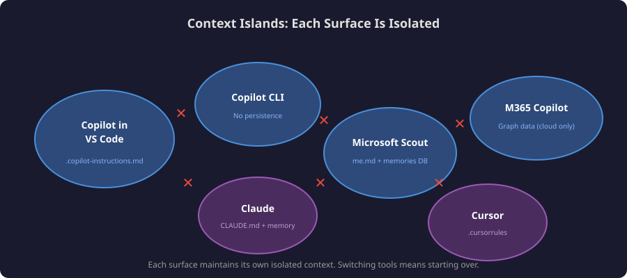
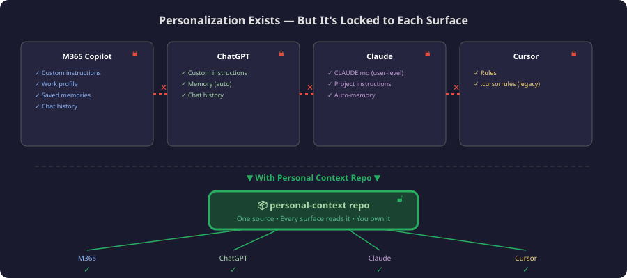
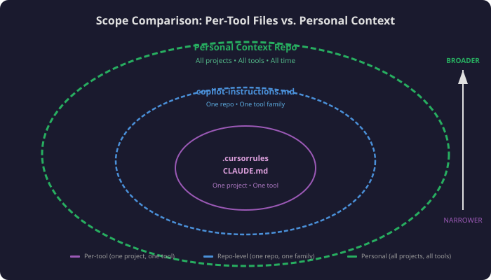
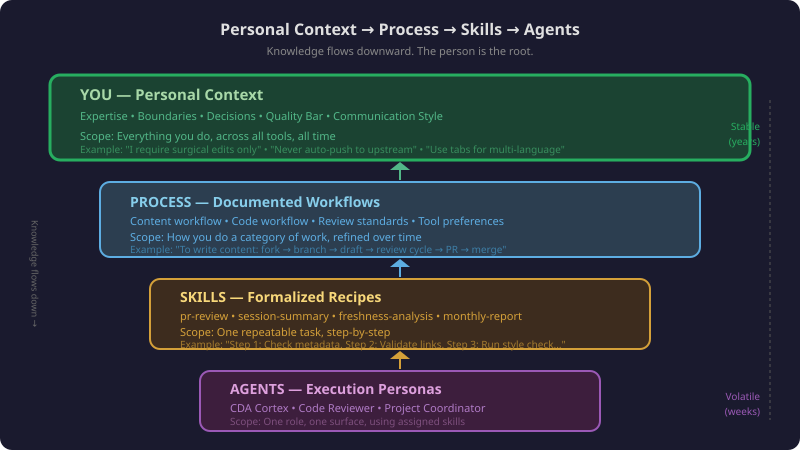
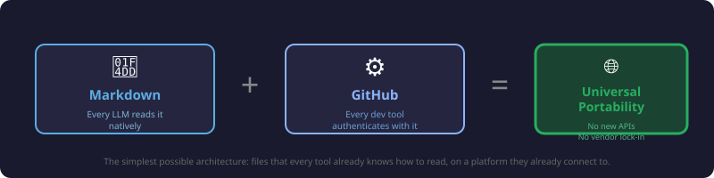
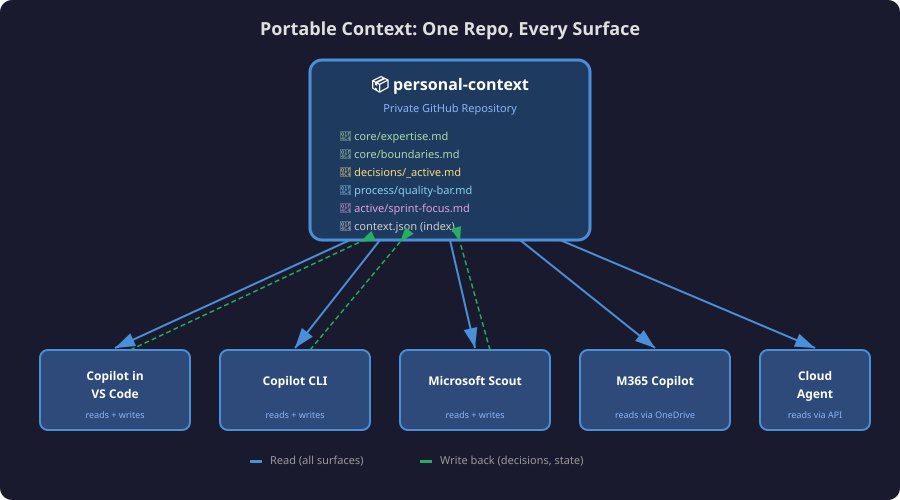
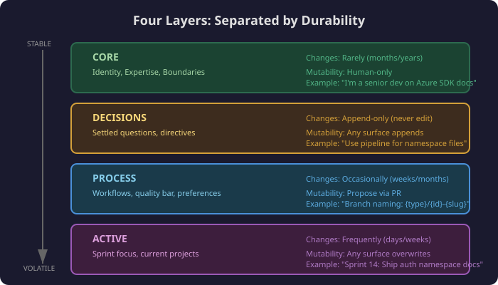
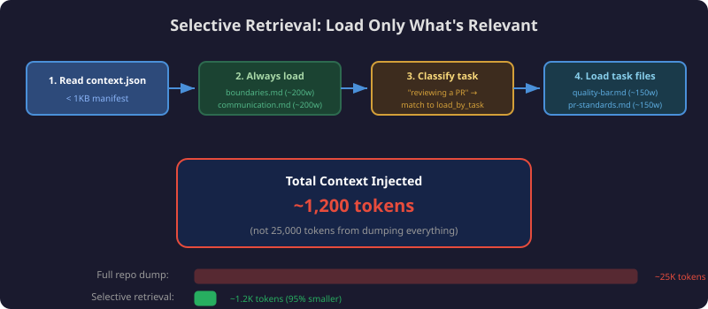
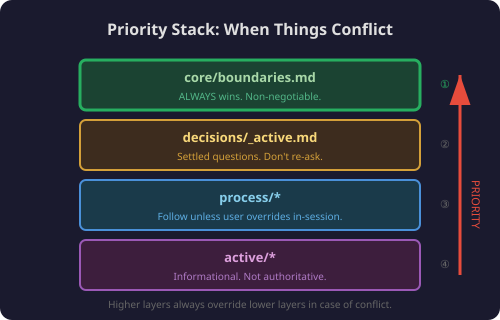
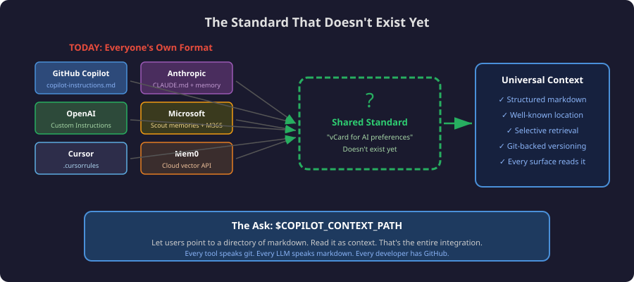

Every developer I know uses multiple AI surfaces daily. GitHub Copilot in VS Code for coding. Copilot CLI for terminal workflows. Microsoft 365 Copilot for email and meetings. Microsoft Scout for desktop orchestration. Maybe Claude, ChatGPT, or Cursor on the side.

The problem? **Every time you switch surfaces, you start over.** The AI that just helped you plan a feature in Scout has no idea you exist when you open VS Code. The Copilot CLI that helped you craft a git command doesn't know your branch naming conventions that you already taught VS Code.

Your context — who you are, what you're working on, how you like to work, and what you've already decided — is trapped in whichever tool you happened to tell it to.

This post **proposes** a fix: a **portable personal context layer** — a structured set of files in a GitHub repo that any AI surface *could* read, giving every tool your "second brain" from the first interaction. Today, no single vendor supports this end-to-end — not even across two surfaces from the same maker. This is a design for what *should* exist, and an invitation to tool builders to make it real.

---

## The Problem: Context Islands



Here's what context fragmentation looks like in practice:

| Surface | What it knows about you | Where that knowledge lives |
|---------|------------------------|---------------------------|
| **Copilot in VS Code** | `.github/copilot-instructions.md` in current repo | Per-repo, per-machine |
| **Copilot CLI** | Nothing persistent between sessions | Ephemeral |
| **Microsoft 365 Copilot** | Your M365 Graph data (emails, calendar) | Cloud, not exportable |
| **Microsoft Scout** | Memories, preferences, profile | Local app state |
| **Claude** | `CLAUDE.md` per project, memory | Per-project file + cloud memory |
| **Cursor** | `.cursorrules` per project | Per-project file |

Notice the pattern: every tool has invented its own format for "things to know about the user," and none of them talk to each other.

The result:
- You repeat preferences in every tool ("I prefer concise output," "use TypeScript," "don't auto-push to main")
- Decisions made in one surface are invisible to others
- Your expertise and boundaries are only known where you've explicitly stated them
- Switching tools feels like introducing yourself to a new coworker every time

---

## You Already Know What the Solution Feels Like

If you've set up **Custom Instructions** in M365 Copilot, **Memory** in ChatGPT, or **CLAUDE.md** in Claude — you already know what personal context feels like. You've experienced the difference between an AI that knows you and one that doesn't.



| Built-in Feature | What it does | The problem |
|---|---|---|
| **M365 Copilot: Custom instructions** | "Be concise, use tables" | Doesn't reach VS Code or CLI |
| **M365 Copilot: Work profile** | Your role, org, skills | Locked in Microsoft Graph |
| **M365 Copilot: Saved memories** | Facts remembered between sessions | Only M365 Copilot sees them |
| **ChatGPT: Memory** | Auto-extracted facts about you | Only ChatGPT sees them |
| **Claude: CLAUDE.md** | Per-project instructions | Only Claude Code sees them |
| **Cursor: Rules** | Coding preferences | Only Cursor sees them |

Every tool has built its own personalization silo. **Personal context is personalization that travels.**

```
Today:
  M365 Copilot    → knows you like concise output
  VS Code Copilot → doesn't know (asks again)
  Copilot CLI     → doesn't know (asks again)
  Scout           → has its own separate copy
  Claude          → has its own separate copy

With portable personal context:
  All surfaces    → read from the same source → know you immediately
```

---

## Why Not Just Use Those Existing Features?

| | Built-in Personalization | Portable Context |
|---|---|---|
| **Portability** | One surface only | Every surface |
| **Transparency** | Opaque ("View work data") | Human-readable markdown |
| **Exportability** | Can't export | `git clone` anywhere |
| **Versioning** | No history | Full git history |
| **Control** | Platform decides format | You decide format |
| **Decisions** | No structured log | Append-only ledger |
| **Auto-extraction** | Yes (convenient) | Manual (precise) |

They're complementary. Use built-in personalization where it exists. Use portable context as the canonical source that stays consistent across *everything*.

---

## Why Not CLAUDE.md, copilot-instructions, or .cursorrules?

Those are **instructions TO the AI** scoped to one project. Personal context is **information ABOUT you** that spans all projects and tools.



```
.github/copilot-instructions.md  → "In this repo, use ESM imports"
personal-context/process/...     → "I always prefer ESM over CommonJS"
```

The repo-level file says how to work in *that codebase*. Personal context says how to work with *you*.

---

## Why Not Just an Agent or Skill?

This is the subtlest distinction. Agents and skills are scoped to tasks. Personal context is scoped to **you as a person**.



| | Personal Context | Agent (agent.md) | Skill (SKILL.md) |
|---|---|---|---|
| **Answers** | "Who is this person?" | "How should I behave?" | "How do I do this task?" |
| **Scope** | Everything you do | One role or surface | One repeatable procedure |
| **Lifespan** | Years (grows with you) | Months (evolves with tooling) | Weeks (refined per use) |
| **Portability** | Every surface | One surface | Some surfaces |

Knowledge flows downward: **person → process → skill → agent**.

1. You learn something → it becomes **expertise** (personal context)
2. You repeat a process → it becomes a **workflow** (personal context)
3. You formalize the workflow → it becomes a **skill** (SKILL.md)
4. You assign skills to a persona → it becomes an **agent** (agent.md)

Personal context is the root. Agents and skills are leaves that grow from it. Without personal context, every agent is generic — it doesn't know YOUR quality bar, YOUR boundaries, YOUR past decisions.

---

## Why Not Mem0 or a Cloud Memory Service?

[Mem0](https://mem0.ai) is a cloud API for persistent AI memory. It solves the same problem but with a different philosophy:

| | Mem0 (Cloud) | Personal Context Repo |
|---|---|---|
| **Architecture** | Hosted API service | Local-first (files in git) |
| **Data ownership** | Third-party hosted | You own it (your GitHub) |
| **Works offline** | No | Yes |
| **Vendor dependency** | Yes (Mem0 API key) | No (just git) |
| **Human-readable** | No (vector store) | Yes (markdown you can edit) |
| **Versioned** | No (mutable state) | Yes (git history + blame) |
| **Semantic search** | Yes (their strength) | No (not needed at personal scale) |
| **Best for** | App builders serving many users | Individual developers across their own tools |

Mem0's own research says file-based memory "works beautifully for ≤200 static memories, single user, no concurrency." That's exactly the personal context use case — ~50-150 facts about you, curated deliberately.

---

## Personal Context Is Not Memory


Before going further, one distinction that tripped me up when I started — and trips up half the tools in this space: **personal context is not memory.** They feel similar, they overlap, and plenty of products blur them on purpose. Architecturally, though, they're two different animals, and conflating them is exactly why so many "memory" features feel both magical and untrustworthy.

Here's the one-line version:

> **Context is your constitution. Memory is your diary.**

Context is what you *ratified* — declared, curated, authoritative. Memory is what was *observed* — accreted, evidentiary, a byproduct of use.

| | Personal Context | Memory |
|---|---|---|
| **Origin** | Authored intentionally | Accumulated automatically |
| **Nature** | Curated / declared | Accreted / observed |
| **Authority** | Authoritative ("this is the rule") | Evidentiary ("this is what happened") |
| **Example** | "My branch naming convention is `{type}/{id}-{slug}`" | "Last Tuesday you renamed a branch to `wip-2`" |
| **Volume** | Small, deliberate (~50-150 facts) | High-volume, ever-growing |
| **Governance** | Human-reviewed | Auto-captured |

They aren't rivals — they're two ends of a **promotion pipeline**:

```
observation  →  candidate  →  [ratification gate]  →  context
 (memory)       (proposed)     (a human decision)      (canonical)
```

Memory is the raw feed. Context is the reviewed, canonical output. The gate in the middle — an explicit human decision — is the whole point. "You renamed a branch to `wip-2` last week" is an observation; it only becomes "my branch naming convention is X" when *I* say so.

That distinction has real architectural consequences:

- **Different stores.** Memory wants a high-volume append log optimized for recall. Context wants a small, curated, versioned set — exactly the git repo above.
- **Different precedence.** When they conflict, **context outranks memory.** The constitution beats the diary. If memory "remembers" you pushed to `main` once, that never overrides the boundary that says you don't.
- **Different retrieval, governance, and security.** Context is load-always and trusted; memory is search-when-relevant and treated as evidence, not instruction.

Why does this matter for the thesis of this post? Because the portable layer I'm proposing is **context, not memory.** Tools like Mem0, Claude memory, and ChatGPT memory solve the *observe-and-recall* half — and they solve it well. What none of them give you is a portable, authored, authoritative layer you *ratify*. They observe; they don't ratify. That gap is the thing this repo pattern is trying to fill.

---

## The Insight: LLMs Already Speak Markdown

The solution isn't a complex sync service, a vector database, or a new protocol. It's simpler than that.



Every AI tool can read files. Every AI tool understands markdown. And there's one platform every developer tool already authenticates with: **GitHub**.

> **A private GitHub repo with structured markdown files IS your portable second brain.**

Any surface that can read a file from GitHub (which is all of them) gets your full context. No new APIs, no dependencies, no vendor lock-in.

---

## The Architecture: Personal Context as a Repo



```
github.com/yourname/personal-context  (private repo)
│
├── context.json              ← Manifest: what's here + retrieval rules
│
├── core/                     ← RARELY CHANGES (your "constitution")
│   ├── expertise.md          # What you know, your domain authority
│   ├── boundaries.md         # What stays human, what AI never does alone
│   ├── role.md               # Job, scope, organization
│   └── communication.md     # How you prefer to interact
│
├── decisions/                ← APPEND-ONLY (your "ledger")
│   ├── _active.md            # Decisions still governing current work
│   ├── 2026-07.md            # This month's new decisions
│   └── ...
│
├── process/                  ← STABLE (your "playbook")
│   ├── content-workflow.md   # How you create content
│   ├── code-workflow.md      # How you write and ship code
│   ├── quality-bar.md        # Definition of done per work type
│   └── tool-preferences.md  # Preferred tools and patterns
│
├── active/                   ← CHANGES OFTEN (your "whiteboard")
│   ├── projects.md           # Current active projects
│   ├── sprint-focus.md       # This sprint's commitments
│   └── parking-lot.md        # Deferred items
│
└── .github/
    └── copilot-instructions.md  # Tells Copilot how to USE this repo
```

### Why Four Layers?

Not all context is equal. The key insight is separating by **durability** — how often something changes and who's allowed to change it:



| Layer | Half-life | Mutability | Example |
|-------|-----------|-----------|---------|
| **Core** | Months/years | Human-only | "I'm a senior developer on the Azure SDK docs team" |
| **Decisions** | Permanent (append-only) | Any surface appends | "Use generation pipeline for MCP namespace files" |
| **Process** | Weeks/months | Propose via PR | "Branch naming: `{type}/{id}-{slug}`" |
| **Active** | Days/weeks | Any surface overwrites | "Sprint focus: Ship auth-flow feature" |

---

## What Goes in Each Layer

### Core: Your Constitution

This is the stuff that rarely changes — your expertise, your boundaries, your communication preferences. Any AI surface reads this to understand *who it's working with* before you say a word.

**`core/expertise.md`** — What you know:

```markdown
## Domain Expertise
- Azure SDK documentation across JavaScript, Python, .NET, Java, Go, Rust
- AI developer tools (MCP servers, AI Toolkit, Copilot extensions)
- Content workflow automation and multi-agent orchestration
- Technical writing for developer audiences

## Not My Expertise (don't assume I know)
- Kubernetes operations / cluster management
- Frontend framework internals (React, Vue, etc.)
- ML model training / fine-tuning
```

**`core/boundaries.md`** — What stays human:

```markdown
## What AI Should Never Do Autonomously
- Push code to upstream repositories (only to forks)
- Send emails, Teams messages, or any outbound communication
- Close or resolve work items without my confirmation
- Delete files, branches, or repos
- Make irreversible changes without showing me the plan first

## What AI Can Do Without Asking
- Read files, search code, explore repos
- Draft content for my review
- Run tests, linting, builds
- Create branches on my fork
- Propose edits (but not commit without confirmation)
```

### Decisions: Your Ledger

The most valuable layer. Every time you make a decision in any AI surface, it gets appended here. No surface should ever re-ask a question you've already answered.

**`decisions/_active.md`** — Still-relevant decisions:

```markdown
### [2026-07-06] Branch naming convention
- **Context:** Inconsistent branch names across repos
- **Decision:** Always use `{type}/{work-item-id}-{brief-slug}`
- **Types:** feat, fix, docs, refactor, test

### [2026-06-15] Prefer tables over prose for comparisons
- **Context:** AI kept writing long paragraphs comparing options
- **Decision:** When comparing 3+ options, always use a table
- **Supersedes:** Nothing (new preference)

### [2026-05-28] No hand-written namespace files
- **Context:** Generated files were higher quality than hand-written
- **Decision:** All namespace articles must come from the generation pipeline
- **Implications:** Slower to ship, but deterministically correct
```

### Process: Your Playbook

How you prefer to work. This changes occasionally as you refine your workflow.

**`process/quality-bar.md`**:

```markdown
## When Is a Pull Request Done?
- [ ] Work item linked with "Fixes AB#{id}"
- [ ] Meaningful title and description (not just commit messages)
- [ ] No unrelated changes (surgical edits only)
- [ ] CI passes
- [ ] Review comments addressed, not dismissed
- [ ] Staged preview links included for doc changes

## When Is an Article Done?
- [ ] Technically accurate (verified against product behavior)
- [ ] Code samples run without modification
- [ ] All links resolve (no 404s)
- [ ] Metadata correct (ms.topic, ms.date, ms.service)
- [ ] Reviewed by at least 1 peer
```

### Active: Your Whiteboard

The ephemeral-ish stuff — what you're working on right now. Any surface can overwrite this.

**`active/sprint-focus.md`**:

```markdown
## Sprint 14 (2026-07-01 → 2026-07-12)

### Committed
1. Ship MCP auth namespace docs (AB#4521)
2. Review 3 community PRs on azure-dev-docs
3. Update AI Toolkit quickstart for v0.9

### Stretch
- Prototype portable context layer (this project!)
```

---

## How Surfaces Consume It

### Selective Retrieval: Only Load What's Relevant

A surface doesn't dump the entire repo into its prompt. The `context.json` manifest tells it what to load based on the task:

```
1. Read context.json (< 1KB, always cached)
2. ALWAYS load: core/boundaries.md + core/communication.md (~400 words)
3. Classify the current task → match to load_by_task
4. Load those 2-3 files (~500 words)
5. Load decisions/_active.md (~300 words)

Total: ~1,200 words ≈ 1,600 tokens
```

That's less than 2K tokens for full personalization. Well within any context window budget.



### The Priority Stack

If different layers contradict, the resolution is deterministic:

```
core/boundaries.md          ← ALWAYS wins. Non-negotiable.
decisions/_active.md        ← Settled questions. Don't re-ask.
process/*.md                ← How to do things. Follow unless overridden in-session.
active/*.md                 ← Informational state. Not authoritative.
```



### Writing Back: Closing the Loop

Any surface can **write decisions back**:

```bash
# After making a decision in any surface:
cd ~/personal-context
echo "
### [$(date +%Y-%m-%d)] {decision title}
- **Context:** {why this came up}
- **Decision:** {what was decided}
- **Implications:** {what this means going forward}
" >> decisions/_active.md

git add decisions/_active.md
git commit -m "decision: {brief title}"
git push
```

Now every other surface picks it up on next read. Decision made in Scout? VS Code Copilot knows. Decision made in CLI? Scout knows.

---

## Connecting Each Surface (Proposed Integrations)

The specifics below are illustrative — some work today with manual setup, others would require tool vendors to add support. The point is that the *mechanism* is simple in every case: read a file, inject as context.

### GitHub Copilot in VS Code

In your user-level `settings.json`:

```json
{
  "github.copilot.chat.codeGeneration.instructions": [
    { "file": "~/personal-context/core/boundaries.md" },
    { "file": "~/personal-context/core/communication.md" },
    { "file": "~/personal-context/decisions/_active.md" }
  ]
}
```

Or reference the repo in any project's custom instructions:

```markdown
<!-- .github/copilot-instructions.md in any repo -->
For my personal preferences and decisions, reference:
https://github.com/yourname/personal-context
```

### Copilot CLI

Create a shell function that injects context:

```bash
# ~/.bashrc or $PROFILE
function copilot-ctx() {
  local context=$(cat ~/personal-context/core/communication.md)
  gh copilot suggest -t shell "$context\n\nTask: $*"
}
```

### Microsoft Scout

Scout's profile can be generated FROM the canonical repo:

```powershell
# Sync script: pull personal-context → render me.md for Scout
$role = Get-Content ~/personal-context/core/role.md -Raw
$comms = Get-Content ~/personal-context/core/communication.md -Raw
$boundaries = Get-Content ~/personal-context/core/boundaries.md -Raw

@"
# Personal Profile
$role

## Communication
$comms

## Boundaries
$boundaries
"@ | Set-Content ~/.copilot/me.md
```

### Microsoft 365 Copilot

Sync the repo to a OneDrive folder:

```
OneDrive/personal-context/ → synced from GitHub repo
```

Then M365 Copilot can reference those files when you ask it to "follow my preferences."

### Any MCP-Enabled Tool (Claude, Cursor, ChatGPT)

Expose the repo as a simple MCP resource server — or just clone locally and point the tool's config to the files. [MCP](https://modelcontextprotocol.io) is the transport layer; the repo is the data.

---

## Getting Started: 30-Minute Setup


### 1. Create the repo (5 minutes)

```bash
gh repo create personal-context --private
cd personal-context
mkdir -p core decisions process active .github
```

### 2. Write your identity (10 minutes)

Start with `core/role.md` and `core/boundaries.md`. Don't overthink it — write what you'd tell a new team member on day one.

### 3. Capture your first decisions (10 minutes)

Think about the last 5 times an AI tool annoyed you by not knowing something. Those are your decisions. Write them in `decisions/_active.md`.

### 4. Connect one surface (5 minutes)

Pick your most-used surface and wire it up. VS Code settings, Scout profile, or a CLI alias. Verify it works — ask the AI something it should now know about you.

### 5. Evolve naturally

Don't try to write everything upfront. When an AI asks you something it should already know, that's a signal: write it down, commit, push. Your context grows organically from real interactions.

---

## The Payoff


After two weeks of capturing context:

| Before | After |
|--------|-------|
| "I prefer concise output" (every session) | AI already knows (from `core/communication.md`) |
| "Use fork-first workflow" (every PR) | AI already knows (from `process/code-workflow.md`) |
| "We decided to use the pipeline" (re-explained monthly) | AI already knows (from `decisions/_active.md`) |
| "My sprint focus is X" (repeated across tools) | Every surface reads `active/sprint-focus.md` |
| Start over in each new tool | Start where you left off, everywhere |

The compound effect is significant. After a month, you've spent maybe 2 hours total writing context. But you've saved dozens of hours of re-explaining, re-deciding, and re-orienting AI tools that should already know you.

---

## Beyond the Repo: When a Service Makes Sense


Everything above is deliberately the **floor** — the simplest thing that could possibly work. A flat git repo of markdown is the whole point: no server, no vendor, no API key. So when *would* you reach for something more?

The honest answer: when a flat repo can't enforce what you need. A git repo hands the whole file to anyone who can read it. A **hosted service** can hand back only the slice the caller is cleared to see. That's the line.

### What a hosted version would buy you

- **Server-side redaction by trust tier.** Split your context into `public` / `work` / `private` tiers and enforce the split *at the server*, not the client. The Copilot CLI on a work machine sees your work tier; a public-facing agent never sees your private tier at all. A flat repo can't do this — anyone with clone access gets everything.
- **Audit and access control tied to real identity.** Who read your context, when, from which surface — logged. Per-surface access bound to an actual identity instead of an honor system.
- **The precedence stack, enforced centrally.** The priority stack from earlier ("context outranks memory," boundaries always win) now runs server-side, so every consumer gets the same resolved answer instead of each surface re-implementing it.

### The key design call: contract vs. transport

If you build this, the mistake to avoid is making **MCP the canonical contract.** MCP is a fast-moving adapter for agentic surfaces — the right *transport*, the wrong thing to bet your data model on.

Build a **REST/OpenAPI service as the source of truth**, and expose **MCP as a thin, swappable facade** over it.

> **Build the contract you can't afford to rewrite in REST; expose MCP as a facade you can afford to throw away.**

The REST contract is the thing you version carefully and support for years. The MCP facade is a convenience layer you can rewrite — or swap for the next protocol — without touching your data model.

### A plausible stack (an example, not a mandate)

| Concern | Example choice | Why |
|---|---|---|
| REST + MCP server | Azure Container Apps | Scales to zero, no cluster to run |
| Storage | Cosmos DB serverless | Change feed gives you versioning + audit almost for free |
| Secrets | Key Vault | Keep keys out of the app |
| Auth / identity | Entra ID app registration + managed identity | Real identity, no shared secrets |
| Output scanning (later) | API Management + Azure AI Content Safety / Prompt Shields | Add when you need it, not on day one |

> **MCP is the transport; Entra is the identity.**

### What the service actually is: a context broker

Strip away the stack and the service does four jobs:

1. **Merge** — combine the layers (core, decisions, process, active) into one view.
2. **Priority** — apply the precedence stack so conflicts resolve deterministically.
3. **Redaction** — return only the caller's trust tier.
4. **Output scanning** — catch a prompt-injection attempt trying to exfiltrate a tier the caller shouldn't see.

That fourth job names the dominant threat honestly: **prompt-injection exfiltration.** A malicious doc or tool convinces the agent to read your private context and leak it. Server-side tier redaction is the mitigation a flat git repo simply can't offer — the private tier never leaves the server in the first place.

### Even a service still hits the standards wall

Here's the deflating part, and it reinforces where this post is headed. Even with a hosted service, consumption stays uneven:

| Surface | Talks to a remote MCP server? |
|---|---|
| VS Code / Copilot CLI / Foundry | Yes — directly |
| Claude / ChatGPT | Only via an `mcp-remote` proxy |
| Microsoft 365 Copilot | No — it wants Graph connectors / declarative agents |

So the grown-up version doesn't escape the "no universal standard" problem from the next section — it runs straight into the same wall, just from a more capable starting point.

And to be clear about scope: for one developer, the repo is usually enough. The service earns its complexity only when you have **multiple trust tiers, multiple consumers, or a real injection threat model.** Short of that, `git push` is the architecture.

---

## What's Next: The Standard That Doesn't Exist Yet



This post is a proposal, not a product announcement. Today, **none of this works automatically** — not even across two Copilot surfaces from the same company. Each tool reads its own context files, in its own format, from its own location.

But the industry is converging on the problem:

- **Mem0** raised $24M to solve "AI memory that persists across sessions"
- **Anthropic** added memory to Claude and `CLAUDE.md` per project
- **OpenAI** added Custom Instructions and Memory to ChatGPT
- **Microsoft** ships Copilot personalization and Scout memories
- **Letta** builds git-backed persistent memory for agents
- **Every coding tool** has its own instructions file format

What's missing is a **shared standard** — an agreement across tools about where personal context lives and how to read/write it. The [Model Context Protocol](https://modelcontextprotocol.io) standardized tool integration; we need the same for user identity.

No such standard exists today. There's no "vCard for AI preferences," no "iCal for decisions." This is genuinely unoccupied territory.

The GitHub repo approach described here is a bet: that structured markdown in a well-known location, with a manifest for selective retrieval, is the simplest architecture that *could* work — if tool builders agreed to read it. Every tool speaks git. Every LLM speaks markdown. Every developer has a GitHub account.

**The ask to tool builders:** Add a `$COPILOT_CONTEXT_PATH` or equivalent. Let users point to a directory of markdown files that your surface reads as additional context. That's the entire integration. The portability follows naturally.

Your second brain is just a `git push` away from every AI surface you use — once the surfaces agree to look for it.

---

*This is a proposal and a conversation starter. Have thoughts? Disagree with the approach? Building something similar? I'd love to hear how you're thinking about context portability across AI tools.*

