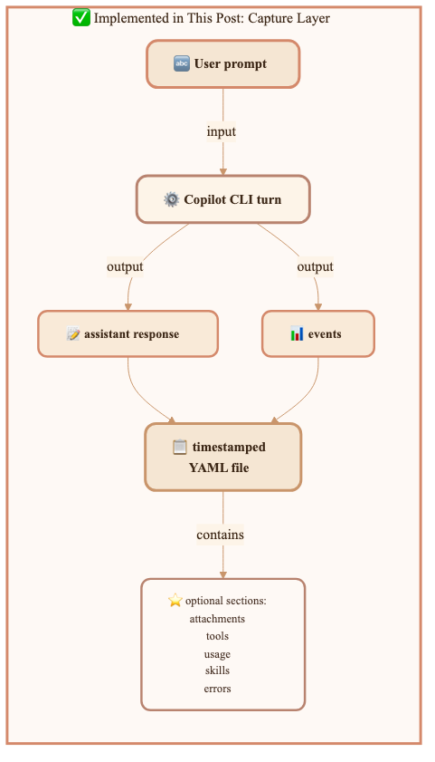
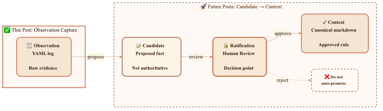
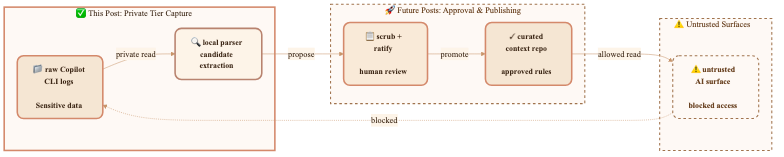

Every session now leaves behind a timestamped note I can review, audit, or delete. No cloud sync. No hidden database. Just files I own.

I built the missing memory half from [my personal context blog post](/2026-07-10-portable-personal-context).

In [Portable Personal Context Across AI Client Surfaces](/2026-07-10-portable-personal-context), I separated **personal context** from **memory**. Context is the small set of reviewed facts I want tools to trust. Memory is what happened while I worked.

The gap was capture. I needed a way for Copilot CLI sessions to leave behind structured observations I could review later. So I built `copilot-cli-log-to-file`: a Copilot CLI extension that writes each finished turn to a timestamped file I own.

The result: a reproducible, human-controlled pipeline from raw evidence to trusted rules—without accidental promotions.

---

## Capture the memory feed first

The stronger angle is **memory feed**, not cross-computer sync.

Sync is useful, but it comes later. What I needed first was a raw feed: timestamped session evidence that could become an observation in the pipeline.

```text
observation  →  candidate  →  [ratification gate]  →  context
 (memory)       (proposed)     (a human decision)      (canonical)
```

A capture file is not context. It can prove that I asked a question, that Copilot answered, and that a tool ran if I opted into tool capture. It should not silently become an instruction. I still want the human gate because one weird session should not rewrite my operating rules.

## Extension output

`copilot-cli-log-to-file` runs after a Copilot CLI turn finishes. By default, it writes a complete YAML document with `timestamp`, `sessionId`, `prompt`, and `response`.

The default filename pattern is `{timestamp}-{prompt30}.yaml`, so a log folder looks like this:

```text
copilot-response-log/
  2026-07-13T11-21-45Z-list-all-my-files.yaml
  2026-07-13T14-05-02Z-explain-this-function.yaml
```

That filename format mattered more than I expected. I can sort by time, skim the prompt slug, and delete one turn without touching the rest of the history.

I kept enriched capture off by default. If I want more detail, I opt in by category: attachments, reasoning, tool calls, tool results, usage, model changes, skills, subagents, permissions, errors, lifecycle events, turn boundaries, schedules, or notifications. There is also a `COPILOT_LOG_CAPTURE_ALL=true` override, but I treat that as a deliberate choice because these files can hold private data.

Here is a small capture with usage and tools enabled:

```yaml
timestamp: "2026-07-14T18:21:45.000Z"
sessionId: "9f4c2a7b12345678"
prompt: |-
  Summarize the current branch and suggest the next test to run.
tools:
  - toolCallId: "call_abc123"
    toolName: "git"
    arguments: '{"command":"status --short"}'
    success: true
    result: "M website/blog/2026-07-17-capture-layer-for-portable-context.md"
usage:
  - model: "gpt-5"
    inputTokens: 1840
    outputTokens: 420
    cacheReadTokens: 600
    cacheWriteTokens: 0
    duration: 1310
    finishReason: "stop"
response: |-
  The branch has one modified blog post. The next targeted validation is to re-read
  the file for frontmatter, link, and YAML-example accuracy before committing.
```

The `toolCalls` and `toolResults` toggles feed one merged `tools:` block. That was a small design choice, but it keeps the question I care about in one place: what tool ran, with which arguments, and what happened.

Two implementation details saved me from future debugging. Copilot CLI reserves stdout for JSON-RPC, so I use `session.log(...)` instead of `console.log(...)`. The runtime also provides `@github/copilot-sdk`; I do not ship it as an npm runtime dependency. `js-yaml` stays dev-only for tests because the extension has a hand-rolled YAML emitter.

The capture layer transforms a CLI turn into structured data. A turn contains two key outputs: the `assistant response` (Copilot's answer) and `events` (the structured record of what happened—tool calls, model usage, and other metadata). Both flow into the timestamped YAML file.



## Promote observations only after review

The previous blog post's pipeline feels less abstract now that I have real files on disk.

```text
copilot-response-log/*.yaml
        ↓
observation
        ↓
candidate
        ↓
[ratification gate]
        ↓
portable personal context repo
```

The YAML file is the observation. A candidate is the proposed durable fact I might extract from one or more observations. The context repo is where the approved rule lives.

For example, a few sessions might suggest that I prefer targeted validation before full-suite validation for docs-only work. That is still only evidence. I decide whether it belongs in `process/quality-bar.md`, `decisions/_active.md`, or nowhere.

| Pipeline stage | Source | Status | Example |
|---|---|---|---|
| Observation | YAML capture | Raw evidence | "This session used a targeted validation step." |
| Candidate | Extracted proposal | Not authoritative | "Maybe targeted validation is preferred." |
| Ratification | Human review | Decision point | "Yes, make this a workflow rule." |
| Context | Markdown repo | Canonical | "For docs-only changes, re-read the edited file first." |

Boring is good here. The capture layer does not promote anything by itself. That keeps mistakes, one-off exceptions, and prompt-injection garbage out of my canonical context unless I approve them.

> 🎨 **Diagram prompt:** Create a dark vector flow diagram on #1a1a2e showing four horizontal stages: "Observation (YAML log)", "Candidate (proposed fact)", "Ratification gate (human review)", and "Context (canonical markdown)". Make the ratification gate visually distinct as a narrow checkpoint with a lock icon. Add a red bypass arrow labeled "do not auto-promote" that is crossed out. Style should match a precise engineering architecture diagram.



## Keep the feed in files I can inspect

I chose files because I wanted the memory feed to stay under my control—fully inspectable and modifiable.

A hidden store might be easier for a product team to manage. It is less helpful when I want to understand what happened. With YAML files, I can open a turn, grep the folder, parse a subset, redact a bad capture, or delete a whole day.

| Choice | Why I used it |
|---|---|
| **YAML documents** | A parser can load each file directly. I can still read it. |
| **One file per turn** | I can archive or delete one capture without editing a combined log. |
| **Configurable folder** | I can keep logs local or point them at a private synced location. |
| **Plain text option** | I can choose readability when structured ingestion is not the goal. |

I do not need a private service to prove the idea. I need a folder that my tools can read and that I can clean up when a log catches something I do not want to keep.

## Treat logs as private-tier data

These logs hold my secrets if I let them.

A prompt can include file paths, pasted snippets, internal project names, tool arguments, tool results, permission prompts, errors, and final responses. Enriched capture defaults to off because the safe default is a small capture. When I turn on tools or usage, I am choosing to record more evidence.

So I treat `copilot-response-log` like the private tier from [my personal context blog post](/2026-07-10-portable-personal-context):

- I keep raw captures local unless I have a private sync policy.
- I scrub before committing any log-derived material.
- I do not point every AI surface at the raw folder.
- I enforce trust tiers before retrieval.

That last point is the security boundary. If an untrusted surface can read my raw logs, filtering the final answer is too late.

> 🎨 **Security boundary diagram:**



## Sync across computers only after the capture layer exists

Once the feed is files, cross-computer sync becomes straightforward. I can point the extension at a folder backed by git, OneDrive, or another private file-sync tool.

That still does not make every surface smarter. Each surface needs wiring, and I do not want most surfaces reading raw logs anyway.

```text
Computer A: Copilot CLI → copilot-response-log/*.yaml
Computer B: Copilot CLI → same synced folder
Review step: observations → candidates → approved context
Wired surfaces: read approved context, not raw logs by default
```

The central second brain is not the log folder. It is the loop: capture evidence, review candidates, then promote the facts I trust into portable context. The raw feed stops useful session evidence from vanishing. The curated repo stops tools from relearning the same facts twice.

## Keep the next step boring

This is not automatic yet. Ratification is still human. Candidate extraction still needs review. Each AI surface still needs its own way to read approved context. There is no shared `$AI_CONTEXT_PATH` that every tool honors.

That is okay for this step. I built one small piece: a Copilot CLI extension that captures my missing memory feed as structured files. Now the architecture from [my personal context blog post](/2026-07-10-portable-personal-context) has something concrete to promote.

## What's next: candidate extraction and ratification

The capture layer answers "how do I collect evidence?" The next piece is "how do I turn evidence into trusted rules?"

That means three things:
1. **Candidate extraction** — Tooling that reads a week of captures and proposes facts worth considering. "You ran targeted validation before full-suite validation in 5 docs-only sessions. Is this a pattern?"
2. **Ratification interface** — A simple review UI where I approve, reject, or refine each candidate before it becomes canonical. No auto-promotion. No surprises.
3. **Context repo publishing** — Once approved, a candidate becomes a rule in the portable personal context repo. Then every surface that reads that repo knows about it.

Until then, the captures sit in their folder as raw evidence. They prove what happened. They don't decide anything. That's the safety boundary I chose to keep.

Next session, I'll build the ratification loop.
