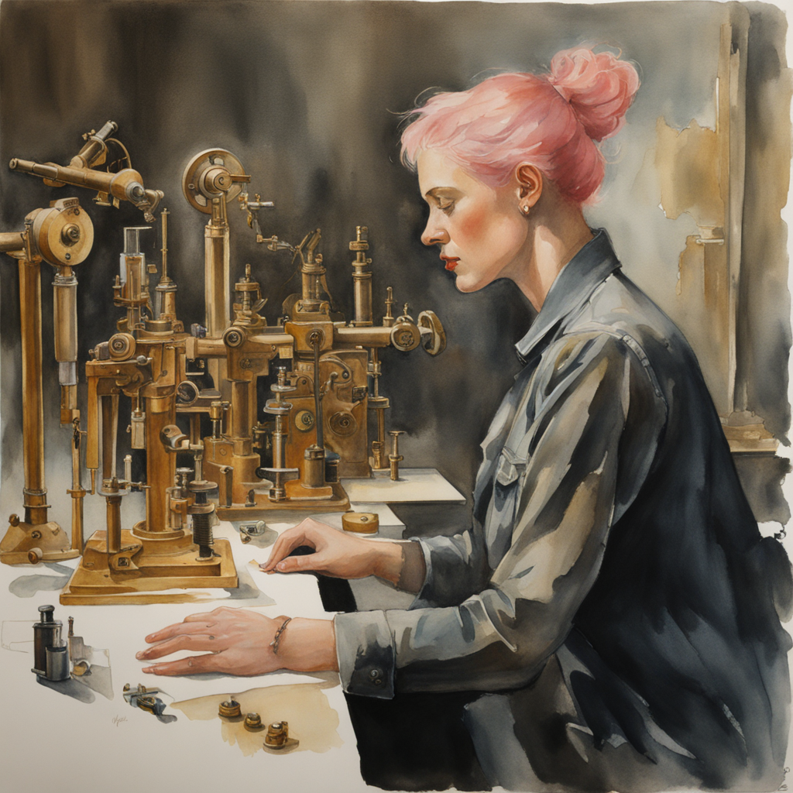
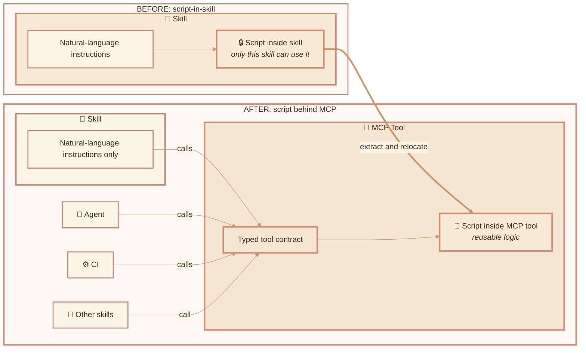
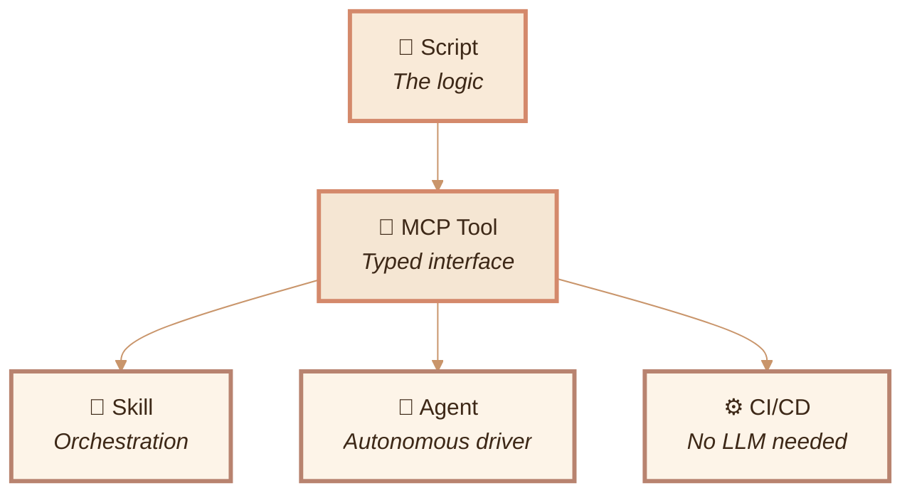
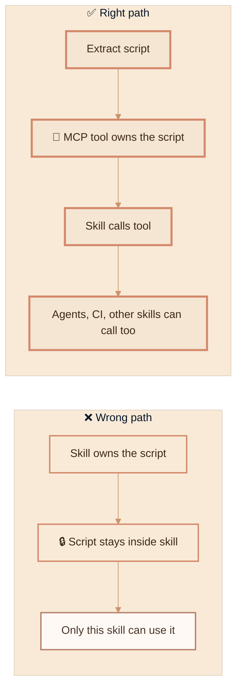
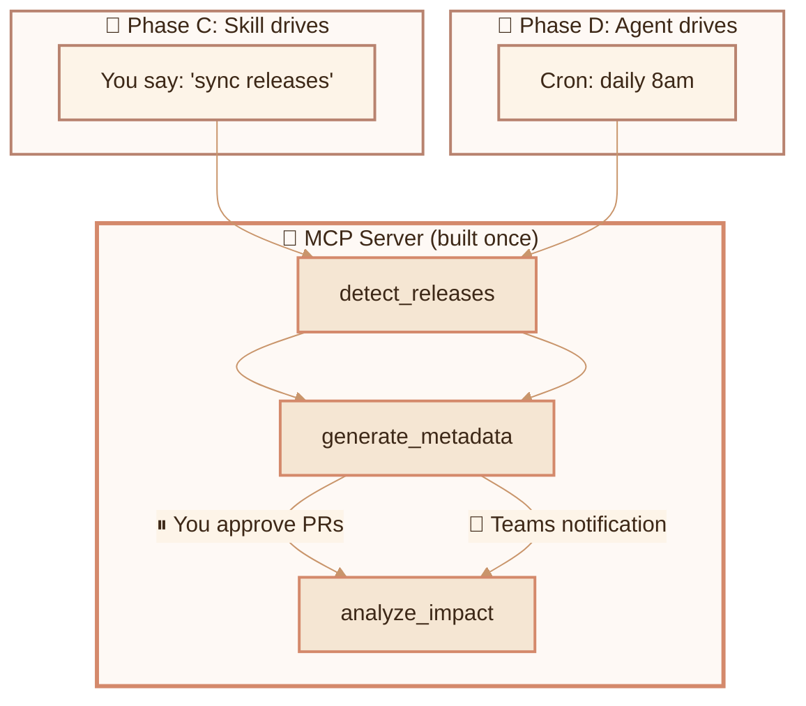

<!-- Watercolor image prompt (hero):
"Watercolor illustration, warm earth tones, soft peach and cream palette.
A pink-haired girl sitting at a workbench with five nesting matryoshka dolls
in front of her, each progressively larger. The smallest doll is labeled with
a tiny scroll (skill), the next has gears visible inside (MCP), the next has
small legs as if it can walk on its own (agent), and the largest has wings
and is lifting off the table (autonomous). Warm lamplight, scattered papers
and tools on the desk, soft watercolor washes, gentle ink outlines."
-->



I want domain experts to capture how they make decisions without starting in code.

A skill gives them a way to write the workflow in natural language, run it, correct it, and keep ownership while it matures. They do not need to be developers to articulate the workflow or the decision points. The process starts with human judgment. Automation comes later, after repeated correct outcomes prove the flow.

That matters because the goal is empowerment. AI should help people in the places where it can save time, while they stay responsible for their own work and decisions.

I built forty skills that worked. Each skill captured useful process knowledge, and many of them had scripts inside that did real work: calling APIs, generating reports, creating pull requests. The scripts were good, but they were scoped to one skill. That made the captured process harder to reuse, test, and run without me.

This post documents the architecture I landed on: a progressive promotion model where domain expertise starts as a natural language skill, hardens into typed MCP tools, and promotes to autonomous execution only when the process is ready.

---

## Where my first design stopped

My first development path was:

1. Write a skill (natural language instructions for the LLM)
2. Notice that part of the skill is deterministic (same inputs → same outputs every time)
3. Extract that logic into a script inside the skill
4. Done

Step 4 is where the design stopped too early. The skill captured the process, and the script worked, but only from that skill. No other skill can call it. No agent can use it. No CI pipeline can run it. If I want the same logic somewhere else, I copy-paste.

After forty skills, I had forty pieces of process knowledge with scripts scoped to individual skills, no typed contracts, no shared interfaces, and no clear path to autonomous execution.

<!-- Watercolor image prompt (dead-end):
"Watercolor illustration, warm earth tones, soft peach and cream palette.
A pink-haired girl standing at a crossroads in a garden. The left path leads
to a stone wall covered in vines (dead end). The right path opens to a
rolling landscape with a distant village. She's looking at the wall, holding
a small box (a script). At her feet are many identical small boxes stacked
up against the wall. Warm lamplight filtering through trees, soft watercolor
washes, gentle ink outlines."
-->


## The four layers

The model I use now puts each concern in its own layer:

| Layer | What it does | Who uses it |
|-------|-------------|-------------|
| **Script** | The actual logic (API calls, file operations, data transforms) | Everything below |
| **MCP tool** | Typed interface around the script (JSON input → JSON output) | Skills, agents, CI, other tools |
| **Skill** | Natural language orchestration (when to call which tool, in what order) | Human-driven sessions |
| **Agent** | Autonomous driver (same skill logic, but it decides when to run) | Cron, webhooks, event triggers |

The script is the logic. The MCP tool is the interface. The skill is the orchestration. The agent is the driver.

The important move is physical: the script leaves the skill and moves behind the MCP tool.



The resulting stack looks like this:



I write the script once, wrap it in a typed tool once, and change only the driver when I promote from interactive to autonomous.

---

## How work naturally evolves

I did not start with this architecture. I watched process knowledge mature across dozens of skills and then named the pattern.

> Start in natural language. Let the domain expert hone the process. Promote only after repeated correct outcomes prove the flow.

### Phase A: Exploration

A new skill starts with the LLM doing everything inline on purpose. The instructions say something like "query the GitHub API for recent releases, then compare against our changelog." A domain or process expert can own that workflow because the first version is written in plain language, not code.

At this stage, correctness matters more than speed. The person with the domain knowledge can run the skill, adjust the instructions, and decide whether the outcome matches their judgment. I want to see the process produce the right outcome more than once before I freeze any part of it into a tool.

The domain expert keeps the process close. They keep running it, correcting it, and deciding when it is ready for more structure.

### Phase B: Determinism emerges

After a few runs, I notice: step 2 is always the same. Same API call, same parsing, same output format. The LLM is not adding judgment here. It is following a mechanical procedure inside a process the expert has already validated.

This is the signal. When the same tool calls and parsing steps keep showing up in the skill instructions, and the outcomes have been correct, the process is mature enough to extract that deterministic part.

### Phase C: Extract to MCP (not script-in-skill)

This is the decision point. The deterministic logic becomes a typed MCP tool instead of a script inside the skill. The domain expert still controls the workflow through the skill. The stable part moves behind a typed interface.



The skill now says "call `detect_releases`" instead of embedding the detection logic. The tool has a JSON input schema, a JSON output schema, and error handling. It is independently testable. Any consumer, including another skill, an agent, or a CI pipeline, can call it.

### Phase D: Promote to agent

I start with the skill and promote to autonomy only when the process is reliable and unattended execution is useful. The agent uses the same MCP tools. The only difference is who drives: me (interactive) or the agent (autonomous).



The MCP server does not change. The tools do not change. The scripts do not change. Only the driver changes.

---

## Why MCP tools instead of scripts-in-skills

The decision to extract into MCP rather than keep scripts inside skills comes down to three things:

### Reusability

A script inside `echo-release-detection/scripts/detect.ps1` is only callable by the echo-release-detection skill. An MCP tool called `detect_releases` is callable by any skill, any agent, any CI pipeline, and any future tool that speaks the MCP protocol.

### Typed contracts

A script takes string arguments from a shell command. An MCP tool has a JSON input schema and a JSON output schema. The LLM knows exactly what to send and what to expect back. No parsing surprises.

### Prompt caching

This is the cost reason I started looking at the pattern. Burke Holland's [prompt caching video](https://www.youtube.com/watch?v=TYOhNRp5n7Y) made the math clear: MCP tool definitions live in the system prompt prefix and get cached at a 50-90% discount. Agent spawns create fresh uncached context windows every time.

| What | Token cost | Cache behavior |
|------|-----------|----------------|
| Skill instructions | ~0 (loaded on invocation) | Part of system prompt (cached) |
| MCP tool definitions | ~400-1600 (when enabled) | Part of system prompt (cached) |
| Agent spawn | ~10-25K per invocation | Fresh context window (uncached) |

For this workflow, MCP tools reduced uncached per-invocation tokens by roughly 90%+ compared with agent spawns.

---

## The decision point

When you find yourself writing a script inside a skill, ask one question:

> Will anything other than this skill ever need to call this logic?

- If **yes** → MCP tool immediately
- If **maybe someday** → MCP tool (future reuse is easier than a later move)
- If **truly never** (one-off, will be deleted) → script-in-skill is fine

For my portfolio of forty skills, the answer was almost always yes.

---

## What promotion looks like in practice

I have a content pipeline called Echo that detects new SDK releases, generates documentation metadata, and produces content impact reports. It ran as a Squad agent with a fresh ~25K token context window every invocation.

After extracting to MCP + skill:

| Before (agent) | After (skill + MCP) |
|----------------|-------------------|
| ~25K uncached tokens | ~1-2K uncached tokens |
| Squad coordinator + agent spawn | Skill in cached system prompt |
| Two context windows | Zero new context windows |
| Scripts available only to agent | Tools callable by anything |

The scripts did not change. The structured output envelopes they already produced worked as MCP tool responses: same JSON schema, different transport.

```
Before:  Script → JSON file → next skill reads file from disk
After:   Script → JSON → MCP protocol → any consumer receives it directly
```

That gave me a useful signal. I had already built toward MCP without naming it. The structured-output spec I wrote a month earlier was the MCP response contract.

---

## The automation tradeoff changed

The old tradeoff was business value versus engineering work. If automation took a developer project to build, only high-value work usually made the cut. The domain expert often had to describe the workflow, hand it to developers, and wait for someone else to turn it into software.

This model changes the cost of the next step. The domain expert hones the workflow in natural language while they use it. When repeated correct outcomes prove the process, the stable parts can move behind MCP tools without a large rewrite. Cached tool definitions, reusable scripts, and typed contracts make promotion cheap enough for smaller workflows too.

That is the empowerment piece. The expert gets time back while keeping ownership of the process and the decisions inside it.

---

## The cost model across stages

<!-- Watercolor image prompt (cost ladder):
"Watercolor illustration, warm earth tones, soft peach and cream palette.
A pink-haired girl climbing a spiral staircase in a tower. Each landing has
a different scene: the bottom landing shows her talking to a small glowing
orb (interactive), the middle landing shows the orb walking on its own
with small legs (autonomous), and the top landing shows the orb has
transformed into a bird flying out an open window (CI/CD). The staircase
has price tags hanging from the railings, getting smaller as she climbs
higher. Warm lamplight through tower windows, soft watercolor washes."
-->


Each promotion stage changes the driver but keeps the same tools. The cost changes because the driver changes:

| Stage | Per-run cost | Who drives | What changes |
|-------|-------------|-----------|-------------|
| **Skill + MCP** | ~1-2K uncached tokens | You, interactively | Lowest token use. Tools cached. Only I/O is new. |
| **Agent + MCP** | ~5-10K uncached tokens | Agent, autonomously | Agent charter is a fresh window, but tools stay cached. |
| **CI/CD** | 0 tokens | GitHub Action | No LLM at all for deterministic steps. |
| **Agent spawn (old way)** | ~25K uncached tokens | Squad coordinator | Two fresh windows every time. Highest token use here. |

The progression changes both autonomy and cost. As work hardens, it needs less LLM reasoning per run, until the final stage needs no LLM at all.

---

## Context occupation cost of MCP

MCP tools have lower per-token cost when cached, but they occupy context window space every turn they are enabled, even when unused. A 4-tool server adds ~600-1600 tokens to every conversation.

I handle this with grouping and toggling:

| Strategy | How it works |
|----------|-------------|
| **Group by workflow** | Combine related tools into one server (`content-pipeline-mcp` for all content tools) |
| **Toggle per task** | Enable the server when doing content work, disable when doing email |
| **Skill as entry point** | The skill reminds you to enable the MCP if it is off |

The pattern I use: **skill triggers workflow** (zero idle cost) → **skill activates MCP tools** (cost only when needed) → **tools do I/O** (cached calls). The MCP stays enabled only when it is needed.

---

## Running autonomously with Copilot CLI

Once a skill is promoted to an agent, I need to run it without a human session. Copilot CLI supports this today:

```bash
# Simplest autonomous run
copilot -p "Run the echo pipeline" --yolo --silent

# With specific agent and model
copilot -p "Execute" \
  --agent echo-pipeline \
  --autopilot --no-ask-user \
  --yolo --silent \
  --model gpt-4o

# Sealed sandbox: only specific tools available
copilot -p "Sync releases" \
  --additional-mcp-config @workflows/echo-sync/mcp-config.json \
  --available-tools='content-pipeline-mcp/*' \
  --no-ask-user --autopilot --silent
```

The key flags:

| Flag | What it does |
|------|-------------|
| `-p "prompt"` | Non-interactive mode (exits after completion) |
| `--agent name` | Use a specific `.agent.md` file |
| `--autopilot` | Agent continues without asking permission |
| `--no-ask-user` | Disable all user questions |
| `--yolo` | Approve all tools, paths, and URLs |
| `--available-tools='...'` | Only these tools exist (sealed sandbox) |
| `--silent` | Output only the agent's response |

For CI/CD, authenticate with a fine-grained PAT:

```bash
COPILOT_GITHUB_TOKEN=github_pat_xxx copilot -p "Run pipeline" \
  --agent echo-pipeline --yolo --silent --no-auto-update
```

---

## The sealed sandbox

<!-- Watercolor image prompt (sandbox):
"Watercolor illustration, warm earth tones, soft peach and cream palette.
A pink-haired girl placing a small clockwork automaton inside a glass bell
jar on her desk. Inside the jar are exactly three small tools laid out
neatly. Outside the jar, the desk is covered with dozens of other tools
and gadgets, but the jar has a clear boundary. The automaton inside is
reaching for one of the three tools. A small card next to the jar reads
'SEALED'. Warm lamplight, soft watercolor washes, gentle ink outlines."
-->


When something runs autonomously, the context must be fully specified at launch and immutable during execution. The agent gets exactly the tools it needs and no extra tools.

A sealed sandbox manifest specifies:

1. **Identity**: who the agent is
2. **Available tools**: exhaustive list (nothing else exists)
3. **Execution plan**: exact steps, no deviation
4. **Error handling**: complete rules, no improvisation
5. **Output routing**: where results go
6. **Boundaries**: hard constraints (violation = immediate exit)

Copilot CLI implements this through `--available-tools` and the `"tools"` allowlist in MCP config:

```json
{
  "mcpServers": {
    "content-pipeline": {
      "command": "node",
      "args": ["./mcp-servers/content-pipeline/index.js"],
      "tools": ["detect_releases", "generate_metadata", "analyze_impact"]
    }
  }
}
```

The MCP server might have twenty tools. The agent only sees three.

---

## Related patterns

I looked for a common name for this pattern. I did not find one, but I found similar progressions:

```mermaid
%%{init: { "theme": "base", "themeVariables": { "fontFamily": "Inter, ui-sans-serif", "primaryColor": "#f5e6d3", "primaryTextColor": "#3d2817", "primaryBorderColor": "#d4896b", "lineColor": "#c9956b", "secondaryColor": "#fdf4e8", "tertiaryColor": "#f9ead8", "background": "#fef9f5" } } }%%
graph LR
    subgraph "This model"
        A1["Skill"] --> A2["MCP Tool"] --> A3["Agent"] --> A4["CI/CD"]
    end
    subgraph "Anthropic"
        B1["Augmented LLM"] --> B2["Workflows"] --> B3["Agents"]
    end
    subgraph "Autonomous vehicles"
        C1["L0: No automation"] --> C2["L2: Partial"] --> C3["L4: High"] --> C4["L5: Full"]
    end
    subgraph "SRE"
        D1["Runbook"] --> D2["Automation"] --> D3["Self-healing"]
    end

    style A1 fill:#f5e6d3,stroke:#d4896b,stroke-width:3px,color:#3d2817
    style A2 fill:#f5e6d3,stroke:#d4896b,stroke-width:3px,color:#3d2817
    style A3 fill:#f5e6d3,stroke:#d4896b,stroke-width:3px,color:#3d2817
    style A4 fill:#f5e6d3,stroke:#d4896b,stroke-width:3px,color:#3d2817
    style B1 fill:#fdf4e8,stroke:#b8836f,stroke-width:2px,color:#3d2817
    style B2 fill:#fdf4e8,stroke:#b8836f,stroke-width:2px,color:#3d2817
    style B3 fill:#fdf4e8,stroke:#b8836f,stroke-width:2px,color:#3d2817
    style C1 fill:#f9ead8,stroke:#d4896b,stroke-width:2px,color:#3d2817
    style C2 fill:#f9ead8,stroke:#d4896b,stroke-width:2px,color:#3d2817
    style C3 fill:#f9ead8,stroke:#d4896b,stroke-width:2px,color:#3d2817
    style C4 fill:#f9ead8,stroke:#d4896b,stroke-width:2px,color:#3d2817
    style D1 fill:#fef9f5,stroke:#b8836f,stroke-width:2px,color:#4a3428
    style D2 fill:#fef9f5,stroke:#b8836f,stroke-width:2px,color:#4a3428
    style D3 fill:#fef9f5,stroke:#b8836f,stroke-width:2px,color:#4a3428
```



| Source | Their pattern | The mapping |
|--------|--------------|-------------|
| Anthropic, "Building Effective Agents" | Start simple, promote complexity | Augmented LLM → Workflows → Agents |
| Claude Agent SDK | Permission modes as autonomy dial | `plan` → `acceptEdits` → `dontAsk` |
| MCP Skills Working Group | Progressive disclosure | Tools → Skills → Agents |
| SAE J3016 (autonomous vehicles) | L0–L5 autonomy levels | Human-in-loop → human-on-loop → human-out-of-loop |
| SRE | Runbook → Automation → Self-Healing | Manual → scripted → autonomous |
| LangGraph | `interrupt()` architecture | Remove interrupts = autonomous |

I did not find a named, concrete "Skill → MCP → Agent → CI" promotion model with extraction checklists and validation gates at each stage. The pattern exists in pieces. I wanted one practical version I could use.

---

## The rule I use now

> When a process proves repeatable, I move reusable logic directly to an MCP tool. I treat scripts-in-skills as prototype code.

I ask who owns the process, how mature it is, and what driver it needs right now.

| If the work is... | Use... |
|-------------------|--------|
| Still being figured out | Skill (exploration, cheap) |
| Deterministic and repeatable | MCP tool (typed, reusable) |
| Needs to run without you | Agent (autonomous driver) |
| Fully deterministic, no judgment needed | CI/CD (no LLM at all) |

---

## What's next

<!-- Watercolor image prompt (horizon):
"Watercolor illustration, warm earth tones, soft peach and cream palette.
A pink-haired girl standing on a hilltop at sunrise, looking out over a
landscape where small automatons are walking along paths between villages.
Each village has a different banner (one with gears, one with scrolls,
one with wings). The paths between them are well-worn and clear. She's
holding a notebook and smiling. Warm sunrise light, soft watercolor
washes, gentle ink outlines, pastoral feeling."
-->


Echo is the pilot. Once the content-pipeline MCP server wraps Echo's three scripts and the `/echo-sync` skill drives them interactively, I will validate both things that matter: the process still produces the right outcome, and the token savings are real.

After that, I will work through Finn, the reporting tools, and the remaining skills one at a time.

The pattern is simple: start with the person who owns the domain knowledge, capture the workflow in a skill, run it until the outcomes are consistently right, move the repeatable parts behind MCP tools, and change the driver only when autonomy helps.

The ownership stays with the person who understands the process. The system matures around that expertise.
