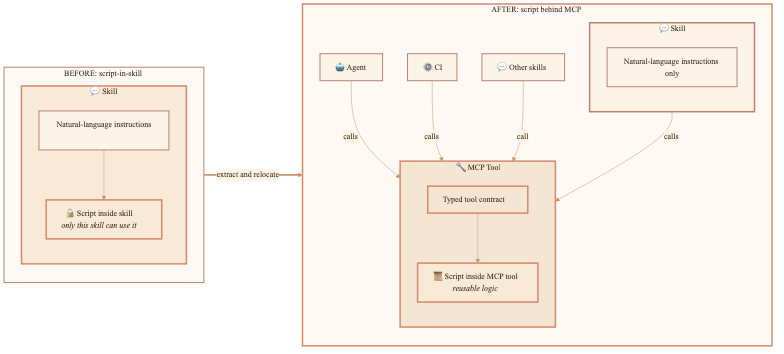
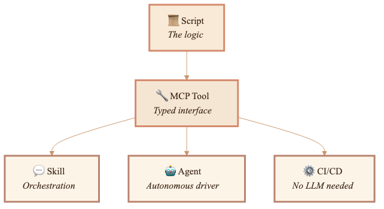
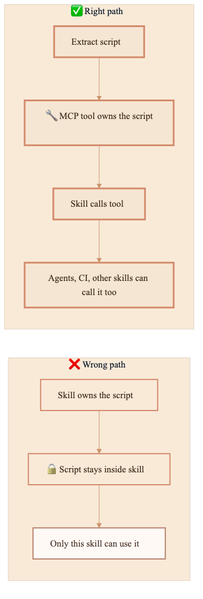
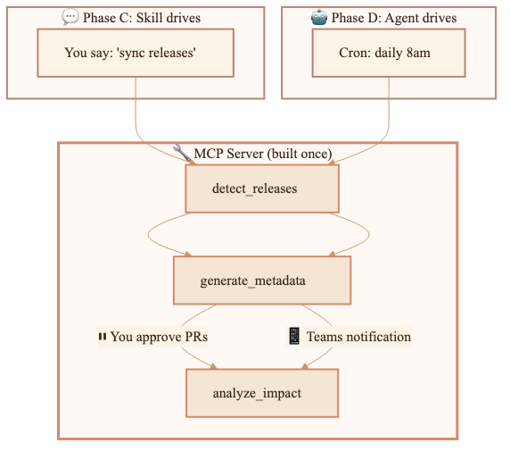

:::note[CLI version]
CLI examples written for **GitHub Copilot CLI v1.0.77**. Flag names and behavior may change in later releases.
:::


**You've built a workflow that works. But automating it requires engineering. Now you're stuck.**

You know *exactly* how the process should run—you do it repeatedly, correctly, and it saves your team real time. But the moment you try to automate it, you hit a wall: write a script (and maintain it forever), hire engineers (and lose control to the project backlog), or give up and do it manually. None of these are wins.

There's a better way. What if you could capture your workflow in plain language, test it out, refine it, and gradually promote it to automation—keeping ownership the whole time? No developers required until you're absolutely sure the workflow is stable.

This is the progressive promotion model. Domain expertise starts as a natural language skill. You run it, refine it, test it. When repeated correct outcomes prove the flow is deterministic, the stable parts move behind MCP tools—reusable logic anyone can call. Then the skill can run autonomously. Ownership stays with the person who understands the process the whole time.

---

## The automation tradeoff changed

The old tradeoff was simple: business value or engineering time. Only high-value workflows got built. Mid-tier work died in the backlog because no developer had bandwidth. The domain expert had to describe the process, hand it to a team, and wait months for the software to arrive.

This model shifts that cost to zero. The domain expert writes and runs the workflow in a skill right now, while they work. When the process proves reliable through repeated correct outcomes, the stable parts move behind MCP tools without a full rewrite. Cached tool definitions and typed contracts mean even small workflows can graduate.

The payoff is ownership. You hone your own process, keep control of your decisions, and run it yourself while it matures.

---

## The four layers

Here is the path at a high level. The model puts each concern in its own layer. MCP stands for Model Context Protocol. In this post, an MCP tool is the typed interface that lets a skill, agent, or CI job call code in a predictable way:

| Layer | What it does | Who uses it |
|-------|-------------|-------------|
| **Script** | The actual logic (API calls, file operations, data transforms) | Everything below |
| **MCP tool** | Typed interface around the script (JSON input → JSON output) | Skills, agents, CI, other tools |
| **Skill** | Natural language orchestration (when to call which MCP tool, in what order) | Human-driven sessions |
| **Agent** | Autonomous driver (same skill logic, but it decides when to run) | Cron, webhooks, event triggers |

The script is the logic. The MCP tool wraps it in a typed interface. The skill decides when to call which MCP tools. The agent runs the skill without you. Each layer has one job.

The key move: pull the script out of the skill and put it behind the MCP tool. Now any consumer can call it—another skill, an agent, a CI pipeline, an external system. The script is no longer locked inside one skill.



The resulting stack looks like this:



The script gets written once, wrapped in a typed tool once, and then only the driver changes during promotion from interactive to autonomous.

---

## How work naturally evolves

Start in natural language. Let the domain expert hone the process. Promote only after repeated correct outcomes prove the flow.

Here's how that progression works in practice:

A new skill starts with the LLM doing everything inline. Your instructions might say "query the GitHub API for recent releases, then compare against our changelog." The first version is written in plain language, not code. You stay in control.

Correctness matters more than speed here. You run the skill, adjust the instructions, and decide if the outcome matches your judgment. Repeat it several times until it consistently produces the right result.

### Phase B: Determinism emerges

After a few runs, you spot a pattern. Step 2 is always the same. Same API call, same parsing, same output format. The LLM isn't adding judgment here—it's just following a mechanical procedure that you've already validated.

This is your signal to move. When the same API calls and parsing steps keep showing up, and the outcomes have been consistently correct, that part is ready to extract.

### Phase C: Extract to MCP (not script-in-skill)

Now make the move. Extract the deterministic logic into a typed MCP tool instead of keeping it inside the skill. You still control the workflow through the skill. The stable, reusable part moves behind a typed interface.



The skill now calls `detect_releases` instead of embedding the logic. The MCP tool has a JSON input schema, a JSON output schema, and error handling. It's independently testable. Any consumer—another skill, an agent, a CI pipeline, or an external system—can call it.

### Phase D: Promote to agent

When the process is reliable and you want it to run without you, promote to autonomous execution. The agent uses the same MCP tools. The only difference is who drives: you (interactive) or the agent (autonomous).



The MCP server does not change. The tools do not change. The scripts do not change. Only the driver changes.

---

## Where my first design stopped

My forty-skill portfolio showed me where this breaks if you stop too early. My original approach was:

1. Write a skill (natural language instructions)
2. Notice a pattern is deterministic (same inputs → same outputs)
3. Extract that logic into a script inside the skill
4. Done

The problem is step 4. The skill works. The script works. But only that skill can use it. No other skill can call it. No agent can use it. No CI pipeline can run it. When you need that logic elsewhere, you copy-paste the whole thing.

After forty skills, I had forty pieces of scattered process knowledge with scripts locked inside individual skills, no typed contracts, no reusability, and no clear path to autonomous execution. The scripts weren't going anywhere.

<!-- Watercolor image prompt (dead-end):
"Watercolor illustration, warm earth tones, soft peach and cream palette.
A pink-haired girl standing at a crossroads in a garden. The left path leads
to a stone wall covered in vines (dead end). The right path opens to a
rolling landscape with a distant village. She's looking at the wall, holding
a small box (a script). At her feet are many identical small boxes stacked
up against the wall. Warm lamplight filtering through trees, soft watercolor
washes, gentle ink outlines."
-->


## Why MCP tools instead of scripts-in-skills

The decision to extract into MCP rather than keep scripts inside skills comes down to three things:

### Reusability

A script locked inside one skill is only callable by that skill. An MCP tool is callable by any skill, any agent, any CI pipeline, and any external system. Reuse changes everything.

### Typed contracts

A script takes string arguments. An MCP tool has a JSON input schema and JSON output schema. The LLM knows exactly what to send and what to expect back. No parsing surprises.

### Prompt caching

The cost reason is direct: MCP tool definitions live in the system prompt and get cached at a 50-90% discount. Every time you spawn an agent fresh, you lose that cache.

| What | Cost | Cache |
|------|------|-------|
| Skill instructions | ~0 | Part of system prompt (cached) |
| MCP tool definitions | ~400-1600 | Part of system prompt (cached) |
| Agent spawn | ~10-25K per run | Fresh context (uncached) |

Using MCP tools instead of spawning fresh agents cut uncached tokens by roughly 90%.

---

## The decision point

When you find yourself writing a script inside a skill, ask one question:

> Will anything other than this skill ever need to call this logic?

- If **yes** → extract to MCP immediately
- If **maybe someday** → extract to MCP (future reuse is cheaper than a later move)
- If **truly never** (one-off, will be deleted soon) → script-in-skill is fine

In my forty-skill portfolio, the answer was almost always yes.

---

## What promotion looks like in practice

I have a content pipeline called Echo that detects new SDK releases, generates documentation metadata, and produces content reports. It started as a Squad agent spawning fresh context every time.

After extracting to MCP + skill:

| Before | After |
|--------|-------|
| ~25K uncached tokens per run | ~1-2K uncached tokens per run |
| Squad agent spawned fresh | Skill in cached system prompt |
| Two separate context windows | One cached context window |
| Scripts locked inside agent | Tools callable by anything |

The scripts themselves didn't change. The structured JSON output envelopes they produced already matched MCP tool responses—same schema, different transport.

Before: Script → JSON file → next skill reads file from disk  
After: Script → JSON → MCP protocol → any consumer gets it directly

---

## The cost model across stages

Each stage changes the driver but reuses the same tools. Costs drop because the driver changes:

| Stage | Per-run cost | Driver | What saves |
|-------|-------------|--------|----------|
| **Skill + MCP** | ~1-2K uncached | You, interactively | Lowest token use. Tools cached. Only I/O is new. |
| **Agent + MCP** | ~5-10K uncached | Agent, autonomously | Agent charter is fresh, but tools stay cached. |
| **CI/CD** | 0 tokens | GitHub Action | No LLM at all for deterministic steps. |
| **Agent spawn (old way)** | ~25K uncached | Squad coordinator | Two fresh windows every time. Highest token use. |

As work matures, it needs less LLM reasoning per run, until CI/CD needs none at all.

---

## Context occupation cost of MCP

MCP tools have lower per-token cost when cached, but they occupy context window space every turn, even when unused. A 4-tool server adds ~600-1600 tokens to every conversation.

Control this with grouping and toggling:

| Strategy | How it works |
|----------|-------------|
| **Group by workflow** | Combine related tools into one server (`content-pipeline-mcp` for all content work) |
| **Toggle per task** | Enable the server when doing that work, disable when doing something else |
| **Skill as gatekeeper** | The skill reminds you to enable MCP if it's off |

The pattern: **skill triggers workflow** (zero idle cost) → **skill activates MCP** (cost only when needed) → **tools do work** (cached calls). The MCP stays enabled only when you're using it.

---

## Running autonomously with Copilot CLI

Once a skill is promoted to an agent, the next need is running it without a human session. Copilot CLI supports this today:

```bash
# Simplest autonomous run
copilot -p "Run the echo pipeline" --yolo --silent

# With specific agent and model
copilot -p "Execute" \
  --agent echo-pipeline \
  --autopilot --no-ask-user \
  --yolo --silent \
  --model gpt-5.4

# Sealed sandbox: only specific tools available
copilot -p "Sync releases" \
  --additional-mcp-config @workflows/echo-sync/mcp-config.json \
  --available-tools='content-pipeline-mcp/*' \
  --no-ask-user --autopilot --silent
```

The key flags:

| Flag | What it does |
|------|-------------|
| `-p "prompt"` | Non-interactive mode (exits after completion) |
| `--agent name` | Use a specific `.agent.md` file |
| `--autopilot` | Agent continues without asking permission |
| `--no-ask-user` | Disable all user questions |
| `--yolo` | Approve all tools, paths, and URLs |
| `--available-tools='...'` | Only these tools exist (sealed sandbox) |
| `--silent` | Output only the agent's response |

For CI/CD, authenticate with a fine-grained PAT:

```bash
COPILOT_GITHUB_TOKEN=github_pat_xxx copilot -p "Run pipeline" \
  --agent echo-pipeline --yolo --silent --no-auto-update
```

---

## The sealed sandbox

When something runs autonomously, the context must be fully specified at launch and locked in place. The agent gets exactly the tools it needs and nothing extra. The glass bell jar is boring on purpose.

A sealed sandbox manifest specifies:

1. **Identity**: who the agent is
2. **Available tools**: exhaustive list—nothing else exists
3. **Execution plan**: exact steps, no deviation
4. **Error handling**: complete rules, no improvisation
5. **Output routing**: where results go
6. **Boundaries**: hard constraints (violation = immediate exit)

Copilot CLI does this through `--available-tools` and the `"tools"` allowlist in MCP config. The MCP server might have twenty tools. The agent only sees three.

```json
{
  "mcpServers": {
    "content-pipeline": {
      "command": "node",
      "args": ["./mcp-servers/content-pipeline/index.js"],
      "tools": ["detect_releases", "generate_metadata", "analyze_impact"]
    }
  }
}
```

---

## Related patterns

Similar progressions appear in other domains under different names:

| Source | Their pattern | Maps to this model |
|--------|--------------|-----------|
| Anthropic, "Building Effective Agents" | Start simple, increase complexity | Augmented LLM → Workflows → Agents |
| Claude Agent SDK | Permission modes as autonomy dial | `plan` → `acceptEdits` → `dontAsk` |
| MCP Skills Working Group | Progressive disclosure | Tools → Skills → Agents |
| SAE J3016 (autonomous vehicles) | L0–L5 autonomy levels | Human-in-loop → human-on-loop → human-out-of-loop |
| SRE | Runbook → Automation → Self-Healing | Manual → scripted → autonomous |
| LangGraph | `interrupt()` architecture | Remove interrupts = autonomous |

The pattern exists in pieces across many domains. What was missing: a practical "Skill → MCP → Agent → CI" progression with extraction checklists and validation gates, tailored specifically for domain experts who want to keep ownership.

---

## The rule I use now

When a process proves repeatable, reusable logic moves to an MCP tool. Scripts-in-skills are prototype code.

Ask three questions: Who owns this? How stable is it? What driver does it need now?

| If the work is... | Use... |
|-------------------|--------|
| Still being figured out | Skill (cheap exploration) |
| Repeatable and deterministic | MCP tool (reusable, typed) |
| Needs to run without you | Agent (autonomous driver) |
| Fully deterministic, no judgment | CI/CD (no LLM at all) |

---

## What's next

Echo is the pilot. Once the content-pipeline MCP server wraps Echo's three scripts and the `/echo-sync` skill drives them interactively, validation has two parts: the process still produces the right output, and the token savings are real.

Then come Finn, the reporting tools, and the rest one by one.

The pattern is straightforward: Start with the person who owns the domain knowledge. Capture the workflow in a skill. Run it until the outcomes are consistently correct. Move the repeatable parts behind MCP tools. Change the driver only when autonomy helps.

Ownership stays with the person who understands the process. The system matures around that expertise.
