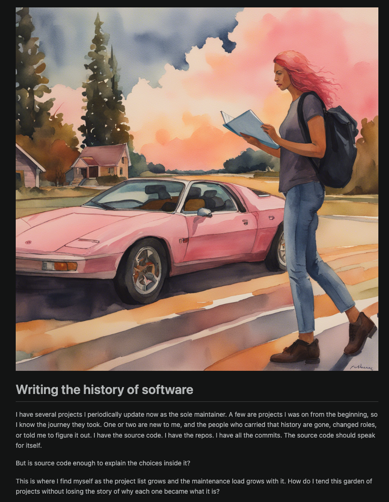
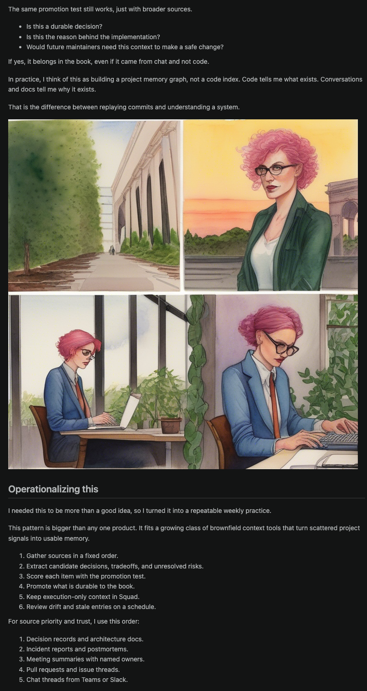

# Writing the history of software

I have several projects I periodically update now as the sole maintainer. A few are projects I was on from the beginning, so I know the journey they took. One or two are new to me, and the people who carried that history are gone, changed roles, or told me to figure it out. I have the source code. I have the repos. I have all the commits. The source code should speak for itself.

But is source code enough to explain the choices inside it?

This is where I find myself as the project list grows and the maintenance load grows with it. How do I tend this garden of projects without losing the story of why each one became what it is?

## The problem

This issue of a better way to tend my garden of projects used to feel casual and theoretical. Now it is immediate. It starts with knowing what is in the source code, but not in some general way and not in some grep/regex way. I need a true, deep understanding of the choices, consistencies, and inconsistencies. Together, they should form the history and choices as well as the current state. From that, I can move forward with changes that do not impair or detract, or worse, unknowingly change the purpose of the project.

## An opportunity to write the history

There is a lot of software out there to help with this brownfield problem space. People come and go in the industry so companies have no choice but to figure it out. There are a few problems the solution would have to tackle but understanding how to determine the guiding principles from the in-the-moment choices is the key. It is similar to determining a book's theme from its scenes and characters. 

There are many vector-based solutions that can gobble up the source code, commits, comments, issues. From there you can begin to build the guiding principles and choices. 

I turned to AI to help me figure this out and one of the answers pointed me to [spec-kit](https://github.com/github/spec-kit). There is enough internal chatter at Microsoft that I had heard of it before. After comparing options, pairing it with my multi-agent orchestrator ([Squad](https://github.com/github/spec-kit)), and looking through a brownfield lens, I had a path forward.

## Two steps back

I can use something like [spec-kit brownfield extension](https://github.com/github/spec-kit) to come up with the main artifacts, then supplement with [Graphify](https://github.com/Graphify-Labs/graphify) queries to solidify the details of the current state. This may seem like a lot of work, but with agents and skills, this process is quickly completed. 

The project _book_, as a living artifact, should now be ready to review. It becomes the reference guide, the map that ensures every decision keeps the project on track. It should include:

- Guiding principles - general design, stack and architecture
- Features - what the project does and did
- Core team - who they were, what they cared about, what they put off to a future state
- Edge cases - the bugs reported, the features not quite complete, the dependencies that haven't aged well 
- Concerns - what are the features or class of bugs that need to be immediately reviewed and fixed

As more and more repos are created and many more are abandoned or _in maintenance mode_, the tools and skills to come into these projects quickly and move fast to understand and prioritize future work without disrupting current state will be important. 

At this point in the process, the _book_ is reviewed and the next steps are decided. How do I build using the _book_?

## Relying on the team

I've been using [Squad](https://github.com/github/spec-kit), my team of agents, for so long I can't imagine working without them. They know my own style, choices, and history. They just don't know this new-to-me brownfield project. For this journey on the project, the _book_ is the rules, the road, and the map. My team is the car keeping the project on the road, safely, to get to the next stop on the journey.

Squad has its own history it keeps in _decisions_, _identity_, _ceremonies_, and project context.

The squad has an architect that will manage the book and decide what stays in the Squad and what moves to the book. This is where things can get muddled. And they do in real life. The real-life architect has a push and pull with the engineering team.

To keep that from becoming chaos, I've started using a few simple guiding principles that create clarity without argument:

- If it explains _why_ we made a decision, it goes in the book.
- If it is a temporary way to get through this sprint, it stays in Squad.
- If a new maintainer would need it to avoid breaking something important, it goes in the book.
- If it changes every week, it stays in Squad.
- If it crosses feature boundaries or affects architecture, it goes in the book.

Another way I think about it: Squad is operational memory, the book is institutional memory.

Squad should carry the active context for doing the work today. The book should carry the durable context that keeps the work safe, consistent, and grounded.

When I'm unsure, I run a quick test:

- Will this still matter in 90 days?
- Does this capture a non-obvious tradeoff?
- Would I want this during an incident review?

If two of those are yes, it gets promoted to the book.

That gives the architect and the team a shared rule. Less opinion. Less tug-of-war. More forward motion.

## Extending beyond source code

The more I do this, the more obvious it becomes: the software story does not live only in repos.

Some of the most important decisions happened in Teams or Slack threads, in meeting transcripts, and in docs that never made it to a pull request. If I only consider code, I get implementation detail. If I include communication and docs, I get intent. This is where the real story emerges.

That means the same book pattern should expand to include:

- Communication history: decision threads, approvals, reversals, and unresolved debates.
- Meeting artifacts: transcripts, notes, action items, and who agreed to what.
- Non-code documentation: design docs, runbooks, incident reviews, architecture diagrams, and policy docs.

The same promotion test still works, just with broader sources.

- Is this a durable decision?
- Is this the reason behind the implementation?
- Would future maintainers need this context to make a safe change?

If yes, it belongs in the book, even if it came from chat and not code.

In practice, I think of this as building a project memory graph, not a code index. Code tells me what exists. Conversations and docs tell me why it exists.

That is the difference between replaying commits and understanding a system.

## Operationalizing this

I needed this to be more than a good idea, so I turned it into a repeatable weekly practice. This is where theory becomes practice, where chaos becomes system.

This pattern is bigger than any one product. It fits a growing class of brownfield context tools that turn scattered project signals into usable memory.

1. Gather sources in a fixed order.
2. Extract candidate decisions, tradeoffs, and unresolved risks.
3. Score each item with the promotion test.
4. Promote what is durable to the book.
5. Keep execution-only context in Squad.
6. Review drift and stale entries on a schedule.

For source priority and trust, I use this order:

1. Decision records and architecture docs.
2. Incident reports and postmortems.
3. Meeting summaries with named owners.
4. Pull requests and issue threads.
5. Chat threads from Teams or Slack.

Higher-ranked sources are usually cleaner on intent and accountability. Lower-ranked sources still matter, especially when they are the only place a decision was captured, but they need corroboration.

To keep this light, I timebox it.

- 30 minutes a week for promotion from Squad to the book.
- 30 minutes a month to prune stale context.
- 60 minutes each quarter for architecture drift review.

That rhythm gives me a stable memory system without turning documentation into a second full-time job.

Further reading: workflows like Scout, OpenClaw, and similar brownfield context systems can support this pattern.

## Summary

I started with a simple question: should source code be enough? For brownfield work, my answer is no.

I treat source as evidence, not the whole story. The story gets written in the book: principles, tradeoffs, features, edge cases, and the things the original team quietly knew.

Squad helps me move quickly through current work. The book keeps that work safe, consistent, and grounded.

When those two stay in sync, maintenance stops feeling like archaeology and starts feeling like stewardship. That is how I keep momentum without losing meaning.

