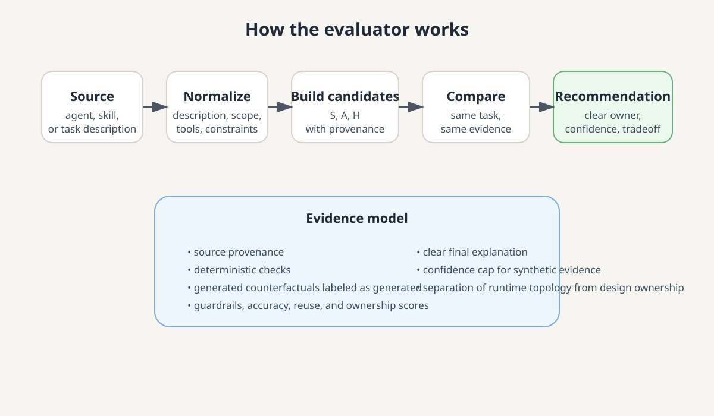

# How I would build an evaluator for the agent-skill boundary

When I see a task handed to an AI system, I keep asking the same question: is this a skill, an agent, or a skill being used inside an agent?

That sounds simple, but it matters a lot. The answer changes who owns the process, what the system is allowed to decide on its own, how reusable the work is, and what kind of failure you're willing to tolerate.

A skill is usually the reusable playbook: a clear procedure, good examples, and a well-defined outcome. An agent is the specialist working through a task with its own boundaries, tools, and decision-making. A combined design uses both: the agent owns the goals and coordination, while the skill supplies the detailed procedure.

The real problem is that this is easy to describe in theory and hard to judge in practice. So if I wanted to build an evaluator for this boundary, I would make it compare the same task through several candidate designs and then score them using the same evidence.

*The evaluator treats the same task as the same input problem, then measures which design yields the best fit without just guessing from the naming alone.*

## Why a boundary evaluator helps

The confusion usually starts because people use the words "agent" and "skill" interchangeably. That creates a few predictable mistakes.

- A skill becomes a giant catch-all prompt because the author wants to avoid making a real architectural decision.
- An agent gets used for work that is really a reusable procedure and should be a skill.
- A task is over-engineered by combining everything into a custom agent when a smaller reusable skill would be easier to test and maintain.
- The team ends up with a mix of helpful behavior and hard-to-explain custom logic that no one can confidently support.

An evaluator helps because it forces the decision to be evidence-based. Instead of arguing semantics, it compares the task across candidate designs and asks: which one has the best mix of correctness, maintainability, reusability, and safety?

## The evaluation model I would use

I would design it around one core idea: run the same task under a few candidate architectures and compare the results with the same standards.

The candidate set should not be broad or magical. It should be small and explicit:

- **Skill-only**: a reusable playbook that executes the workflow.
- **Agent-only**: an autonomous specialist that handles the task directly.
- **Agent + skill**: the agent coordinates and selects the skill for the mechanical or reusable steps.

This gives me three real design options, not just an opinionated label.

I would also separate two different concerns:

1. **Ownership of the work** — skill, agent, or combined design.
2. **Execution topology** — local execution, MCP-backed execution, or some external connector.

Those are different axes. A task can be owned by a skill and still run locally, or be coordinated by an agent while the actual data access happens through an MCP tool. The topology does not decide whether work belongs in a skill or an agent.

## What the evaluator should measure

Any serious evaluator needs to capture more than "the model liked the output." It needs structured evidence.

I would score the candidate designs on a few dimensions:

- **Correctness**: Did it perform the task accurately and safely?
- **Reusability**: Can the workflow be used again without rewriting the instructions?
- **Clarity of ownership**: Is the role boundary clear enough for a human to maintain?
- **Operational burden**: Is the process too fragile to repeat?
- **Safety and guardrails**: Does it avoid the wrong tool, wrong scope, or wrong automation boundary?
- **Explainability**: Can the owner understand why this design was chosen?

The output should say something like: "This task is better as a skill because the process is repeatable and reusable; this task is better as an agent because it needs context, judgment, and tool switching; this task is best as an agent plus skill because the agent owns goals but the skill owns the repeatable method."

That is far more useful than a vague verdict like "use a skill" or "use an agent." The point is to explain the tradeoff, not hide it.

## The evaluator architecture

I would keep the evaluator intentionally simple and grounded.

*This is the kind of pipeline I would want: intake the source, normalize it, generate the design options, score them, and attach evidence to the final recommendation.*

### 1. Intake the source

A task or capability can come from several places:

- a repository-level agent definition
- a skill file such as `SKILL.md`
- a custom prompt or workflow doc
- a plugin package with a mix of agents and skills
- a task description from a human owner

The evaluator should record the original source and whether it is a supplied file or a generated counterfactual. This matters because a real file and a synthetic generated version are not the same thing.

### 2. Normalize the source

The evaluator should parse only the parts that matter: the description, persona, workflow intent, tools, and any explicit operating constraints. I would avoid making up capabilities that are not stated. If the source is a skill, I would read the activation description and route it from there. If the source is an agent, I would read the persona and procedure boundaries. If there is no matching counterpart, the evaluator can generate a small counterfactual for comparison, but it should clearly label that produced content as generated and lower-confidence.

### 3. Build the candidate designs

Then I would create three realistic versions of the same capability:

- **S**: skill-first design
- **A**: agent-first design
- **H**: hybrid design (agent + skill)

The important part is that they are not arbitrary. They are grounded in the source task and the available tool or procedural context. The generated counterparts should be small, deterministic, and explicitly marked as synthetic.

### 4. Score against outcome and operating constraints

This is where the evaluator becomes useful. I would grade each design against a fixed rubric:

- How well does it match the task's real need?
- Is the output reusable or highly specialized?
- Does the institution understand who owns the procedure?
- Can the design be safely repeated without hidden coupling?
- Does it create a fragile, over-privileged agent or a narrowly scoped reusable skill?

This score should be transparent. The evaluator should not just say "the agent wins." It should explain why the hybrid design is better because the work is goal-driven, but repeated steps are stable enough to become a skill.

## A practical rule of thumb

I still want a few simple heuristics for human owners because the evaluator should not create more complexity than it solves.

Use a **skill** when the work is:

- reusable and repeatable
- procedure-driven
- easy to validate with a known output
- best run by a known sequence of steps

Use an **agent** when the work is:

- highly contextual
- decision-heavy
- sensitive to shifting goals or partial information
- dependent on tool selection and stateful iteration

Use an **agent plus skill** when the work is:

- goal-driven in the agent
- procedural in the skill
- reusable enough to deserve a playbook but context-rich enough to require a coordinator

This is the design pattern I come back to most often.

## The local-vs-MCP distinction

One subtle but important point is that the execution location is not the same as the ownership model.

A skill can run locally. An agent can also run locally. An MCP-backed tool can still be called by either one. The question is not "where is it running?" The question is "what is the durable responsibility boundary?"

This separation matters because a lot of bad design comes from collapsing separate concerns into a single abstraction. A local workflow is not automatically better or worse than an MCP-backed one. It is simply a different runtime topology.

*The responsibility boundary is different from the execution topology. The decision about role ownership should remain stable even when the runtime changes.*

The evaluator should therefore treat runtime topology as a separate axis from role ownership. The recommendation should state something like: "This workflow belongs in a skill, regardless of whether it is executed locally or behind an MCP layer; the connector is a runtime detail, not the architectural owner."

## What makes this trustworthy

The evaluator should be explicit about what is evidence and what is guesswork.

A trustworthy system should:

- record the source file and version
- keep the original source immutable
- label generated counterfactuals as generated
- avoid inventing missing capabilities
- compare only equivalent tasks
- use deterministic scoring for structural checks
- reserve model-based grading for softer judgments like clarity or maintainability

This prevents the evaluator from becoming a style guessing machine that only mirrors whatever the model thought sounded best.

## The output I would want

The final report should not be a vague verdict. It should identify:

- the recommended design
- the evidence that supported it
- the alternative designs that were considered
- the exact tradeoff and the owner guidance
- the confidence level and any limits of the evidence

A final output should read like a design recommendation, not a slogan.

If the recommendation says "better as a skill,” it should tell the owner why the process is stable, reusable, and testable. If it says "agent + skill,” it should explain that the agent owns the goal and the skill owns the procedure. If it says "agent-only,” it should explain why the problem needs judgment, state, or improvisation that a skill would hide.

## The practical value

This does not create a universal rule for every AI workflow. It creates a repeatable decision-making process.

That is the real win. It turns a fuzzy design argument into a reusable evaluation loop.

Instead of someone asking, "Should this be a skill or an agent?" and getting a hand-wavy answer, the owner gets a grounded recommendation with evidence attached. That changes the conversation from tribal preference to architecture.

And once you can evaluate the boundary consistently, you can start improving the boundary itself. The result is better routing, less accidental complexity, and stronger habits for building AI systems that are maintainable rather than just impressive.

## My practical checklist

Before I decide on a design, I ask these questions:

1. Is the task essentially a reusable procedure or a specialist role?
2. Do we need one clear sequence of steps or a flow that keeps changing based on context?
3. Is this something that should be reusable by other workflows or only used in one context?
4. Does the owner need a strong boundary, or is this a flexible orchestrator problem?
5. Will the result be easier to maintain if the procedure is separated from the coordinator?

If I can answer those clearly, the architecture decision becomes much easier.

When the answer is still messy, I do not force a binary decision. I treat it as a hybrid design until the evidence proves otherwise.

---

One thing I have learned is that good AI design is rarely about choosing one magical abstraction. It is about making the ownership boundaries visible and honest enough that a human can maintain them.

That is why I would build the evaluator this way: not to replace judgment, but to make the judgment easier to explain, reuse, and improve.
