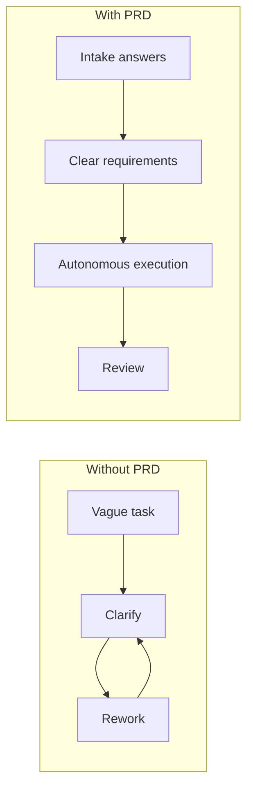

<!-- truncate -->

# 2026-05-24 PRDs Aren't Just for Code — Image Prompts

## Batch JSON

```json
{
  "post": "2026-05-24-prds-arent-just-for-code",
  "style": "Watercolor illustration, soft wet-on-wet washes, visible paper texture, warm muted tones, loose brushwork",
  "character": "White female with pink hair",
  "images": [
    {
      "filename": "hero-prd-thinking-tax.png",
      "alt": "Pink-haired woman turning a vague request into a structured PRD while helper agents begin moving",
      "prompt": "White female with pink hair at desk turning one vague note into structured PRD pages, faint helper agents moving around her, watercolor illustration, soft wet-on-wet washes, visible paper texture, warm muted tones, loose brushwork, no text"
    },
    {
      "filename": "project-management-prd.png",
      "alt": "Pink-haired woman organizing a kanban board while agents pull clearly defined work items into motion",
      "prompt": "White female with pink hair arranging PRD cards across a kanban board while helper agents pull work items into columns, watercolor illustration, soft wet-on-wet washes, visible paper texture, warm muted tones, loose brushwork, no text"
    },
    {
      "filename": "product-management-prd.png",
      "alt": "Pink-haired woman reviewing feature sketches and requirement pages while agents work from the clarified spec",
      "prompt": "White female with pink hair studying feature sketches and requirement pages while helper agents build from precise notes, watercolor illustration, soft wet-on-wet washes, visible paper texture, warm muted tones, loose brushwork, no text"
    },
    {
      "filename": "content-management-prd.png",
      "alt": "Pink-haired woman sorting article outlines and editorial plans while agents manage the operational content flow",
      "prompt": "White female with pink hair at editorial desk sorting article outlines, calendar pages, and review notes while helper agents manage content folders, watercolor illustration, soft wet-on-wet washes, visible paper texture, warm muted tones, loose brushwork, no text"
    },
    {
      "filename": "autonomous-execution-payoff.png",
      "alt": "Pink-haired woman directing agents as work packets move from a PRD board into execution queues",
      "prompt": "White female with pink hair overseeing small helper agents carrying folders from PRD board to task queues, watercolor illustration, soft wet-on-wet washes, visible paper texture, warm muted tones, loose brushwork, no text"
    }
  ],
  "mermaidDiagrams": [
    {
      "filename": "flow-vague-request-to-autonomy.mmd",
      "prompt": "Create a simple left-to-right Mermaid flow diagram showing: vague request -> PRD intake -> specificity -> autonomous execution. Keep labels short. Use 4 nodes max. Emphasize that specificity is the enabling step."
    },
    {
      "filename": "comparison-with-vs-without-prd.mmd",
      "prompt": "Create a two-lane Mermaid comparison diagram. Left lane: without PRD -> vague task -> repeated clarification -> rework loops. Right lane: with PRD -> intake answers -> clear requirements -> autonomous execution. Keep each lane to 4 nodes and use short labels."
    }
  ]
}
```

## Individual Watercolor Prompts

### 1. Hero

- **Filename:** `hero-prd-thinking-tax.png`
- **Prompt:** White female with pink hair at desk turning one vague note into structured PRD pages, faint helper agents moving around her, watercolor illustration, soft wet-on-wet washes, visible paper texture, warm muted tones, loose brushwork, no text
- **Purpose:** Opening concept image for the thesis that specificity unlocks autonomous work.

### 2. Project Management

- **Filename:** `project-management-prd.png`
- **Prompt:** White female with pink hair arranging PRD cards across a kanban board while helper agents pull work items into columns, watercolor illustration, soft wet-on-wet washes, visible paper texture, warm muted tones, loose brushwork, no text
- **Purpose:** Visual for epics and work items becoming dispatchable through PRD structure.

### 3. Product Management

- **Filename:** `product-management-prd.png`
- **Prompt:** White female with pink hair studying feature sketches and requirement pages while helper agents build from precise notes, watercolor illustration, soft wet-on-wet washes, visible paper texture, warm muted tones, loose brushwork, no text
- **Purpose:** Visual for feature requirements becoming clear enough to route without back-and-forth.

### 4. Content Management

- **Filename:** `content-management-prd.png`
- **Prompt:** White female with pink hair at editorial desk sorting article outlines, calendar pages, and review notes while helper agents manage content folders, watercolor illustration, soft wet-on-wet washes, visible paper texture, warm muted tones, loose brushwork, no text
- **Purpose:** Visual for editorial and content strategy work treated as inspectable requirements.

### 5. Automation Payoff

- **Filename:** `autonomous-execution-payoff.png`
- **Prompt:** White female with pink hair overseeing small helper agents carrying folders from PRD board to task queues, watercolor illustration, soft wet-on-wet washes, visible paper texture, warm muted tones, loose brushwork, no text
- **Purpose:** Visual for the handoff from clarified requirement to autonomous execution.

## Mermaid Diagram Prompts

### 1. Vague Request to Autonomous Execution

- **Filename:** `flow-vague-request-to-autonomy.mmd`
- **Prompt:** Create a simple left-to-right Mermaid flow diagram showing: vague request -> PRD intake -> specificity -> autonomous execution. Keep labels short. Use 4 nodes max. Emphasize that specificity is the enabling step.
- **Suggested Mermaid source:**


### 2. With PRD vs Without PRD

- **Filename:** `comparison-with-vs-without-prd.mmd`
- **Prompt:** Create a two-lane Mermaid comparison diagram. Left lane: without PRD -> vague task -> repeated clarification -> rework loops. Right lane: with PRD -> intake answers -> clear requirements -> autonomous execution. Keep each lane to 4 nodes and use short labels.
- **Suggested Mermaid source:**


