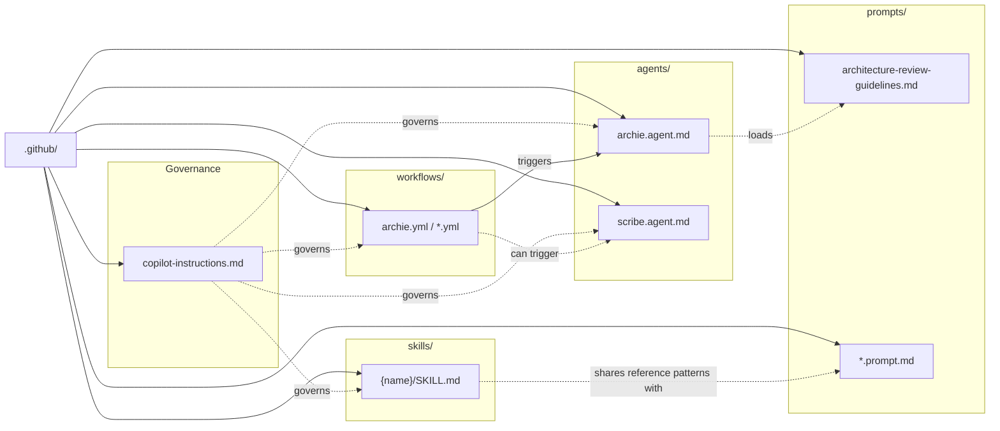
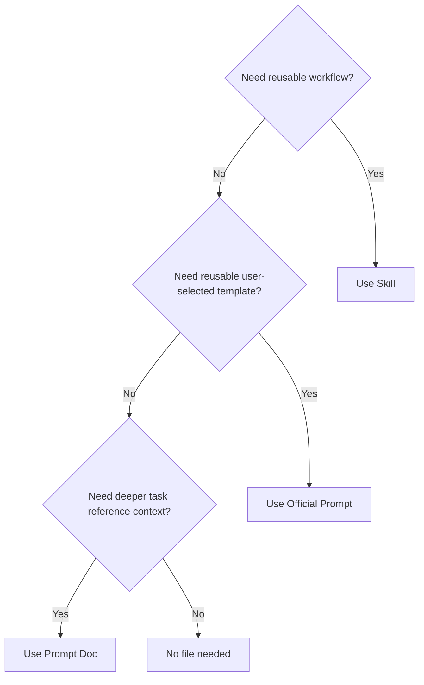
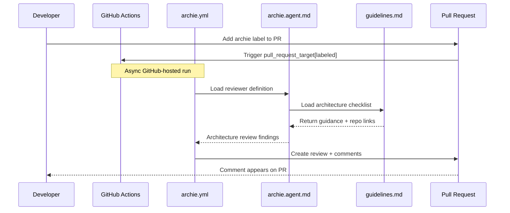
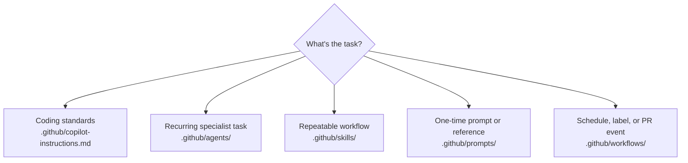

# Image Specs and Prompts

These specs were extracted from the existing 7 assets in this folder.

Notes:
- For SVGs, I read the source and reconstructed editable structure.
- For PNGs, I examined the rendered image and provide a faithful editable production spec.
- I did **not** find a separate original prompt file for these 7 assets in the repo, so the PNG sections include an extracted **specification/prompt** rather than a repo-authored source prompt.

---

## 1. `diagram-1-mental-model.svg`

**Type:** custom SVG composition  

### Design System (applies to all diagrams)
- **Background:** White or light gray (#ffffff, #f5f5f5)
- **Shapes:** Light fills (#fafafa) or white with light gray borders (#cccccc)
- **Text color:** Black (#000000) always
- **Lines/Connectors:** Light gray (#cccccc)
- **Constraint:** NO text can overlap or touch other text, shapes, or connectors. All text must have clear breathing room.

**Canvas:** `viewBox="0 0 807 646"`  
**Title in file:** `Layers of Governance`

Production specification (revised for text layout)
This is not a native Mermaid diagram; it is a custom SVG built around the post's mental model: instructions create the boundary, agents interpret inside it, and skills sit at the execution center.

```text
Canvas: viewBox 0 0 807 646 on a white background (#ffffff).
Use black text only (#000000), light-gray strokes (#cccccc), and white/light fills only where specified.
Treat the composition as four protected text zones: the top INSTRUCTIONS card, the right AGENTS card, the left SKILLS card, and the inner-circle center copy. Text from one zone must never enter another zone.
Build the diagram around a centered three-ring system. Keep generous negative space around the rings so the rings read as layers, not collisions.
Top card: place a rounded rectangle centered above the rings for INSTRUCTIONS with a soft light fill such as #f5f7fa (or #f0f4f8) so it pops against the white canvas while staying subtle. Keep at least 24px of vertical gap between the bottom of this card and any connector. Inside the card, use 18-20px side padding, at least 16px top/bottom padding, a bold all-caps heading, then two short lines of body copy. If the text feels tight, increase card height before reducing spacing.
Right card: place a rounded rectangle to the right of the rings for AGENTS using the same soft light fill (#f5f7fa or #f0f4f8). Keep at least 24px of horizontal clearance between the card edge and the outer ring. Put the AGENTS label inside the card as the card heading, then keep the body copy inside the card with 18-20px internal padding and no more than two short lines.
Left card: place a rounded rectangle lower-left for SKILLS using the same soft light fill (#f5f7fa or #f0f4f8). Keep at least 24px of clearance from the outer ring and enough width that the supporting copy stays fully inside the card. Put the SKILLS label inside the card as the card heading. Increase card height or width instead of squeezing text.
Connectors: use thin light-gray connectors, but route them so they stop before any text area. No connector may pass under or through a text label.
Center copy: place three stacked lines inside the inner circle only. Keep all center text at least 16px away from the inner circle boundary on every side. Use shorter lines and a slightly smaller size than the card headings so the hierarchy stays clear.
Typography for web-sized viewing (~600px content column): card headings should read like 18-20px, supporting copy like 13-15px, center copy like 15-17px, title like 24-28px, and subtitle like 14-16px.
Bottom title block: keep the title, subtitle, and three dots centered below the diagram with enough separation that the caption reads as a footer, not part of the rings.
Overall style: minimal editorial explainer, monochrome, airy, and legible at small blog-column display sizes, with softly tinted cards on a white canvas for contrast.
```

### What each element represents
- **Top card:** the always-on repo rules and guardrails that shape the space before anything else happens.
- **Right card:** agents as the interpretation layer that decides how to apply those rules in context.
- **Left card:** skills as reusable procedures and assets that carry out the chosen work.
- **Rings:** a nested-ring cascade, not three unrelated badges: instructions define the outer boundary, agents work inside it, and skills sit at the center where execution happens.
- **Center copy:** the author's shorthand for remembering the model: `Instructions set the rules. Agents decide. Skills execute.`
- **Bottom title block:** the caption that restates the blog's key claim that rules constrain decisions and decisions choose the execution path.

### Layout choices
- The composition reads like a cascade into the center, not just cards surrounding circles.
- The instructions card sits highest and feeds straight into the rings to signal baseline governance.
- The agents card is offset right and tied to the upper rings so it feels like the interpretation layer.
- The skills card sits lower-left and closer to the core so execution reads as downstream from agent choice.
- The title/caption is isolated below the diagram so the visual makes the mental model first and the text closes the argument.

### How to modify it
- **Change a label:** edit the `<text>` or `<tspan>` values.
- **Add a new governance layer:** add another circle around the existing ring group, then reposition connector paths.
- **Add another callout card:** duplicate one `<g>` card block, move its `rect` and text coordinates, then add a new connector `<path>`.
- **Adjust emphasis:** increase stroke width or font weight for one layer.
- **Keep visual consistency:** white canvas, `#f5f7fa` (or `#f0f4f8`) card fills, `#cccccc` stroke, black text, rounded rectangles, and airy spacing.

---

## 2. `diagram-2-configuration-files-structure.svg`

**Type:** Mermaid-generated flowchart SVG  

### Design System (applies to all diagrams)
- **Background:** White or light gray (#ffffff, #f5f5f5)
- **Shapes:** Light fills (#fafafa) or white with light gray borders (#cccccc)
- **Text color:** Black (#000000) always
- **Lines/Connectors:** Light gray (#cccccc)
- **Constraint:** NO text can overlap or touch other text, shapes, or connectors. All text must have clear breathing room.

**Canvas:** `viewBox="0 0 1584.6875 673"`

### Editable Mermaid reconstruction


### What each element represents
- **`.github/` root node:** the shared home for the whole configuration ecosystem.
- **Governance cluster:** the baseline instruction layer that applies across the repo.
- **Agents cluster:** specialist reviewer/persona files with tighter scope and boundaries.
- **Skills cluster:** packaged, repeatable procedures Copilot can reuse.
- **Prompts cluster:** both official `.prompt.md` templates and repo-local reference docs.
- **Workflows cluster:** GitHub Actions entry points for label-, schedule-, dispatch-, or PR-driven automation.
- **Dotted labeled edges:** the blog's relationship layer — who governs, loads, triggers, or shares patterns with what.
- **Solid root edges:** the simple file-placement fact that all five families live under one `.github` home.

### Layout choices
- The diagram reads left-to-right as `.github` -> five file families -> cross-links.
- Governance sits closest to the root because it is the baseline layer.
- Skills and workflows occupy the middle because they represent the reusable and event-driven operational paths.
- Agents and prompts sit farther right to show specialists depending on loaded guidance and reference material.
- The overall framing matches the post's quick-reference lens: one navigable map of baseline, specialized, reusable, reference, and event-driven files.

### How to modify it
- **Add a new file family:** add another `subgraph` and connect it from `root`.
- **Add another agent:** add a node inside `agents` and optionally connect governance/workflow edges.
- **Add a new relationship:** add a dotted edge with a label.
- **Rename paths/files:** change the node labels only; the structure can stay the same.

---

## 3. `diagram-3-skills-vs-prompts-decision-tree.svg`

**Type:** Mermaid-generated decision tree  

### Design System (applies to all diagrams)
- **Background:** White or light gray (#ffffff, #f5f5f5)
- **Shapes:** Light fills (#fafafa) or white with light gray borders (#cccccc)
- **Text color:** Black (#000000) always
- **Lines/Connectors:** Light gray (#cccccc)
- **Constraint:** NO text can overlap or touch other text, shapes, or connectors. All text must have clear breathing room.

**Canvas:** `viewBox="0 0 665.625 1080.9375"`

### Editable Mermaid reconstruction


### What each element represents
- **Diamond 1:** the first and most important question from the post — is this a reusable workflow?
- **Diamond 2:** only appears if the answer is no; it checks whether you need an official reusable prompt template instead.
- **Diamond 3:** if it is not a prompt template, it asks whether the task needs deeper repo-local reference context.
- **Terminal boxes:** the four outcomes the article distinguishes: skill, official prompt file, prompt doc, or no extra file.

### Layout choices
- The strict top-to-bottom order mirrors the blog's sequence: reusable workflow first, reusable prompt second, reference doc third.
- “Yes” exits early because the whole point is to stop once you have the right file family.
- Uniform outcome boxes keep the emphasis on the routing questions instead of making one option feel privileged.

### How to modify it
- **Add another decision:** insert another diamond between `promptDoc` and the terminal nodes.
- **Change wording:** update node labels directly.
- **Change file taxonomy:** rename `Use Official Prompt`, `Use Prompt Doc`, etc.
- **Preserve readability:** keep the branching direction consistent (`Yes`/`No`).

---

## 4. `diagram-4-azure-sdk-workflow-trigger.svg`

**Type:** Mermaid-generated sequence diagram  

### Design System (applies to all diagrams)
- **Background:** White or light gray (#ffffff, #f5f5f5)
- **Shapes:** Light fills (#fafafa) or white with light gray borders (#cccccc)
- **Text color:** Black (#000000) always
- **Lines/Connectors:** Light gray (#cccccc)
- **Constraint:** NO text can overlap or touch other text, shapes, or connectors. All text must have clear breathing room.

**Canvas:** `viewBox="-50 -10 1478 572"`

### Editable Mermaid reconstruction


### What each element represents
- **Developer:** the person who adds the reviewer label to the PR.
- **Pull Request:** both the trigger surface and the place where findings show up again as comments.
- **GitHub Actions / archie.yml:** the remote asynchronous workflow layer started by that label event.
- **archie.agent.md:** the reusable architecture-reviewer definition the workflow loads.
- **guidelines.md:** the repo guidance/checklist that the reviewer uses as reference context.
- **Return arrows:** findings come back directly to the PR from the workflow path shown here; the post is explicit that there is no separate collector loop in this example.

### Layout choices
- Left-to-right order follows the loop the article says it trusts: label -> workflow -> reviewer -> guidance -> PR comment.
- The PR remains at the far right because it is both the initiation target and the visible output surface.
- The async note sits between GitHub Actions and the workflow file to emphasize GitHub-hosted automation rather than local Copilot behavior.

### How to modify it
- **Add another reviewer asset:** insert another participant between `Agent` and `Guide`.
- **Add another step:** add a new message line in sequence order.
- **Rename the workflow:** change `archie.yml` everywhere.
- **Show additional outputs:** add another message from `WF` to `PR` or another participant.

---

## 5. `diagram-5-file-placement-decision-tree.svg`

**Type:** Mermaid-generated routing diagram  

### Design System (applies to all diagrams)
- **Background:** White or light gray (#ffffff, #f5f5f5)
- **Shapes:** Light fills (#fafafa) or white with light gray borders (#cccccc)
- **Text color:** Black (#000000) always
- **Lines/Connectors:** Light gray (#cccccc)
- **Constraint:** NO text can overlap or touch other text, shapes, or connectors. All text must have clear breathing room.

**Canvas:** `viewBox="0 0 1441.15625 336.78125"`

### Editable Mermaid reconstruction


### What each element represents
- **Center diamond:** the routing question the section cares about — what shape of task is this?
- **Five output boxes:** the same five file families from the quick reference and decision table.
- **Two-line box labels:** line one names the task pattern; line two gives the folder/path so you can match the task shape and drop it in the right place.

### Layout choices
- A single fan-out keeps the emphasis on classification rather than process.
- The five destination boxes spread horizontally so the families read like peers in one routing table.
- There are no deeper branches because this section is a placement cheat sheet, not a nuanced workflow diagram.

### How to modify it
- **Add a sixth destination:** add another box and connect from `start`.
- **Change repo paths:** update the second line in each node.
- **Simplify for a smaller image:** collapse to three outputs or split into two rows.

---

## 6. `image-1-layers.png`

**Type:** raster infographic  

### Design System (applies to all diagrams)
- **Background:** White or light gray (#ffffff, #f5f5f5)
- **Shapes:** Light fills (#fafafa) or white with light gray borders (#cccccc)
- **Text color:** Black (#000000) always
- **Lines/Connectors:** Light gray (#cccccc)
- **Constraint:** NO text can overlap or touch other text, shapes, or connectors. All text must have clear breathing room.

**Size:** `1614 x 1292`


### Visual metaphor and hierarchy
- **Metaphor:** the blog's nested-ring governance model.
- **Primary visual:** three concentric circles that make the control flow explicit rather than decorative.
- **Supporting callouts:** instructions above, agents to the right, and skills lower-left, each feeding into the same ring system.
- **Narrative hierarchy:** instructions shape the space -> agents interpret inside that boundary -> skills execute at the center -> the caption restates that rules constrain decisions.

### Shapes and geometry
- White background.
- Three light-gray concentric circles.
- Three large rounded cards: top, right, lower-left.
- Two capsule labels embedded over the circles: `AGENTS` and `SKILLS`.
- Thin connector lines from the cards into the circular system.
- Bottom title block and three small centered dots.

### Colors
Approximate palette from the rendered image:
- Background: white
- Lines and borders: light gray
- Text: black
- No accent fill colors; the design is monochrome/minimal

### Editable production specification
Use this if recreating in Figma, Illustrator, or SVG:

```text
Canvas: 1614x1292. Use a white or very light background (#ffffff or #f5f5f5).
All text must be black only (#000000).
All ring strokes, card borders, capsule outlines, and connector lines must be light gray (#cccccc).
All shapes should use white or very light fills (#ffffff or #fafafa) with light gray borders.
Build the composition as four clearly separated text regions: top INSTRUCTIONS card, right AGENTS card, lower-left SKILLS card, and center-copy inside the inner ring. Never let text from one region cross into another.
Center a three-ring system in the upper-middle of the canvas so it reads like nested governance rings, but reserve dedicated label lanes around it before placing any text.
Top card: use a rounded rectangle for INSTRUCTIONS with a bold all-caps heading and at most two short lines of supporting copy. Keep 20-24px internal side padding, at least 18px top/bottom padding, and at least 24px of vertical clearance between the card and any ring label below it.
Right card: place AGENTS far enough right that the card does not collide with the center copy or ring labels. Keep at least 24px between the card edge and the outer ring, and keep all supporting copy fully inside the card with 20px padding.
Lower-left card: place SKILLS far enough left and low that its body copy stays inside the card and does not run into the ring system. Keep at least 24px between the card and the outer ring. If needed, widen or heighten the card rather than shrinking padding.
Ring pills: use AGENTS and SKILLS pill labels only if each pill has its own isolated space. Do not place the AGENTS pill inside the top INSTRUCTIONS card. Keep every pill at least 12px from a ring stroke and at least 16px from any card, connector, or other text. If space is tight, move the pill outside the ring and connect it with a short leader line.
Center copy: keep the three statements inside the inner circle only, on three separate lines, with at least 20px clearance from the circle boundary. Use shorter line lengths, lighter weight, or slightly smaller type before allowing any overlap.
Connectors: keep all connectors thin and behind the composition, but do not let them pass under text. End connector lines before they enter a text box or pill.
Typography must remain readable when the image is displayed in a ~600px-wide blog column. Target an effective display scale of roughly: card headings 18-22px, supporting copy 13-15px, pill labels 16-18px, center copy 15-17px, title 24-28px, subtitle 14-16px.
At the bottom center, place the title “Layers of Governance”, then the subtitle “Rules constrain decisions, then reusable skills carry out the work.”, then three small black dots. Keep generous spacing so the footer reads separately from the diagram.
Style: minimal editorial explainer, monochrome, airy, and easy to read — more like a remembered mental model than a product UI mock.
```

### How to modify it
- **Best option:** edit `diagram-1-mental-model.svg` and re-export PNG.
- **If editing the PNG design manually:** keep the circle system centered and keep all callout boxes aligned to the current top/right/lower-left pattern.
- **If adding another layer:** add another ring and corresponding callout card.
- **If changing the message:** update the center copy first, then title/subtitle if needed.

---

## 7. `image-2-where-they-live.png`

**Type:** raster infographic  

### Design System (applies to all diagrams)
- **Background:** White or light gray (#ffffff, #f5f5f5)
- **Shapes:** Light fills (#fafafa) or white with light gray borders (#cccccc)
- **Text color:** Black (#000000) always
- **Lines/Connectors:** Light gray (#cccccc)
- **Constraint:** NO text can overlap or touch other text, shapes, or connectors. All text must have clear breathing room.

**Size:** `1400 x 900`


### Visual metaphor and hierarchy
- **Metaphor:** a single `.github` home with distinct rooms, matching the blog's point that these files live together but do different jobs.
- **Primary focal point:** one large neutral folder-house container on the left-middle with `.github` text in black.
- **Secondary structure:** five family labels stacked on the right, one for each room/file family.
- **Connector logic:** light-gray lines show that every family belongs to the same home while staying separate by purpose.
- **Reading order:** title -> subtitle -> shared home/container -> room labels.

### Shapes and geometry
- White or very light full-bleed background.
- Large folder/house shape with white or very light fill and a light-gray outline, including a tab/roof shape at the upper-left.
- Five rounded pill/box labels stacked vertically on the right.
- Five diagonal light-gray connector lines from the folder body to each pill.

### Colors
Standardized production palette:
- Background: white or very light gray (`#ffffff`, `#f5f5f5`)
- Folder house and pills: white or very light fill (`#ffffff`, `#fafafa`)
- Borders and connector lines: light gray (`#cccccc`)
- All text, including `.github`, title, subtitle, and labels: black (`#000000`)
- No accent colors, gradients, or dark theme treatments

### Editable production prompt/specification
No separate prompt file was found in the repo; use this extracted art-direction spec:

```text
Create a 1400x900 editorial infographic with a white or very light background (#ffffff or #f5f5f5).
All text must be black only (#000000).
All shape outlines and connector lines must be light gray (#cccccc).
Top-left: large black title “Where They Live”.
Below it: smaller black subtitle reading “A single .github home with distinct rooms for rules, specialists, reusable procedures, prompts, and triggers.”
Center-left: a large stylized `.github` folder that also reads as one shared home. Use a light background (white or #f5f5f5). Text must be black (#000000).
All shape outlines must be light gray (#cccccc).
Connector lines must be light gray (#cccccc).
Text labels for file families (copilot-instructions.md, agents/, skills/, prompts/, workflows/) must each have minimum 8–10px clearance from adjacent shapes and from each other. No overlaps.
Right side: stack five rounded rectangular pills vertically with generous spacing, one per file family.
Label them, top to bottom:
1. copilot-instructions.md
2. agents/
3. skills/
4. prompts/
5. workflows/
Connect the folder-house to each pill with its own light-gray line so each line reads like a room assignment inside the same home.
Use white or very light fills for the folder-house and each pill, keeping the design monochrome and editorial.
All text labels must have minimum 8px clearance from adjacent shapes and other text, with 8–10px preferred.
Style: clean explainer graphic, flat vector shapes, soft rounded corners, no texture, strong contrast, and a clear “live together, different jobs” message.
```

### How to modify it
- **Change a family name:** edit the text inside one pill only.
- **Add a new family:** add another pill to the stack and route a new light-gray connector line from the folder.
- **Change the metaphor:** keep the same connector system, but swap the folder-house for another “single home/container” shape.
- **Keep hierarchy stable:** title and subtitle stay top-left; container stays left; destinations stay right.
