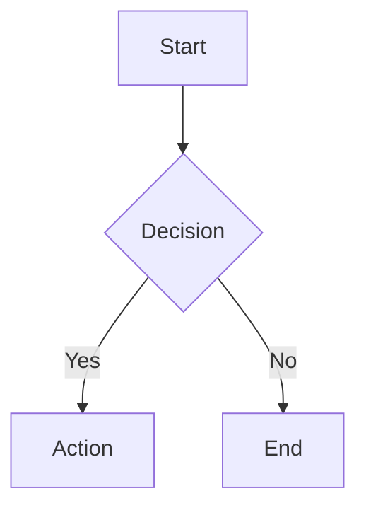

# Mermaid Diagram Documentation

This directory contains mermaid diagram source files and a reusable theme for blog post visualizations.

## Overview

- **Source files (.mmd)**: Text-based diagram definitions
- **Generated files (.png)**: Rendered diagram outputs
- **Theme (watercolor-theme.json)**: Reusable styling for consistent visual identity

## Theme: Watercolor

The watercolor theme provides warm, cohesive styling that matches the portable context blog hero illustration. It emphasizes readability on light backgrounds with:

- **Color palette**: Warm earth tones (cream #fef9f5, peach #f5e6d3, warm-brown #d4896b)
- **Typography**: Clear hierarchy via font-weight and font-size variations
- **Styling**: Rounded corners (12px primary, 10px secondary) and medium strokes (2.5-3px)
- **Background**: Off-white cream (#fef9f5) for luminous effect

### Color Reference

| Name | Hex | Use |
|------|-----|-----|
| cream | #fef9f5 | Main background |
| peach | #f5e6d3 | Primary nodes |
| warm-cream | #fdf4e8 | Secondary nodes |
| light-peach | #f9ead8 | Tertiary nodes (e.g., decision points) |
| warm-brown | #d4896b | Primary borders, connector lines |
| muted-brown | #b8836f | Secondary borders |
| tan | #c9956b | Connector lines |
| dark-brown | #3d2817 | Text color |

## How to Apply the Theme

### In a New Mermaid Diagram

Copy the `themeVariables` block from `watercolor-theme.json` into your diagram's init block:

```mermaid
%%{init: {
  "theme": "base",
  "themeVariables": {
    "fontFamily": "Inter, ui-sans-serif, system-ui",
    "primaryColor": "#f5e6d3",
    "primaryTextColor": "#3d2817",
    ...
  }
}}%%
```

Then use standard mermaid syntax for diagram elements.

## File Naming Convention

Blog diagrams follow this naming pattern for version control clarity:

```
{date}-{blog-slug}-{diagram-name}.mmd
{date}-{blog-slug}-{diagram-name}.png
```

**Example:**
- Source: `2026-07-17-capture-layer-for-portable-context-capture-layer-architecture.mmd`
- Output: `../media/2026-07-17-capture-layer-for-portable-context/capture-layer-architecture.png`

Media folder: `../media/{date}-{blog-slug}/`

## Regenerating Diagrams

To regenerate PNG files from updated mermaid source:

```bash
cd website/blog/mermaid

# Regenerate a single diagram
mmdc -i 2026-07-17-capture-layer-for-portable-context-capture-layer-architecture.mmd \
     -o ../media/2026-07-17-capture-layer-for-portable-context/capture-layer-architecture.png

# Regenerate all diagrams for a post (example: 2026-07-17)
for f in 2026-07-17-capture-layer-for-portable-context-*.mmd; do
  name=$(echo "$f" | sed 's/^2026-07-17-capture-layer-for-portable-context-//' | sed 's/\.mmd$//')
  mmdc -i "$f" -o "../media/2026-07-17-capture-layer-for-portable-context/${name}.png"
done
```

## Customization

### Changing Colors

Edit `watercolor-theme.json` or override `themeVariables` directly in a diagram's init block:

```mermaid
%%{init: {
  "themeVariables": {
    "primaryColor": "#new-hex-color"
  }
}}%%
```

### Node Styling

Apply inline styles for emphasis:

```mermaid
style nodeId fill:#custom-color,stroke:#border-color,stroke-width:3px,color:#text-color,rx:12,ry:12
```

Use the `nodeStyles` object in `watercolor-theme.json` as templates:
- **primary**: Main emphasis (bold, large font)
- **secondary**: Supporting elements (medium emphasis)
- **tertiary**: Details (lighter emphasis)
- **muted**: Reference/background (least emphasis)
- **subgraph**: Container grouping

### Scope Bounding

Use subgraphs with distinct borders to show implemented vs. future work:

```mermaid
subgraph done["✅ This Post: Feature X"]
  ...
end

subgraph future["🚀 Future Posts: Feature Y"]
  ...
end

style done fill:#fef9f5,stroke:#d4896b,stroke-width:3px
style future fill:#fef9f5,stroke:#a0734d,stroke-width:2px,stroke-dasharray:5
```

- **Solid borders (3px)**: Implemented content (This Post)
- **Dashed borders (2px)**: Future content (Future Posts)

## Syntax Reference

### Flowchart



**Shapes:**
- `[text]` → rectangle
- `{text}` → diamond (decision)
- `(text)` → rounded rectangle
- `[(text)]` → database/storage
- `[[text]]` → subroutine

### Subgraph (Grouping)

```mermaid
subgraph group["Group Label"]
  A[Item 1]
  B[Item 2]
end
```

### Connections

- `-->` → solid arrow (default)
- `-->|label|` → arrow with label
- `-.->` → dotted arrow
- `-.-` → dotted line

## Best Practices

1. **Keep labels short** (\<50 chars) for readability
2. **Use consistent emoji conventions** (✅ done, 🚀 future, ⚠️ warning)
3. **Limit diagram complexity** (5-7 levels deep, \<15 nodes for flowcharts)
4. **Apply watercolor theme** to all blog diagrams for visual cohesion
5. **Use node styles consistently** (same semantic use = same style)
6. **Test on both light and dark backgrounds** (theme designed for light)

## Troubleshooting

**Diagram not rendering:**
- Check mermaid syntax: `https://mermaid.live/` for live editor
- Verify themeVariables are valid hex colors
- Ensure quotes match (`"` or `'`, not mixed)

**Colors look different than expected:**
- Verify `themeVariables` hex values match desired colors
- Check inline `style` statements override themeVariables correctly
- Note: PNG output quality depends on mmdc version — `npm install -g @mermaid-js/mermaid-cli@latest`

**Text not readable:**
- Increase font-size in themeVariables or node styles
- Ensure text color (#3d2817) contrasts with background (#fef9f5)
- Use lighter backgrounds for dark text, darker text for light backgrounds

## Resources

- **Mermaid syntax:** https://mermaid.js.org/
- **Mermaid CLI:** https://github.com/mermaid-js/mermaid-cli
- **Watercolor hero illustration:** See blog post images for design reference
